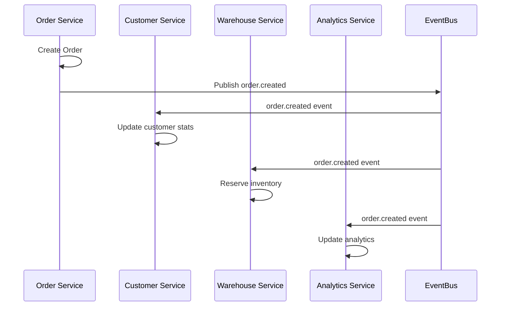

# 🗄️ Data Architecture

**Purpose**: Database design, data management patterns, and storage strategies  
**Last Updated**: 2026-01-27  
**Audience**: Architects, Database Engineers, Senior Developers

---

## 📋 Overview

Our data architecture follows the **Database-per-Service** pattern, ensuring data isolation, technology choice flexibility, and independent scaling. Each microservice owns its data and database, with well-defined integration patterns for cross-service data access.

## 🏗️ Database Architecture Principles

### 1. **Database-per-Service Pattern**
Each microservice has its own dedicated database:

```
┌─────────────────────────────────────────────────────────────┐
│                    SERVICE DATABASES                        │
├─────────────────────────────────────────────────────────────┤
│                                                             │
│  ┌─────────────┐    ┌──────────────┐    ┌─────────────┐    │
│  │ Order       │    │ Checkout     │    │ Return      │    │
│  │ Service     │    │ Service      │    │ Service     │    │
│  │             │    │              │    │             │    │
│  └─────────────┘    └──────────────┘    └─────────────┘    │
│         │                   │                   │          │
│  ┌─────────────┐    ┌──────────────┐    ┌─────────────┐    │
│  │ order_db    │    │ checkout_db  │    │ return_db   │    │
│  │(PostgreSQL) │    │(PostgreSQL)  │    │(PostgreSQL) │    │
│  └─────────────┘    └──────────────┘    └─────────────┘    │
│                                                             │
│  ┌─────────────┐    ┌──────────────┐    ┌─────────────┐    │
│  │ Customer    │    │ Catalog      │    │ Payment     │    │
│  │ Service     │    │ Service      │    │ Service     │    │
│  │             │    │              │    │             │    │
│  └─────────────┘    └──────────────┘    └─────────────┘    │
│         │                   │                   │          │
│  ┌─────────────┐    ┌──────────────┐    ┌─────────────┐    │
│  │customer_db  │    │ catalog_db   │    │ payment_db  │    │
│  │(PostgreSQL) │    │(PostgreSQL)  │    │(PostgreSQL) │    │
│  └─────────────┘    └──────────────┘    └─────────────┘    │
└─────────────────────────────────────────────────────────────┘
```

### 2. **Technology Choice per Service**
Each service can choose the optimal database technology:

| Service | Database | Rationale |
|---------|----------|-----------|
| **Order, Checkout, Return** | PostgreSQL | ACID transactions, complex queries |
| **Customer, Auth, User** | PostgreSQL | Relational data, consistency |
| **Catalog, Search** | PostgreSQL + Elasticsearch | Structured data + full-text search |
| **Analytics** | PostgreSQL + ClickHouse | OLTP + OLAP workloads |
| **Cache Layer** | Redis | High-performance caching |
| **Session Storage** | Redis | Fast session management |

### 3. **Data Consistency Models**

#### Strong Consistency (Within Service)
- **ACID Transactions**: Within service boundaries
- **Database Constraints**: Foreign keys, unique constraints
- **Immediate Consistency**: Real-time data integrity

#### Eventual Consistency (Cross-Service)
- **Event-Driven Synchronization**: Async data propagation
- **Saga Pattern**: Distributed transaction management
- **Compensation Actions**: Rollback mechanisms

---

## 🗃️ Database Schemas by Service

### Core Commerce Services

#### Order Service Database (`order_db`)
```sql
-- Orders table
CREATE TABLE orders (
  id UUID PRIMARY KEY DEFAULT gen_random_uuid(),
  order_number VARCHAR(50) UNIQUE NOT NULL,
  customer_id VARCHAR(36) NOT NULL, -- Customer ID or session ID
  status VARCHAR(20) NOT NULL DEFAULT 'confirmed',
  currency VARCHAR(3) NOT NULL DEFAULT 'USD',
  subtotal DECIMAL(10,2) DEFAULT 0,
  tax_amount DECIMAL(10,2) DEFAULT 0,
  shipping_amount DECIMAL(10,2) DEFAULT 0,
  discount_amount DECIMAL(10,2) DEFAULT 0,
  total_amount DECIMAL(10,2) NOT NULL,
  payment_id VARCHAR(255),
  payment_method VARCHAR(50),
  payment_status VARCHAR(20) DEFAULT 'completed',
  shipping_address JSONB,
  billing_address JSONB,
  notes TEXT,
  metadata JSONB DEFAULT '{}',
  created_at TIMESTAMP WITH TIME ZONE DEFAULT NOW(),
  updated_at TIMESTAMP WITH TIME ZONE DEFAULT NOW(),
  cancelled_at TIMESTAMP WITH TIME ZONE,
  completed_at TIMESTAMP WITH TIME ZONE,
  created_by_service VARCHAR(50) DEFAULT 'checkout-service'
);

-- Order items table
CREATE TABLE order_items (
  id BIGSERIAL PRIMARY KEY,
  order_id UUID NOT NULL REFERENCES orders(id),
  product_id UUID NOT NULL,
  product_sku VARCHAR(255) NOT NULL,
  product_name VARCHAR(500) NOT NULL,
  quantity INTEGER NOT NULL,
  unit_price DECIMAL(10,2) NOT NULL,
  total_price DECIMAL(10,2) NOT NULL,
  discount_amount DECIMAL(10,2) DEFAULT 0,
  tax_amount DECIMAL(10,2) DEFAULT 0,
  warehouse_id UUID,
  reservation_id UUID,
  metadata JSONB DEFAULT '{}'
);

-- Order status history
CREATE TABLE order_status_history (
  id BIGSERIAL PRIMARY KEY,
  order_id UUID NOT NULL REFERENCES orders(id),
  status_from VARCHAR(20),
  status_to VARCHAR(20) NOT NULL,
  changed_by VARCHAR(255),
  reason TEXT,
  metadata JSONB DEFAULT '{}',
  created_at TIMESTAMP WITH TIME ZONE DEFAULT NOW()
);

-- Indexes for performance
CREATE INDEX idx_orders_customer ON orders(customer_id);
CREATE INDEX idx_orders_status ON orders(status);
CREATE INDEX idx_orders_created ON orders(created_at DESC);
CREATE INDEX idx_order_items_order ON order_items(order_id);
CREATE INDEX idx_order_items_product ON order_items(product_id);
```

#### Checkout Service Database (`checkout_db`)
```sql
-- Checkout sessions table
CREATE TABLE checkout_sessions (
  id UUID PRIMARY KEY DEFAULT gen_random_uuid(),
  session_token VARCHAR(255) UNIQUE NOT NULL,
  customer_id VARCHAR(36) NOT NULL,
  cart_id UUID,
  status VARCHAR(20) NOT NULL DEFAULT 'initialized',
  
  -- Address Information
  shipping_address JSONB,
  billing_address JSONB,
  customer_shipping_address_id VARCHAR(36),
  customer_billing_address_id VARCHAR(36),
  
  -- Payment Information
  payment_method_id VARCHAR(255),
  payment_method_type VARCHAR(50),
  
  -- Shipping Information
  shipping_method_id VARCHAR(255),
  shipping_method_name VARCHAR(255),
  shipping_cost DECIMAL(10,2),
  
  -- Pricing Information
  subtotal DECIMAL(10,2) NOT NULL,
  tax_amount DECIMAL(10,2) DEFAULT 0,
  shipping_amount DECIMAL(10,2) DEFAULT 0,
  discount_amount DECIMAL(10,2) DEFAULT 0,
  total_amount DECIMAL(10,2) NOT NULL,
  
  -- Metadata
  metadata JSONB DEFAULT '{}',
  
  -- Timestamps
  created_at TIMESTAMP WITH TIME ZONE DEFAULT NOW(),
  updated_at TIMESTAMP WITH TIME ZONE DEFAULT NOW(),
  expires_at TIMESTAMP WITH TIME ZONE NOT NULL,
  completed_at TIMESTAMP WITH TIME ZONE
);

-- Cart sessions table
CREATE TABLE cart_sessions (
  id UUID PRIMARY KEY DEFAULT gen_random_uuid(),
  session_id VARCHAR(255) UNIQUE NOT NULL,
  customer_id VARCHAR(36),
  guest_token VARCHAR(255),
  status VARCHAR(20) NOT NULL DEFAULT 'active',
  expires_at TIMESTAMP WITH TIME ZONE,
  metadata JSONB DEFAULT '{}',
  created_at TIMESTAMP WITH TIME ZONE DEFAULT NOW(),
  updated_at TIMESTAMP WITH TIME ZONE DEFAULT NOW()
);

-- Cart items table
CREATE TABLE cart_items (
  id BIGSERIAL PRIMARY KEY,
  cart_session_id UUID NOT NULL REFERENCES cart_sessions(id),
  product_id UUID NOT NULL,
  product_sku VARCHAR(255) NOT NULL,
  quantity INTEGER NOT NULL,
  unit_price DECIMAL(10,2),
  total_price DECIMAL(10,2),
  warehouse_id UUID,
  added_at TIMESTAMP WITH TIME ZONE DEFAULT NOW(),
  updated_at TIMESTAMP WITH TIME ZONE DEFAULT NOW()
);
```

#### Return Service Database (`return_db`)
```sql
-- Return requests table
CREATE TABLE return_requests (
  id UUID PRIMARY KEY DEFAULT gen_random_uuid(),
  return_number VARCHAR(50) UNIQUE NOT NULL,
  order_id UUID NOT NULL,
  customer_id VARCHAR(36) NOT NULL,
  status VARCHAR(20) NOT NULL DEFAULT 'requested',
  return_type VARCHAR(20) NOT NULL DEFAULT 'refund',
  reason VARCHAR(100) NOT NULL,
  description TEXT,
  
  -- Processing Information
  approved_by VARCHAR(255),
  approved_at TIMESTAMP WITH TIME ZONE,
  processed_by VARCHAR(255),
  processed_at TIMESTAMP WITH TIME ZONE,
  
  -- Financial Information
  total_refund_amount DECIMAL(10,2) DEFAULT 0,
  refund_shipping BOOLEAN DEFAULT false,
  refund_tax BOOLEAN DEFAULT true,
  
  -- Shipping Information
  return_shipping_label_url VARCHAR(500),
  return_tracking_number VARCHAR(100),
  
  -- Metadata
  metadata JSONB DEFAULT '{}',
  
  -- Timestamps
  created_at TIMESTAMP WITH TIME ZONE DEFAULT NOW(),
  updated_at TIMESTAMP WITH TIME ZONE DEFAULT NOW(),
  expires_at TIMESTAMP WITH TIME ZONE,
  completed_at TIMESTAMP WITH TIME ZONE
);

-- Return items table
CREATE TABLE return_items (
  id UUID PRIMARY KEY DEFAULT gen_random_uuid(),
  return_request_id UUID NOT NULL REFERENCES return_requests(id),
  order_item_id BIGINT NOT NULL,
  product_id UUID NOT NULL,
  product_sku VARCHAR(255) NOT NULL,
  product_name VARCHAR(500) NOT NULL,
  quantity_returned INTEGER NOT NULL,
  quantity_received INTEGER DEFAULT 0,
  return_reason VARCHAR(100),
  condition_received VARCHAR(50),
  unit_price DECIMAL(10,2) NOT NULL,
  refund_amount DECIMAL(10,2) NOT NULL,
  restocked BOOLEAN DEFAULT false,
  restocked_at TIMESTAMP WITH TIME ZONE,
  warehouse_id UUID,
  metadata JSONB DEFAULT '{}',
  created_at TIMESTAMP WITH TIME ZONE DEFAULT NOW(),
  updated_at TIMESTAMP WITH TIME ZONE DEFAULT NOW()
);
```

### Supporting Services

#### Customer Service Database (`customer_db`)
```sql
-- Customers table
CREATE TABLE customers (
  id UUID PRIMARY KEY DEFAULT gen_random_uuid(),
  customer_number VARCHAR(50) UNIQUE,
  email VARCHAR(255) UNIQUE NOT NULL,
  phone VARCHAR(20),
  first_name VARCHAR(100),
  last_name VARCHAR(100),
  date_of_birth DATE,
  gender VARCHAR(10),
  status VARCHAR(20) DEFAULT 'active',
  email_verified BOOLEAN DEFAULT false,
  phone_verified BOOLEAN DEFAULT false,
  marketing_consent BOOLEAN DEFAULT false,
  metadata JSONB DEFAULT '{}',
  created_at TIMESTAMP WITH TIME ZONE DEFAULT NOW(),
  updated_at TIMESTAMP WITH TIME ZONE DEFAULT NOW(),
  deleted_at TIMESTAMP WITH TIME ZONE
);

-- Customer addresses table
CREATE TABLE customer_addresses (
  id BIGSERIAL PRIMARY KEY,
  customer_id UUID NOT NULL REFERENCES customers(id),
  type VARCHAR(20) NOT NULL, -- 'shipping', 'billing'
  first_name VARCHAR(100),
  last_name VARCHAR(100),
  company VARCHAR(255),
  address_line1 VARCHAR(255) NOT NULL,
  address_line2 VARCHAR(255),
  city VARCHAR(100) NOT NULL,
  state VARCHAR(100),
  postal_code VARCHAR(20),
  country VARCHAR(2) NOT NULL,
  phone VARCHAR(20),
  is_default BOOLEAN DEFAULT false,
  created_at TIMESTAMP WITH TIME ZONE DEFAULT NOW(),
  updated_at TIMESTAMP WITH TIME ZONE DEFAULT NOW()
);
```

#### Catalog Service Database (`catalog_db`)
```sql
-- Products table
CREATE TABLE products (
  id UUID PRIMARY KEY DEFAULT gen_random_uuid(),
  sku VARCHAR(255) UNIQUE NOT NULL,
  name VARCHAR(500) NOT NULL,
  description TEXT,
  short_description TEXT,
  status VARCHAR(20) DEFAULT 'active',
  type VARCHAR(50) DEFAULT 'simple',
  weight DECIMAL(8,2),
  dimensions JSONB,
  category_id UUID,
  brand_id UUID,
  manufacturer_id UUID,
  metadata JSONB DEFAULT '{}',
  created_at TIMESTAMP WITH TIME ZONE DEFAULT NOW(),
  updated_at TIMESTAMP WITH TIME ZONE DEFAULT NOW(),
  deleted_at TIMESTAMP WITH TIME ZONE
);

-- Categories table
CREATE TABLE categories (
  id UUID PRIMARY KEY DEFAULT gen_random_uuid(),
  parent_id UUID REFERENCES categories(id),
  name VARCHAR(255) NOT NULL,
  slug VARCHAR(255) UNIQUE NOT NULL,
  description TEXT,
  image_url VARCHAR(500),
  sort_order INTEGER DEFAULT 0,
  is_active BOOLEAN DEFAULT true,
  metadata JSONB DEFAULT '{}',
  created_at TIMESTAMP WITH TIME ZONE DEFAULT NOW(),
  updated_at TIMESTAMP WITH TIME ZONE DEFAULT NOW()
);

-- Product attributes table
CREATE TABLE product_attributes (
  id BIGSERIAL PRIMARY KEY,
  product_id UUID NOT NULL REFERENCES products(id),
  attribute_name VARCHAR(100) NOT NULL,
  attribute_value TEXT,
  attribute_type VARCHAR(50) DEFAULT 'text',
  created_at TIMESTAMP WITH TIME ZONE DEFAULT NOW()
);
```

---

## 🔄 Data Integration Patterns

### 1. **Event-Driven Data Synchronization**

Services synchronize data through domain events:



### 2. **API-Based Data Access**

Cross-service data access through well-defined APIs:

```go
// Order Service accessing Customer data
type CustomerService interface {
    GetCustomer(ctx context.Context, customerID string) (*Customer, error)
    GetCustomerAddresses(ctx context.Context, customerID string) ([]*Address, error)
}

// Order Service accessing Product data
type CatalogService interface {
    GetProduct(ctx context.Context, productID string) (*Product, error)
    ValidateProducts(ctx context.Context, productIDs []string) error
}
```

### 3. **Data Replication Patterns**

#### Read Replicas for Performance
```sql
-- Master-slave replication for read scaling
-- Master: Write operations
-- Slave: Read operations (reports, analytics)

-- Connection configuration
type DatabaseConfig struct {
    MasterDB *sql.DB  // Write operations
    SlaveDB  *sql.DB  // Read operations
}
```

#### Event Sourcing for Audit
```sql
-- Event store for audit and replay
CREATE TABLE event_store (
  id UUID PRIMARY KEY DEFAULT gen_random_uuid(),
  aggregate_id UUID NOT NULL,
  aggregate_type VARCHAR(100) NOT NULL,
  event_type VARCHAR(100) NOT NULL,
  event_data JSONB NOT NULL,
  event_version INTEGER NOT NULL,
  created_at TIMESTAMP WITH TIME ZONE DEFAULT NOW()
);

-- Index for event replay
CREATE INDEX idx_event_store_aggregate ON event_store(aggregate_id, event_version);
```

---

## 📊 Data Management Strategies

### 1. **Data Lifecycle Management**

#### Data Retention Policies
```sql
-- Automated data cleanup policies
-- Cart sessions: 30 days
DELETE FROM cart_sessions 
WHERE created_at < NOW() - INTERVAL '30 days' 
AND status = 'abandoned';

-- Checkout sessions: 7 days after expiry
DELETE FROM checkout_sessions 
WHERE expires_at < NOW() - INTERVAL '7 days';

-- Event logs: 1 year retention
DELETE FROM event_store 
WHERE created_at < NOW() - INTERVAL '1 year';
```

#### Data Archival Strategy
```sql
-- Archive old orders to separate table
CREATE TABLE orders_archive (
  LIKE orders INCLUDING ALL
);

-- Move orders older than 2 years
INSERT INTO orders_archive 
SELECT * FROM orders 
WHERE created_at < NOW() - INTERVAL '2 years';
```

### 2. **Backup and Recovery**

#### Backup Strategy
- **Full Backup**: Daily at 2 AM UTC
- **Incremental Backup**: Every 4 hours
- **Point-in-Time Recovery**: 30-day retention
- **Cross-Region Replication**: For disaster recovery

#### Recovery Procedures
```bash
# Database backup script
#!/bin/bash
pg_dump -h $DB_HOST -U $DB_USER -d $DB_NAME \
  --format=custom \
  --compress=9 \
  --file=/backups/$(date +%Y%m%d_%H%M%S)_${DB_NAME}.backup

# Point-in-time recovery
pg_restore -h $DB_HOST -U $DB_USER -d $DB_NAME \
  --clean --if-exists \
  /backups/20260127_020000_order_db.backup
```

### 3. **Data Security and Compliance**

#### Encryption at Rest
```sql
-- Enable transparent data encryption
ALTER DATABASE order_db SET default_table_access_method = 'encrypted';

-- Encrypt sensitive columns
CREATE TABLE customers (
  id UUID PRIMARY KEY,
  email VARCHAR(255) ENCRYPTED,
  phone VARCHAR(20) ENCRYPTED,
  -- other fields
);
```

#### GDPR Compliance
```sql
-- Data anonymization for GDPR
UPDATE customers 
SET 
  email = 'anonymized_' || id || '@deleted.com',
  phone = NULL,
  first_name = 'Deleted',
  last_name = 'User',
  date_of_birth = NULL
WHERE id = $customer_id;

-- Audit trail for data access
CREATE TABLE data_access_log (
  id UUID PRIMARY KEY DEFAULT gen_random_uuid(),
  user_id VARCHAR(255) NOT NULL,
  table_name VARCHAR(100) NOT NULL,
  operation VARCHAR(20) NOT NULL, -- SELECT, INSERT, UPDATE, DELETE
  record_id VARCHAR(255),
  accessed_at TIMESTAMP WITH TIME ZONE DEFAULT NOW()
);
```

---

## 🚀 Performance Optimization

### 1. **Database Indexing Strategy**

#### Primary Indexes
```sql
-- Order service indexes
CREATE INDEX CONCURRENTLY idx_orders_customer_status ON orders(customer_id, status);
CREATE INDEX CONCURRENTLY idx_orders_created_desc ON orders(created_at DESC);
CREATE INDEX CONCURRENTLY idx_order_items_product_warehouse ON order_items(product_id, warehouse_id);

-- Customer service indexes
CREATE INDEX CONCURRENTLY idx_customers_email_status ON customers(email, status);
CREATE INDEX CONCURRENTLY idx_customer_addresses_customer_type ON customer_addresses(customer_id, type);

-- Catalog service indexes
CREATE INDEX CONCURRENTLY idx_products_category_status ON products(category_id, status);
CREATE INDEX CONCURRENTLY idx_products_sku_status ON products(sku, status);
```

#### Composite Indexes for Complex Queries
```sql
-- Multi-column indexes for common query patterns
CREATE INDEX CONCURRENTLY idx_orders_complex_search 
ON orders(customer_id, status, created_at DESC) 
WHERE status IN ('confirmed', 'processing', 'shipped');

-- Partial indexes for active records
CREATE INDEX CONCURRENTLY idx_products_active 
ON products(category_id, created_at DESC) 
WHERE status = 'active' AND deleted_at IS NULL;
```

### 2. **Query Optimization**

#### Efficient Pagination
```sql
-- Cursor-based pagination for large datasets
SELECT * FROM orders 
WHERE created_at < $cursor_timestamp 
ORDER BY created_at DESC 
LIMIT 20;

-- Avoid OFFSET for large offsets
-- Bad: SELECT * FROM orders ORDER BY id LIMIT 20 OFFSET 10000;
-- Good: SELECT * FROM orders WHERE id > $last_id ORDER BY id LIMIT 20;
```

#### Query Plan Analysis
```sql
-- Analyze query performance
EXPLAIN (ANALYZE, BUFFERS) 
SELECT o.*, oi.* 
FROM orders o 
JOIN order_items oi ON o.id = oi.order_id 
WHERE o.customer_id = $customer_id 
AND o.status = 'confirmed';
```

### 3. **Connection Pooling**

```go
// Database connection pool configuration
type DatabaseConfig struct {
    MaxOpenConns    int           // 25
    MaxIdleConns    int           // 5
    ConnMaxLifetime time.Duration // 5 minutes
    ConnMaxIdleTime time.Duration // 1 minute
}

// Connection pool per service
func NewDatabase(config DatabaseConfig) *sql.DB {
    db, err := sql.Open("postgres", config.DSN)
    if err != nil {
        panic(err)
    }
    
    db.SetMaxOpenConns(config.MaxOpenConns)
    db.SetMaxIdleConns(config.MaxIdleConns)
    db.SetConnMaxLifetime(config.ConnMaxLifetime)
    db.SetConnMaxIdleTime(config.ConnMaxIdleTime)
    
    return db
}
```

---

## 📈 Monitoring and Observability

### 1. **Database Metrics**

Key metrics to monitor:
- **Connection Pool**: Active/idle connections, wait time
- **Query Performance**: Slow queries, execution time, lock waits
- **Storage**: Disk usage, growth rate, fragmentation
- **Replication**: Lag, sync status, failover readiness

### 2. **Alerting Thresholds**

```yaml
# Database monitoring alerts
alerts:
  - name: "High Connection Usage"
    condition: "connection_usage > 80%"
    severity: "warning"
    
  - name: "Slow Query Detected"
    condition: "query_duration > 5s"
    severity: "critical"
    
  - name: "Replication Lag High"
    condition: "replication_lag > 30s"
    severity: "warning"
    
  - name: "Disk Space Low"
    condition: "disk_usage > 85%"
    severity: "critical"
```

### 3. **Performance Dashboards**

Monitor key database performance indicators:
- Query throughput (QPS)
- Average response time
- Error rates
- Connection pool utilization
- Cache hit ratios
- Lock contention

---

## 🔧 Migration and Schema Evolution

### 1. **Database Migration Strategy**

```sql
-- Migration versioning
CREATE TABLE schema_migrations (
  version VARCHAR(255) PRIMARY KEY,
  applied_at TIMESTAMP WITH TIME ZONE DEFAULT NOW()
);

-- Example migration: Add new column
-- Migration: 20260127_001_add_order_source.sql
ALTER TABLE orders 
ADD COLUMN source VARCHAR(50) DEFAULT 'web' NOT NULL;

-- Update migration table
INSERT INTO schema_migrations (version) VALUES ('20260127_001');
```

### 2. **Zero-Downtime Migrations**

```sql
-- Step 1: Add new column (nullable)
ALTER TABLE orders ADD COLUMN new_status VARCHAR(50);

-- Step 2: Populate new column
UPDATE orders SET new_status = 
  CASE 
    WHEN status = 'pending' THEN 'draft'
    WHEN status = 'confirmed' THEN 'confirmed'
    ELSE status
  END;

-- Step 3: Make column non-nullable
ALTER TABLE orders ALTER COLUMN new_status SET NOT NULL;

-- Step 4: Drop old column (after application deployment)
ALTER TABLE orders DROP COLUMN status;

-- Step 5: Rename new column
ALTER TABLE orders RENAME COLUMN new_status TO status;
```

### 3. **Schema Versioning**

Each service maintains its own schema version:
- **Backward Compatible**: Add optional fields, new tables
- **Breaking Changes**: Require coordinated deployment
- **Migration Scripts**: Automated and tested
- **Rollback Plans**: For each migration

---

## 🔗 Related Documentation

- **[System Overview](system-overview.md)** - High-level architecture
- **[Microservices Design](microservices-design.md)** - Service patterns
- **[API Architecture](api-architecture.md)** - API design standards
- **[Security Architecture](security-architecture.md)** - Security patterns

---

**Last Updated**: 2026-01-27  
**Maintained By**: Data Architecture Team  
**Review Cycle**: Quarterly architecture review