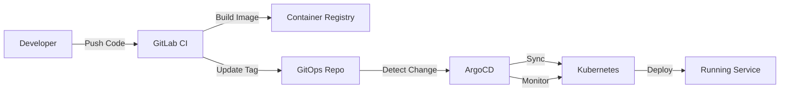

# 🚀 Deployment Architecture

**Purpose**: Deployment patterns, infrastructure components, and operational architecture  
**Navigation**: [← Back to Architecture](README.md) | [System Overview →](system-overview.md)

---

## 📋 Overview

This document describes the deployment architecture of our microservices platform, including infrastructure components, deployment patterns, and operational considerations. The system is designed for high availability, scalability, and maintainability.

---

## 🏗️ Infrastructure Architecture

### **Kubernetes Cluster Architecture**

```
┌─────────────────────────────────────────────────────────────┐
│                    Kubernetes Cluster                        │
├─────────────────────────────────────────────────────────────┤
│  ┌─────────────┐  ┌─────────────┐  ┌─────────────┐         │
│  │   Master    │  │   Master    │  │   Master    │         │
│  │   Node      │  │   Node      │  │   Node      │         │
│  └─────────────┘  └─────────────┘  └─────────────┘         │
├─────────────────────────────────────────────────────────────┤
│  ┌─────────────┐  ┌─────────────┐  ┌─────────────┐         │
│  │   Worker    │  │   Worker    │  │   Worker    │         │
│  │   Node      │  │   Node      │  │   Node      │         │
│  │             │  │             │  │             │         │
│  │ ┌─────────┐ │  │ ┌─────────┐ │  │ ┌─────────┐ │         │
│  │ │Services │ │  │ │Services │ │  │ │Services │ │         │
│  │ └─────────┘ │  │ └─────────┘ │  │ └─────────┘ │         │
│  │ ┌─────────┐ │  │ ┌─────────┐ │  │ ┌─────────┐ │         │
│  │ │Dapr    │ │  │ │Dapr    │ │  │ │Dapr    │ │         │
│  │ │Sidecars│ │  │ │Sidecars│ │  │ │Sidecars│ │         │
│  │ └─────────┘ │  │ └─────────┘ │  │ └─────────┘ │         │
│  └─────────────┘  └─────────────┘  └─────────────┘         │
└─────────────────────────────────────────────────────────────┘
```

### **Namespace Organization**

```yaml
# Namespace Strategy
namespaces:
  core-business-dev:
    purpose: Development environment for core business services
    services: checkout, order, payment, catalog, customer
    
  core-business-staging:
    purpose: Staging environment for core business services
    services: checkout, order, payment, catalog, customer
    
  core-business-prod:
    purpose: Production environment for core business services
    services: checkout, order, payment, catalog, customer
    
  platform-dev:
    purpose: Development environment for platform services
    services: auth, notification, search, analytics
    
  platform-staging:
    purpose: Staging environment for platform services
    services: auth, notification, search, analytics
    
  platform-prod:
    purpose: Production environment for platform services
    services: auth, notification, search, analytics
    
  infrastructure:
    purpose: Infrastructure components
    services: redis, postgresql, dapr, monitoring
```

---

## 🔄 GitOps Deployment Model

### **GitOps Principles**

```yaml
# GitOps Core Principles
gitops:
  declarative:
    description: Entire system state declared in Git
    benefits:
      - Version controlled
      - Auditable
      - Reproducible
      
  versioned:
    description: All changes tracked in Git history
    benefits:
      - Complete audit trail
      - Easy rollback
      - Change tracking
      
  automated:
    description: ArgoCD automatically syncs Git to cluster
    benefits:
      - Reduced human error
      - Faster deployments
      - Consistent state
      
  continuously_reconciled:
    description: ArgoCD ensures cluster matches Git
    benefits:
      - Self-healing
      - Drift detection
      - Automatic correction
```

### **Repository Structure**

```yaml
# GitOps Repository Organization
gitops/
├── bootstrap/                 # Root applications
│   └── root-app-dev.yaml     # Dev environment root app
│   
├── environments/              # Environment configurations
│   ├── dev/
│   │   ├── apps/             # Dev applications
│   │   ├── projects/         # ArgoCD projects
│   │   └── resources/        # Dev-specific resources
│   └── production/
│       ├── apps/             # Production applications
│       ├── projects/         # ArgoCD projects
│       └── resources/        # Prod-specific resources
│       
├── apps/                     # Application manifests
│   ├── {service}/
│   │   ├── base/             # Base configuration
│   │   └── overlays/         # Environment overlays
│   │       ├── dev/
│   │       └── production/
│   
├── infrastructure/            # Infrastructure components
│   ├── databases/
│   ├── monitoring/
│   └── security/
│   
├── components/               # Reusable components
│   ├── common-infrastructure-envvars/
│   ├── imagepullsecret/
│   └── infrastructure-egress/
│   
└── clusters/                 # Cluster-specific configs
    ├── dev/
    └── production/
```

### **Deployment Workflow**



### **Sync Waves Strategy**

```yaml
# ArgoCD Sync Waves
sync_waves:
  wave_0:
    name: Infrastructure Foundation
    services:
      - PostgreSQL
      - Redis
      - Dapr
    duration: ~5 minutes
    
  wave_1:
    name: Core Services
    services:
      - Auth Service
      - User Service
      - Gateway Service
    duration: ~5 minutes
    dependencies: [wave_0]
    
  wave_2:
    name: Business Services
    services:
      - Catalog Service
      - Pricing Service
      - Order Service
      - Checkout Service
    duration: ~10 minutes
    dependencies: [wave_1]
    
  wave_3:
    name: Supporting Services
    services:
      - Notification Service
      - Search Service
      - Analytics Service
    duration: ~10 minutes
    dependencies: [wave_2]
    
  wave_4:
    name: Frontend Services
    services:
      - Admin Service
      - Frontend Service
    duration: ~5 minutes
    dependencies: [wave_3]
```

### **Environment Management**

```yaml
# Environment Configuration
environments:
  dev:
    cluster: k3d-local
    namespace_pattern: "{service}-dev"
    replicas: 1
    resources:
      requests:
        cpu: 100m
        memory: 128Mi
      limits:
        cpu: 500m
        memory: 512Mi
    auto_sync: true
    prune: true
    self_heal: true
    
  staging:
    cluster: eks-staging
    namespace_pattern: "{service}-staging"
    replicas: 2
    resources:
      requests:
        cpu: 200m
        memory: 256Mi
      limits:
        cpu: 1000m
        memory: 1Gi
    auto_sync: true
    prune: true
    self_heal: true
    
  production:
    cluster: eks-production
    namespace_pattern: "{service}-prod"
    replicas: 3
    resources:
      requests:
        cpu: 500m
        memory: 512Mi
      limits:
        cpu: 2000m
        memory: 2Gi
    auto_sync: false  # Manual approval required
    prune: false
    self_heal: true
```

---

## 🔄 Deployment Patterns

### **GitOps with ArgoCD**

```yaml
# GitOps Repository Structure (Kustomize-based)
gitops/
├── bootstrap/                 # Root Applications (Dev/Prod)
│   └── root-app-dev.yaml
├── environments/              # Environment-specific configurations
│   ├── dev/
│   │   ├── apps/             # Dev environment applications
│   │   ├── projects/         # ArgoCD projects
│   │   └── resources/        # Environment-specific resources
│   └── production/
│       ├── apps/             # Production environment applications
│       ├── projects/         # ArgoCD projects
│       └── resources/        # Environment-specific resources
├── apps/                     # Application configurations (24 services)
│   ├── auth/
│   │   ├── base/             # Base manifests
│   │   ├── overlays/
│   │   │   ├── dev/          # Dev environment overlays
│   │   │   └── production/   # Production environment overlays
│   │   └── kustomization.yaml
│   ├── user/
│   ├── gateway/
│   ├── catalog/
│   ├── checkout/
│   ├── order/
│   └── ...                   # 24 deployable services
├── infrastructure/            # Infrastructure components
│   ├── databases/            # PostgreSQL, Redis configurations
│   ├── monitoring/           # Prometheus, Grafana, AlertManager
│   ├── security/             # Network policies, RBAC
│   └── storage/              # Storage classes and PVCs
├── clusters/                  # Cluster-specific configurations
│   ├── dev/                  # Dev cluster (k3d)
│   └── production/           # Production cluster
├── components/               # Reusable components
│   ├── common-infrastructure-envvars/
│   ├── imagepullsecret/
│   └── infrastructure-egress/
├── scripts/                  # Utility scripts
└── docs/                     # GitOps documentation
```

**Note**: The legacy `argocd/` directory (ApplicationSet-based) has been deprecated and migrated to the new `gitops/` repository (Kustomize-based) for better environment management and consistency.

### **Kustomize Application Structure**

```yaml
# Standard Kustomize Application Structure
apps/{service}/
├── base/                      # Base manifests
│   ├── deployment.yaml
│   ├── service.yaml
│   ├── configmap.yaml
│   ├── secret.yaml
│   ├── hpa.yaml
│   ├── pdb.yaml
│   ├── networkpolicy.yaml
│   ├── servicemonitor.yaml
│   └── kustomization.yaml
├── overlays/                  # Environment-specific overlays
│   ├── dev/
│   │   ├── kustomization.yaml
│   │   ├── patch-deployment.yaml
│   │   ├── patch-configmap.yaml
│   │   └── patch-resources.yaml
│   └── production/
│       ├── kustomization.yaml
│       ├── patch-deployment.yaml
│       ├── patch-configmap.yaml
│       └── patch-resources.yaml
└── kustomization.yaml         # Root kustomization
```

---

## 📦 Service Deployment Architecture

### **Container Architecture**

```yaml
# Standard Service Container
container:
  name: service-name
  image: registry.example.com/service-name:tag
  ports:
    - name: http
      containerPort: 8000
      protocol: TCP
    - name: grpc
      containerPort: 9000
      protocol: TCP
  env:
    - name: APP_ENV
      value: "production"
    - name: LOG_LEVEL
      value: "info"
  resources:
    limits:
      cpu: 500m
      memory: 1Gi
    requests:
      cpu: 200m
      memory: 512Mi
  livenessProbe:
    httpGet:
      path: /health/live
      port: 8000
    initialDelaySeconds: 10
    periodSeconds: 10
  readinessProbe:
    httpGet:
      path: /health/ready
      port: 8000
    initialDelaySeconds: 5
    periodSeconds: 5
```

### **Dapr Sidecar Configuration**

```yaml
# Dapr Annotations
annotations:
  dapr.io/enabled: "true"
  dapr.io/app-id: "service-name"
  dapr.io/app-port: "8000"
  dapr.io/app-protocol: "http"
  dapr.io/config: "appconfig"
  dapr.io/log-level: "info"
  dapr.io/sidecar-cpu-limit: "300m"
  dapr.io/sidecar-memory-limit: "300Mi"
  dapr.io/sidecar-readiness-probe-delay-seconds: "30"
```

---

## 🌐 Network Architecture

### **Service Mesh Communication**

```yaml
# Service Communication Patterns
communication:
  service-to-service:
    type: gRPC
    protocol: HTTP/2
    timeout: 30s
    retries: 3
    
  event-driven:
    type: Dapr Pub/Sub
    broker: Redis
    pattern: Publish/Subscribe
    
  external-apis:
    type: REST/gRPC
    gateway: API Gateway
    authentication: JWT/OAuth2
```

### **Network Policies**

```yaml
# Example Network Policy
apiVersion: networking.k8s.io/v1
kind: NetworkPolicy
metadata:
  name: checkout-network-policy
  namespace: core-business-prod
spec:
  podSelector:
    matchLabels:
      app: checkout
  policyTypes:
  - Ingress
  - Egress
  ingress:
  - from:
    - namespaceSelector:
        matchLabels:
          name: core-business-prod
    - namespaceSelector:
        matchLabels:
          name: platform-prod
    ports:
    - protocol: TCP
      port: 8000
    - protocol: TCP
      port: 9000
  egress:
  - to:
    - namespaceSelector:
        matchLabels:
          name: infrastructure
    ports:
    - protocol: TCP
      port: 6379  # Redis
    - protocol: TCP
      port: 5432  # PostgreSQL
```

---

## 📊 Infrastructure Components

### **Data Layer**

```yaml
# Database Architecture
databases:
  postgresql:
    type: PostgreSQL 15
    deployment: StatefulSet
    storage: 100Gi per instance
    backup: Daily + Point-in-time recovery
    high_availability: Primary-Replica
    
  redis:
    type: Redis 7
    deployment: StatefulSet
    mode: Cluster
    storage: 50Gi per node
    backup: Daily snapshots
    high_availability: Multi-node cluster
```

### **Message Broker**

```yaml
# Message Broker Architecture
message_broker:
  type: Redis Pub/Sub
  deployment: Cluster
  partitions: 16
  replication: 3
  persistence: AOF + RDB
  backup: Daily snapshots
```

### **Monitoring Stack**

```yaml
# Monitoring Components
monitoring:
  metrics:
    - Prometheus
    - Grafana
    - AlertManager
    
  logging:
    - Loki
    - Promtail
    - Grafana
    
  tracing:
    - Jaeger
    - OpenTelemetry
    
  uptime:
    - Blackbox Exporter
    - Heartbeat Monitoring
```

---

## 🔧 Deployment Strategies

### **Blue-Green Deployment**

```yaml
# Blue-Green Strategy
blue_green:
  strategy:
    type: RollingUpdate
    maxSurge: 100%
    maxUnavailable: 0%
    
  routing:
    primary: blue
    secondary: green
    switch: Instantaneous
    
  validation:
    health_checks: true
    smoke_tests: true
    rollback_on_failure: true
```

### **Canary Deployment**

```yaml
# Canary Strategy
canary:
  phases:
    - weight: 10%
      duration: 5m
      validation: health_checks
    - weight: 50%
      duration: 15m
      validation: smoke_tests
    - weight: 100%
      duration: 30m
      validation: full_validation
      
  rollback_conditions:
    error_rate: > 5%
    response_time: > 500ms
    availability: < 99.9%
```

---

## 🛡️ Security Architecture

### **Container Security**

```yaml
# Security Configuration
security:
  containers:
    runAsNonRoot: true
    runAsUser: 65532
    fsGroup: 65532
    readOnlyRootFilesystem: true
    allowPrivilegeEscalation: false
    capabilities:
      drop:
        - ALL
    seccompProfile:
      type: RuntimeDefault
      
  images:
    registry: Private registry
    scanning: Trivy/Clair
    signing: Cosign
    base_images: distroless/alpine
```

### **Network Security**

```yaml
# Network Security
network_security:
  encryption:
    in_transit: TLS 1.3
    at_rest: AES-256
    
  access_control:
    rbac: Kubernetes RBAC
    network_policies: Calico
    service_mesh: mTLS
    
  secrets:
    management: Kubernetes Secrets + SealedSecrets
    rotation: Automated (90 days)
    auditing: Access logs
```

---

## 📈 Scalability Architecture

### **Horizontal Scaling**

```yaml
# Auto-scaling Configuration
autoscaling:
  hpa:
    min_replicas: 1
    max_replicas: 10
    target_cpu_utilization: 70
    target_memory_utilization: 80
    scale_up_period: 60s
    scale_down_period: 300s
    
  vpa:
    update_mode: Auto
    resource_policy:
      min_allowed:
        cpu: 100m
        memory: 128Mi
      max_allowed:
        cpu: 2000m
        memory: 4Gi
```

### **Resource Management**

```yaml
# Resource Allocation
resources:
  limits:
    global:
      cpu: 100 cores
      memory: 200Gi
      
    per_namespace:
      core-business-prod: 50 cores, 100Gi
      platform-prod: 30 cores, 60Gi
      infrastructure: 20 cores, 40Gi
      
  quality_of_service:
    guaranteed: Critical services
    burstable: Standard services
    best_effort: Background jobs
```

---

## 🔄 Disaster Recovery

### **Backup Strategy**

```yaml
# Backup Configuration
backup:
  databases:
    frequency: Daily
    retention: 30 days
    storage: S3 with cross-region replication
    encryption: AES-256
    
  configurations:
    frequency: On change
    retention: 90 days
    storage: Git repository
    encryption: GPG
    
  testing:
    frequency: Weekly
    validation: Automated restore tests
    reporting: Success/failure metrics
```

### **High Availability**

```yaml
# HA Configuration
high_availability:
  control_plane: 3 masters
  worker_nodes: Minimum 3 per AZ
  data_replication: Multi-AZ
  failover: Automatic
  recovery_time: < 5 minutes (RTO)
  recovery_point: < 1 minute (RPO)
```

---

## 📊 Monitoring & Observability

### **Metrics Collection**

```yaml
# Metrics Architecture
metrics:
  collection:
    prometheus:
      retention: 15 days
      scrape_interval: 15s
      evaluation_interval: 15s
      
    custom_metrics:
      business_metrics: Order rate, revenue, conversion
      technical_metrics: Response time, error rate, throughput
      infrastructure_metrics: CPU, memory, network, disk
      
  alerting:
    severity_levels: Critical, Warning, Info
    escalation: PagerDuty, Slack, Email
    silence_periods: Maintenance windows
```

### **Logging Architecture**

```yaml
# Logging Configuration
logging:
  collection:
    agent: Promtail
    backend: Loki
    retention: 30 days
    
    formats:
      structured: JSON
      correlation: Trace ID
      enrichment: Service, version, namespace
      
  analysis:
    dashboards: Grafana
    alerting: Loki Alertmanager
    archiving: S3 for long-term storage
```

---

## 🚀 Deployment Pipeline

### **CI/CD Pipeline**

```yaml
# Pipeline Stages
pipeline:
  stages:
    - name: Build
      steps:
        - compile
        - test
        - security_scan
        - image_build
        
    - name: Deploy to Dev
      steps:
        - deploy_to_dev
        - integration_tests
        - smoke_tests
        
    - name: Deploy to Staging
      steps:
        - deploy_to_staging
        - full_regression_tests
        - performance_tests
        
    - name: Deploy to Prod
      steps:
        - manual_approval
        - blue_green_deployment
        - health_validation
        - rollback_if_needed
```

---

## 📚 Best Practices

### **Deployment Best Practices**

1. **Immutable Infrastructure**
   - Never modify running containers
   - Use immutable images
   - Deploy new versions, don't update existing ones

2. **Configuration Management**
   - Externalize all configuration
   - Use environment-specific configs
   - Store secrets securely

3. **Health Checks**
   - Implement comprehensive health checks
   - Include dependency health checks
   - Use proper HTTP status codes

4. **Resource Management**
   - Set appropriate resource limits
   - Use resource quotas
   - Monitor resource utilization

### **Security Best Practices**

1. **Container Security**
   - Use minimal base images
   - Scan images for vulnerabilities
   - Run as non-root user

2. **Network Security**
   - Implement network policies
   - Use encrypted communication
   - Apply principle of least privilege

3. **Secrets Management**
   - Use dedicated secrets management
   - Rotate secrets regularly
   - Audit secret access

---

## 🔗 Related Documentation

- **[System Overview](system-overview.md)** - High-level system architecture
- **[Microservices Design](microservices-design.md)** - Service design patterns
- **[Security Architecture](security-architecture.md)** - Security design and compliance
- **[Performance Architecture](performance-architecture.md)** - Performance considerations
- **[Operations Guide](../06-operations/README.md)** - Operational procedures

---

**Last Updated**: February 7, 2026  
**Review Cycle**: Quarterly  
**Maintained By**: Platform Engineering Team  
**GitOps Repository**: [ta-microservices/gitops](https://gitlab.com/ta-microservices/gitops)
