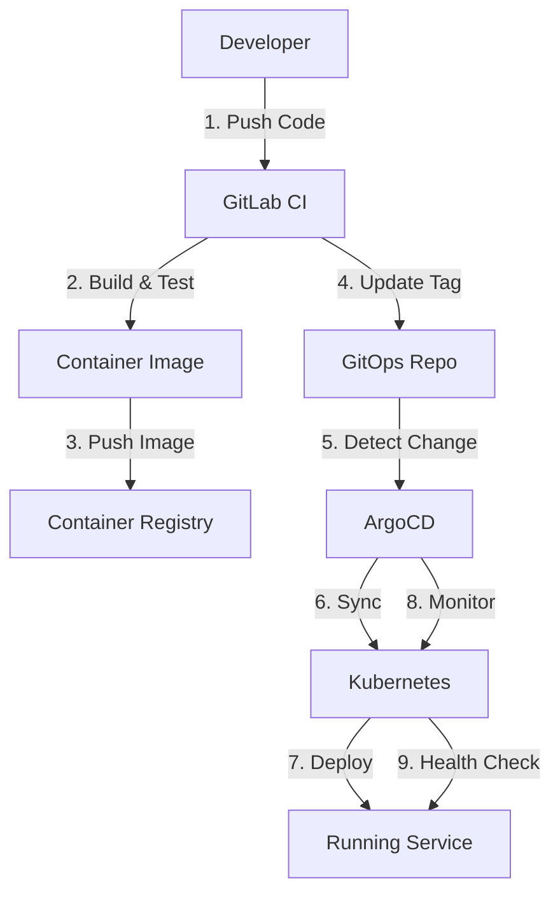

# 🔄 GitOps Migration Guide

**Purpose**: Documentation for ArgoCD to GitOps repository migration  
**Migration Date**: February 2026  
**Status**: ✅ Completed  
**Navigation**: [← Back to Architecture](README.md) | [Deployment Architecture →](deployment-architecture.md)

---

## 📋 Overview

This document describes the migration from the legacy `argocd/` directory (ApplicationSet-based) to the new `gitops/` repository (Kustomize-based) for better environment management, consistency, and scalability.

---

## 🎯 Migration Objectives

### **Why Migrate?**

1. **Better Environment Management**
   - Clear separation between dev/staging/production
   - Environment-specific configurations with overlays
   - Easier to manage multiple environments

2. **Improved Consistency**
   - Kustomize provides better configuration management
   - Reusable components across services
   - Standardized structure for all applications

3. **Enhanced Scalability**
   - Easier to add new services
   - Better support for multi-cluster deployments
   - Simplified configuration inheritance

4. **Simplified Operations**
   - Single source of truth for all deployments
   - Better GitOps workflow
   - Improved auditability and rollback capabilities

---

## 🏗️ Architecture Comparison

### **Legacy Structure (argocd/)**

```yaml
argocd/
├── applications/
│   ├── main/                    # ApplicationSet-based
│   │   ├── checkout/
│   │   │   ├── checkout-appset.yaml
│   │   │   ├── values-base.yaml
│   │   │   ├── dev/
│   │   │   │   ├── values.yaml
│   │   │   │   └── tag.yaml
│   │   │   └── staging/
│   │   │       ├── values.yaml
│   │   │       └── tag.yaml
│   │   └── ...
│   └── thirdparties/
├── argocd-projects/
│   ├── dev.yaml
│   ├── staging.yaml
│   └── production.yaml
└── infrastructure/

# Issues:
- Mixed Helm and ApplicationSet patterns
- Complex values inheritance
- Difficult to manage environment-specific configs
- No clear separation of concerns
```

### **New Structure (gitops/)**

```yaml
gitops/
├── bootstrap/                   # Root applications
│   └── root-app-dev.yaml
│   
├── environments/                # Environment-first organization
│   ├── dev/
│   │   ├── apps/               # Dev applications
│   │   ├── projects/           # ArgoCD projects
│   │   └── resources/          # Dev-specific resources
│   └── production/
│       ├── apps/               # Production applications
│       ├── projects/           # ArgoCD projects
│       └── resources/          # Prod-specific resources
│       
├── apps/                       # Application manifests
│   ├── {service}/
│   │   ├── base/               # Base configuration
│   │   │   ├── deployment.yaml
│   │   │   ├── service.yaml
│   │   │   ├── configmap.yaml
│   │   │   └── kustomization.yaml
│   │   └── overlays/           # Environment overlays
│   │       ├── dev/
│   │       │   ├── kustomization.yaml
│   │       │   └── patch-*.yaml
│   │       └── production/
│   │           ├── kustomization.yaml
│   │           └── patch-*.yaml
│   
├── infrastructure/              # Infrastructure components
│   ├── databases/
│   ├── monitoring/
│   └── security/
│   
├── components/                 # Reusable components
│   ├── common-infrastructure-envvars/
│   ├── imagepullsecret/
│   └── infrastructure-egress/
│   
└── clusters/                   # Cluster-specific configs
    ├── dev/
    └── production/

# Benefits:
- Pure Kustomize-based approach
- Clear environment separation
- Reusable components
- Simplified configuration management
- Better GitOps practices
```

---

## 🔄 Migration Process

### **Phase 1: Repository Setup** ✅

```bash
# 1. Create new gitops repository
git clone https://gitlab.com/ta-microservices/gitops.git
cd gitops

# 2. Initialize structure
mkdir -p {bootstrap,environments/{dev,production},apps,infrastructure,components,clusters}

# 3. Set up base structure
# - Created bootstrap/root-app-dev.yaml
# - Created environments/dev and environments/production
# - Created apps/ with base/overlays pattern
```

### **Phase 2: Service Migration** ✅

```bash
# For each service:
# 1. Create base manifests
mkdir -p apps/{service}/base
# - deployment.yaml
# - service.yaml
# - configmap.yaml
# - kustomization.yaml

# 2. Create environment overlays
mkdir -p apps/{service}/overlays/{dev,production}
# - kustomization.yaml
# - patch-deployment.yaml
# - patch-configmap.yaml

# 3. Migrate configuration from argocd/
# - Convert Helm values to Kustomize patches
# - Update image tags
# - Update environment variables
```

### **Phase 3: Infrastructure Migration** ✅

```bash
# 1. Migrate infrastructure components
# - PostgreSQL configurations
# - Redis configurations
# - Monitoring stack (Prometheus, Grafana)
# - Security policies

# 2. Create reusable components
# - common-infrastructure-envvars
# - imagepullsecret
# - infrastructure-egress

# 3. Set up cluster-specific configs
# - Dev cluster (k3d)
# - Production cluster (EKS/GKE)
```

### **Phase 4: ArgoCD Configuration** ✅

```bash
# 1. Update ArgoCD to point to new repository
# 2. Create root application
kubectl apply -f bootstrap/root-app-dev.yaml

# 3. Verify sync
argocd app list
argocd app sync root-app-dev
```

### **Phase 5: Validation & Cleanup** ✅

```bash
# 1. Validate all services deployed correctly
kubectl get pods --all-namespaces

# 2. Run health checks
./scripts/health-check.sh dev

# 3. Mark legacy argocd/ as deprecated
# - Add deprecation notice to argocd/README.md
# - Update documentation to reference gitops/
# - Keep argocd/ for reference (do not delete)
```

---

## 📊 Migration Statistics

### **Services Migrated**

```yaml
total_services: 24
categories:
  core_infrastructure: 6
    - PostgreSQL
    - Redis
    - Dapr
    - Consul
    - Vault
    - MinIO
    
  core_business: 4
    - Auth
    - User
    - Customer
    - Gateway
    
  order_processing: 5
    - Catalog
    - Pricing
    - Checkout
    - Order
    - Payment
    
  supporting: 5
    - Warehouse
    - Fulfillment
    - Shipping
    - Notification
    - Search
    
  frontend: 2
    - Admin
    - Frontend
    
  after_sales: 2
    - Return
    - Review

migration_time: 2 weeks
deployment_time: 35-45 minutes (full platform)
```

### **Configuration Changes**

```yaml
changes:
  manifests_created: 240+
    - 24 services × 10 manifests per service
    
  kustomizations_created: 72
    - 24 services × 3 (base + 2 overlays)
    
  components_created: 3
    - common-infrastructure-envvars
    - imagepullsecret
    - infrastructure-egress
    
  environments_configured: 2
    - dev
    - production
```

---

## 🎯 Key Improvements

### **1. Environment Management**

**Before (argocd/):**
```yaml
# Complex values inheritance
checkout/
├── values-base.yaml
├── dev/
│   ├── values.yaml      # Overrides base
│   └── tag.yaml         # Image tag
└── staging/
    ├── values.yaml      # Overrides base
    └── tag.yaml         # Image tag
```

**After (gitops/):**
```yaml
# Clear Kustomize overlays
checkout/
├── base/
│   ├── deployment.yaml
│   ├── service.yaml
│   └── kustomization.yaml
└── overlays/
    ├── dev/
    │   ├── kustomization.yaml
    │   └── patch-deployment.yaml
    └── production/
        ├── kustomization.yaml
        └── patch-deployment.yaml
```

### **2. Reusable Components**

**Before:** Duplicated configuration across services

**After:** Shared components
```yaml
# Use in any service
apiVersion: kustomize.config.k8s.io/v1beta1
kind: Kustomization

components:
  - ../../../components/common-infrastructure-envvars
  - ../../../components/imagepullsecret
  - ../../../components/infrastructure-egress
```

### **3. Deployment Consistency**

**Before:** Mixed patterns (Helm + ApplicationSet)

**After:** Pure Kustomize
- Consistent structure across all services
- Predictable configuration management
- Easier to understand and maintain

### **4. GitOps Best Practices**

**Before:** 
- Manual sync required for some services
- Inconsistent auto-sync policies
- Complex rollback procedures

**After:**
- Automated sync with ArgoCD
- Consistent sync policies per environment
- Simple rollback via Git revert

---

## 📚 Documentation Updates

### **Updated Documents**

1. **[deployment-architecture.md](deployment-architecture.md)**
   - Updated GitOps section with new structure
   - Added Kustomize configuration examples
   - Updated sync waves strategy

2. **[infrastructure-architecture.md](infrastructure-architecture.md)**
   - Updated CI/CD infrastructure section
   - Added Kustomize management section
   - Updated ArgoCD configuration

3. **[README.md](README.md)**
   - Updated system metrics (24 deployable services)
   - Added GitOps reference
   - Updated last updated date

4. **[gitops-migration.md](gitops-migration.md)** (this document)
   - Complete migration guide
   - Architecture comparison
   - Key improvements

### **New Documentation**

1. **gitops/README.md**
   - Repository overview
   - Structure explanation
   - Getting started guide

2. **gitops/docs/README.md**
   - Documentation index
   - Quick start for AI agents
   - Architecture overview

3. **gitops/docs/SERVICE_INDEX.md**
   - Complete service catalog
   - Deployment order
   - Dependencies matrix

---

## 🚀 Deployment Workflow

### **New Deployment Process**



### **Deployment Steps**

```bash
# 1. Developer pushes code
git push origin feature/new-feature

# 2. GitLab CI builds and tests
# - Run unit tests
# - Build Docker image
# - Push to registry
# - Update gitops repo with new tag

# 3. ArgoCD detects change
# - Monitors gitops repo
# - Detects new commit
# - Triggers sync

# 4. ArgoCD syncs to cluster
# - Applies Kustomize manifests
# - Deploys to Kubernetes
# - Monitors health

# 5. Service is running
# - Health checks pass
# - Service is ready
# - Metrics are collected
```

---

## 🔧 Rollback Procedures

### **Git-based Rollback**

```bash
# 1. Identify problematic commit
git log --oneline

# 2. Revert to previous version
git revert <commit-hash>
git push origin main

# 3. ArgoCD automatically syncs
# - Detects revert commit
# - Applies previous configuration
# - Service rolls back

# Alternative: Manual sync to specific commit
argocd app sync app-name --revision <commit-hash>
```

### **Emergency Rollback**

```bash
# 1. Disable auto-sync
argocd app set app-name --sync-policy none

# 2. Manually sync to known good state
argocd app sync app-name --revision <good-commit>

# 3. Verify service health
kubectl get pods -n namespace
kubectl logs -f deployment/service-name -n namespace

# 4. Re-enable auto-sync when stable
argocd app set app-name --sync-policy automated
```

---

## 📊 Monitoring & Observability

### **ArgoCD Monitoring**

```yaml
# ArgoCD Application Health
health_checks:
  - Application sync status
  - Resource health status
  - Sync operation status
  - Last sync time
  
metrics:
  - argocd_app_sync_total
  - argocd_app_health_status
  - argocd_app_sync_status
  - argocd_app_reconcile_duration_seconds
  
alerts:
  - Application out of sync
  - Application degraded
  - Sync operation failed
  - Resource health degraded
```

### **Deployment Monitoring**

```yaml
# Kubernetes Deployment Monitoring
health_checks:
  - Pod readiness
  - Pod liveness
  - Deployment rollout status
  - Service endpoints
  
metrics:
  - kube_deployment_status_replicas
  - kube_deployment_status_replicas_available
  - kube_pod_status_phase
  - kube_pod_container_status_ready
  
alerts:
  - Deployment rollout stuck
  - Pod crash looping
  - Service endpoints unavailable
  - High pod restart rate
```

---

## 🎓 Best Practices

### **GitOps Best Practices**

1. **Single Source of Truth**
   - All configuration in Git
   - No manual kubectl apply
   - All changes via Git commits

2. **Environment Separation**
   - Clear dev/staging/production separation
   - Environment-specific overlays
   - No shared configurations between environments

3. **Automated Sync**
   - Enable auto-sync for dev/staging
   - Manual approval for production
   - Self-healing enabled

4. **Version Control**
   - Meaningful commit messages
   - Tag releases
   - Document breaking changes

### **Kustomize Best Practices**

1. **Base + Overlays Pattern**
   - Keep base minimal
   - Use overlays for environment-specific changes
   - Avoid duplication

2. **Reusable Components**
   - Create components for shared configuration
   - Use components across services
   - Keep components focused

3. **Patch Strategy**
   - Use strategic merge patches
   - Keep patches minimal
   - Document patch purpose

4. **Resource Management**
   - Set appropriate resource limits
   - Use HPA for auto-scaling
   - Configure PDB for high availability

---

## 🔗 Related Documentation

- **[Deployment Architecture](deployment-architecture.md)** - Deployment patterns and strategies
- **[Infrastructure Architecture](infrastructure-architecture.md)** - Infrastructure components
- **[GitOps Repository](../../gitops/README.md)** - GitOps repository documentation
- **[Service Index](../../docs/SERVICE_INDEX.md)** - Complete service catalog

---

## 📞 Support

### **Migration Issues**

If you encounter issues with the migration:

1. **Check ArgoCD Status**
   ```bash
   argocd app list
   argocd app get app-name
   ```

2. **Check Kubernetes Resources**
   ```bash
   kubectl get all -n namespace
   kubectl describe pod pod-name -n namespace
   ```

3. **Check Logs**
   ```bash
   kubectl logs -f deployment/service-name -n namespace
   argocd app logs app-name
   ```

4. **Contact Team**
   - DevOps Team: Platform engineering support
   - Development Team: Application support
   - Architecture Team: Design decisions

---

**Migration Date**: February 2026  
**Status**: ✅ Completed  
**Legacy Repository**: `argocd/` (deprecated, kept for reference)  
**Active Repository**: `gitops/` (Kustomize-based)  
**Last Updated**: February 7, 2026  
**Maintained By**: Platform Engineering Team
