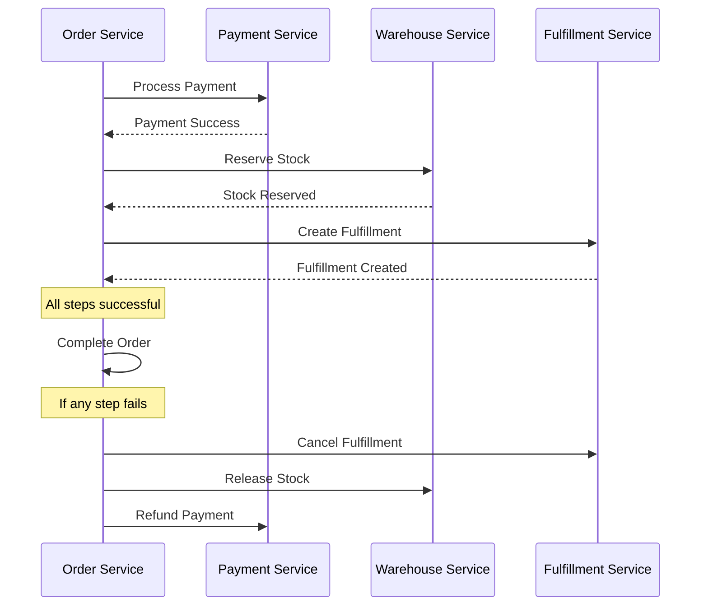

# 🏗️ Microservices Design Patterns

**Purpose**: Microservices architecture patterns and design principles used in our platform

---

## 📋 **Overview**

This document outlines the microservices design patterns, principles, and best practices implemented in our e-commerce platform. It serves as a guide for understanding our architectural approach and making consistent design decisions.

## 🎯 **Core Design Principles**

### **1. Domain-Driven Design (DDD)**
Our microservices are organized around business domains rather than technical layers:

```
Business Domains → Microservices Mapping
├── Commerce Domain
│   ├── Order Service (order lifecycle)
│   ├── Cart Service (shopping cart)
│   └── Payment Service (payment processing)
├── Inventory Domain
│   ├── Warehouse Service (stock management)
│   ├── Fulfillment Service (order fulfillment)
│   └── Shipping Service (logistics)
├── Customer Domain
│   ├── Customer Service (profiles)
│   ├── Auth Service (authentication)
│   └── User Service (admin users)
└── Content Domain
    ├── Catalog Service (products)
    ├── Search Service (discovery)
    └── Review Service (ratings)
```

### **2. Single Responsibility Principle**
Each service has a single, well-defined business responsibility:
- **Order Service**: Manages order lifecycle from creation to completion
- **Payment Service**: Handles payment processing and reconciliation
- **Catalog Service**: Manages product information and categories
- **Warehouse Service**: Controls inventory and stock levels

### **3. Database Per Service**
Each service owns its data and database:
- **Data Isolation**: No direct database access between services
- **Technology Choice**: Each service can choose optimal database technology
- **Independent Scaling**: Databases scale based on service needs
- **Failure Isolation**: Database issues don't cascade across services

## 🔄 **Communication Patterns**

### **Synchronous Communication**
Used for real-time operations requiring immediate responses:

**gRPC for Internal Communication**
```go
// Example: Order Service calling Payment Service
paymentResponse, err := s.paymentClient.ProcessPayment(ctx, &payment.ProcessPaymentRequest{
    OrderID: orderID,
    Amount:  totalAmount,
    Method:  paymentMethod,
})
```

**REST APIs for External Communication**
```http
POST /api/v1/orders
Content-Type: application/json
Authorization: Bearer <token>

{
  "items": [...],
  "shipping_address": {...},
  "payment_method": "credit_card"
}
```

### **Asynchronous Communication**
Used for eventual consistency and loose coupling:

**Event-Driven Architecture with Dapr**
```go
// Publishing domain events
event := &events.OrderCreatedEvent{
    OrderID:    order.ID,
    CustomerID: order.CustomerID,
    Items:      order.Items,
    Timestamp:  time.Now(),
}

err := s.eventPublisher.Publish(ctx, "orders.order.created", event)
```

**Event Consumption**
```go
// Consuming events in other services
func (h *InventoryEventHandler) HandleOrderCreated(ctx context.Context, event *events.OrderCreatedEvent) error {
    // Reserve inventory for order items
    return h.inventoryService.ReserveStock(ctx, event.Items)
}
```

## 🏛️ **Architectural Patterns**

### **1. API Gateway Pattern**
Centralized entry point for all client requests:

```
Client Requests → API Gateway → Microservices
                      ↓
              ┌─────────────────┐
              │   API Gateway   │
              │  - Routing      │
              │  - Auth         │
              │  - Rate Limit   │
              │  - Load Balance │
              └─────────────────┘
                      ↓
    ┌─────────┬─────────┬─────────┬─────────┐
    │ Order   │Catalog  │Customer │Payment  │
    │Service  │Service  │Service  │Service  │
    └─────────┴─────────┴─────────┴─────────┘
```

**Benefits:**
- Single entry point for clients
- Cross-cutting concerns (auth, logging, rate limiting)
- Service discovery and load balancing
- API versioning and backward compatibility

### **2. Saga Pattern**
Distributed transaction management across services:



### **3. Circuit Breaker Pattern**
Prevent cascading failures and improve resilience:

```go
type CircuitBreaker struct {
    failureThreshold int
    resetTimeout     time.Duration
    state           State // Closed, Open, HalfOpen
}

func (cb *CircuitBreaker) Call(operation func() error) error {
    if cb.state == Open {
        return ErrCircuitBreakerOpen
    }
    
    err := operation()
    if err != nil {
        cb.recordFailure()
        return err
    }
    
    cb.recordSuccess()
    return nil
}
```

### **4. Outbox Pattern**
Reliable event publishing with transactional guarantees:

```sql
-- Outbox table for reliable event publishing
CREATE TABLE outbox (
    id UUID PRIMARY KEY,
    event_type VARCHAR(100) NOT NULL,
    event_data JSONB NOT NULL,
    created_at TIMESTAMP DEFAULT NOW(),
    processed_at TIMESTAMP NULL
);

-- Business transaction with event
BEGIN;
  INSERT INTO orders (id, customer_id, total) VALUES (...);
  INSERT INTO outbox (event_type, event_data) VALUES ('order.created', {...});
COMMIT;
```

## 📊 **Service Design Standards**

### **Service Structure**
Each service follows Clean Architecture principles:

```
service-name/
├── cmd/
│   └── server/          # Application entry point
├── internal/
│   ├── biz/            # Business logic layer
│   ├── data/           # Data access layer
│   ├── service/        # gRPC/HTTP services
│   ├── client/         # External service clients
│   └── server/         # Server setup
├── api/
│   └── proto/          # Protocol buffer definitions
├── configs/            # Configuration files
└── migrations/         # Database migrations
```

### **Dependency Management**
Services use dependency injection with Wire:

```go
//go:build wireinject
// +build wireinject

func NewServer(config *Config) (*Server, error) {
    wire.Build(
        // Data layer
        data.NewDatabase,
        data.NewOrderRepository,
        
        // Business layer
        biz.NewOrderUsecase,
        
        // Service layer
        service.NewOrderService,
        
        // Server
        NewGRPCServer,
        NewHTTPServer,
        NewServer,
    )
    return &Server{}, nil
}
```

## 🔒 **Security Patterns**

### **Authentication & Authorization**
JWT-based authentication with service-to-service security:

```go
// JWT validation middleware
func JWTMiddleware(secret []byte) gin.HandlerFunc {
    return func(c *gin.Context) {
        token := extractToken(c.GetHeader("Authorization"))
        
        claims, err := validateJWT(token, secret)
        if err != nil {
            c.JSON(401, gin.H{"error": "Unauthorized"})
            c.Abort()
            return
        }
        
        c.Set("user_id", claims.UserID)
        c.Set("roles", claims.Roles)
        c.Next()
    }
}
```

### **Service Mesh Security**
mTLS for service-to-service communication:

```yaml
# Dapr configuration for mTLS
apiVersion: dapr.io/v1alpha1
kind: Configuration
metadata:
  name: default
spec:
  mtls:
    enabled: true
    workloadCertTTL: "24h"
    allowedClockSkew: "15m"
```

## 📈 **Scalability Patterns**

### **Horizontal Scaling**
Services scale independently based on demand:

```yaml
# Kubernetes HPA configuration
apiVersion: autoscaling/v2
kind: HorizontalPodAutoscaler
metadata:
  name: order-service-hpa
spec:
  scaleTargetRef:
    apiVersion: apps/v1
    kind: Deployment
    name: order-service
  minReplicas: 2
  maxReplicas: 10
  metrics:
  - type: Resource
    resource:
      name: cpu
      target:
        type: Utilization
        averageUtilization: 70
```

### **Database Scaling**
Read replicas and connection pooling:

```go
// Database connection with read replicas
type DatabaseConfig struct {
    WriteDB *sql.DB  // Primary database for writes
    ReadDB  *sql.DB  // Read replica for queries
}

func (r *Repository) GetOrder(ctx context.Context, id string) (*Order, error) {
    // Use read replica for queries
    return r.queryOrder(ctx, r.config.ReadDB, id)
}

func (r *Repository) CreateOrder(ctx context.Context, order *Order) error {
    // Use primary database for writes
    return r.insertOrder(ctx, r.config.WriteDB, order)
}
```

## 🔍 **Observability Patterns**

### **Distributed Tracing**
Track requests across service boundaries:

```go
// OpenTelemetry tracing
func (s *OrderService) CreateOrder(ctx context.Context, req *pb.CreateOrderRequest) (*pb.CreateOrderResponse, error) {
    ctx, span := otel.Tracer("order-service").Start(ctx, "CreateOrder")
    defer span.End()
    
    // Add attributes to span
    span.SetAttributes(
        attribute.String("customer.id", req.CustomerID),
        attribute.Int("items.count", len(req.Items)),
    )
    
    // Business logic with context propagation
    order, err := s.usecase.CreateOrder(ctx, req)
    if err != nil {
        span.RecordError(err)
        span.SetStatus(codes.Error, err.Error())
        return nil, err
    }
    
    return &pb.CreateOrderResponse{Order: order}, nil
}
```

### **Metrics Collection**
Prometheus metrics for monitoring:

```go
// Prometheus metrics
var (
    ordersCreated = prometheus.NewCounterVec(
        prometheus.CounterOpts{
            Name: "orders_created_total",
            Help: "Total number of orders created",
        },
        []string{"status"},
    )
    
    orderProcessingDuration = prometheus.NewHistogramVec(
        prometheus.HistogramOpts{
            Name: "order_processing_duration_seconds",
            Help: "Order processing duration",
        },
        []string{"operation"},
    )
)

func (s *OrderService) CreateOrder(ctx context.Context, req *pb.CreateOrderRequest) (*pb.CreateOrderResponse, error) {
    timer := prometheus.NewTimer(orderProcessingDuration.WithLabelValues("create"))
    defer timer.ObserveDuration()
    
    order, err := s.usecase.CreateOrder(ctx, req)
    if err != nil {
        ordersCreated.WithLabelValues("failed").Inc()
        return nil, err
    }
    
    ordersCreated.WithLabelValues("success").Inc()
    return &pb.CreateOrderResponse{Order: order}, nil
}
```

## 🔗 **Related Documentation**

- **[System Overview](system-overview.md)** - High-level system architecture
- **[Event-Driven Architecture](event-driven-architecture.md)** - Event communication patterns
- **[API Architecture](api-architecture.md)** - API design and versioning
- **[Services Documentation](../03-services/)** - Individual service implementations

---

**Last Updated**: January 26, 2026  
**Maintained By**: Architecture Team