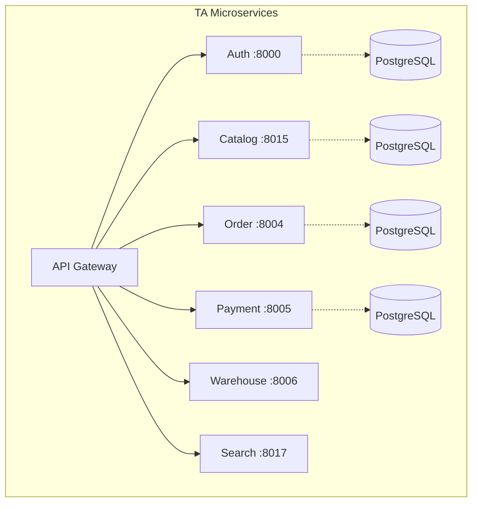
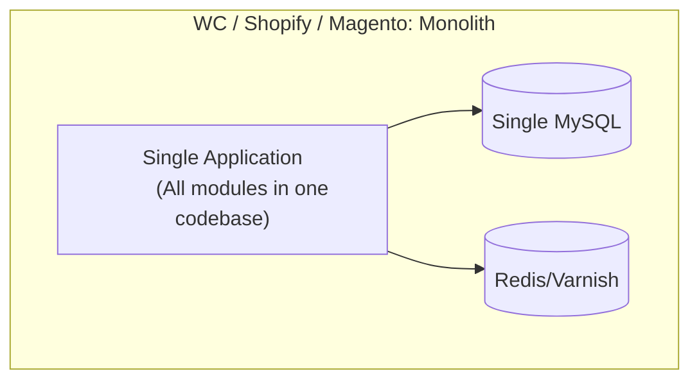

# Platform Comparison: TA Microservices vs WooCommerce vs Shopify vs Magento

> **Date**: 2026-02-14 | **Version**: v1.1

---

## 1. Platform Overview

| Criteria | 🟠 TA Microservices | 🟣 WooCommerce | 🟢 Shopify | 🔵 Magento (Adobe Commerce) |
|----------|---------------------|----------------|------------|------------------------------|
| **Architecture** | Microservices (21 Go services) | Monolith (WordPress plugin) | SaaS / Monolith hosted | Monolith (PHP, modular) |
| **Language** | Go, React, Next.js | PHP (WordPress) | Ruby on Rails (closed) | PHP (Magento Framework) |
| **Database** | PostgreSQL per service | MySQL (shared) | MySQL (managed, closed) | MySQL (shared) |
| **Hosting** | Self-hosted K8s (K3d/ArgoCD) | Self-hosted / Any hosting | Shopify Cloud (managed) | Self-hosted / Adobe Cloud |
| **Open Source** | ✅ Private source, full ownership | ✅ GPL v2 | ❌ Closed source | ⚠️ Open Source (CE) / Closed (EE) |
| **Cost** | Infra + dev team | Free plugin + hosting | $29–299/mo + transaction fees | Free (CE) / $$$$ (EE) |
| **Target** | Custom enterprise, VN market | SMB, bloggers, WP users | D2C brands, SMB–Enterprise | Enterprise, B2B complex |

---

## 2. Architecture & Scalability

### Key Differentiator: Microservices vs Monolith

| Aspect | 🟠 TA Microservices | 🟣 WooCommerce | 🟢 Shopify | 🔵 Magento |
|--------|---------------------|----------------|------------|------------|
| **Per-module scaling** | ✅ Scale Order and Payment independently | ❌ Scale entire WordPress | ✅ Shopify manages (no control) | ❌ Scale entire app (limited horizontal) |
| **Database isolation** | ✅ Separate DB per service | ❌ Shared DB, 60+ tables | ❌ No DB access | ❌ Shared DB, 300+ tables |
| **Independent deploy** | ✅ Deploy 1 service without affecting others | ❌ Deploy = update all of WP | ✅ Shopify handles deploys | ❌ Deploy = full downtime |
| **Fault isolation** | ✅ Payment crash ≠ Catalog down | ❌ Plugin crash = site down | ✅ Shopify manages | ❌ Module crash = site down |
| **Complexity** | 🔴 Very high (21 services + event flows + K8s) | 🟢 Low | 🟢 Lowest | 🟡 Medium–High |

---

## 3. Core E-Commerce Features

### 3.1 Checkout & Order Flow

| Feature | 🟠 TA | 🟣 WooCommerce | 🟢 Shopify | 🔵 Magento |
|---------|-------|----------------|------------|------------|
| **Cart management** | ✅ RDBMS + Redis session | ✅ WP Session/Cookie | ✅ Cart API | ✅ Quote system |
| **Multi-step checkout** | ✅ Custom flow (validate → reserve → pay → order) | ✅ Via plugins | ✅ Checkout UI Extensions | ✅ Native multi-step |
| **Stock reservation** | ✅ TTL-based reservation + expiry worker | ❌ Only reduce on order | ✅ 10-min reservation | ✅ Pre-payment reservation |
| **Idempotency** | ✅ Redis + DB (prevent duplicate orders) | ❌ Not built-in | ✅ Built-in | ⚠️ Partial |
| **Payment Saga** | ✅ 3-phase (authorize → capture retry → compensation + DLQ) | ❌ Sync payment only | ✅ Shopify Payments internal | ❌ Sync payment |
| **Order cancellation** | ✅ Reservation release + refund + loyalty reversal + events | ✅ Basic cancel + restock | ✅ Full cancel flow | ✅ Credit memo system |

### 3.2 Payment Processing

| Feature | 🟠 TA | 🟣 WooCommerce | 🟢 Shopify | 🔵 Magento |
|---------|-------|----------------|------------|------------|
| **Payment gateways** | Stripe, VNPay, MoMo + COD | 100+ plugins (Stripe, PayPal, etc.) | Shopify Payments + 100+ providers | PayPal, Stripe, Braintree, etc. |
| **VN-specific gateways** | ✅ VNPay, MoMo native | ⚠️ Via 3rd-party plugin | ⚠️ Limited VN support | ⚠️ Via extension |
| **Gateway failover** | ✅ Automatic failover between gateways | ❌ | ❌ | ❌ |
| **Fraud detection** | ✅ GeoIP + VPN/proxy detection + ML model | ❌ Plugin-based | ✅ Shopify Protect | ⚠️ Signifyd/etc integration |
| **Circuit breaker** | ✅ Per-gateway circuit breakers | ❌ | ✅ Internal | ❌ |
| **Rate limiting** | ✅ Per-gateway rate limits | ❌ | ✅ Internal | ❌ |
| **Reconciliation** | ✅ Automated reconciliation job | ❌ Manual | ✅ Shopify Balance | ⚠️ Manual/3rd party |
| **Auth + Capture** | ✅ Separate authorize → delayed capture | ✅ Gateway-dependent | ✅ Native | ✅ Native |

### 3.3 Inventory & Warehouse

| Feature | 🟠 TA | 🟣 WooCommerce | 🟢 Shopify | 🔵 Magento |
|---------|-------|----------------|------------|------------|
| **Multi-warehouse** | ✅ Full multi-warehouse | ❌ Single stock location | ✅ Multi-location | ✅ Multi-source inventory (MSI) |
| **Stock reservation** | ✅ Transactional outbox + TTL expiry | ❌ | ✅ Basic | ✅ Reservation (MSI) |
| **Backorder management** | ✅ BackorderQueue + auto-fill | ✅ Basic allow/disallow | ✅ Continue selling | ✅ Backorder per product |
| **Inventory transfers** | ✅ Between warehouses | ❌ | ✅ Between locations | ✅ Source transfer |
| **Batch picking** | ✅ Optimized pick path | ❌ | ❌ (3rd party: ShipHero) | ❌ (3rd party) |
| **Bin/Aisle location** | ✅ Full WMS features | ❌ | ❌ | ❌ |

### 3.4 Search & Catalog

| Feature | 🟠 TA | 🟣 WooCommerce | 🟢 Shopify | 🔵 Magento |
|---------|-------|----------------|------------|------------|
| **Search engine** | Elasticsearch (full-text, faceted, autocomplete) | MySQL LIKE queries | Shopify Search & Discovery | Elasticsearch (native in 2.4+) |
| **EAV attributes** | ✅ Custom EAV in Catalog service | ❌ WP meta (slow) | ❌ Metafields (limited query) | ✅ Full EAV (notoriously complex) |
| **Real-time sync** | ✅ Event-driven (product/price/stock → ES) | ❌ On-demand reindex | ✅ Automatic | ⚠️ Cron-based reindex |
| **Synonyms** | ✅ Built-in synonym management | ❌ Plugin | ✅ Built-in | ✅ Native |
| **ML features** | ✅ Feature extraction for recommendations | ❌ | ✅ Shopify AI | ⚠️ Adobe Sensei (EE only) |

---

## 4. Event-Driven Architecture — Key Differentiator

| Aspect | 🟠 TA | 🟣 WooCommerce | 🟢 Shopify | 🔵 Magento |
|--------|-------|----------------|------------|------------|
| **Event system** | Dapr PubSub (Redis Streams) — async, decoupled | WordPress Hooks (sync, in-process) | Webhooks (HTTP callback) | Magento Events/Observers (sync, in-process) |
| **Transactional outbox** | ✅ 8 services (order, payment, warehouse, fulfillment, shipping, pricing, loyalty, return) | ❌ | ❌ | ❌ |
| **Event idempotency** | ✅ DB-level per consumer | ❌ | ❌ (webhook retry is "at least once") | ❌ |
| **Saga pattern** | ✅ Multi-phase payment saga with DLQ + compensation | ❌ | ❌ (internal, closed) | ❌ |
| **Dead Letter Queue** | ✅ Failed events tracked + alert | ❌ | ❌ | ❌ |

> **Why this matters:**
> - WordPress hooks are **synchronous** — if one hook is slow, the entire request blocks
> - Shopify webhooks can be **missed** if the endpoint is down — no replay mechanism
> - Magento observers are **synchronous** and can cause performance bottlenecks
> - TA Microservices: Events are **asynchronous**, auto-retried, idempotent, with outbox guaranteeing delivery

---

## 5. DevOps & Deployment

| Aspect | 🟠 TA | 🟣 WooCommerce | 🟢 Shopify | 🔵 Magento |
|--------|-------|----------------|------------|------------|
| **Infrastructure** | K8s (K3d) + ArgoCD GitOps | cPanel / VPS / WP hosting | Shopify Cloud (managed) | Cloud / On-prem / Adobe Cloud |
| **CI/CD** | GitLab CI + ArgoCD auto-sync | FTP / Git deploy plugins | Shopify CLI / GitHub integration | Self-managed CI/CD |
| **Containers** | ✅ Docker (dual-binary: service + worker) | ❌ (possible but not native) | ❌ Closed | ⚠️ Possible but complex |
| **Zero-downtime deploy** | ✅ Rolling update per service | ❌ Maintenance mode | ✅ Always up | ⚠️ Depends on setup |
| **Auto-scaling** | ✅ K8s HPA per service | ❌ Manual | ✅ Shopify managed | ⚠️ Manual / Cloud managed |
| **Observability** | Prometheus metrics + OpenTelemetry tracing | ❌ WP Debug Log | ✅ Shopify Analytics | ⚠️ New Relic/etc integration |
| **Service discovery** | Consul | ❌ N/A | ❌ N/A | ❌ N/A |

---

## 6. Current Weaknesses vs Other Platforms

| Weakness | Detail | WC/Shopify/Magento? |
|----------|--------|---------------------|
| 🔴 **No plugin ecosystem** | All features must be custom-built | ✅ WC: 59,000+ plugins, Shopify: 8,000+ apps |
| 🔴 **No CMS/Content** | No blog, landing pages | ✅ WC = WordPress CMS, Shopify has Online Store |
| 🔴 **Very high complexity** | 21 services + event flows + K8s = large team required | ✅ One person can run WC/Shopify |
| 🟡 **No POS** | No in-store sales support | ✅ Shopify POS, Magento POS extensions |
| 🟡 **Email marketing** | Basic notification service only | ✅ Mailchimp/Klaviyo integrated |
| 🟡 **SEO tools** | No built-in SEO | ✅ WC: Yoast SEO, Shopify: built-in |
| 🟡 **Themes / Storefront** | 1 Next.js frontend (self-maintained) | ✅ WC: 1,000+ themes, Shopify: 100+ themes |

---

## 7. Unique Strengths — No Other Platform Has These

| Strength | Detail | Any platform have this? |
|----------|--------|------------------------|
| ✅ **3-Phase Payment Saga** | Authorize → Capture retry → Compensation + DLQ + Alert | ❌ None |
| ✅ **Transactional Outbox** | Guaranteed event delivery, zero data loss | ❌ None |
| ✅ **Native VN gateways** | VNPay + MoMo + Stripe with circuit breaker + failover | ⚠️ WC/Shopify need plugins, Magento needs extensions |
| ✅ **Multi-warehouse WMS** | Bin location, batch picking, optimized pick path | ❌ WC: none, Shopify/Magento: very basic |
| ✅ **Per-service scaling** | Payment spike? Scale only Payment service | ❌ Monoliths must scale everything |
| ✅ **Database isolation** | Payment data fully isolated, better security | ❌ Shared DB = 1 SQL injection → all data exposed |
| ✅ **Full loyalty system** | Tiers, campaigns, points, referrals, rewards | ⚠️ Shopify/WC: plugin. Magento EE: built-in |
| ✅ **Event idempotency** | No duplicate event processing | ❌ None |
| ✅ **Full observability** | Prometheus + OpenTelemetry per service | ❌ WC/Magento must self-configure |

---

## 8. Decision Matrix

| Scenario | TA Microservices | WooCommerce | Shopify | Magento |
|----------|-----------------|-------------|---------|---------|
| **< 100 products, solo operator** | ❌ Overkill | ✅ | ✅✅ | ❌ |
| **SMB, 1,000 products** | ❌ Overkill | ✅ | ✅✅ | ⚠️ |
| **D2C brand, scaling** | ⚠️ If VN-specific needed | ⚠️ Performance issues | ✅✅ | ✅ |
| **Multi-warehouse, WMS** | ✅✅ | ❌ | ⚠️ | ✅ |
| **Enterprise, B2B** | ✅✅ | ❌ | ⚠️ Plus plan | ✅✅ |
| **VN market, COD + VNPay** | ✅✅ Best fit | ⚠️ Plugin quality varies | ⚠️ Limited VN | ⚠️ Extension |
| **Full customization needed** | ✅✅ Own everything | ✅ Open source | ❌ Locked | ✅ Open source (CE) |
| **Team < 3 devs** | ❌ Too complex | ✅ | ✅✅ | ⚠️ |
| **Team 5+ devs, long-term** | ✅✅ | ❌ Scale issues | ⚠️ Vendor lock-in | ✅ |

---

## 9. Conclusion

### This platform is the right choice when:
1. 🏢 **Enterprise scale** — multi-warehouse, custom payment flows, VN-specific gateways needed
2. 🔧 **Full ownership** — no vendor lock-in, 100% source code control
3. 📈 **High throughput** — per-service independent scaling based on actual load
4. 🔒 **Data isolation** — high security requirements, PCI compliance per-service
5. 🇻🇳 **Vietnam market** — VNPay/MoMo/COD are first-class citizens, not plugins

### Not the right choice when:
1. 👤 Small team (< 3 devs) — complexity too high to maintain
2. 🚀 Need to launch fast — Shopify launches in 1 day, custom takes months
3. 📝 Need CMS/Blog — no content management
4. 🔌 Need plugin ecosystem — everything must be built in-house
5. 💰 Low budget — K8s infra + Go dev team ≠ cheap

> **Bottom line**: This platform delivers what **Magento Enterprise charges $200K+/year in licensing** — payment saga, multi-warehouse WMS, event-driven architecture, transactional outbox, fraud detection — with **zero license fees** and **full source ownership**. Core flows (checkout → order → payment → fulfillment → shipping → return) are fully implemented.
