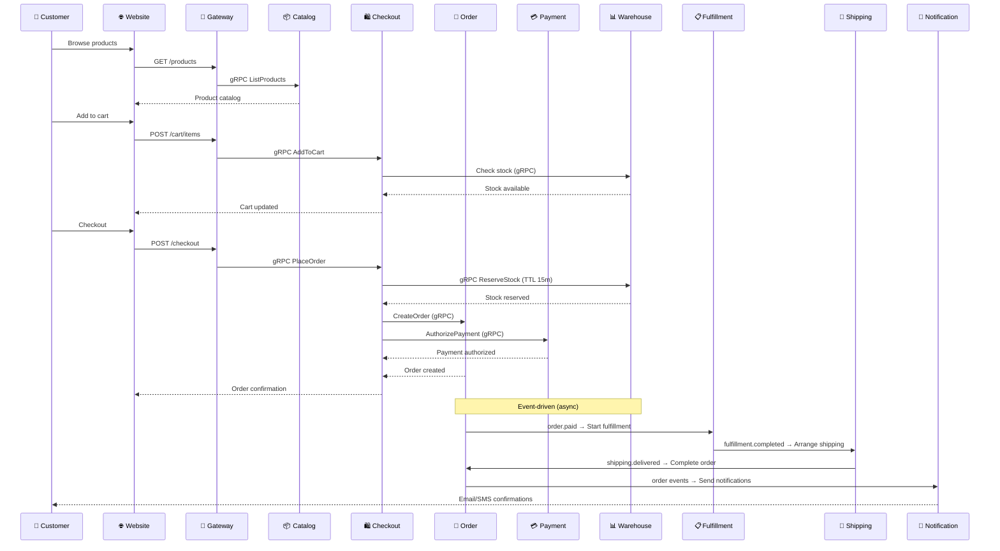

# 🏗️ System Architecture Overview

**Last Updated**: March 2, 2026  
**Platform Status**: Production-Ready (23/23 Services Deployed)  
**Audience**: Business Stakeholders & Technical Teams

---

## 📋 Executive Summary

Our e-commerce platform is built on a modern **microservices architecture** with **23 deployable services** (21 Go backends + 2 frontends) that deliver a comprehensive online shopping experience for the **Vietnam market**. All services are **production-ready** and deployed via GitOps (ArgoCD + Kustomize).

### Key Business Benefits
- ✅ **Scalable**: Each service scales independently (e.g., 10× Order during flash sales, 1× Analytics)
- ✅ **Reliable**: Service isolation — if Review crashes, customers still shop and pay
- ✅ **Event-Driven**: Transactional outbox guarantees zero data loss across 17 services
- ✅ **VN-First**: Native VNPay, MoMo integration; GHN & Grab shipping carriers
- ✅ **Zero License Fees**: Full source ownership, no vendor lock-in

---

## 🎯 Platform Overview

```mermaid
graph TB
    subgraph "🌐 Customer Experience"
        WEB["Customer Website (Next.js)"]
        ADMIN["Admin Dashboard (React)"]
    end
    
    subgraph "🚪 API Gateway"
        GATEWAY["Gateway Service<br/>Auth · Rate Limit · Routing"]
    end
    
    subgraph "🔐 Identity & Access"
        AUTH["Auth Service<br/>JWT · OAuth2 · MFA"]
        USER["User Service<br/>Admin RBAC & Permissions"]
        CUSTOMER["Customer Service<br/>Profiles · Segments · GDPR"]
    end
    
    subgraph "📦 Product & Discovery"
        CATALOG["Catalog Service<br/>EAV · 25K+ SKUs"]
        PRICING["Pricing Service<br/>Dynamic Rules Engine"]
        PROMOTION["Promotion Service<br/>Coupons & Campaigns"]
        SEARCH["Search Service<br/>Elasticsearch"]
    end
    
    subgraph "🛒 Commerce"
        CHECKOUT["Checkout Service<br/>Cart · Checkout Flow"]
        ORDER["Order Service<br/>Lifecycle Management"]
        PAYMENT["Payment Service<br/>Multi-Gateway · Saga"]
    end
    
    subgraph "🚚 Logistics"
        WAREHOUSE["Warehouse Service<br/>Multi-WH · Stock Reservation"]
        FULFILLMENT["Fulfillment Service<br/>Pick · Pack · Ship"]
        SHIPPING["Shipping Service<br/>GHN · Grab · Tracking"]
        LOCATION["Location Service<br/>VN Geographic Data"]
    end
    
    subgraph "🎁 Post-Purchase"
        RETURN["Return Service<br/>Returns · Refunds"]
        LOYALTY["Loyalty-Rewards Service<br/>Points · Tiers · Referrals"]
        REVIEW["Review Service<br/>Ratings · Moderation"]
    end
    
    subgraph "📡 Platform Services"
        ANALYTICS["Analytics Service<br/>BI · Event Metrics"]
        NOTIFICATION["Notification Service<br/>Email · SMS · Push"]
        OPS["Common-Operations<br/>Task Orchestration"]
    end
    
    WEB --> GATEWAY
    ADMIN --> GATEWAY
    
    GATEWAY --> AUTH & CUSTOMER & CATALOG & SEARCH & CHECKOUT & ORDER
    
    CHECKOUT -->|"CreateOrder"| ORDER
    CHECKOUT -->|"Authorize"| PAYMENT
    ORDER -->|"order.confirmed"| WAREHOUSE
    ORDER -->|"order.paid"| FULFILLMENT
    FULFILLMENT -->|"fulfillment.completed"| SHIPPING
    SHIPPING -->|"shipping.delivered"| ORDER
    ORDER -->|"order.cancelled"| LOYALTY & PROMOTION
    RETURN -->|"refund gRPC"| PAYMENT
    RETURN -->|"restock gRPC"| WAREHOUSE
    CATALOG -->|"product events"| SEARCH & ANALYTICS
    ORDER -->|"order events"| ANALYTICS & CUSTOMER & NOTIFICATION
```



---

## 🏢 Service Registry (23 Deployable Services)

### 🔐 Identity & Access (3 Services)

| Service | Port | Business Function | Key Features |
|---------|------|------------------|--------------|
| **Auth** | :8000 | Authentication & authorization | JWT, OAuth2 (Google), MFA (TOTP), session management |
| **User** | :8001 | Admin user management | RBAC, role/permission management, audit trails |
| **Customer** | :8003 | Customer profiles | Segmentation, GDPR compliance, address management |

### 📦 Product & Discovery (4 Services)

| Service | Port | Business Function | Key Features |
|---------|------|------------------|--------------|
| **Catalog** | :8015 | Product catalog | EAV pattern, 25K+ SKUs, categories, attributes |
| **Pricing** | :8014 | Dynamic pricing | Rule engine, warehouse-specific prices, scheduled prices |
| **Promotion** | :8020 | Campaigns & coupons | BOGO, tiered discounts, coupon validation |
| **Search** | :8017 | Product discovery | Elasticsearch, full-text, faceted, autocomplete |

### 🛒 Commerce (3 Services)

| Service | Port | Business Function | Key Features |
|---------|------|------------------|--------------|
| **Checkout** | :8018 | Cart & checkout | Cart management, checkout flow, stock validation |
| **Order** | :8004 | Order lifecycle | Creation → confirmation → fulfillment → delivery |
| **Payment** | :8005 | Payment processing | VNPay, MoMo, Stripe, COD; payment saga with DLQ |

### 🚚 Logistics (4 Services)

| Service | Port | Business Function | Key Features |
|---------|------|------------------|--------------|
| **Warehouse** | :8006 | Inventory management | Multi-warehouse, stock reservation with TTL, batch picking |
| **Fulfillment** | :8008 | Order fulfillment | Pick/pack/ship workflow, quality control |
| **Shipping** | :8007 | Shipping logistics | GHN, Grab integration, webhook tracking, label generation |
| **Location** | :8016 | Geographic data | Vietnam provinces/districts/wards, delivery zones |

### 🎁 Post-Purchase (3 Services)

| Service | Port | Business Function | Key Features |
|---------|------|------------------|--------------|
| **Return** | :8019 | Returns & refunds | Return requests, automated refunds, restock, exchanges |
| **Loyalty-Rewards** | :8021 | Rewards program | Points, tiers, referral bonuses, campaigns |
| **Review** | :8010 | Product reviews | Ratings, text reviews, moderation, verified purchase |

### 📡 Platform Services (4 Services)

| Service | Port | Business Function | Key Features |
|---------|------|------------------|--------------|
| **Analytics** | :8012 | Business intelligence | Event-based metrics, revenue, cohort analysis |
| **Notification** | :8009 | Multi-channel notifications | Email, SMS, push; template engine |
| **Gateway** | :8080 | API gateway | Auth middleware, rate limiting, routing, CORS |
| **Common-Operations** | :8022 | Task orchestration | Shared operational tasks, health checks |

### 🌐 Frontends (2 Services)

| Service | Port | Framework | Key Features |
|---------|------|-----------|--------------|
| **Frontend** | :3000 | Next.js + TypeScript | Customer-facing storefront, SSR |
| **Admin** | :3001 | React + Ant Design | Admin dashboard, order/inventory management |

---

## 🔄 Customer Journey Flow



---

## 🏗️ Technical Architecture

### Technology Stack

| Layer | Technology |
|-------|-----------|
| **Backend** | Go 1.25 · Kratos v2 (Google's microservice framework) |
| **Frontend** | Next.js (customer) · React + Ant Design (admin) |
| **Database** | PostgreSQL 15+ (per-service isolation) |
| **Cache** | Redis 7+ (caching, sessions, distributed locks) |
| **Search** | Elasticsearch 8.11+ |
| **Messaging** | Dapr PubSub (Redis Streams) + Transactional Outbox |
| **API** | gRPC (internal) + REST via gRPC-Gateway (external) |
| **Deploy** | Docker · Kubernetes (k3d) · ArgoCD (GitOps) |
| **Observability** | Prometheus · Grafana · Jaeger (OpenTelemetry) |
| **Service Discovery** | Consul |
| **Shared Library** | `common` — outbox, idempotency, health, config, gRPC factories |

### Architecture Layers

```
┌─────────────────────────────────────────────────────────────┐
│              🌐 Clients (Next.js / React / Mobile)          │
└─────────────────────────────────────────────────────────────┘
┌─────────────────────────────────────────────────────────────┐
│          🚪 Gateway Service (Kratos-based, Go)              │
│           Auth · Rate Limiting · Routing · CORS             │
└─────────────────────────────────────────────────────────────┘
┌─────────────────────────────────────────────────────────────┐
│                ☸️ Kubernetes Cluster (k3d)                   │
│    21 Go services (server + worker binaries each)           │
│    Dapr sidecars for PubSub, Service Discovery              │
└─────────────────────────────────────────────────────────────┘
┌─────────────────────────────────────────────────────────────┐
│              🗄️ Data Layer (per-service isolation)           │
│   PostgreSQL (21 DBs) · Redis · Elasticsearch · Consul      │
└─────────────────────────────────────────────────────────────┘
```

### Key Architecture Patterns

| Pattern | Purpose | Services Using |
|---------|---------|---------------|
| **Transactional Outbox** | Reliable event publishing (DB + event in single TX) | 17 services |
| **Event Idempotency** | Deduplicate events with `event_idempotency` table | Warehouse, Search, Shipping, Loyalty |
| **Dead Letter Queue** | Failed events → DLQ for manual review | Order, Checkout, Payment, Search |
| **Circuit Breaker** | Prevent cascade failures | Analytics (PG writes), Gateway |
| **Saga / Compensation** | Distributed transactions with rollback | Checkout → Order → Payment → Warehouse |
| **CQRS** | Separate read/write paths | Search (read-optimized Elasticsearch) |
| **Dual Binary** | Server (API) + Worker (events, cron, outbox) per service | All Go services |

---

## 🔒 Security

- **Authentication**: JWT + OAuth2 (Google) + MFA (TOTP)
- **Authorization**: RBAC with role/permission management
- **API Security**: Rate limiting, CORS, request validation
- **Data**: Per-service database isolation, encrypted connections
- **Audit**: Complete audit trail for admin operations
- **Payment**: PCI DSS compliance patterns (tokenization, no card storage)

---

## 📈 Performance Targets

| Metric | Target |
|--------|--------|
| **API Response Time** | P95 < 200ms |
| **Event Processing** | < 5s end-to-end latency |
| **System Availability** | 99.9% uptime |
| **Search Response** | < 100ms |
| **Deployment Time** | 35-45 min (full platform) |
| **Cache Hit Rate** | > 90% |

---

## 🚀 Deployment

- **GitOps**: Kustomize-based with ArgoCD auto-sync
- **Strategy**: Rolling updates per service, zero-downtime
- **Environments**: Local (k3d) → Staging → Production
- **CI/CD**: GitLab CI → Docker build → ArgoCD deploy
- **Each service**: server + worker + migrate binaries

---

## 🔗 Integration Partners

| Category | Partners |
|----------|---------|
| **Payment** | VNPay, MoMo, Stripe, COD |
| **Shipping** | GHN, Grab Express |
| **Notifications** | Email (SMTP), SMS providers |

---

## 📚 Related Documentation

- **[Service Index](../SERVICE_INDEX.md)** — All 23 services with ports and architecture patterns
- **[Business Domains](../02-business-domains/README.md)** — DDD bounded contexts
- **[Workflows](../05-workflows/README.md)** — Business process flows
- **[ADRs](../08-architecture-decisions/README.md)** — 24 Architecture Decision Records
- **[Platform Comparison](platform-comparison-wc-shopify-magento.md)** — vs Shopify/WooCommerce/Magento

---

**Document Status**: ✅ Current  
**Last Updated**: March 2, 2026  
**Maintained By**: Platform Architecture Team
