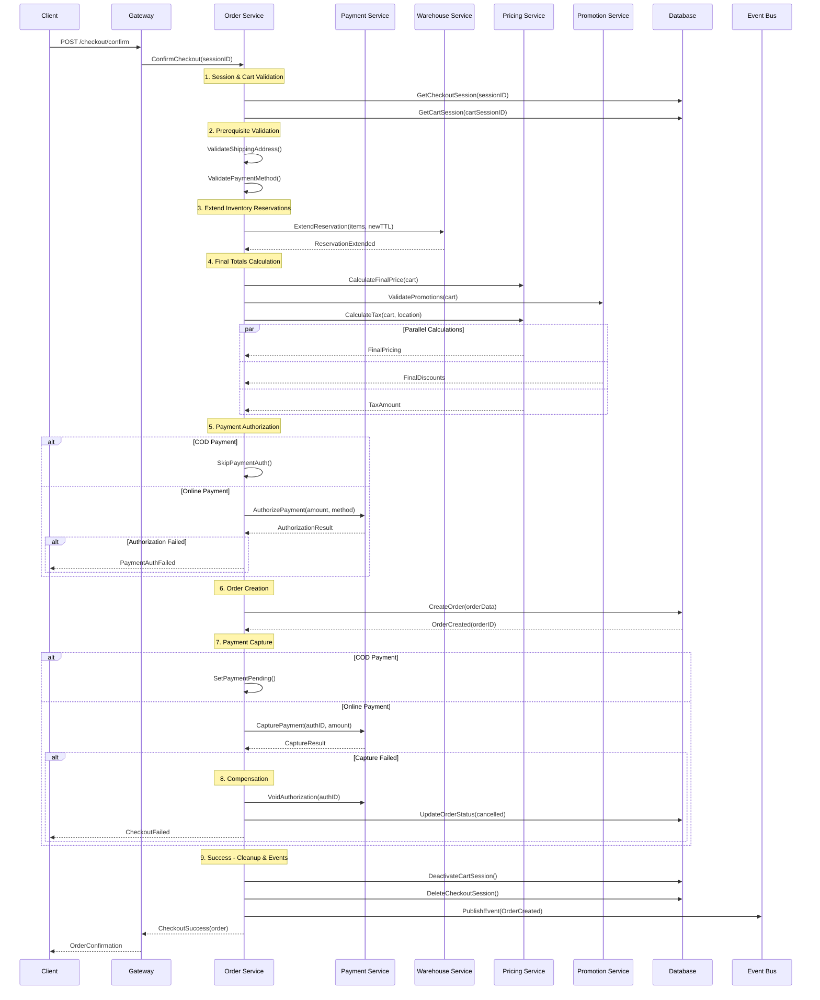
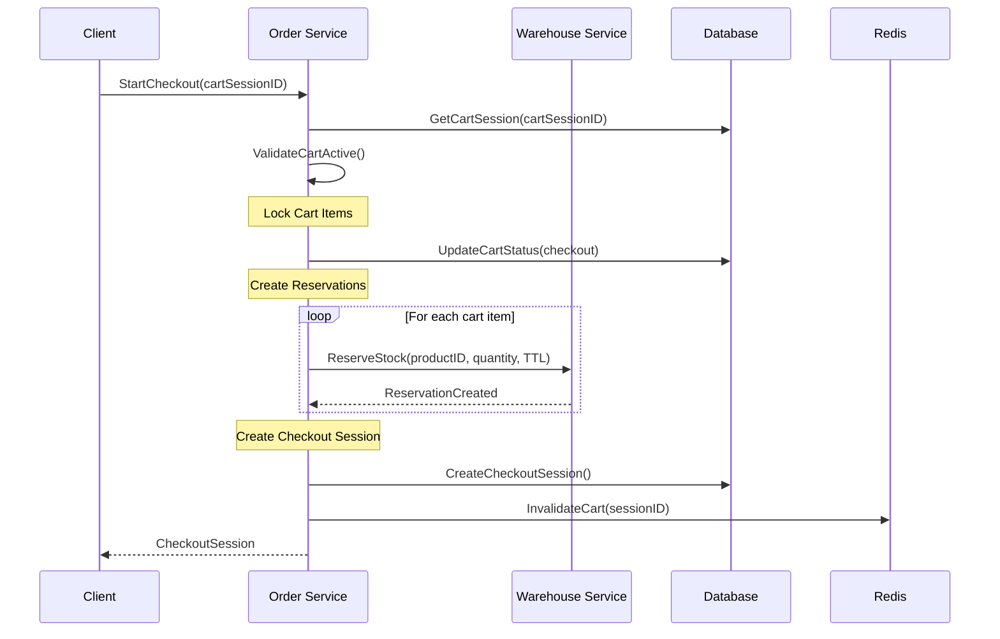
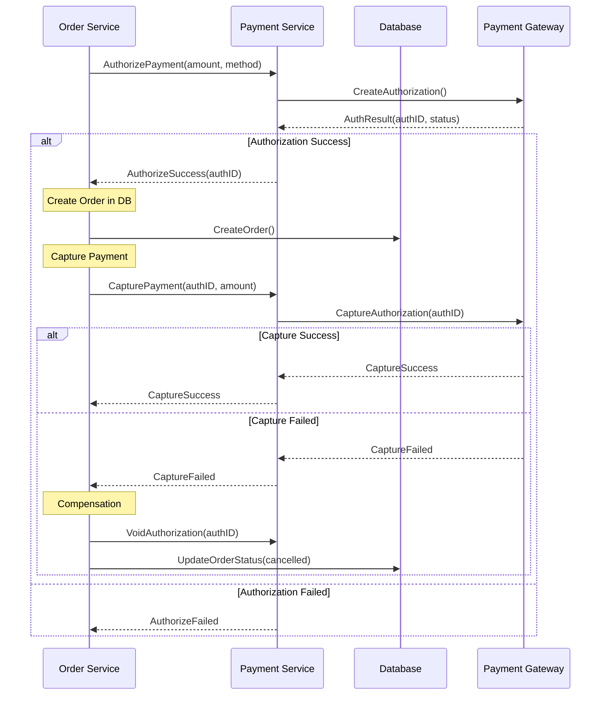
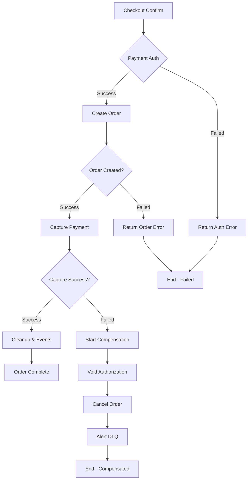

# Checkout Process Flow

**Last Updated**: 2026-01-29
**Status**: Updated for Service Split
**Domain**: Commerce
**Services**: Checkout Service (Primary), Order Service (Integration), Payment Service
**Navigation**: [← Commerce Domain](../README.md) | [← Business Domains](../../README.md) | [Checkout Service →](../../03-services/core-services/checkout-service.md)

## Overview

This document describes the checkout confirmation flow, which converts a `Cart` into a final `Order`. The implementation follows a "Quote Pattern", where the cart acts as a quote that is finalized upon confirmation.

The core logic is handled within the `order` service.

**Key File**: `order/internal/biz/checkout/confirm.go`

---

## Key Flow Steps

The `ConfirmCheckout` function orchestrates a critical, multi-step process that involves several other services.

1.  **Session & Cart Validation**: The system retrieves the `CheckoutSession` and the associated `CartSession`. It validates that the cart is in the correct `checkout` status.

2.  **Prerequisite Validation**: It ensures all necessary checkout steps have been completed (e.g., shipping address selected).

3.  **Inventory Reservation Extension**: It extends the TTL (Time-To-Live) of any existing inventory reservations to ensure stock is held while payment is processed.

4.  **Final Totals Calculation**: It calls the `calculateTotals` function to get the final, authoritative amount, which includes subtotal, discounts, shipping, and taxes.

5.  **Payment Authorization**: It initiates a payment **authorization** (a hold on the funds) by calling the `payment` service. This does not capture the money yet.

6.  **Order Creation**: If payment authorization is successful, it builds and creates the `Order` in the database. This step is critical as it persists the order record.

7.  **Payment Capture**: After the order is successfully created, it proceeds to **capture** the previously authorized funds. This is the step where money is actually transferred.

8.  **Capture Failure Handling (Compensation)**: If payment capture fails, the system attempts a manual rollback:
    - It calls a `rollbackPaymentAndReservations` function to void the payment authorization.
    - It updates the newly created order's status to `cancelled`.

9.  **Cart & Session Cleanup**: After a successful checkout, the `CartSession` is marked as inactive and the `CheckoutSession` is deleted. This cleanup is designed to be resilient, with retries and alerts if it fails, ensuring it doesn't block the confirmation response to the user.

10. **Event Publishing**: An `OrderCreated` event is published via the Transactional Outbox pattern, ensuring the event is sent reliably after the order is committed to the database.

---

## Additional Checkout Flows

### 11. Start Checkout Flow

- **File**: `start.go`
- **Logic**:
  1. Creates a `CheckoutSession` from active cart
  2. Transitions cart status from `active` → `checkout` 
  3. Locks cart items to prevent modifications
  4. Validates shipping address and payment method
  5. Creates inventory reservations with TTL
  6. Returns checkout session for frontend

### 12. Update Checkout Flow

- **File**: `update.go`
- **Logic**:
  1. Updates shipping address, payment method, or other checkout details
  2. Re-validates inventory availability
  3. Recalculates totals with updated information
  4. Extends reservation TTL if needed

### 13. Preview Order Flow

- **File**: `preview.go` 
- **Logic**:
  1. Provides final order preview before confirmation
  2. Shows exact amounts, taxes, shipping
  3. Validates all prerequisites are met
  4. Does NOT create order or process payment

### 14. Payment Processing Flow

- **File**: `payment.go`
- **Logic**:
  1. **Cash on Delivery (COD)**: Skips payment authorization
  2. **Online Payment**: 
     - Authorizes payment (holds funds)
     - Creates order if authorization succeeds
     - Captures payment after order creation
     - Handles capture failures with compensation

### 15. Checkout Validation Flow

- **File**: `validation.go`
- **Logic**:
  1. **Inventory Validation**: Checks stock availability
  2. **Address Validation**: Validates shipping address format
  3. **Payment Method Validation**: Ensures payment method is active
  4. **Prerequisite Check**: All required steps completed

---

## Sequence Diagrams

### Complete Checkout Confirmation Flow

### Start Checkout Flow

### Payment Authorization & Capture Flow

### Error Recovery & Compensation Flow

Based on the `AI-OPTIMIZED CODE REVIEW GUIDE`.

### P1 - Atomicity: Manual Distributed Transaction

- **Description**: The `Authorize -> Create Order -> Capture` sequence is a distributed transaction handled manually. This creates a risk of inconsistent states if the service crashes between these critical steps. For example, an order could be created but the payment never captured, leaving the order in a limbo state without a robust, automated recovery process.
- **Recommendation**: Replace the manual sequence with a durable Saga orchestration pattern. A Saga would ensure that the entire process either completes successfully or is properly compensated (e.g., the order is cancelled if capture fails), even in the event of service restarts.

### P1 - Resilience: Ignored Rollback Errors

- **Description**: In the payment capture failure path, the error from the compensating action (`rollbackPaymentAndReservations`) is ignored (`_ = ...`). If voiding the payment authorization fails, the customer's funds could remain on hold for an order that was ultimately cancelled.
- **Recommendation**: The error from compensating actions must be handled. A failed rollback is a critical event that should be sent to a Dead-Letter Queue (DLQ) and trigger an immediate alert for manual intervention.
