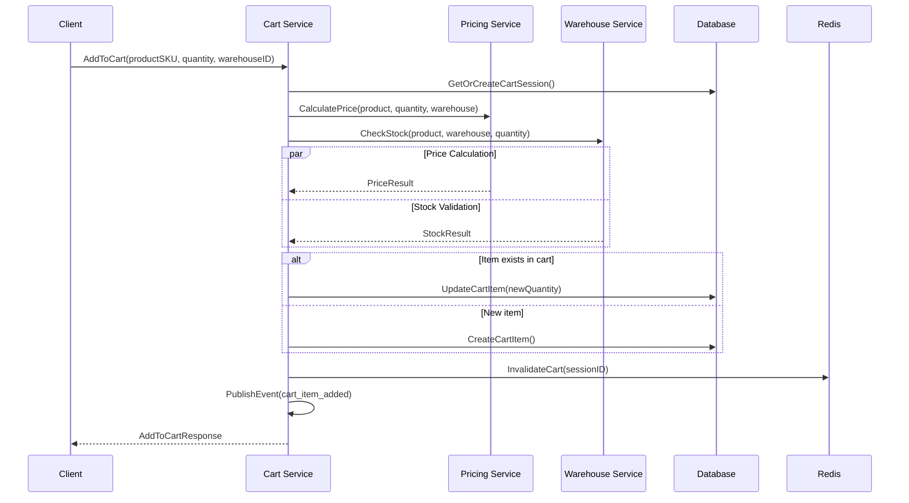
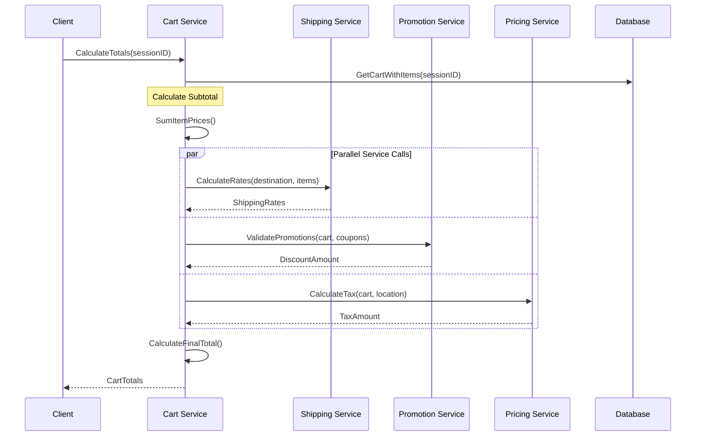
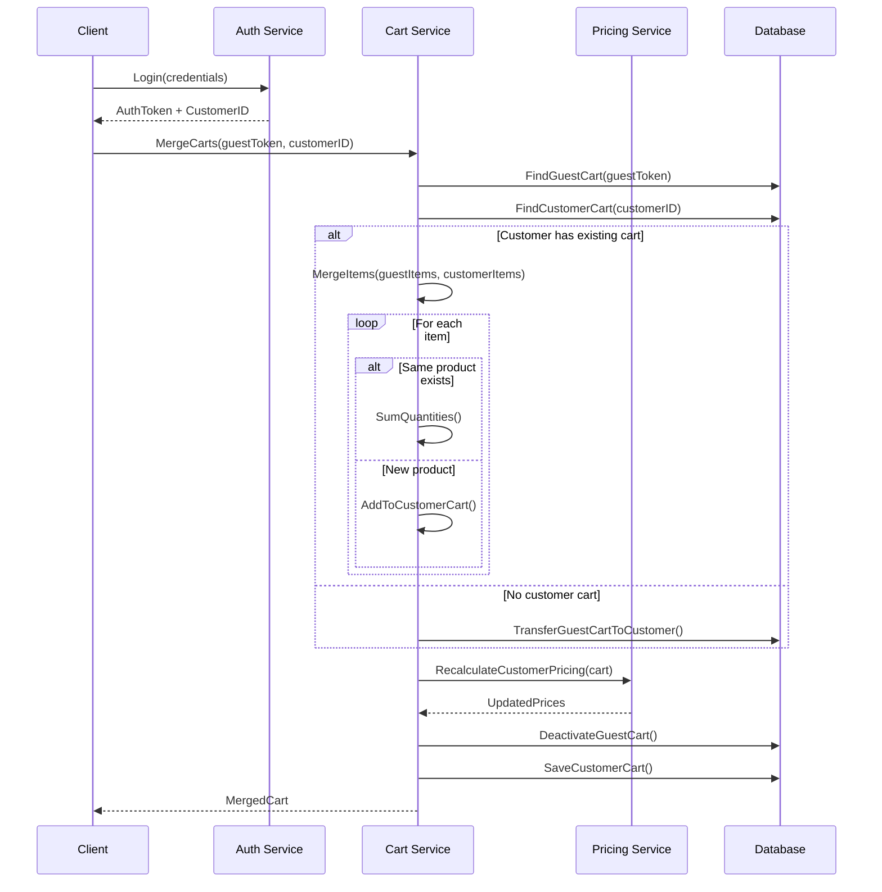
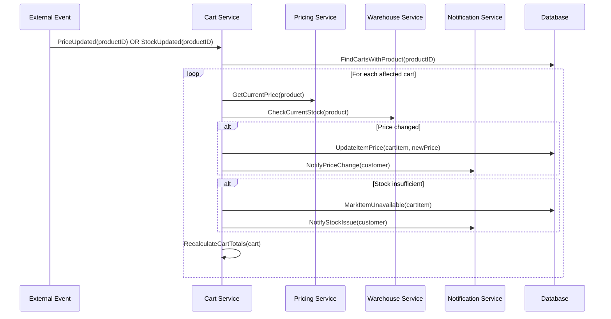
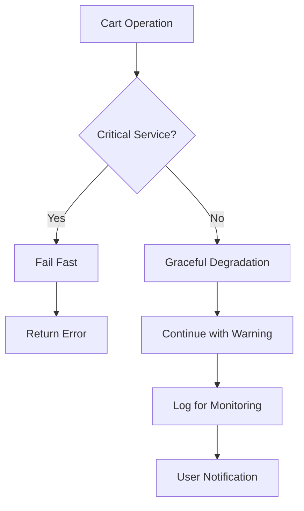

# Cart Management Flow

**Last Updated**: 2026-01-18  
**Status**: Verified vs Code  
**Domain**: Commerce  
**Service**: Order Service  
**Navigation**: [← Commerce Domain](../README.md) | [← Business Domains](../../README.md) | [Order Service →](../../03-services/core-services/order-service.md)

---

## 📋 Quick Navigation

### **Core Cart Operations**
- **[Get/Create Cart](#1-getcreate-cart-flow)** - Cart session management
- **[Add Item](#2-add-item-to-cart-flow)** - Adding products to cart
- **[Update Item](#3-update-item-quantity-flow)** - Quantity modifications
- **[Apply Coupon](#4-apply-coupon-flow-quote-pattern)** - Promotion handling
- **[Cart Totals](#9-totals-calculation-flow)** - Price calculation

### **Advanced Workflows**
- **[Cart Merge](#7-cart-merge-flow-guest-to-customer)** - Guest to customer transition
- **[Cart Refresh](#8-cart-refresh-flow-pricestockupdates)** - Real-time updates
- **[Checkout Transition](#10-cart-to-checkout-transition-flow)** - Order creation

### **Related Documentation**
- **[Order Service](../../03-services/core-services/order-service.md)** - Technical implementation
- **[Pricing Management](pricing-management.md)** - Price calculation workflows
- **[Promotion Management](promotion-management.md)** - Coupon and discount logic

---

## Overview

This document describes the business logic and key flows for cart management within the `order` service. The cart implementation follows a session-based model and uses a "Quote Pattern" for applying coupons, where the final discount calculation is deferred until the totals are calculated.

**Key Files:**
- **Usecase**: `order/internal/biz/cart/usecase.go`
- **Logic**: `order/internal/biz/cart/{add,update,remove,get,clear,coupon,merge,totals}.go`
- **Data Model**: `order/internal/model/cart.go` (`CartSession`, `CartItem`)

---

## Key Flows

### 1. Get/Create Cart Flow

This is the primary entry point for all cart interactions.

- **File**: `get.go`
- **Logic**:
  1.  Finds an active `CartSession` using `sessionID`, `customerID`, or `guestToken`.
  2.  **Auto-Creation**: If no active cart is found, a new one is created automatically.
  3.  **Post-Order Handling**: If a cart is found but is marked `is_active=false` (meaning an order was placed with it), a new active cart is created to ensure a fresh session.
  4.  **Abandoned Checkout Handling**: If a cart has a status of `checkout` but no associated `order_id` in its metadata, the status is reset to `active`.
  5.  Finally, it calls `CalculateCartTotals` to provide a full summary with pricing.

### 2. Add Item to Cart Flow

- **File**: `add.go`
- **Logic**:
  1.  Gets or creates a cart session.
  2.  Validates product SKU and quantity limits.
  3.  Uses `errgroup` to perform two critical operations in parallel for performance:
      - **Stock Check**: Calls `warehouseInventoryService.CheckStock`.
      - **Price Check**: Calls `pricingService.CalculatePrice` to get the authoritative price.
  4.  **Read-Then-Write**: Checks if the item (product + warehouse) already exists in the cart.
      - If yes, it updates the quantity of the existing item.
      - If no, it creates a new `CartItem`.
  5.  Invalidates the cart cache.
  6.  Publishes a `cart_item_added` event asynchronously.

### 3. Update Item Quantity Flow

- **File**: `update.go`
- **Logic**:
  1.  Finds the existing cart item by its ID.
  2.  **Always** calls `pricingService.CalculatePrice` with the new quantity to ensure price accuracy.
  3.  Updates the item's quantity and pricing information in the database.

### 4. Apply Coupon Flow (Quote Pattern)

- **File**: `coupon.go`
- **Logic**:
  1.  Calls `promotionService.ValidatePromotions` to check if the coupon is valid for the current cart state (items, subtotal).
  2.  If valid, it **saves the coupon code to the `CartSession` metadata**.
  3.  It does **not** calculate or apply the discount at this stage. The discount is calculated later by the `CalculateCartTotals` flow.

### 5. Remove Item Flow

- **File**: `remove.go`
- **Logic**:
  1. Validates the cart item exists and belongs to the session.
  2. Removes the item from the database.
  3. Invalidates cart cache.
  4. Publishes a `cart_item_removed` event.
  5. Recalculates cart totals if needed.

### 6. Clear Cart Flow

- **File**: `clear.go`
- **Logic**:
  1. Removes all items from the cart session.
  2. Clears any applied coupons from session metadata.
  3. Resets cart status to `active`.
  4. Invalidates cart cache.
  5. Publishes a `cart_cleared` event.

### 7. Cart Merge Flow (Guest to Customer)

- **File**: `merge.go`
- **Logic**:
  1. **Triggered on customer login** when guest has existing cart.
  2. Finds existing customer cart (if any) and guest cart.
  3. **Merge Strategy**:
     - If same product + warehouse exists in both: sum quantities (respecting max limits)
     - If product exists only in guest cart: move to customer cart
     - If customer cart has exclusive items: keep them
  4. Deactivates guest cart session.
  5. Updates customer cart with merged items.
  6. Recalculates totals and applies customer-specific pricing.

### 8. Cart Refresh Flow (Price/Stock Updates)

- **File**: `refresh.go`
- **Logic**:
  1. **Triggered by**: Price updates, stock changes, or manual refresh request.
  2. For each cart item:
     - Re-validates stock availability
     - Re-calculates pricing (may have changed)
     - Checks if product is still active
  3. **Handle Changes**:
     - Price changes: Update item price, show notification to user
     - Stock insufficient: Mark item as unavailable, show warning
     - Product discontinued: Remove item, notify user
  4. Recalculates cart totals with updated information.
  5. Returns change summary to frontend.

### 9. Totals Calculation Flow

- **File**: `totals.go`
- **Logic**: This is the central orchestration point for final pricing.
  1.  Calculates subtotal from the sum of `item.TotalPrice`.
  2.  Calls `shippingService.CalculateRates` to get shipping costs.
  3.  Calls `promotionService.ValidatePromotions` (again) to get the final discount amount based on the current cart state.
  4.  Calls `pricingService.CalculateTax` to get the tax amount.
  5.  Sums all values to produce the final `TotalEstimate`.

### 10. Cart to Checkout Transition Flow

- **File**: `checkout.go` (in checkout domain)
- **Logic**:
  1. **Pre-Checkout Validation**:
     - Verify all items are in stock
     - Re-validate all pricing
     - Check shipping address is valid
     - Ensure payment method is available
  2. **Create Checkout Session**:
     - Lock cart items (prevent further modifications)
     - Create order draft with cart data
     - Reserve stock for limited time (15-30 minutes)
     - Generate checkout token for security
  3. **Update Cart Status**: Mark cart as `checkout` to prevent modifications.
  4. **Prepare Checkout Data**: Return all necessary data for checkout UI.

---

## Sequence Diagrams

### Add Item to Cart Sequence

### Cart Totals Calculation Sequence

### Guest to Customer Cart Merge Sequence

### Cart Refresh (Price/Stock Updates) Sequence

---

## Error Handling Patterns

### Service Failure Scenarios

| Service Down | Cart Impact | Fallback Strategy | User Experience |
|-------------|-------------|------------------|------------------|
| **Pricing Service** | Cannot add items | ❌ Block operation | "Pricing unavailable, try again" |
| **Warehouse Service** | Cannot validate stock | ⚠️ Allow with warning | "Stock validation pending" |
| **Promotion Service** | Cannot apply discounts | ✅ Continue without | "Promotions temporarily unavailable" |
| **Shipping Service** | Cannot calculate rates | ✅ Default estimate | "Shipping rates estimated" |

### Data Consistency Patterns

---

## Identified Issues & Gaps

Based on the `AI-OPTIMIZED CODE REVIEW GUIDE`.

### P1 - Concurrency: Race Condition on Cart Updates

- **Description**: The `AddToCart` and `UpdateCartItem` flows use a `Read-Then-Write` pattern without any locking mechanism (optimistic or pessimistic). If two requests try to modify the quantity of the same cart item concurrently, the final quantity can be incorrect, leading to data inconsistency.
- **Files**: `add.go`, `update.go`
- **Recommendation**: Implement optimistic locking. Add a `version` column to the `cart_items` table. The `UPDATE` query should include `WHERE version = ?` and the application should retry the read-modify-write cycle if the update fails due to a version mismatch.

### P1/P2 - Resilience: Silent Failures in Totals Calculation

- **Description**: The `CalculateCartTotals` function has a weak failure handling strategy. When calls to dependent services like `shippingService`, `promotionService`, or `pricingService` (for tax) fail, it logs a warning and proceeds with a default value of `0`.
- **File**: `totals.go`
- **Impact**: This can lead to incorrect pricing being shown to the customer. A tax calculation failure, in particular, is a **P1 compliance risk**. A promotion failure is a **P2 customer experience issue**.
- **Recommendation**: The failure mode should be more explicit. For critical dependencies like tax, the calculation should fail fast and return an error. For non-critical dependencies like promotions, the current behavior might be acceptable but should be clearly monitored with metrics and alerts.

---

## 🔗 See Also

### **Related Business Workflows**
- **[Pricing Management](pricing-management.md)** - Price calculation and dynamic pricing
- **[Promotion Management](promotion-management.md)** - Coupon validation and discount application
- **[Tax Calculation](tax-calculation.md)** - Tax computation for cart totals

### **Technical Implementation**
- **[Order Service Documentation](../../03-services/core-services/order-service.md)** - Complete service documentation
- **[Order Service Runbook](../../06-operations/runbooks/order-service-runbook.md)** - Operational procedures

### **Quality Assurance**
- **[Cart Flow Issues Checklist](../../10-appendix/checklists/cart_flow_issues.md)** - Known issues and remediation
- **[Production Readiness Issues](../../10-appendix/checklists/production-readiness-issues.md)** - System-wide quality checklist

### **Architecture & Patterns**
- **[Event-Driven Architecture](../../01-architecture/event-driven-architecture.md)** - Event publishing patterns
- **[API Architecture](../../01-architecture/api-architecture.md)** - API design standards
- **[Microservices Design](../../01-architecture/microservices-design.md)** - Service design patterns

---

**Document Maintainer**: Commerce Domain Team  
**Last Review**: January 26, 2026  
**Next Review**: February 26, 2026