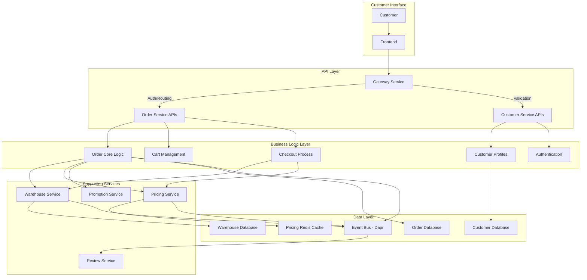
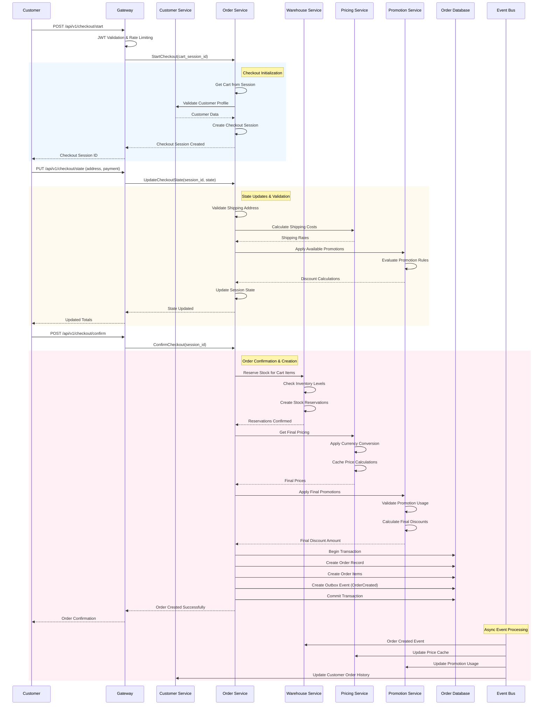
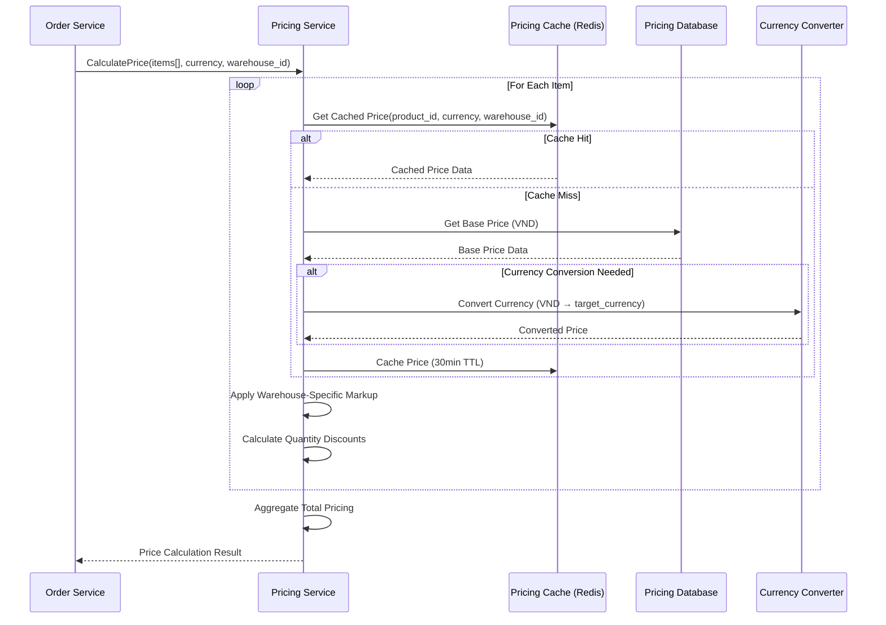
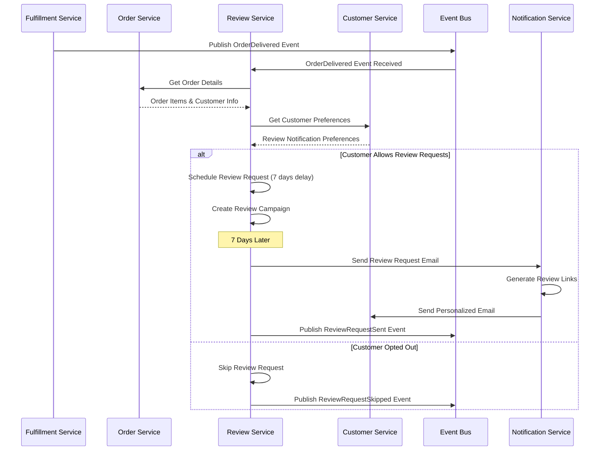
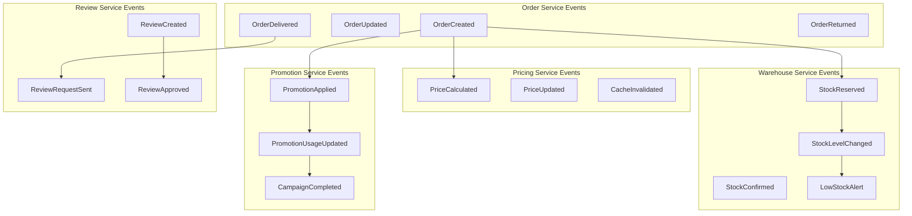

# Order Flow Documentation

> **Note:** Comprehensive analysis based on codebase review of Order, Gateway, Customer, Warehouse, Pricing, Promotion, and Review services as of January 18, 2026.

## 1. Executive Summary

The Order system follows a **distributed microservices architecture** with event-driven communication and transactional outbox patterns. The flow spans 7 core services with complex orchestration for inventory management, pricing calculations, and payment processing.

**Key Components:**
- **Gateway Service**: Request routing, authentication, rate limiting
- **Customer Service**: Profile management, authentication, order history
- **Order Service**: Core orchestration (cart, checkout, order lifecycle)
- **Warehouse Service**: Inventory management, stock reservations
- **Pricing Service**: Dynamic pricing, currency conversion, cache management
- **Promotion Service**: Campaign management, discount calculations
- **Review Service**: Post-order review collection and moderation

## 2. High-Level Order Architecture



## 3. Order Lifecycle Flows

### 3.1. Complete Order Creation Flow
End-to-end flow from cart to order confirmation.



### 3.2. Inventory Reservation Flow
Detailed stock management during order creation.


### 3.3. Dynamic Pricing Calculation Flow
Real-time pricing with cache management and currency support.



### 3.4. Promotion Application Flow
Discount calculation with rule validation and usage tracking.


### 3.5. Post-Order Review Collection Flow
Automated review request after order delivery.



## 4. Service Integration Details

### 4.1. Gateway Service Integration
**File**: `gateway/internal/router/auto_router.go`

**Order-Related Routing**:
```
/api/v1/orders/*     → Order Service (port 8001)
/api/v1/cart/*       → Order Service (port 8001)
/api/v1/checkout/*   → Order Service (port 8001)
/api/v1/customers/*  → Customer Service (port 8002)
/api/v1/reviews/*    → Review Service (port 8003)
```

**Middleware Stack**:
1. **CORS Handler**: Cross-origin request support
2. **JWT Validator**: Customer authentication validation
3. **Rate Limiter**: API abuse protection (100 req/min per customer)
4. **Request ID Generator**: Distributed tracing support
5. **Proxy Handler**: Service discovery and load balancing

### 4.2. Customer Service Integration
**File**: `customer/internal/biz/customer/customer.go`

**Order-Related Operations**:
- **Profile Validation**: Address validation for shipping/billing
- **Authentication**: JWT token validation and customer context
- **Order History**: Customer order tracking and analytics
- **Preferences**: Notification and marketing preferences
- **Segmentation**: Customer categorization for promotions

**Cache Strategy**:
```go
type customerCache struct {
    profileCache    *cache.Cache // 30min TTL
    preferencesCache *cache.Cache // 1hr TTL
    segmentCache    *cache.Cache // 4hr TTL
}
```

### 4.3. Order Service Core Logic
**File**: `order/internal/biz/order/create.go`

**Transactional Outbox Pattern**:
```go
func (uc *UseCase) CreateOrder(ctx context.Context, req *CreateOrderRequest) (*Order, error) {
    // 1. Reserve stock from warehouse
    reservations, err := uc.buildReservationsMap(ctx, req.Items)
    
    // 2. Fetch pricing and calculate totals
    productCache, totalAmount, err := uc.fetchAndCacheProducts(ctx, req.Items, reservations)
    
    // 3. Create order with transactional outbox
    err = uc.tm.WithTransaction(ctx, func(ctx context.Context) error {
        // Create order in DB
        createdOrder, err := uc.createOrderInternal(ctx, order)
        
        // Create outbox event in same transaction
        eventPayload := &events.OrderStatusChangedEvent{...}
        return uc.createOutboxEvent(ctx, eventPayload)
    })
}
```

### 4.4. Warehouse Service Integration
**File**: `warehouse/internal/biz/inventory/inventory.go`

**Stock Reservation Logic**:
```go
type ReservationRequest struct {
    ProductID   string
    SKU         string
    WarehouseID string
    Quantity    int32
    OrderID     string
    ExpiresAt   time.Time  // 15min default
}
```

**Inventory Update Flow**:
1. **Availability Check**: Real-time stock level validation
2. **Atomic Reservation**: Stock hold with expiration
3. **Event Publishing**: Stock level change notifications
4. **Alert System**: Low stock and out-of-stock alerts

### 4.5. Pricing Service Integration
**File**: `pricing/internal/biz/price/price.go`

**Cache-Aside Pattern**:
```go
func (uc *PriceUsecase) GetPrice(ctx context.Context, productID, currency string) (*model.Price, error) {
    // 1. Try cache first
    if price, err := uc.cache.GetProductPrice(ctx, productID, currency); err == nil {
        return price, nil
    }
    
    // 2. Cache miss - get from database
    price, err := uc.repo.GetByProduct(ctx, productID, currency)
    
    // 3. Currency conversion if needed
    if err != nil && currency != "VND" {
        anyPrice, err := uc.repo.GetAnyPriceByProduct(ctx, productID)
        if err == nil {
            convertedPrice, err := uc.currencyConverter.Convert(anyPrice, currency)
            price = convertedPrice
        }
    }
    
    // 4. Update cache
    uc.cache.SetProductPrice(ctx, productID, currency, price)
    return price, nil
}
```

### 4.6. Promotion Service Integration
**File**: `promotion/internal/biz/promotion.go`

**Campaign Rule Engine**:
```go
type PromotionRule struct {
    CampaignType         string    // "cart", "catalog", "customer"
    DiscountType         string    // "percentage", "fixed_amount", "buy_x_get_y"
    MinimumOrderAmount   *float64
    MaximumDiscountAmount *float64
    ApplicableProducts   []string
    ApplicableCategories []string
    CustomerSegments     []string
    UsageLimit           int32
    StartDate           time.Time
    EndDate             time.Time
}
```

### 4.7. Review Service Integration
**File**: `review/internal/biz/review/review.go`

**Verified Purchase Validation**:
```go
func (uc *ReviewUsecase) CreateReview(ctx context.Context, req *CreateReviewRequest) (*model.Review, error) {
    // Verify purchase with Order Service
    if req.OrderID != "" {
        order, err := uc.orderClient.GetOrder(ctx, req.OrderID)
        
        // Validate order belongs to customer
        if order.CustomerID != req.CustomerID {
            return nil, ErrOrderCustomerMismatch
        }
        
        // Validate product was in order
        hasProduct := false
        for _, item := range order.Items {
            if item.ProductID == req.ProductID {
                hasProduct = true
                break
            }
        }
        
        if !hasProduct {
            return nil, ErrProductNotInOrder
        }
        
        isVerified = true
    }
}
```

## 5. Event-Driven Architecture

### 5.1. Order Events Flow


### 5.2. Event Processing Patterns

**Outbox Pattern Implementation**:
```sql
CREATE TABLE outbox (
    id UUID PRIMARY KEY,
    event_type VARCHAR(100) NOT NULL,
    event_data JSONB NOT NULL,
    created_at TIMESTAMP DEFAULT NOW(),
    processed_at TIMESTAMP NULL,
    retry_count INTEGER DEFAULT 0
);
```

**Event Worker Processing**:
- **Polling Interval**: 30 seconds
- **Batch Size**: 100 events per batch
- **Retry Strategy**: Exponential backoff (max 5 retries)
- **Dead Letter Queue**: Failed events after max retries

## 6. Performance & Monitoring

### 6.1. Key Performance Metrics

**Order Processing**:
- Order creation time: <5 seconds (p95)
- Cart operations: <200ms (p95)
- Stock reservation: <1 second (p95)
- Price calculation: <300ms (p95)

**Service Integration**:
- Gateway routing latency: <50ms (p95)
- Inter-service communication: <100ms (p95)
- Database transaction time: <500ms (p95)
- Cache hit ratio: >90%

### 6.2. Monitoring Implementation

**Prometheus Metrics**:
```go
type OrderMetrics struct {
    OrdersCreated       prometheus.Counter
    OrderCreationTime   prometheus.Histogram
    CartOperations      prometheus.Counter
    StockReservations   prometheus.Counter
    PriceCalculations   prometheus.Histogram
    PromotionApplications prometheus.Counter
}
```

**Health Check Endpoints**:
- `/health/live`: Service liveness check
- `/health/ready`: Service readiness with dependency checks
- `/metrics`: Prometheus metrics endpoint

## 7. Error Handling & Recovery

### 7.1. Compensation Patterns

**Stock Reservation Failure**:
```go
func (uc *UseCase) handleReservationFailure(ctx context.Context, reservations []Reservation) {
    for _, reservation := range reservations {
        if err := uc.warehouse.ReleaseReservation(ctx, reservation.ID); err != nil {
            // Send to dead letter queue for manual intervention
            uc.dlq.Send(ctx, &ReservationRollbackEvent{
                ReservationID: reservation.ID,
                Reason:       "Order creation failed",
            })
        }
    }
}
```

**Price Calculation Fallback**:
```go
func (uc *UseCase) getPriceWithFallback(ctx context.Context, productID string) (*Price, error) {
    // Try primary pricing service
    price, err := uc.pricing.GetPrice(ctx, productID)
    if err == nil {
        return price, nil
    }
    
    // Fallback to cached price
    cachedPrice, err := uc.cache.GetPrice(ctx, productID)
    if err == nil {
        return cachedPrice, nil
    }
    
    // Last resort: base catalog price
    return uc.catalog.GetBasePrice(ctx, productID)
}
```

### 7.2. Circuit Breaker Implementation

**Service Resilience**:
- **Failure Threshold**: 5 failures in 60 seconds
- **Half-Open**: Test with single request after 5 minutes
- **Timeout**: 30 seconds for external service calls
- **Fallback**: Cached data or graceful degradation

---

## 8. Development Guidelines

### 8.1. Adding New Order Features

1. **Update Proto Definitions**: Modify API contracts
2. **Implement Business Logic**: Add to appropriate biz layer
3. **Add Event Handling**: Implement outbox events
4. **Update Integration**: Modify service dependencies
5. **Add Monitoring**: Include metrics and health checks
6. **Write Tests**: Unit, integration, and end-to-end tests

### 8.2. Testing Strategy

**Unit Tests**: Business logic validation
**Integration Tests**: Service-to-service communication
**End-to-End Tests**: Complete order flow validation
**Load Tests**: Performance under high concurrency
**Chaos Tests**: Service failure scenarios

---

**Document Status**: ✅ Comprehensive Order Flow Analysis  
**Last Updated**: January 18, 2026  
**Services Covered**: Gateway, Customer, Order, Warehouse, Pricing, Promotion, Review  
**Next Review**: Order Performance Optimization & Issue Identification

#### Step 3.5: Reservation Confirmation
- Calls `warehouseInventoryService.ConfirmReservation(reservationID)`.
- **Failure Handling**: If confirmation fails, errors are logged and stored in `order.metadata["reservation_confirmation_errors"]`. The order is **not** rolled back (Soft Failure). Admin intervention may be required.

#### Step 3.6: Cart Finalization
- marks the Cart as `is_active = false`.
- Invalidates Cart Cache.

## 3. Asynchronous Processing (Outbox)
- The `OrderStatusChanged` event (saved in Step 3.3) is picked up by a background worker (Change Data Capture or Polling).
- This worker publishes the event to the Event Bus (Dapr/Kafka) for other services:
    - **Notification**: Send email confirmation.
    - **Loyalty**: Accrue points.
    - **Analytics**: Track sales.

## 4. Key Dependencies
- **Catalog Service**: Product details.
- **Pricing Service**: Price calculation.
- **Warehouse Service**: Inventory check and reservation.
- **Payment Service**: (Implicit) Payment execution usually happens before confirmation or is integrated into the flow.

## 5. Error Handling
- **Idempotency**: Returns existing order if `cart_session_id` conflict occurs.
- **Reservation Failure**: Rollbacks are attempted if validation fails before order commit.
- **Post-Commit Failures**: (e.g., Warehouse confirmation) handled via logging/alerting (Metadata flagging).
