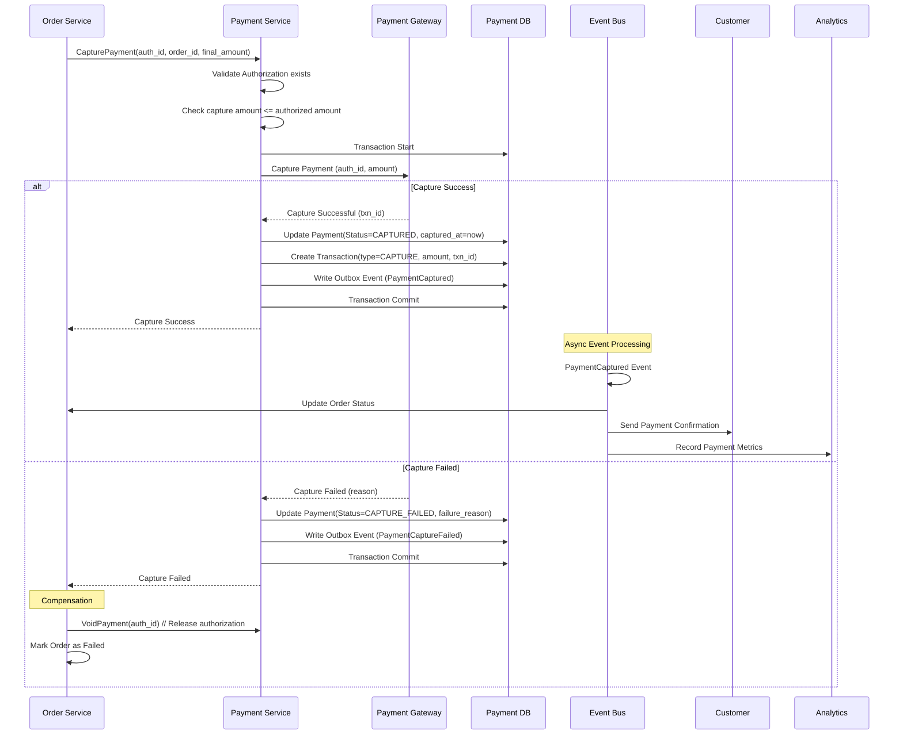
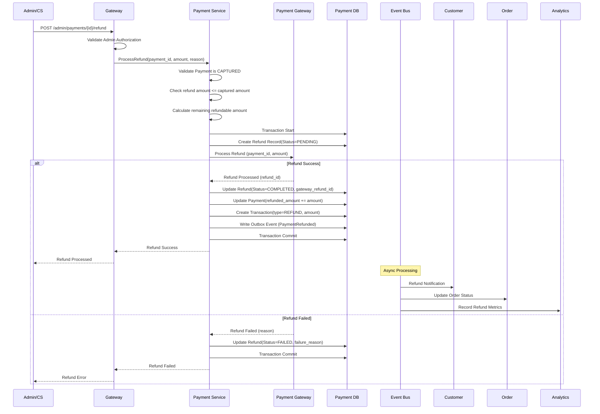
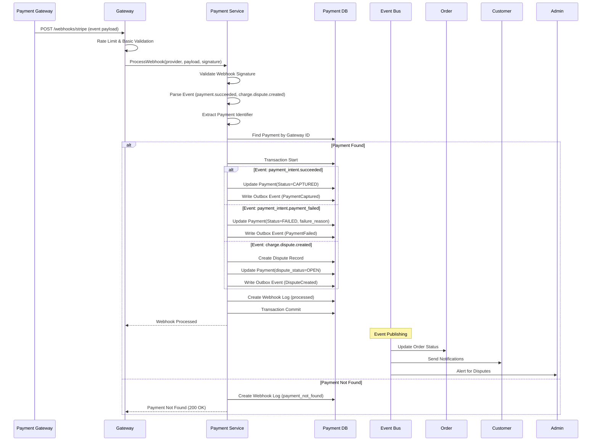
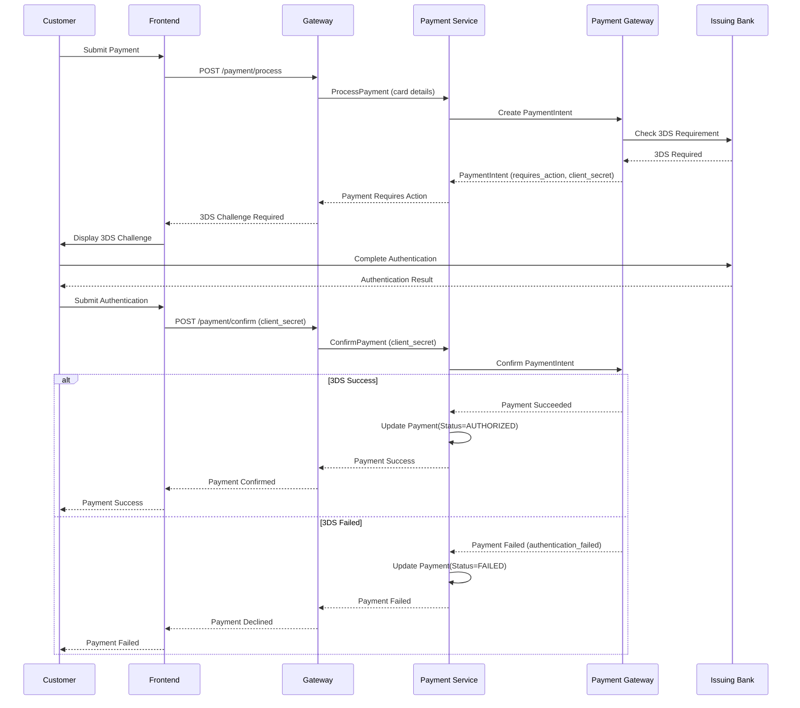
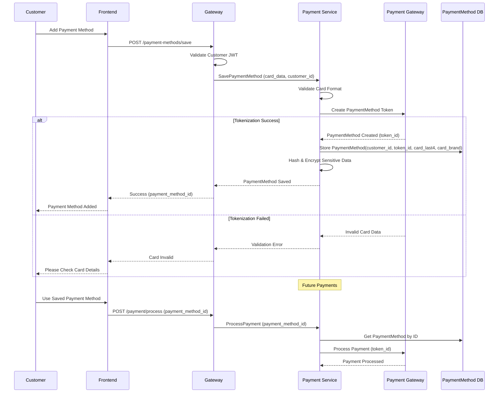
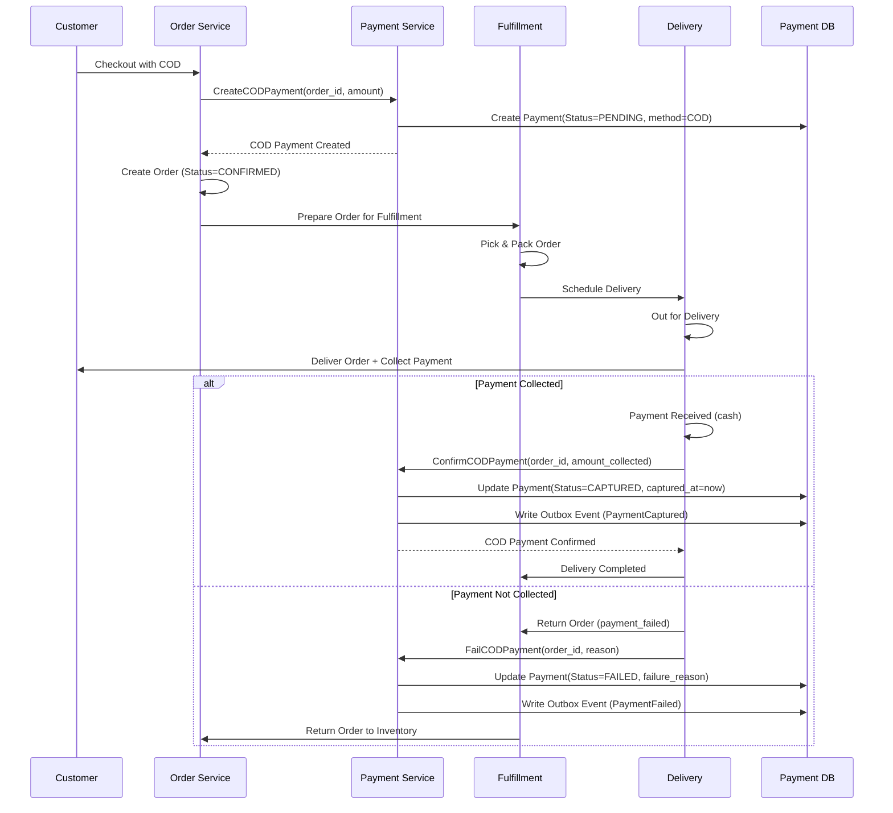

# Payment Flow

## 1. Overview
The **Payment Service** handles multiple payment methods, gateway integrations (Stripe, PayPal, VNPay, MoMo), and ensures transaction integrity via the **Outbox Pattern** and **Idempotency**.

**Architecture**: Event-driven microservices with distributed transaction support via Saga pattern
**Security**: PCI DSS Level 1 compliance, tokenization, fraud detection
**Gateways**: Multi-provider support with circuit breakers and failover

## 2. Actors & Services
- **Customer/Client**: Initiates payment via Web/Mobile App
- **Gateway Service**: Routes payment requests, handles authentication, rate limiting
- **Order Service**: Orchestrates checkout process and requests payment authorization/capture
- **Payment Service**: Core payment processing, gateway management, compliance
- **Payment Gateways**: External providers (Stripe, PayPal, VNPay, MoMo)
- **Background Workers**: Handles asynchronous events (webhooks, outbox events, reconciliation)

## 3. Core Payment Flows

### 3.1. Payment Authorization Flow (Checkout)
This flow occurs when the customer clicks "Place Order" during checkout.

```mermaid
sequenceDiagram
    participant C as Customer
    participant G as Gateway
    participant O as Order Service
    participant P as Payment Service
    participant I as Idempotency (Redis)
    participant PG as Gateway (Stripe/PayPal)
    participant DB as Payment DB
    participant E as Event Bus

    C->>G: POST /checkout/confirm (payment_method_id)
    G->>G: Validate JWT, Rate Limit
    G->>O: Confirm Checkout Request
    
    rect rgb(240, 248, 255)
    note right of O: Order Orchestration
    O->>O: Validate Cart & Inventory
    O->>O: Calculate Final Totals
    O->>P: AuthorizePayment(order_id, amount, payment_method)
    end
    
    rect rgb(255, 250, 240)
    note right of P: Payment Processing
    P->>P: Validate Customer & Order
    P->>P: Fraud Detection (Rules Engine)
    P->>I: Check Idempotency Key
    
    alt Idempotency Hit
        I-->>P: Return Cached Response
    else New Request
        P->>DB: Transaction Start
        P->>DB: Create Payment(Status=PENDING)
        
        P->>PG: Create PaymentIntent/Authorization
        alt Success
            PG-->>P: Payment Authorized (auth_id)
            P->>DB: Update Payment(Status=AUTHORIZED)
            P->>DB: Create Transaction Record
            P->>DB: Write Outbox Event (PaymentAuthorized)
            P->>DB: Transaction Commit
            P->>I: Cache Response (24h TTL)
            P-->>O: Success (auth_id, payment_id)
        else Failure
            PG-->>P: Payment Declined
            P->>DB: Update Payment(Status=FAILED, failure_reason)
            P->>DB: Write Outbox Event (PaymentFailed)
            P->>DB: Transaction Commit
            P-->>O: Error (failure_reason)
        end
    end
    
    alt Authorization Success
        O->>O: Create Order (Status=CONFIRMED)
        O->>P: CapturePayment(auth_id, order_id)
        P->>PG: Capture Payment
        PG-->>P: Payment Captured
        P->>DB: Update Payment(Status=CAPTURED)
        P->>E: Publish PaymentCaptured Event
        O-->>G: Order Success
        G-->>C: Order Confirmation
    else Authorization Failed
        O-->>G: Payment Error
        G-->>C: Payment Failed
    end
```

### 3.2. Payment Capture Flow
After successful authorization, capture transfers funds from customer to merchant.



### 3.3. Refund Processing Flow
Processes customer refunds for captured payments.



### 3.4. Webhook Processing Flow
Handles asynchronous notifications from payment gateways.



### 3.5. 3D Secure Authentication Flow
Handles Strong Customer Authentication (SCA) requirements.



### 3.6. Payment Method Tokenization Flow
Securely stores payment methods for future use.



### 3.7. Cash on Delivery (COD) Flow
Handles offline payment processing for COD orders.


    else Failure
        G-->>P: Error / Declined
        P->>DB: Update Payment(Status=FAILED)
        P->>DB: Write Outbox Event (PaymentFailed)
        P->>DB: Transaction Commit
        P->>I: MarkFailed(error)
        P-->>O: Error
    end
    end
```

### 3.2. Payment Capture (Post-Fulfillment)
This flow typically happens when the warehouse confirms shipment, or immediately if `AutoCapture` is enabled.

1. **Trigger**: `Fulfillment Service` (or Order Service) requests capture after shipping.
2. **Action**: `PaymentService.CapturePayment(payment_id, amount)`.
3. **Logic**:
    - Validate status is `AUTHORIZED`.
    - Call `Gateway.CapturePayment`.
    - Update status to `CAPTURED`.
    - Publish `PaymentCaptured` event.

### 3.3. Asynchronous Webhooks
Gateways send webhooks for status updates (e.g., async payment method success, refunds, chargebacks).

1. **Endpoint**: `POST /api/v1/webhooks/{provider}`
2. **Security**: Validate signature (Note: PayPal currently has partial validation).
3. **Processing**:
    - Identify Payment ID from payload.
    - Map gateway status to internal status.
    - Update `Payment` record.
    - Publish `PaymentStatusChanged` event via Outbox.

## 4. Key Mechanics

### 4.1. Idempotency (Redis)
- Prevents double-charging for the same request.
- **Keys**: `payment:idempotency:{scope}:{key}`
- **TTL**: 24 hours.
- **States**: `in_progress`, `completed` (returns cached response), `failed` (allows retry).

### 4.2. Transactional Outbox
- Ensures distributed data consistency.
- Events (`PaymentProcessed`, `PaymentFailed`) are written to `outbox` table in the same DB transaction as the Payment record update.
- **Worker** processes outbox table and publishes to Dapr PubSub.

### 4.3. Circuit Breaker
- Protects the system from cascading failures when Gateways are down.
- Implemented per-gateway using `Internal/Client/CircuitBreaker`.
- Wraps all external gateway calls.

## 5. State Machine

- **PENDING**: Initial state created in DB.
- **AUTHORIZED**: Funds reserved (Hold).
- **CAPTURED**: Funds transferred to merchant.
- **FAILED**: Gateway declined or error.
- **CANCELLED**: User cancelled or voided before capture.
- **REFUNDED**: Post-capture return.
- **REQUIRES_ACTION**: 3D Secure / Redirect flow needed.
