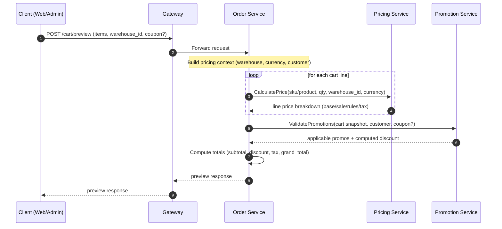
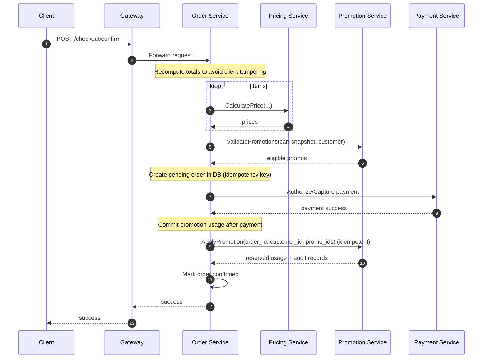
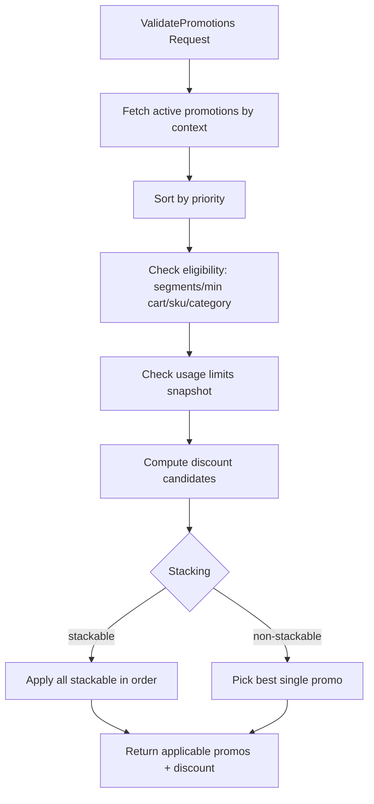
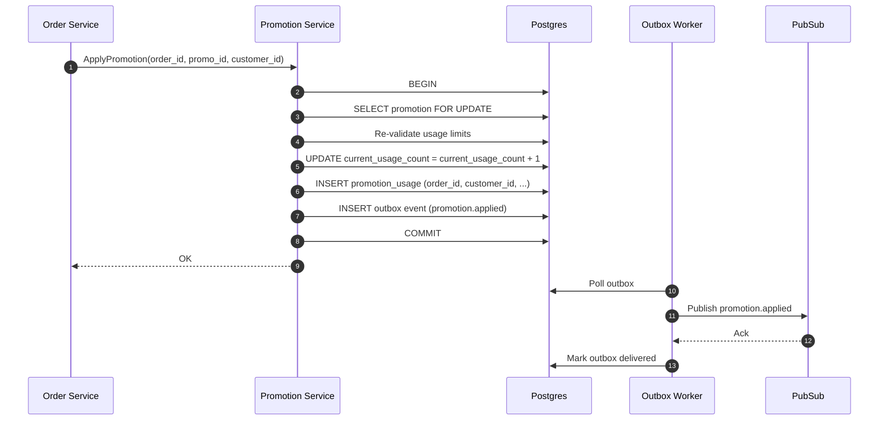
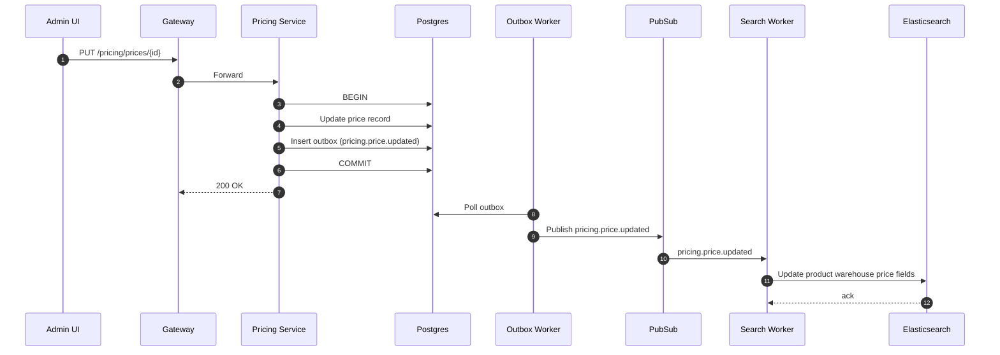

# 💰🎁 Pricing + Promotion Flow (End-to-End)

**Last Updated**: 2026-01-18  
**Owner**: Platform Engineering  
**Scope**: Pricing service + Promotion service + Order integration + downstream consumers (Search/Gateway cache)

---

## 1) Purpose & Boundaries

### Pricing service owns
- Base price storage (per SKU/product, per warehouse/global)
- Price calculation pipeline (base → dynamic → rules → tax)
- Publish price change events (`pricing.price.updated|deleted`)

### Promotion service owns
- Promotion definitions (conditions, segments, applicable products/categories/brands)
- Validation (read-only): determine applicable promotions and discount amounts
- Reservation/apply (write): atomic usage reservation with locking + outbox events

### Order service owns
- Checkout orchestration: preview totals, confirm order, payment, finalization
- Calling pricing & promotion APIs at the right moments (idempotent)

---

## 2) Request-Time Flow: Cart/Checkout Price Preview

### What this flow answers
- “Given cart items + customer + warehouse, what is the total price and which promos apply?”



### Notes
- Pricing calculates **tax** and internal pricing rules.
- Promotion applies **coupon/promo discounts** (separate service).
- Order must keep a stable **cart snapshot** used for both validation and eventual apply.

Tax integration details are documented in [tax-calculation.md](tax-calculation.md).

---

## 3) Request-Time Flow: Order Confirmation (Promotion Apply/Reserve)

### Recommended “correct” sequence
- Promotion usage should be **reserved/applied** only when the order is truly being placed (or in a clear reservation step with TTL).



### Idempotency rules
- Order must pass a stable `order_id` / idempotency key to Promotion.
- Promotion Apply must be safe to retry (e.g., on gateway timeout).

---

## 4) Pricing Calculation Internals (Pricing Service)

```mermaid
flowchart TD
  A[CalculatePrice Request] --> B{Redis Cache Hit?}
  B -->|Yes| Z[Return cached price]
  B -->|No| C[Fetch Base Price]
  C --> C1[Priority: SKU+WH]
  C --> C2[SKU Global]
  C --> C3[Product+WH]
  C --> C4[Product Global]
  C --> D[Currency Conversion if needed]
  D --> E[Multiply by Quantity]
  E --> F[Dynamic Pricing Adjustment]
  F --> G[Apply Pricing Rules (priority order)]
  G --> H[Tax Calculation]
  H --> I[Cache Result]
  I --> J[Publish price.calculated event (optional)]
  J --> Z2[Return final breakdown]

### 4.1 Tax Calculation (How it should work)

Pricing should calculate tax using **full context** (address + product categories + customer group when applicable).  
There are currently two integration styles in the system:

1. **Preferred**: tax is part of `CalculatePrice`.
2. **Current**: Order calls `CalculateTax` (RPC). Pricing internally uses `TaxUsecase.CalculateTaxWithContext`.

Current correctness risks are mostly on the **Order context** side (not on Pricing):
- Some Order flows pass `product_categories=[]` (TODO), so category-based tax rules won’t apply.
- Some Order flows mistakenly pass `customer_id` into the `customer_group_id` field.

See [tax-calculation.md](tax-calculation.md) for the verified current path and the recommended refactor (pass full context correctly).
```

---

## 5) Promotion Internals (Promotion Service)

### 5.1 ValidatePromotions (read-only)



### 5.2 Apply/ReserveUsage (write, atomic)



---

## 6) Write-Time Flow: Admin Updates Price → Downstream Sync



---

## 7) Where Search fits in (read model)

- Search service consumes `pricing.price.updated|deleted` and `warehouse.inventory.stock_changed` to keep a **warehouse-aware sellable view** in Elasticsearch.
- Order uses Pricing+Promotion as the **source of truth** for checkout totals; Search is for discovery only.

---

## 8) Links
- Issues checklist: [docs/10-appendix/checklists/pricing-promotion-flow-issues.md](../../10-appendix/checklists/pricing-promotion-flow-issues.md)
- Pricing-only flow: [pricing-management.md](pricing-management.md)
- Promotion-only flow: [promotion-management.md](promotion-management.md)
- Tax flow: [tax-calculation.md](tax-calculation.md)
- Search sellable view: [docs/10-appendix/legacy/search-sellable-view-per-warehouse-complete.md](../../10-appendix/legacy/search-sellable-view-per-warehouse-complete.md)
