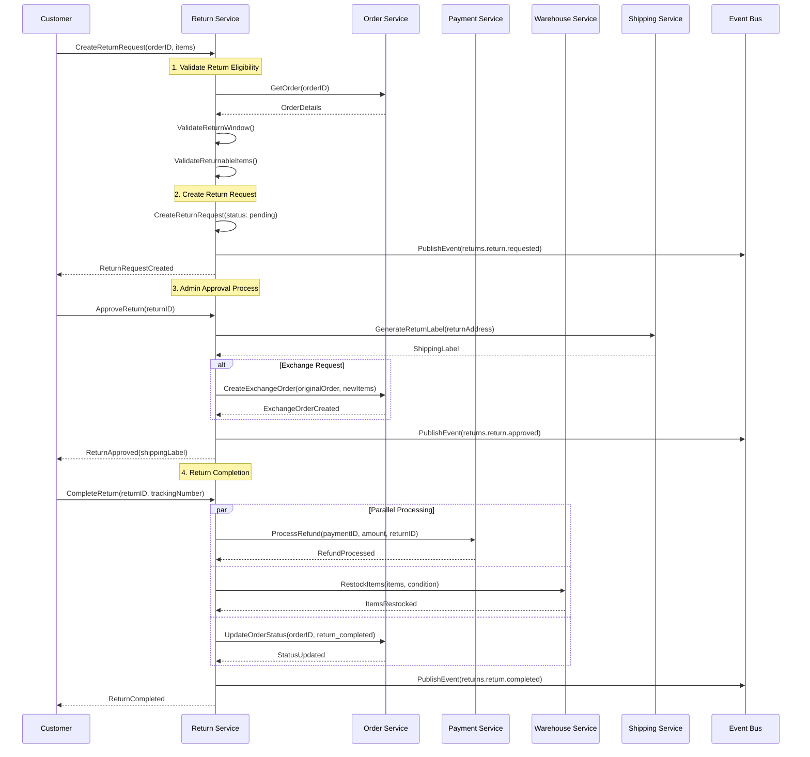
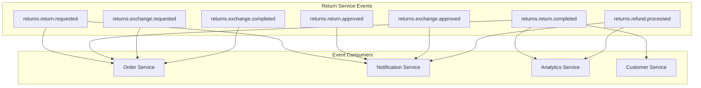

# Return & Refund Flow

**Last Updated**: 2026-01-29
**Status**: Updated for Service Split
**Domain**: Commerce
**Services**: Return Service (Primary), Order Service (Integration), Payment Service, Warehouse Service
**Navigation**: [← Commerce Domain](../README.md) | [← Business Domains](../../README.md) | [Return Service →](../../03-services/core-services/return-service.md)

## Overview

This document describes the business logic for handling customer returns and exchanges. After the service domain split, return and refund processing is now handled by the dedicated `return` service, which orchestrates calls to other services like `order`, `shipping`, `payment`, and `warehouse`.

**Key Files:**
- **Return Service**: `return/internal/biz/return/return.go`
- **Order Integration**: `return/internal/client/order_client.go`
- **Payment Integration**: `return/internal/client/payment_client.go`
- **Warehouse Integration**: `return/internal/client/warehouse_client.go`

---

## Key Flows

### 1. Return/Exchange Request Creation

- **File**: `return.go` (`CreateReturnRequest`)
- **Logic**:
  1.  **Order Validation**: The return service first validates the order by calling the order service:
      - The order must belong to the customer.
      - The order status must be `delivered`.
      - The request must be within the return window (e.g., 30 days from `order.CompletedAt`).
  2.  **Request Creation**: A `ReturnRequest` record is created in the return service database with a `pending` status.
  3.  **Event Publishing**: An event (`returns.return.requested` or `returns.exchange.requested`) is published to notify other systems.
  4.  **Order Service Notification**: The order service is notified of the return request for order status tracking.

### 2. Status Update and Cross-Service Orchestration

- **File**: `return.go` (`UpdateReturnRequestStatus`)
- **Logic**: This function acts as a state machine for the return process, coordinating with multiple services. Key transitions trigger cross-service operations:
  -   **On `approved`**:
      -   A return shipping label is automatically generated by calling the `shipping` service.
      -   If the request is for an exchange, the `processExchangeOrder` logic is triggered, which creates a new order via the order service.
      -   The order service is notified to update the original order status.
  -   **On `completed`**:
      -   The `processReturnRefund` function is called to initiate a refund via the `payment` service.
      -   The `restockReturnedItems` function is called to return items to inventory via the `warehouse` service.
      -   The order service is updated with the final return completion status.

### 3. Refund Processing with Payment Service Integration

- **File**: `return.go` (`processReturnRefund`)
- **Logic**:
  1.  Retrieves the original order details from the order service to get the `paymentID`.
  2.  Calls `paymentService.ProcessRefund` with the calculated refund amount and return request ID as idempotency key.
  3.  Updates the `ReturnRequest` with the `RefundID` from the payment service.
  4.  Publishes a `returns.refund.processed` event for audit and notification purposes.

### 4. Item Restocking with Warehouse Service Integration

- **File**: `return.go` (`restockReturnedItems`)
- **Logic**:
  1.  Iterates through the returned items in the return request.
  2.  For each item marked as `Restockable`, it calls `warehouseService.RestockItem` with the item details.
  3.  Updates inventory levels and publishes stock change events via the warehouse service.
  4.  Handles partial restocking scenarios where some items may not be restockable due to condition.

---

## Service Integration Patterns

### Cross-Service Communication Flow

### Event-Driven Integration

The return service publishes events that other services consume:

---

## Identified Issues & Gaps

Based on the `AI-OPTIMIZED CODE REVIEW GUIDE` and service split considerations.

### P1 - Cross-Service Transaction Consistency

- **Description**: With the service split, return processing now involves multiple services (return, order, payment, warehouse). The current implementation handles refund and restock operations in a "best-effort" manner across service boundaries. If any cross-service call fails, the return could be in an inconsistent state.
- **Impact**: Critical data inconsistencies across services. A customer's return could be marked as complete in the return service, but the order service might not reflect the return status, or the refund might fail while inventory is restocked.
- **Recommendation**: Implement a distributed Saga pattern for return processing. Use the return service as the saga orchestrator with compensation actions for each service integration. Failed operations should trigger compensating transactions and move the return to a failed state for manual intervention.

### P1 - Service Communication Resilience

- **Description**: The return service now depends on multiple external services (order, payment, warehouse). Network failures or service unavailability can cause return processing to fail without proper retry mechanisms or circuit breakers.
- **Impact**: Return requests could fail due to temporary service issues, leading to poor customer experience and potential data inconsistency.
- **Recommendation**: Implement circuit breakers for all external service calls, with exponential backoff retry strategies. Use async processing with message queues for non-critical operations like notifications and analytics updates.

### P1 - Idempotency Across Services

- **Description**: Cross-service operations (refund processing, inventory restocking) need idempotency guarantees to handle retries safely. The current implementation may not provide sufficient idempotency keys for all service interactions.
- **Impact**: Retry scenarios could lead to duplicate refunds or inventory adjustments, causing financial and operational issues.
- **Recommendation**: Generate unique idempotency keys (based on return request ID and operation type) for all cross-service calls. Ensure all integrated services honor these idempotency keys. Implement idempotency checks in the return service for incoming requests.
