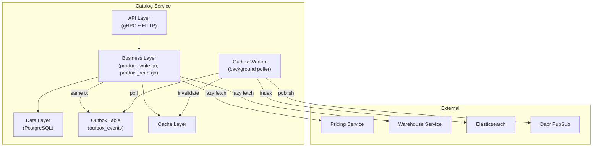
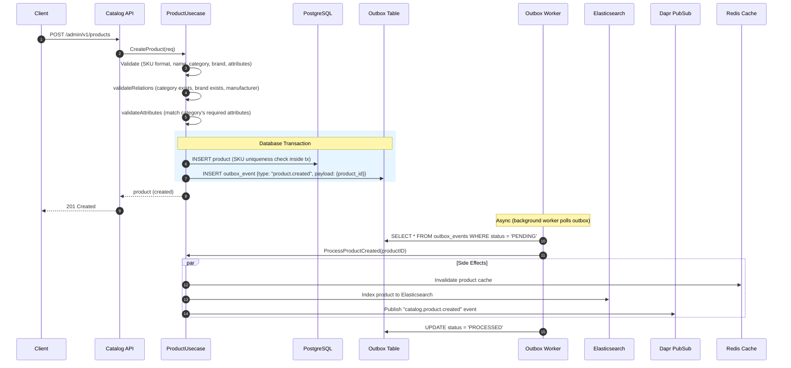
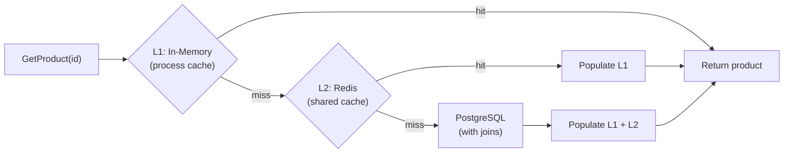
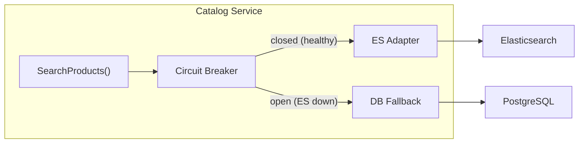
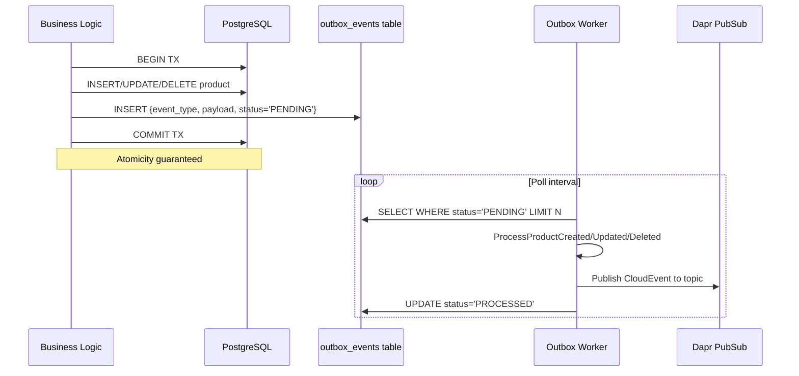

# 📦 Product & Catalog Management

**Purpose**: Product CRUD, category/brand management, event publishing, and data enrichment  
**Domain**: Content Management  
**Service**: Catalog Service  
**Last Updated**: 2026-02-12  
**Navigation**: [← Content Domain](../README.md) | [← Business Domains](../../README.md) | [Search & Discovery →](search-discovery.md)

---

## 📋 Quick Navigation

| Area | Section | Description |
|------|---------|-------------|
| **Write** | [Product CRUD](#1-write-operations-createupdatedelete) | Create/Update/Delete with transactional outbox |
| **Read** | [Product Detail](#2-read-operations---product-detail) | Multi-layer cache + live enrichment |
| **Read** | [Product List](#3-read-operations---product-list) | Materialized views + cache |
| **Events** | [Outbox Publishing](#4-event-publishing-transactional-outbox) | Reliable event propagation |
| **Enrichment** | [Price & Stock](#5-price--stock-enrichment) | Lazy-loading from Pricing/Warehouse |
| **Visibility** | [Access Control](#6-product-visibility-rules) | Rule engine + fail-open |

---

## 🏗️ Architecture



---

## 1. Write Operations (Create/Update/Delete)

> **Source**: [product_write.go](file:///home/user/microservices/catalog/internal/biz/product/product_write.go)

### 1.1 Sequence Diagram



### 1.2 Validation Rules

| Phase | Check | Source |
|-------|-------|--------|
| Basic | SKU format, name length, required fields | `validateCreateRequestBasic()` |
| Relations | Category ID exists, Brand ID exists, Manufacturer ID exists | `validateRelations()` |
| Attributes | Required attributes for category, value types, allowed values | `validateAttributes()` |
| DB (in-tx) | SKU uniqueness (race-condition safe) | Inside transaction |

### 1.3 Update Flow

Same transactional outbox pattern:
1. Validate update request against existing product
2. `mergeUpdateModel()` — selective field update
3. Tx: UPDATE product + INSERT outbox `product.updated`
4. Worker: cache invalidation + ES reindex + publish event

### 1.4 Delete Flow

1. Tx: Soft-delete product + INSERT outbox `product.deleted`
2. Worker: cache invalidation + ES delete + publish event

> [!CAUTION]
> **Missing**: `DeleteBrand` and `DeleteCategory` do NOT check for referencing products. Deleting a brand/category still linked to products creates dangling references. **TODO**: Add FK usage check before deletion.

---

## 2. Read Operations — Product Detail

> **Source**: [product_read.go → GetProduct](file:///home/user/microservices/catalog/internal/biz/product/product_read.go#L13-L59)

### 2.1 Multi-Layer Cache



### 2.2 Price & Stock Enrichment for PDP

After retrieving the core product, PDP enriches with **live** price and stock:

```
GetProductAvailability(productID, currency):
  1. Check Redis cache for price/stock
  2. On cache miss → parallel calls:
     ├── PricingService.GetBasePrice(productID, currency, warehouseID)
     ├── PricingService.GetSalePrice(productID, currency, warehouseID)  
     └── WarehouseService.GetStock(productID, warehouseID)
  3. Cache result with jittered TTL
  4. Return ProductAvailability {basePrice, salePrice, stock, inStock}
```

### 2.3 Batch Fetch (GetProductsByIDs)

Optimized for multi-product fetch (e.g., cart, order confirmation):
1. Try cache for all IDs
2. Identify cache misses
3. Batch-fetch missing from DB
4. Populate cache for misses
5. Return merged results

---

## 3. Read Operations — Product List

> **Source**: [product_read.go → ListProducts](file:///home/user/microservices/catalog/internal/biz/product/product_read.go#L161-L327)

### 3.1 Data Source

| Use Case | Recommended Source | Why |
|----------|-------------------|-----|
| Customer search/browse | **Search Service (ES)** | Full-text, facets, warehouse-aware |
| Admin product management | **Catalog Service (DB)** | Authoritative, all fields |
| Simple category browse | Either | ES preferred for performance |

### 3.2 Catalog Service List Flow

```
ListProducts(offset, limit, filters):
  1. Try search result cache (for simple, repeated queries)
  2. On cache miss → query PostgreSQL materialized views
     ├── Pre-aggregated views avoid complex production joins
     ├── Supports filters: category_id, brand_id, status, is_active
     └── Pagination via OFFSET/LIMIT
  3. Cache results for subsequent requests
  4. Return products[] + total count
```

### 3.3 Catalog + ES Dual Search



The catalog service has an internal `SearchProducts()` method with circuit breaker:
- **Healthy**: Query Elasticsearch via adapter
- **ES Down**: Fallback to PostgreSQL LIKE/ILIKE search
- This is separate from the Search Service API — it's for internal catalog use

---

## 4. Event Publishing (Transactional Outbox)

### 4.1 Pattern



### 4.2 Events Published

| Event Topic | Trigger | Payload | Consumers |
|-------------|---------|---------|-----------|
| `catalog.product.created` | Product created | `{product_id, sku, name, category_id, ...}` | Search, Analytics |
| `catalog.product.updated` | Product updated | `{product_id, changed_fields}` | Search, Analytics |
| `catalog.product.deleted` | Product deleted | `{product_id, sku}` | Search, Analytics |
| `catalog.attribute.config_changed` | Attribute indexed/searchable changed | `{attribute_id, is_indexed, is_searchable}` | Search (ES mapping) |
| `catalog.cms.page.created/updated/deleted` | CMS content changes | `{page_id, type, content}` | Search (CMS index) |

### 4.3 Side Effects (ProcessProduct*)

| Step | ProcessProductCreated | ProcessProductUpdated | ProcessProductDeleted |
|------|----------------------|----------------------|----------------------|
| 1 | Fetch full product from DB | Fetch updated product from DB | Fetch product (before delete) |
| 2 | Index to Elasticsearch | Re-index to Elasticsearch | Delete from Elasticsearch |
| 3 | Invalidate Redis cache | Invalidate Redis cache | Invalidate Redis cache |
| 4 | Publish event to PubSub | Publish event to PubSub | Publish event to PubSub |

---

## 5. Price & Stock Enrichment

> **Source**: [product_price_stock.go](file:///home/user/microservices/catalog/internal/biz/product/product_price_stock.go)

### 5.1 Design: Lazy-Loading Cache

```
Cache Strategy:
  - Cache is WRITE-THROUGH on first access (lazy)
  - NOT pre-warmed (WarmStockCache/WarmPriceCache are DISABLED)
  - Search service handles real-time price/stock for the ES read model
  - Catalog's price/stock cache is ONLY for Product Detail Page fallback
```

### 5.2 Scope

| Method | Purpose | Used By |
|--------|---------|---------|
| `GetStockFromCache` | Lazy stock fetch (cache → Warehouse gRPC → cache) | PDP |
| `GetBasePriceFromCache` | Lazy base price fetch (cache → Pricing gRPC → cache) | PDP |
| `GetSalePriceFromCache` | Lazy sale price fetch (cache → Pricing gRPC → cache) | PDP |
| `GetProductAvailability` | Unified: price + stock in one call | PDP |
| `SyncProductAvailabilityBatch` | Bulk refresh for batch contexts | Internal |

> [!IMPORTANT]
> **Separation of Concerns**: Catalog's price/stock logic is a **fallback/lazy-cache** for PDP only. The **Search Service** is the primary source for price/stock in listings via its ES read model. See [Search & Discovery → Data Ownership](search-discovery.md#8-data-ownership-matrix) for the full matrix.

---

## 6. Product Visibility Rules

> **Source**: [product_visibility.go](file:///home/user/microservices/catalog/internal/biz/product/product_visibility.go)

### 6.1 Rule Engine

```
CheckProductVisibility(productID, customerContext):
  1. Fetch visibility rules for product
  2. Evaluate each rule against customer context:
     ├── Age restriction (min_age check)
     ├── Customer group (allowed/denied groups)
     ├── Geographic (restricted countries/regions/cities)
     ├── License/Prescription requirements
     └── Enforcement level (hard/soft)
  3. Return visible: bool + reason: string
```

### 6.2 Fail-Open Strategy

If any error occurs during rule fetch or evaluation → product is **visible** by default.

- **Rationale**: Availability over restriction for commerce
- **Exception**: Age-restricted or compliance categories should consider fail-safe

### 6.3 Integration with Search

The Search Service calls `BatchCheckProductVisibility()` as a **post-filter** after ES returns results. See [Search & Discovery → Visibility Filtering](search-discovery.md#9-visibility-filtering-hybrid-model).

---

## 📚 Related Documentation

- **[Search & Discovery](search-discovery.md)** — ES sync, search pipeline, product lists
- **[Review Management](review-management.md)** — Product ratings integration
- **[Catalog Service](../../03-services/core-services/catalog-service.md)** — Technical service details
- **[Catalog OpenAPI](file:///home/user/microservices/catalog/openapi.yaml)** — API specification

---

**Maintained By**: Catalog Team  
**Code Refs**: `catalog/internal/biz/product/`, `catalog/internal/biz/events/`, `catalog/internal/biz/category/`, `catalog/internal/biz/brand/`
