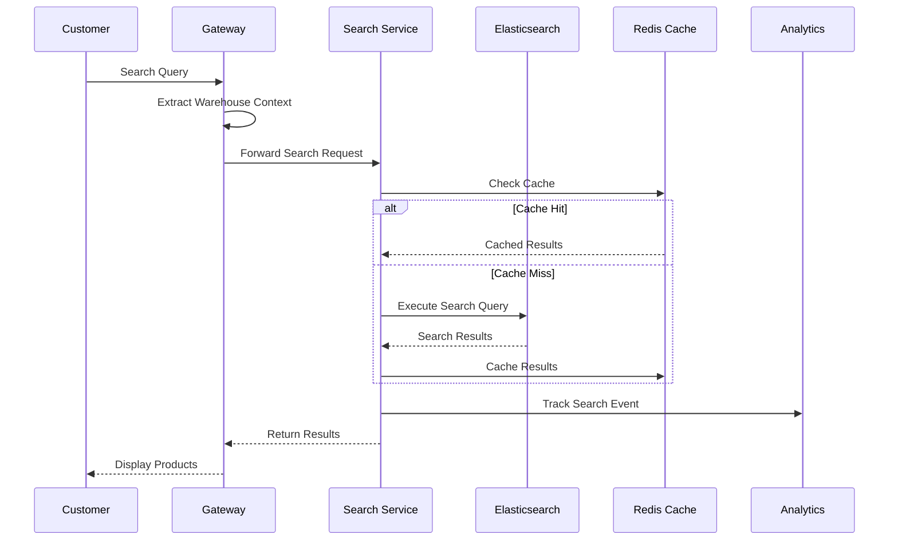
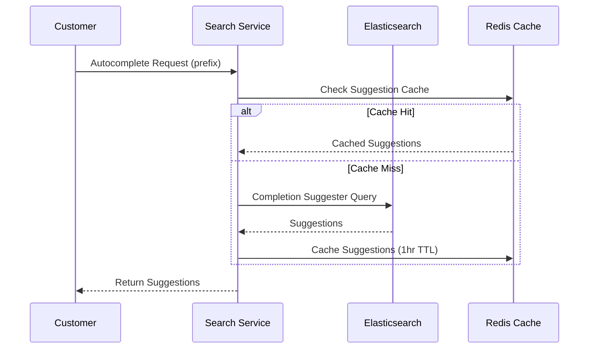
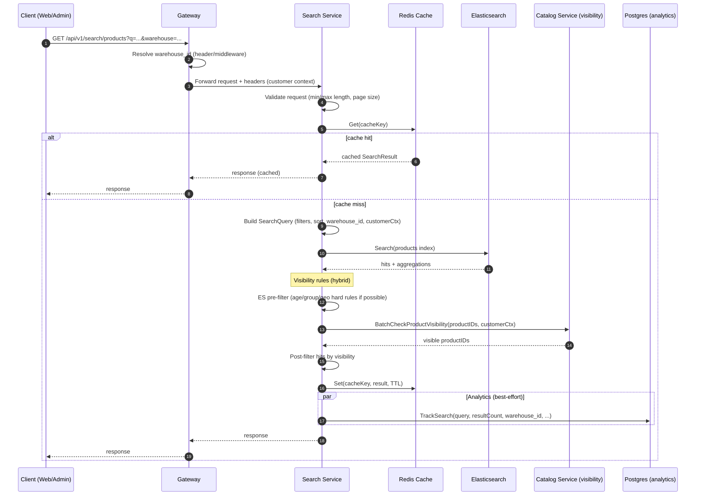
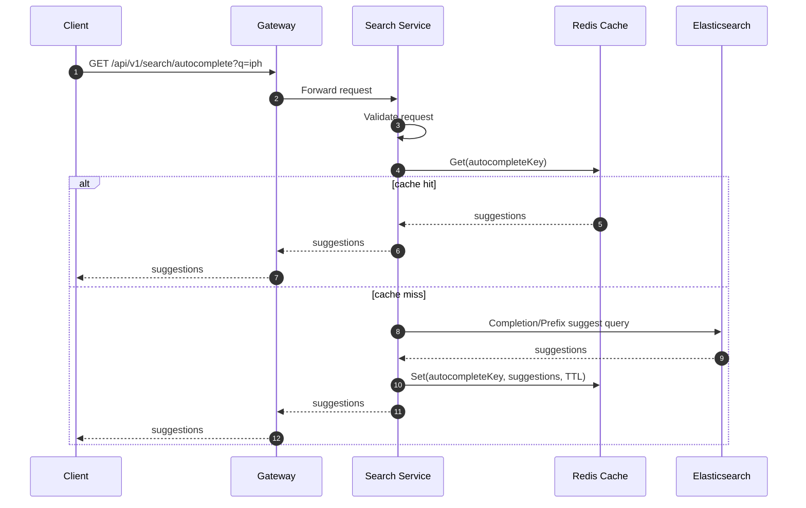
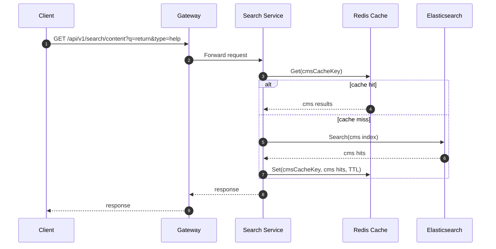
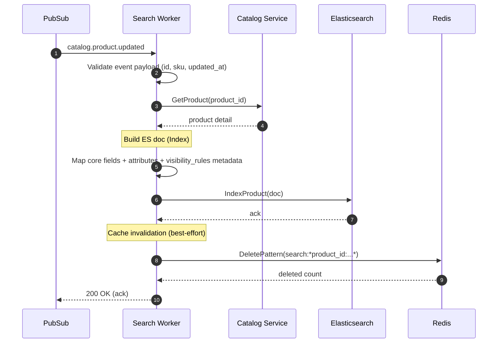
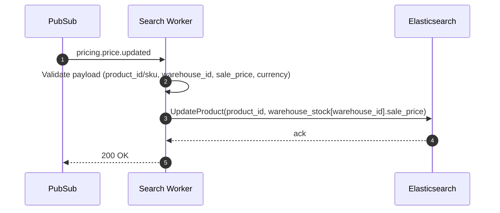
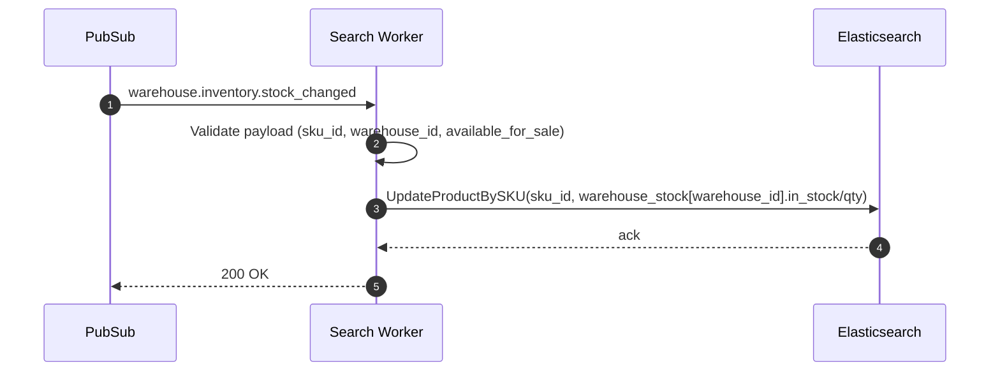
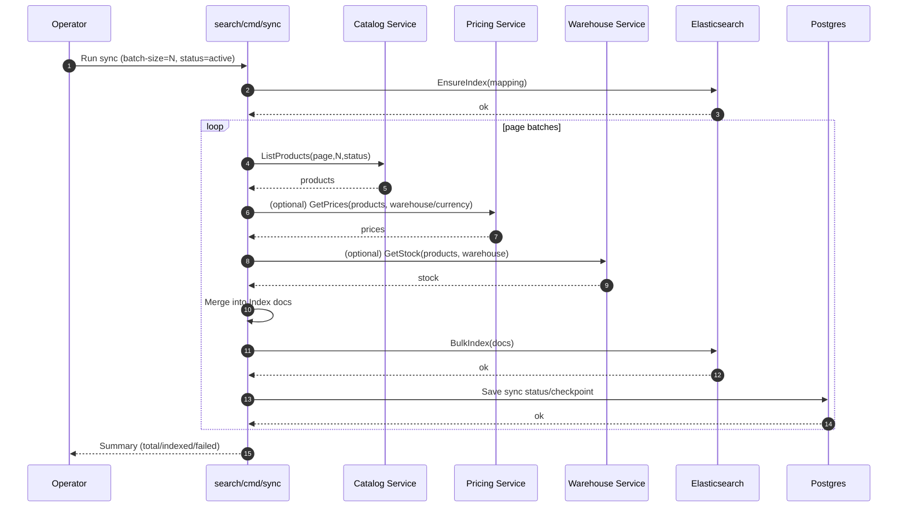
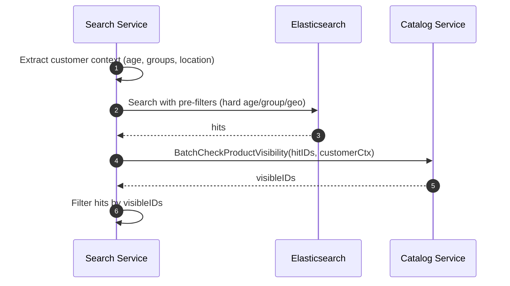

# 🔍 Search & Product Discovery

**Purpose**: Product search, discovery, and content search capabilities  
**Domain**: Content Management  
**Services**: Search Service, Catalog Service  
**Navigation**: [← Content Domain](../README.md) | [← Business Domains](../../README.md) | [Search Service →](../../03-services/platform-services/search-service.md)

---

## 📋 **Quick Navigation**

### **Core Workflows**
- **[Product Search](#1-product-search)** - Real-time product search and filtering
- **[Search Suggestions](#2-search-suggestions)** - Autocomplete and recommendations
- **[Content Search](#3-content-search)** - CMS and help content search
- **[Search Analytics](#4-search-analytics)** - Search performance and insights

### **Technical Implementation**
- **[Search Indexing](#search-indexing-flow)** - Event-driven index updates
- **[Visibility Rules](#visibility-filtering-hybrid-model)** - Access control and filtering
- **[Performance](#observability--slo-checkpoints)** - Caching and optimization

### **Related Documentation**
- **[Catalog Service](../../03-services/core-services/catalog-service.md)** - Product data source
- **[Search Service](../../03-services/platform-services/search-service.md)** - Technical implementation
- **[Event Processing](../../06-operations/platform/event-validation-dlq-flow.md)** - Event reliability

---

## 📋 **Overview**

This document describes the search and product discovery capabilities of our e-commerce platform. The Search Service provides intelligent product search, autocomplete suggestions, trending searches, and content discovery to enhance the customer shopping experience.

## 🎯 **Core Capabilities**

### **1. Product Search**
- **Intelligent Search**: AI-powered search with Elasticsearch
- **Faceted Search**: Filter by category, brand, price, ratings
- **Warehouse-Aware**: Stock and pricing per warehouse location
- **Performance**: Sub-200ms response times for product queries

### **2. Search Suggestions**
- **Autocomplete**: Real-time suggestions as users type
- **Trending Searches**: Popular searches in real-time
- **Spell Correction**: "Did you mean?" for typos
- **Content Suggestions**: CMS pages, help articles, blog posts

### **3. Product Discovery**
- **Personalized Results**: Based on user behavior and preferences
- **Visual Search**: Search by product images (planned)
- **Recommendation Engine**: Related and similar products
- **Category Navigation**: Hierarchical category browsing

## 🏗️ **Architecture Overview**

### **Search Service Architecture**
```
┌─────────────────┐
│   Client Apps   │
│ (Web, Mobile)   │
└────────┬────────┘
         │
         ↓
┌─────────────────┐
│  API Gateway    │
│ (Routing, Auth) │
└────────┬────────┘
         │
         ↓
┌─────────────────┐
│ Search Service  │
│ (Query Engine)  │
└────────┬────────┘
         │
         ├─── Elasticsearch (Search Index)
         ├─── Redis (Cache Layer)
         ├─── PostgreSQL (Analytics)
         └─── Event Bus (Real-time Updates)
```

### **Data Flow**
```
Product Updates → Event Bus → Search Service → Elasticsearch Index
                                    ↓
Customer Query → Search Service → Elasticsearch → Filtered Results
```

## 🔄 **Search Process Flow**

### **1. Product Search Flow**


### **2. Autocomplete Flow**


## 📊 **Search Features**

### **Advanced Search Capabilities**

#### **1. Intelligent Query Processing**
- **Natural Language**: Process conversational queries
- **Synonym Handling**: Understand product variations
- **Fuzzy Matching**: Handle typos and misspellings
- **Boost Factors**: Prioritize popular and relevant products

#### **2. Filtering & Faceting**
```json
{
  "filters": {
    "category": ["electronics", "computers"],
    "brand": ["apple", "samsung"],
    "price_range": {"min": 100, "max": 1000},
    "in_stock": true,
    "rating": {"min": 4.0},
    "warehouse_id": "warehouse-123"
  },
  "facets": {
    "categories": {"terms": {"field": "category"}},
    "brands": {"terms": {"field": "brand"}},
    "price_ranges": {"range": {"field": "price"}}
  }
}
```

#### **3. Sorting Options**
- **Relevance**: Default search relevance scoring
- **Price**: Low to high, high to low
- **Rating**: Highest rated first
- **Popularity**: Most viewed/purchased
- **Newest**: Recently added products
- **Stock Priority**: In-stock items first

### **Search Suggestions System**

#### **1. Autocomplete Types**
- **Product Names**: Suggest product titles and SKUs
- **Categories**: Navigate to product categories
- **Brands**: Filter by brand names
- **Content**: Help articles, blog posts, FAQs

#### **2. Trending & Popular Searches**
```go
// Trending searches (last 24 hours)
type TrendingSearch struct {
    Query      string  `json:"query"`
    Count      int32   `json:"count"`
    GrowthRate float64 `json:"growth_rate"`
}

// Popular searches (all time)
type PopularSearch struct {
    Query      string  `json:"query"`
    Count      int32   `json:"count"`
    Period     string  `json:"period"` // "7d", "30d", "all_time"
}
```

#### **3. Spell Correction**
- **Zero Results**: Suggest corrections for queries with no results
- **Typo Detection**: Identify and correct common misspellings
- **Dictionary Building**: Learn from successful queries
- **Multiple Suggestions**: Provide top 3 correction options

## 🏪 **Warehouse-Aware Search**

### **Multi-Warehouse Support**
Our search system supports multiple warehouse locations with:

#### **1. Warehouse Context**
- **Header Detection**: `X-Warehouse-ID` from gateway
- **Location-Based**: Automatic warehouse detection by user location
- **Default Fallback**: Default warehouse when location unknown

#### **2. Warehouse-Specific Data**
```json
{
  "product_id": "prod-123",
  "name": "iPhone 15 Pro",
  "warehouse_stock": [
    {
      "warehouse_id": "wh-001",
      "in_stock": true,
      "quantity": 50,
      "price": 999.99,
      "sale_price": 899.99
    },
    {
      "warehouse_id": "wh-002", 
      "in_stock": false,
      "quantity": 0,
      "price": 999.99,
      "sale_price": null
    }
  ]
}
```

#### **3. Warehouse Filtering**
- **Stock Availability**: Filter by in-stock items per warehouse
- **Price Variations**: Different prices per warehouse location
- **Delivery Options**: Shipping and pickup availability
- **Local Inventory**: Prioritize local warehouse stock

## 📈 **Search Analytics**

### **Event Tracking**
We track comprehensive search analytics:

#### **1. Search Events**
```go
type SearchEvent struct {
    Query       string    `json:"query"`
    UserID      *int64    `json:"user_id,omitempty"`
    SessionID   string    `json:"session_id"`
    WarehouseID string    `json:"warehouse_id"`
    Results     int32     `json:"results"`
    Timestamp   time.Time `json:"timestamp"`
}
```

#### **2. Click-Through Events**
```go
type ClickEvent struct {
    SearchQuery string    `json:"search_query"`
    ProductID   string    `json:"product_id"`
    Position    int32     `json:"position"`
    UserID      *int64    `json:"user_id,omitempty"`
    SessionID   string    `json:"session_id"`
    Timestamp   time.Time `json:"timestamp"`
}
```

#### **3. Conversion Events**
```go
type ConversionEvent struct {
    SearchQuery string    `json:"search_query"`
    ProductID   string    `json:"product_id"`
    OrderID     string    `json:"order_id"`
    Revenue     float64   `json:"revenue"`
    UserID      *int64    `json:"user_id,omitempty"`
    SessionID   string    `json:"session_id"`
    Timestamp   time.Time `json:"timestamp"`
}
```

### **Analytics Insights**
- **Search Performance**: Query response times and success rates
- **User Behavior**: Click-through and conversion rates
- **Popular Queries**: Most searched terms and trending topics
- **Zero Results**: Queries that return no results for improvement
- **Personalization**: User-specific search patterns

## 🎨 **Content Search**

### **CMS Content Discovery**
Beyond product search, we provide content discovery:

#### **1. Content Types**
- **Help Articles**: Customer support documentation
- **Blog Posts**: Company news and product updates
- **FAQ Pages**: Frequently asked questions
- **Policy Pages**: Terms, privacy, return policies

#### **2. Content Search Features**
- **Full-Text Search**: Search within article content
- **Category Filtering**: Filter by content type
- **Tag-Based Discovery**: Find related content by tags
- **Popularity Ranking**: Most viewed and helpful content

#### **3. Content Suggestions**
- **Related Articles**: Suggest relevant help content
- **Popular Content**: Most accessed pages
- **Recent Updates**: Newly published content
- **Contextual Help**: Content based on current page/action

## ⚡ **Performance Optimization**

### **Caching Strategy**
Multi-layer caching for optimal performance:

#### **1. Cache Layers**
- **CDN Cache**: Static content and API responses (1 hour TTL)
- **Redis Cache**: Search results and suggestions (30 min TTL)
- **Application Cache**: Frequently accessed data (5 min TTL)

#### **2. Cache Keys**
```go
// Search results cache
search:products:{query_hash}:{filters_hash}:{warehouse_id}

// Autocomplete cache  
autocomplete:product:{query_prefix}:{limit}

// Trending searches cache
trending:searches:{time_window}:{limit}

// Content search cache
cms:search:{query}:{type}:{offset}:{limit}
```

### **Performance Targets**
- **Product Search**: < 200ms response time (95th percentile)
- **Autocomplete**: < 50ms response time (95th percentile)
- **Content Search**: < 150ms response time (95th percentile)
- **Cache Hit Rate**: > 80% for search results
- **Suggestion Hit Rate**: > 90% for autocomplete

## 🔍 **Search Quality**

### **Relevance Optimization**
- **Scoring Factors**: Text relevance, popularity, ratings, stock status
- **Boost Rules**: Promote in-stock, highly-rated, popular products
- **Personalization**: Adjust results based on user behavior
- **A/B Testing**: Continuously test and improve search algorithms

### **Quality Metrics**
- **Click-Through Rate**: > 15% for search results
- **Conversion Rate**: > 5% from search to purchase
- **Zero Results Rate**: < 10% of all queries
- **User Satisfaction**: > 4.0/5.0 search experience rating

## 🔗 **Integration Points**

### **Service Dependencies**
- **Catalog Service**: Product data and metadata
- **Warehouse Service**: Stock levels and availability
- **Pricing Service**: Product pricing and promotions
- **Customer Service**: User preferences and history
- **Analytics Service**: Search performance metrics

### **Event Subscriptions**
- `catalog.product.created/updated/deleted`
- `warehouse.inventory.stock_changed`
- `pricing.price.updated/deleted`
- `catalog.cms.page.created/updated/deleted`

### **API Endpoints**
```
GET  /api/v1/search/products          # Product search
GET  /api/v1/search/autocomplete      # Search suggestions
GET  /api/v1/search/trending          # Trending searches
GET  /api/v1/search/popular           # Popular searches
GET  /api/v1/search/content           # Content search
POST /api/v1/search/events/track      # Analytics tracking
```

## 🚀 **Future Enhancements**

### **Planned Features**
- **Visual Search**: Search by product images
- **Voice Search**: Voice-activated product search
- **AR Integration**: Augmented reality product preview
- **Advanced Personalization**: ML-based recommendation engine
- **Multi-Language**: Support for multiple languages
- **Semantic Search**: Understanding intent beyond keywords

### **Technical Improvements**
- **Real-Time Indexing**: Instant search index updates
- **Distributed Search**: Multi-region search deployment
- **Advanced Analytics**: Machine learning insights
- **Performance Optimization**: Sub-100ms search responses

---

## 📚 **Related Documentation**

- **[Catalog Management](catalog-management.md)** - Product catalog and content management
- **[Search Service](../../03-services/platform-services/search-service.md)** - Technical implementation details
- **[API Documentation](../../04-apis/openapi/search.openapi.yaml)** - Complete API specification
- **[Analytics](../../03-services/platform-services/analytics-service.md)** - Search analytics and reporting

---

**Last Updated**: January 26, 2026  
**Maintained By**: Search & Discovery Team

---

# 🔍 Search Service - Product Discovery Flow (Search + Catalog Integration)

**Last Updated**: 2026-01-18  
**Owner**: Platform Engineering  
**Scope**: Search Service (Elasticsearch read model) + Catalog visibility filtering + Pricing/Warehouse enrichment via events

---

## 1) Goal & Boundary

### What Search Service is responsible for
- Serve **product discovery APIs** (search/list/autocomplete/content search)
- Query Elasticsearch indices (products, cms content)
- Apply **warehouse-aware** filtering/sorting using indexed per-warehouse views
- Apply **visibility rules** (hybrid: ES pre-filter + Catalog post-filter)
- Emit/search analytics events (query/click/conversion tracking)

### What Search Service is NOT responsible for
- Source-of-truth product data (Catalog owns)
- Source-of-truth price rules (Pricing owns)
- Source-of-truth stock/reservation (Warehouse owns)

---

## 2) Request-Time Flow: Search Products

### 2.1 Sequence Diagram (happy path)



### 2.2 Data shaping rules (what Search returns)
- Source fields come from **indexed document** (product read model)
- Warehouse-aware fields are read from `warehouse_stock[]` (ex: `in_stock`, `sale_price`, `quantity`)
- Visibility filtering happens **after** ES returns hits (post-filter), so:
  - Total hits may be adjusted after visibility
  - Pagination must be careful to avoid "empty page after filtering" (see risks section)

---

## 3) Request-Time Flow: Autocomplete



---

## 4) Request-Time Flow: CMS Content Search



---

## 5) Real-Time Indexing Flow (Event-Driven)

### 5.1 High-level event topology

```mermaid
flowchart LR
  CATALOG[Catalog Service] -- catalog.product.created/updated/deleted --> PUB[(Dapr PubSub)]
  PRICING[Pricing Service] -- pricing.price.updated/deleted --> PUB
  WAREHOUSE[Warehouse Service] -- warehouse.inventory.stock_changed --> PUB
  CMS[Catalog CMS] -- catalog.cms.page.* --> PUB

  PUB --> SW[Search Worker (event consumers)]
  SW --> ES[(Elasticsearch)]
  SW --> PG[(Postgres analytics/metadata)]

  SVC[Search API Service] --> ES
  SVC --> R[(Redis cache)]
  SVC --> CATV[Catalog visibility client]
```

### 5.2 Product Created/Updated event handling (happy path)



### 5.3 Price Updated event handling



### 5.4 Stock Changed event handling



---

## 6) Initial Backfill Flow (cmd/sync)

Use this when Elasticsearch is empty, mapping changed, or after major drift.



---

## 7) Visibility Filtering (Hybrid Model)

### 7.1 Strategy
- **Pre-filter in ES** (fast): only simple hard rules that can be represented as filters
- **Post-filter via Catalog** (correct): evaluate full rule engine with customer context

### 7.2 Flow



### 7.3 Fail-open vs fail-closed (policy)
- Default for commerce: **fail-open** (availability) for Catalog visibility check failures
- For compliance categories (age restricted): consider **fail-safe** behavior

---

## 8) Observability & SLO checkpoints

### Key metrics
- Search latency: p50/p95/p99
- Elasticsearch `took` vs total duration
- Cache hit rate (search + autocomplete)
- Event processing lag (consumer)
- Event failures by type + DLQ count

### Recommended SLOs
- p95 search latency < 200ms
- Event processing lag < 5s
- Cache hit rate > 90% for popular queries

---

## 9) Failure Modes (what to expect)

### 9.1 Elasticsearch slow or degraded
- Search API latency increases
- Autocomplete may fall back or timeout

### 9.2 Catalog visibility unavailable
- If fail-open: results may include restricted products (risk)
- If fail-safe: results may be overly strict (lower discovery)

### 9.3 Event consumer blocked
- Index drift grows (stale price/stock)
- Symptoms: search results inconsistent with product detail

---

## 10) Related Docs
- Search sellable view & warehouse strategy: [search-sellable-view-per-warehouse-complete.md](search-sellable-view-per-warehouse-complete.md)
- Visibility filtering design: [search-product-visibility-filtering.md](search-product-visibility-filtering.md)
- Issues checklist: [search-catalog-product-discovery-flow-issues.md](../../workflow/checklists/search-catalog-product-discovery-flow-issues.md)