# 🔍 Search & Product Discovery

**Purpose**: Product search, discovery, catalog sync to Elasticsearch, and content search  
**Domain**: Content Management  
**Services**: Search Service, Catalog Service, Pricing Service, Warehouse Service  
**Last Updated**: 2026-02-12  
**Navigation**: [← Content Domain](../README.md) | [← Business Domains](../../README.md)

---

## 📋 Quick Navigation

| Area | Section | Description |
|------|---------|-------------|
| **Data Sync** | [Initial Backfill (cmd/sync)](#1-initial-backfill-cmdsync) | One-time full sync from Catalog → ES |
| **Data Sync** | [Real-Time Event Sync](#2-real-time-event-sync-worker) | Event-driven incremental updates |
| **Search** | [Product Search](#3-product-search-flow) | Full-text search + filters + facets |
| **Search** | [Autocomplete](#4-autocomplete) | Type-ahead suggestions |
| **Data Read** | [Product Detail Page](#5-product-detail-page-pdp) | How PDP data is assembled |
| **Data Read** | [Product List / Category Page](#6-product-list--category-page) | Listings, filters, sorting |
| **Index** | [Elasticsearch Mapping](#7-elasticsearch-index-mapping) | Document structure in ES |
| **Architecture** | [Data Ownership Matrix](#8-data-ownership-matrix) | Who owns what |

---

## 🏗️ Architecture Overview


> [!IMPORTANT]
> **ES is a read model**, not the source of truth. The source of truth is always the upstream service's PostgreSQL database. ES can be rebuilt at any time via `cmd/sync`.

---

## 1. Initial Backfill (`cmd/sync`)

> **Source**: [sync_usecase.go](file:///home/user/microservices/search/internal/biz/sync_usecase.go) | [README_SYNC.md](file:///home/user/microservices/search/README_SYNC.md)

### 1.1 When to Run
- First deployment of Search Service
- After ES index mapping changes
- After major data migration
- Manual re-sync when index has drifted

### 1.2 Sequence Diagram

```mermaid
sequenceDiagram
    autonumber
    participant OP as Operator
    participant SYNC as cmd/sync
    participant CAT as Catalog Service (gRPC)
    participant PR as Pricing Service (gRPC)
    participant WH as Warehouse Service (gRPC)
    participant ES as Elasticsearch
    participant DB as Postgres (sync_status)

    OP->>SYNC: Run sync (--status=active --batch-size=100 --currency=VND)
    SYNC->>DB: Check for partial sync (resume capability)
    alt Partial sync exists
        SYNC->>SYNC: Resume from last checkpoint page
    else New sync
        SYNC->>ES: CreateProductIndex("products_YYYYMMDD_HHMMSS")
        Note over SYNC,ES: New index created for zero-downtime swap
    end

    loop Page batches (100 products/page)
        SYNC->>CAT: ListProducts(page, batchSize, status)
        CAT-->>SYNC: products[] + total count

        par Batch fetch enrichments
            SYNC->>PR: GetAllPricesBulk(productIDs, currency)
            PR-->>SYNC: map[productID][]Price (global + warehouse-specific)
        and
            SYNC->>WH: GetBulkStock(productIDs)
            WH-->>SYNC: map[productID][]InventoryItem
        end

        SYNC->>SYNC: buildProductIndexDoc() for each product
        Note over SYNC: Priority price matching:<br/>1. Warehouse-specific price<br/>2. Global price<br/>3. Skip if no price

        SYNC->>ES: BulkIndexProducts(docs, targetIndex)
        SYNC->>DB: Checkpoint progress (every 10 pages)
    end

    SYNC->>ES: Refresh index
    SYNC->>ES: SwitchAlias("products_search", old → new)
    Note over ES: Zero-downtime alias swap
    SYNC-->>OP: Summary (total/synced/failed)
```



### 1.3 buildProductIndexDoc Logic

This is the core data assembly for each product → ES document:

```
For each product from Catalog:
  1. Get inventory[] from WarehouseClient batch map
  2. Get prices[] from PricingClient batch map
  3. Separate prices into: globalPrice + warehousePrices map

  For each inventory item (per warehouse):
    ├── Match price (warehouse-specific > global > skip)
    ├── Calculate: availableStock = quantityAvailable - quantityReserved
    ├── Determine: inStock = inv.InStock AND availableStock > 0
    └── Build WarehouseStockItem {warehouseID, inStock, quantity, basePrice, salePrice, currency}

  4. If NO valid warehouse stock entries → SKIP product (not indexed)
  5. Set main display price from global or first warehouse entry
  6. Return ProductIndex document
```

> [!NOTE]
> Products without any valid price+inventory combination are deliberately **not indexed**. This follows the business rule: "no sellable view → no search result."

### 1.4 Zero-Downtime Reindex Strategy


### 1.5 CLI Usage

```bash
cd search
./bin/sync -conf ./configs -status active -batch-size 100 -currency VND
```

| Flag | Default | Description |
|------|---------|-------------|
| `-conf` | `../../configs` | Config path |
| `-status` | `active` | Product status filter (`active`, `published`, `all`) |
| `-batch-size` | `100` | Products per page |
| `-currency` | `VND` | Currency for prices |

---

## 2. Real-Time Event Sync (Worker)

> **Source**: [product_consumer.go](file:///home/user/microservices/search/internal/service/product_consumer.go) | [price_consumer.go](file:///home/user/microservices/search/internal/service/price_consumer.go) | [consumer.go](file:///home/user/microservices/search/internal/service/consumer.go)

### 2.1 Event Topology


### 2.2 Event Processing Details

#### Product Created / Updated


#### Price Updated


#### Stock Changed


### 2.3 Event Reliability

| Feature | Implementation |
|---------|---------------|
| **Idempotency** | `EventIdempotencyRepo` stores processed event IDs (dedup window) |
| **DLQ** | Failed events → Dead Letter Queue → `DLQConsumerService` for manual retry |
| **Validation** | `ValidatorRegistry` validates all event payloads before processing |
| **Cache Invalidation** | Pattern-based Redis key deletion (`DeletePattern`) after every mutation |
| **Outbox** | Catalog uses Transactional Outbox pattern — event intent saved in same DB tx as business data |

---

## 3. Product Search Flow

> **Source**: [search_usecase.go](file:///home/user/microservices/search/internal/biz/search_usecase.go) | [search_handlers.go](file:///home/user/microservices/search/internal/service/search_handlers.go)

### 3.1 Sequence Diagram


### 3.2 Pipeline: Validate → Query → Filter → Sort → Return

```
1. VALIDATE
   ├── Trim query, set page defaults (page=1, pageSize=20)
   ├── Enforce max_result_window <= 10,000 (or use cursor pagination)
   └── Require warehouse_id if in_stock filter is active

2. BUILD ES QUERY (query_builder.go)
   ├── Multi-match: name^3, name.ngram^1, description, brand_name, category_name
   ├── Active filter: is_active=true, status=active
   ├── Warehouse stock boost: function_score wraps query with nested in_stock boost
   └── Spell correction: ES phrase_suggester for zero-result queries

3. APPLY FILTERS (filter_builder.go)
   ├── category_ids → terms filter on category_id
   ├── brand_ids → terms filter on brand_id
   ├── price_range → nested warehouse_stock price range (effective_price = min(sale, base))
   ├── on_sale → nested: warehouse_stock.sale_price < warehouse_stock.base_price
   ├── min_rating → range filter on rating
   ├── colors/sizes → terms filter on attributes.color/size.keyword
   ├── attributes.{key} → dynamic terms/range filter
   └── in_stock → nested: warehouse_stock.warehouse_id + in_stock=true

4. APPLY SORT (sort_builder.go)
   ├── Default: _score DESC, nested in_stock DESC (warehouse-aware)
   ├── price_asc/desc → nested warehouse_stock.sale_price sort
   ├── newest → created_at DESC
   ├── rating → rating DESC
   ├── popularity → stock + review_count weighted
   └── Always: _score as tiebreaker

5. AGGREGATE (aggregation_builder.go)
   ├── categories → terms agg on category_id
   ├── brands → terms agg on brand_id  
   └── price_ranges → range agg on price

6. VISIBILITY POST-FILTER
   ├── Extract customer context (age, groups, location) from headers
   ├── Batch call Catalog.BatchCheckProductVisibility()
   ├── Filter hits by visible product IDs
   └── FAIL-OPEN: on error, allow all products through
```

### 3.3 API Endpoint

```
GET /api/v1/search/products

Query params:
  q              string   Search query (empty = browse mode)
  page           int      Page number (default: 1)
  page_size      int      Results per page (default: 20, max: 100)
  sort_by        enum     relevance|price_asc|price_desc|newest|rating|popularity
  warehouse_id   string   Warehouse context (from X-Warehouse-ID header)
  in_stock       bool     Filter to in-stock only (requires warehouse_id)
  category_ids   []string Filter by category
  brand_ids      []string Filter by brand
  price_range    object   {gte: float, lte: float}
  min_rating     float    Minimum rating filter
  on_sale        bool     Products with active sale price
  cursor         string   Cursor for deep pagination (>10k results)
```

### 3.4 Response Structure

```json
{
  "total_hits": 1234,
  "max_score": 12.5,
  "page": 1,
  "page_size": 20,
  "total_pages": 62,
  "next_cursor": "eyJzY29yZSI6MTIuNSwic29ydCI6WzEyLjUsIjIwMjYtMDEtMTUiXX0=",
  "spell_correction": "iphone",
  "results": [
    {
      "id": "prod-uuid-123",
      "name": "iPhone 15 Pro Max",
      "sku": "SKU-IP15PM-256",
      "description": "...",
      "category_id": "cat-electronics",
      "category_name": "Electronics",
      "brand_id": "brand-apple",
      "brand_name": "Apple",
      "price": 999.99,
      "stock": 150,
      "rating": 4.8,
      "review_count": 2340,
      "images": ["https://cdn.example.com/img1.jpg"],
      "tags": ["smartphone", "5g", "flagship"],
      "warehouse_stock": [
        {
          "warehouse_id": "wh-001",
          "in_stock": true,
          "quantity": 50,
          "base_price": 999.99,
          "sale_price": 899.99,
          "currency": "VND"
        }
      ],
      "attributes": {"color": "Space Black", "storage": "256GB"},
      "score": 12.5
    }
  ],
  "facets": [
    {"field": "category_id", "type": "TERMS", "values": [{"key": "cat-electronics", "count": 500}]},
    {"field": "brand_id", "type": "TERMS", "values": [{"key": "brand-apple", "count": 120}]},
    {"field": "price", "type": "RANGE", "values": [{"key": "0-500", "count": 300}]}
  ]
}
```

---

## 4. Autocomplete

> **Source**: [search_usecase.go → Autocomplete/AutocompleteAdvanced](file:///home/user/microservices/search/internal/biz/search_usecase.go#L357-L417) | [autocomplete.go](file:///home/user/microservices/search/internal/data/elasticsearch/autocomplete.go)

### 4.1 Types

| Type | Source | Description |
|------|--------|-------------|
| **Product** | `name.suggest` (completion) + `name.autocomplete` (edge_ngram) | Product name suggestions |
| **Content** | CMS index | Help articles, blog posts |
| **Category** | `category_name.keyword` | Category navigation |
| **Brand** | `brand_name.keyword` | Brand filtering |

### 4.2 Flow


### 4.3 Endpoints

```
GET /api/v1/search/autocomplete     # Simple string suggestions (legacy)
GET /api/v1/search/autocomplete/v2  # Advanced: typed suggestions with metadata
GET /api/v1/search/trending         # Trending searches (cached, jittered TTL)
GET /api/v1/search/popular          # Popular searches by period
```

---

## 5. Product Detail Page (PDP)

> **Source**: [product_read.go → GetProduct](file:///home/user/microservices/catalog/internal/biz/product/product_read.go#L13-L59) | [product_price_stock.go](file:///home/user/microservices/catalog/internal/biz/product/product_price_stock.go)

### 5.1 Data Source: Catalog Service (NOT Search)

Product detail is served by the **Catalog Service** directly, NOT from Elasticsearch.


### 5.2 Key Differences: PDP vs Search

| Aspect | Product Detail (PDP) | Product List/Search |
|--------|---------------------|-------------------|
| **Data source** | Catalog Service (PostgreSQL) | Search Service (Elasticsearch) |
| **Price/Stock** | Live from Pricing + Warehouse services | Denormalized in ES (may be slightly stale) |
| **Cache** | Multi-layer: L1 (in-memory) → L2 (Redis) → DB | Redis cache (30min TTL) |
| **Attributes** | Full EAV from DB | Flattened map in ES doc |
| **Freshness** | Real-time | Near real-time (event-driven, <5s lag) |

> [!WARNING]
> **Price shown in search results may differ from PDP price.** Search uses the last-indexed price (event latency). PDP always fetches live price. Frontend should re-fetch price on PDP load.

---

## 6. Product List / Category Page

### 6.1 Two Paths: Search Service vs Catalog Service


### 6.2 Via Search Service (Customer-facing)

**Use for**: Homepage search, category browsing with filters, search results page

```
GET /api/v1/search/products?category_ids=cat-electronics&sort_by=popularity&warehouse_id=wh-001

Pipeline:
  1. SearchUsecase.SearchProducts() ← (same flow as section 3)
  2. Empty query = browse mode (match_all + filters)
  3. Returns: products + facets for sidebar filters + total count for pagination
```

### 6.3 Via Catalog Service (Admin / Simple Browse)

**Use for**: Admin product management, simple paginated browse, internal tools

> **Source**: [product_read.go → ListProducts](file:///home/user/microservices/catalog/internal/biz/product/product_read.go#L161-L327)

```
GET /admin/v1/products?offset=0&limit=20&category_id=xxx&status=active

Pipeline:
  1. ProductUsecase.ListProducts()
  2. Check search result cache for simple queries
  3. Query PostgreSQL materialized views (pre-aggregated)
  4. No facets, no full-text search — just filtered pagination
```

### 6.4 Filter Comparison — Industry Standards

| Filter | Our Implementation | Shopee | Amazon |
|--------|--------------------|--------|--------|
| **Category** | `terms` on `category_id` | ✅ Hierarchical tree | ✅ Category + subcategory |
| **Brand** | `terms` on `brand_id` | ✅ | ✅ |
| **Price Range** | Nested warehouse_stock effective price | ✅ Sliders | ✅ Preset ranges |
| **Rating** | `range` on `rating` (≥ N stars) | ✅ ≥ 4 stars | ✅ ≥ 1-4 stars |
| **On Sale** | Nested: `sale_price < base_price` | ✅ Flash sale / mall | ✅ Deal badge |
| **In Stock** | Nested: `warehouse_stock.in_stock=true` | ✅ | ✅ |
| **Color/Size** | `terms` on `attributes.color/size` | ✅ | ✅ |
| **Dynamic Attrs** | `attributes.{key}` terms/range | ⚠️ Category-specific | ✅ Category-specific |
| **Warehouse** | Nested `warehouse_stock.warehouse_id` | ✅ Location-based | ✅ Fulfillment-based |
| **Spell Correct** | ES `phrase_suggester` on zero results | ✅ | ✅ |
| **Faceted Counts** | ES `terms`/`range` aggregations | ✅ Dynamic | ✅ Dynamic |

### 6.5 Sorting Options

| Sort Key | ES Implementation | Notes |
|----------|------------------|-------|
| `relevance` | `_score` DESC + nested `in_stock` DESC | Default. Stock-boosted via `function_score` |
| `price_asc` | Nested `warehouse_stock.sale_price` ASC | Warehouse-aware, filtered by `warehouse_id` |
| `price_desc` | Nested `warehouse_stock.sale_price` DESC | Same ^^ |
| `newest` | `created_at` DESC | |
| `rating` | `rating` DESC | |
| `popularity` | `stock` DESC + `review_count` weighted | Custom scoring |

---

## 7. Elasticsearch Index Mapping

> **Source**: [mapping.json](file:///home/user/microservices/search/mapping.json)

### 7.1 Index: `products_search` (alias)

| Field | Type | Analyzer | Purpose |
|-------|------|----------|---------|
| `id` | keyword | — | Product UUID |
| `sku` | keyword | — | SKU code |
| `name` | text | `product_analyzer` | Full-text search |
| `name.keyword` | keyword | — | Exact match, sorting |
| `name.ngram` | text | `product_analyzer_with_ngram` | Partial match |
| `name.autocomplete` | text | `autocomplete_analyzer` | Edge n-gram (2-10) |
| `name.suggest` | completion | — | Completion suggester |
| `description` | text | `product_analyzer` | Full-text search |
| `description.ngram` | text | `product_analyzer_with_ngram` | Partial match |
| `category_id` | keyword | — | Category filter |
| `category_name` | text + keyword | `product_analyzer` | Search + exact |
| `brand_id` | keyword | — | Brand filter |
| `brand_name` | text + keyword | `product_analyzer` | Search + exact |
| `price` | double | — | Display price (global/first warehouse) |
| `stock` | long | — | Total stock across warehouses |
| `rating` | double | — | Average rating |
| `review_count` | long | — | Total review count |
| `status` | keyword | — | Product status |
| `is_active` | boolean | — | Active flag |
| `tags` | keyword | — | Tag filter/search |
| `images` | keyword | — | Image URLs |
| `attributes` | object (dynamic) | — | EAV attributes as flat map |
| `created_at` | date | — | Sort by newest |
| `updated_at` | date | — | Last modification |

### 7.2 Nested: `warehouse_stock[]`

| Field | Type | Purpose |
|-------|------|---------|
| `warehouse_id` | keyword | Warehouse identifier |
| `in_stock` | boolean | Available for sale |
| `quantity` | long | Available quantity |
| `base_price` | double | Original price |
| `sale_price` | double | Discounted price |
| `special_price` | double | Promotional price |
| `currency` | keyword | Price currency |
| `price_updated_at` | date | Last price update |

### 7.3 Nested: `visibility_rules[]`

| Field | Type | Purpose |
|-------|------|---------|
| `rule_type` | keyword | Rule category |
| `enforcement_level` | keyword | Soft / hard |
| `min_age` | integer | Age restriction |
| `allowed_groups` / `denied_groups` | keyword[] | Customer group access |
| `restricted_countries/regions/cities` | keyword[] | Geo restriction |

### 7.4 Analyzers

| Analyzer | Tokenizer | Filters | Use |
|----------|-----------|---------|-----|
| `product_analyzer` | standard | lowercase, stop, **synonym_filter**, asciifolding | Main search |
| `product_analyzer_with_ngram` | standard | lowercase, ngram(3-4) | Partial match |
| `autocomplete_analyzer` | standard | lowercase, edge_ngram(2-10) | Type-ahead |

**Synonym examples**: `laptop, notebook, computer, máy tính xách tay` | `phone, mobile, smartphone, điện thoại`

---

## 8. Data Ownership Matrix

```mermaid
graph TB
    subgraph "Source of Truth (Write)"
        CAT_DB["Catalog DB<br/>Products, Categories, Brands,<br/>Attributes, Images, CMS"]
        PR_DB["Pricing DB<br/>Base price, Sale price,<br/>Price rules"]
        WH_DB["Warehouse DB<br/>Inventory, Stock levels,<br/>Reservations"]
        REV_DB["Review DB<br/>Ratings, Review count"]
    end

    subgraph "Read Model (Denormalized)"
        ES_IDX["ES products_search<br/>Merged: product + price + stock + rating"]
    end

    subgraph "Query Patterns"
        PDP["Product Detail Page<br/>→ Catalog (live) + Pricing + Warehouse"]
        SEARCH["Product Search/List<br/>→ Search Service (ES)"]
        ADMIN["Admin Product List<br/>→ Catalog (DB views)"]
    end

    CAT_DB --> ES_IDX
    PR_DB --> ES_IDX
    WH_DB --> ES_IDX
    REV_DB --> ES_IDX

    ES_IDX --> SEARCH
    CAT_DB --> PDP
    CAT_DB --> ADMIN
```



| Data | Source of Truth | Read Model (ES) | PDP Source | Staleness |
|------|----------------|-----------------|------------|-----------|
| Product name, SKU, description | Catalog DB | ✅ Synced | Catalog DB | <5s (event) |
| Category, Brand | Catalog DB | ✅ Synced | Catalog DB | <5s |
| Attributes (EAV) | Catalog DB | ✅ Flattened map | Catalog DB | <5s |
| Images, Tags | Catalog DB | ✅ Synced | Catalog DB | <5s |
| Base Price | Pricing DB | ✅ Per-warehouse nested | Live from Pricing | <5s |
| Sale Price | Pricing DB | ✅ Per-warehouse nested | Live from Pricing | <5s |
| Stock Quantity | Warehouse DB | ✅ Per-warehouse nested | Live from Warehouse | <5s |
| In-Stock Status | Warehouse DB | ✅ Calculated | Live from Warehouse | <5s |
| Rating, Review Count | Review DB | ✅ Synced | Catalog cache | <5m |
| Visibility Rules | Catalog DB | ✅ Nested metadata | Catalog (post-filter) | <5s |

---

## 9. Visibility Filtering (Hybrid Model)

### 9.1 Strategy

| Phase | Where | What | Speed |
|-------|-------|------|-------|
| **Pre-filter** | Elasticsearch | Simple hard rules (age, group, geo) as nested filter on `visibility_rules` | Fast (query-time) |
| **Post-filter** | Catalog Service | Full rule engine with complete customer context | Correct (authoritative) |

### 9.2 Fail-Open Policy

- **Commerce (default)**: On Catalog visibility error → allow all products (availability > restriction)
- **Compliance (age/license)**: Consider fail-safe (stricter, but may reduce discovery)

---

## 10. Performance & Caching

### 10.1 Cache Strategy

| Cache Key Pattern | TTL | Invalidation |
|------------------|-----|--------------|
| `search:{query}:{warehouseID}:{inStock}:{filters}:{page}:{pageSize}:{sort}` | 30min (stock-filtered: 15min) | Pattern delete on product/price/stock event |
| `autocomplete:{query}:{limit}` | 15min + 0-3min jitter | Pattern delete on product update |
| `trending:{limit}` | 15min + jitter | Rebuilt by `TrendingWorker` |
| `spell:correction:{query}` | 24h | Auto-expire |

### 10.2 SLO Targets

| Metric | Target |
|--------|--------|
| Product search p95 | < 200ms |
| Autocomplete p95 | < 50ms |
| Event processing lag | < 5s |
| Cache hit rate | > 80% (search), > 90% (autocomplete) |
| Slow query threshold | 500ms (logged + alerted) |

---

## 11. CMS Content Search

> **Source**: [cms_search_usecase.go](file:///home/user/microservices/search/internal/biz/cms_search_usecase.go) | [cms_consumer.go](file:///home/user/microservices/search/internal/service/cms_consumer.go)

Separate ES index for CMS content (help articles, blog posts, FAQs, policy pages).

```
GET /api/v1/search/content?q=return&type=help&page=1&page_size=10

Flow: same query pipeline but targets cms_content index
Events: catalog.cms.page.created/updated/deleted → CmsConsumerService → ES
```

---

## 📚 Related Documentation

- **[Catalog Management](catalog-management.md)** — Product CRUD, outbox events, materialized views
- **[Review Management](review-management.md)** — Rating and review integration
- **[ADR-012: Search Architecture](../../08-architecture-decisions/ADR-012-search-architecture-elasticsearch.md)** — Architecture decision record
- **[Search OpenAPI](../../04-apis/openapi/search.openapi.yaml)** — API specification
- **[Search Indexing Workflow](../../05-workflows/integration-flows/search-indexing.md)** — Operational workflow

---

**Maintained By**: Platform Engineering  
**Code Refs**: `search/internal/biz/`, `search/internal/service/`, `search/internal/data/elasticsearch/`, `catalog/internal/biz/product/`