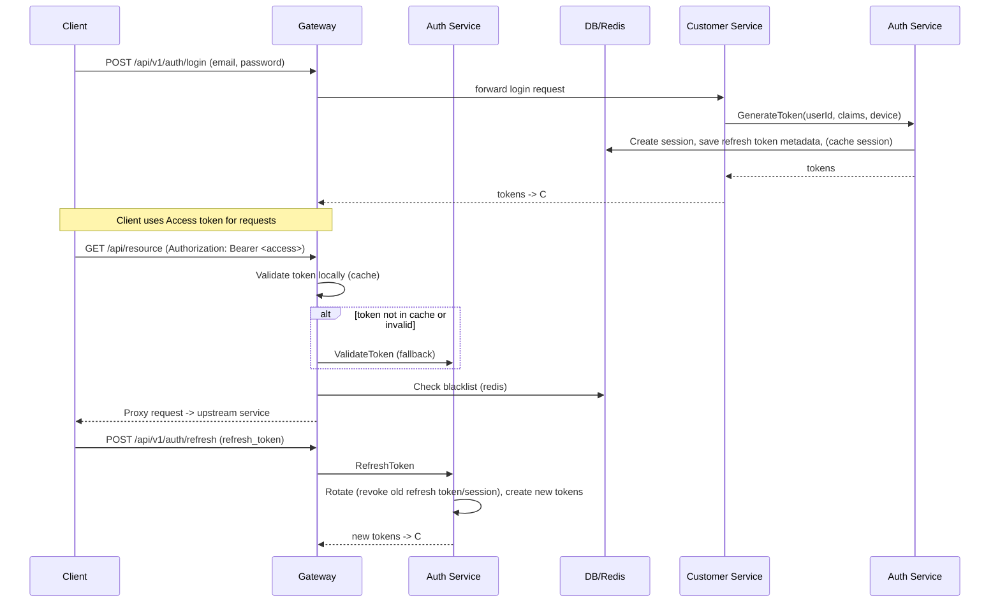

# Authentication Flow (Auth Flow)

## Overview
This document describes the main **authentication flow** of the system (login, token refresh, token revocation, token validation), related components, common failure points and their handling. The content is concise with source code references to help the dev team quickly identify execution locations.

---

## 🧭 Main Components
- **Client**: Browser / Mobile / Service
- **Gateway**: HTTP entrypoint, validates JWT, caches results, checks blacklist
- **Auth Service**: Manages sessions, issues/revokes access & refresh tokens, token rotation, blacklist
- **User/Customer Service**: Registration/login endpoints (delegates token ops to Auth Service)
- **Redis**: Cache (session cache, token blacklist, rate limiter)
- **Postgres**: Persistent storage (user, sessions metadata)

> Code references: 
- `auth/internal/biz/token/token.go` (refresh/rotate/revoke)
- `gateway/internal/router/utils/jwt_validator_wrapper.go` (JWT + blacklist + cache)
- `customer/internal/biz/customer/auth.go` (customer login flow)
- `auth/openapi.yaml` (Auth API)

---

## 🔁 Sequence Diagram (Main Flow)

---

## ✅ Best practices & checks (Implementer checklist)
- [ ] Gateway: **JWT secret** configured via env `JWT_SECRET`.
- [ ] Auth Service: JWT secret prioritizes env `AUTH_JWT_SECRET` (fallback config `cfg.Auth.JWT.Secret`). **Must not use default secret** in production.
- [ ] Gateway: Token cache + blacklist check before accepting token (implemented in `jwt_validator_wrapper.go`)
- [ ] Auth Service: **Refresh token rotation** must revoke old token/session *and* fail the refresh if revoke fails (consider making revoke strict)
- [ ] Auth Service: Publish `token.revoked` events after revoke for eventual consistency
- [ ] Session store: Use Redis for fast checks (cache) with Postgres as source of truth; plan migration if needed
- [ ] Login endpoints: Rate limiting + account lock on repeated failures (implementer should validate configs in `auth` and `customer` services)
- [ ] Add monitoring: JWT validation latency, token rotation failures, blacklist size, cache hit rate

---

## ⚠️ Failure Modes & Mitigations
- Auth Service unavailable → Gateway can still validate JWT locally (using cache). For flows requiring stronger verification, Gateway can fallback to Auth Service validation via HTTP (see `ValidateTokenWithAuthService`).
- Redis/blacklist unavailable → currently Gateway uses **fail-open** for blacklist check: if blacklist check fails, it still continues to validate JWT and allows the request through. Need to monitor metric `JWTBlacklistChecks{error}` and alert when increasing.
- Refresh rotation revoke fails → **fail-closed** (test exists `FailClosedWhenRotationRevokeFails`); refresh request will fail if unable to revoke old token.

---

## 🔍 Troubleshooting quick commands
- Check JWT_SECRET: `docker compose exec auth-service env | grep JWT_SECRET` and `docker compose exec gateway-service env | grep JWT_SECRET`
- Clear token blacklist (emergency): `redis-cli --scan --pattern "jwt:blacklist:*" | xargs redis-cli DEL` (use caution)
- List active sessions (Auth API): `GET /api/v1/auth/sessions/user/{userId}`

> See runbook: `docs/06-operations/runbooks/auth-service-runbook.md` for operational steps.

---

## 💡 Notes & References
- Keep the workflow doc short and link to detailed files (code + runbooks)
- Consider updating `docs/checklists/auth-permission-flow-checklist.md` to align statuses/measures with current code state.

---

_Last updated: 2026-01-18_
