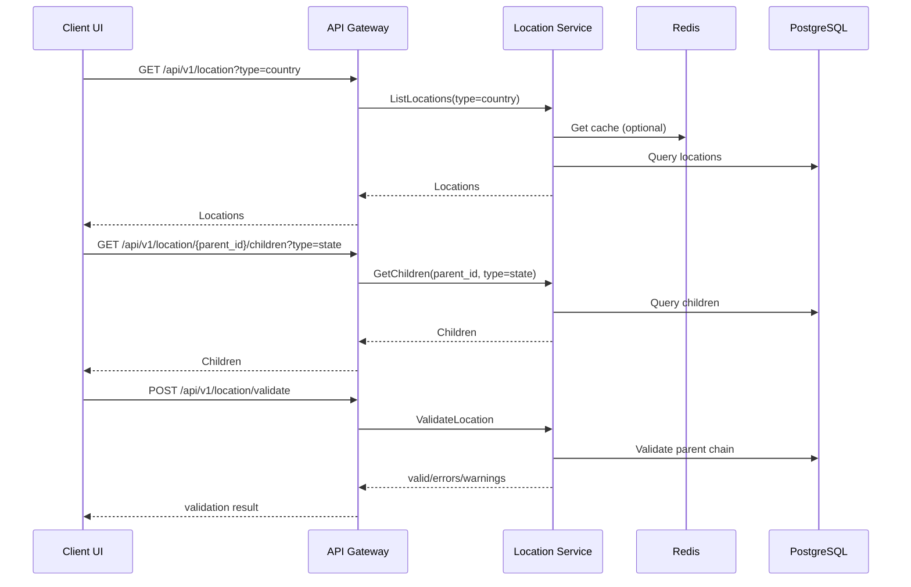

# Location & Address/Zone Flow

**Domain**: Customer
**Service**: Location Service

## Overview
The Location Service manages the geographic hierarchy (country → state → city → district → ward) and supports:
- Address auto-complete and parent-based listing.
- Hierarchy validation.
- Tree/path retrieval for UI and rule engines (shipping/tax/pricing).

## Actors
- Client (Admin/Customer UI)
- API Gateway
- Location Service
- PostgreSQL (location_db)
- Redis (cache)

## Core APIs
- GET /api/v1/location/{id}
- GET /api/v1/location?parent_id=&type=&country_code=
- GET /api/v1/location/tree?root_id=&country_code=
- GET /api/v1/location/{id}/path
- GET /api/v1/location/search?query=
- POST /api/v1/location/validate
- GET /api/v1/location/{parent_id}/children
- GET /api/v1/location/{id}/ancestors

## Diagram

## Flow 1: Address Selection (UI dropdown/autocomplete)
1. Client selects Country → call ListLocations (type=country).
2. Client selects State → call GetChildren (parent_id=country_id, type=state).
3. Client selects City/District/Ward using parent chain.
4. For autocomplete: call SearchLocations with query + country_code.
5. UI can call GetLocationPath to render breadcrumbs.

## Flow 2: Address Validation (Checkout/Customer Profile)
1. Client submits address (code/id) to ValidateLocation.
2. Service checks required fields, type, level, and parent relationship.
3. Response includes valid + errors/warnings.

## Flow 3: Zone Resolution (Shipping/Tax/Pricing)
1. Service calls GetLocationPath or GetAncestors to retrieve the hierarchy.
2. Rule engine maps zones by level (city/district/ward).
3. For full country tree: call GetLocationTree (country_code).

## Flow 4: Admin Update (Create/Update Location)
1. Admin service calls internal usecase CreateLocation/UpdateLocation.
2. Validate + persist DB in a transaction.
3. Write outbox event (location.created / location.updated).
4. Invalidate per-location cache.

## Caching
- Read-through cache for GetLocation.
- Tree cache for GetLocationTree (active tree only).
- Cache TTL: 24h.

## Events
- Outbox event on Create/Update for downstream sync/search.

## Error Handling
- Input validation at usecase.
- Invalid parent relationship returns validation errors.

## Observability
- Logs at service layer.
- Health endpoint: /api/v1/location/health.
