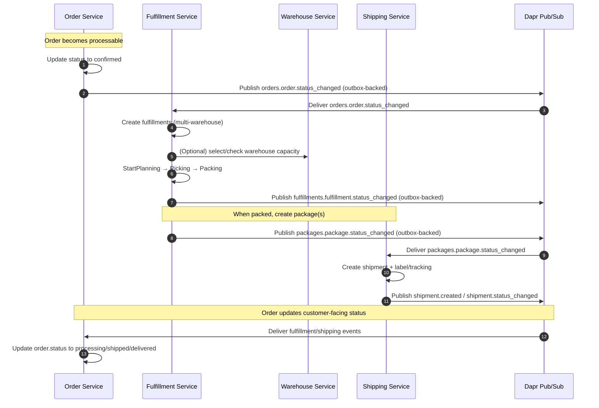
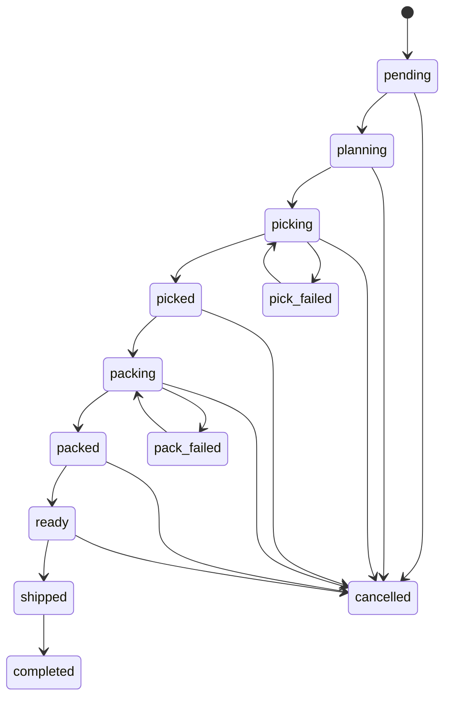

# 🚚 Order → Fulfillment → Shipping Flow

**Last Updated**: January 30, 2026  
**Scope**: Order, Fulfillment, Shipping, Warehouse (event-driven + outbox)  

This document describes the end-to-end fulfillment flow as implemented today: when an Order reaches a “processable” state, Fulfillment creates warehouse work (pick/pack), emits status events, Shipping reacts to packages and emits shipment events, and Order updates customer-facing status.

If you want the open problems / gaps, keep them in the checklist: [docs/10-appendix/checklists/order_fufillment_issues.md](../../10-appendix/checklists/order_fufillment_issues.md)

---

## Event Topics (Observed)

- Order → downstream: `orders.order.status_changed` (published by Order)
- Fulfillment → downstream: `fulfillments.fulfillment.status_changed` (published by Fulfillment)
- Fulfillment → downstream: `packages.package.status_changed` (published by Fulfillment)
- Shipping → downstream: shipment lifecycle events (published by Shipping outbox; e.g. `shipment.created`, `shipment.status_changed`, `shipment.delivered`)

---

## High-Level Sequence

---

## Step-by-Step Flow

### 1) Order confirmed → publish `orders.order.status_changed`

- Trigger: Order transitions to `confirmed` (online payment confirmed, or COD auto-confirm flow).
- Action: Order publishes one unified event: `orders.order.status_changed`.

Code map:
- [Order publishes order status events](../..//order/internal/biz/order/events.go)
- [Order publishes order status events](../../order/internal/biz/order/events.go)
- [Order event publisher (topic: orders.order.status_changed)](../../order/internal/events/publisher.go)
- [Order constants (topics)](../../order/internal/constants/constants.go)

### 2) Fulfillment consumes `orders.order.status_changed` → create fulfillment(s)

- Trigger: Fulfillment receives `orders.order.status_changed` where `new_status == confirmed`.
- Action:
  - Create one fulfillment per warehouse (multi-warehouse supported).
  - Immediately call `StartPlanning()` for each fulfillment.

Code map:
- [Fulfillment consumes order_status_changed](../../fulfillment/internal/data/eventbus/order_status_consumer.go)
- [Observer → Biz delegation](../../fulfillment/internal/observer/order_status_changed/fulfillment_sub.go)
- [Biz: order status handler](../../fulfillment/internal/biz/fulfillment/order_status_handler.go)
- [Biz: CreateFromOrderMulti (multi-warehouse)](../../fulfillment/internal/biz/fulfillment/fulfillment.go)

### 3) Fulfillment lifecycle (pick/pack) → publish `fulfillments.fulfillment.status_changed`

Fulfillment state machine (see also the source of truth in constants):

Every successful transition publishes a unified status event for downstream consumers.

Code map:
- [Fulfillment status transitions (source of truth)](../../fulfillment/internal/constants/fulfillment_status.go)
- [Fulfillment event topics/types](../../fulfillment/internal/constants/event_topics.go)
- [Biz: publishes fulfillment status changed](../../fulfillment/internal/biz/fulfillment/fulfillment.go)
- [Outbox-backed publisher (writes to outbox)](../../fulfillment/internal/events/outbox_publisher.go)
- [Outbox worker (publishes to Dapr pub/sub)](../../fulfillment/internal/worker/outbox/outbox_worker.go)

### 4) Packed → publish `packages.package.status_changed` → Shipping reacts

- Trigger: Fulfillment creates/updates packages as part of pack/ready-to-ship stages.
- Action: Fulfillment publishes `packages.package.status_changed` (package status lifecycle: created/labeled/ready/shipped/cancelled).
- Shipping consumes package events and creates/updates shipment records.

Code map:
- [Fulfillment publishes package status changed](../../fulfillment/internal/events/publisher.go)
- [Shipping consumes packages.package.status_changed](../../shipping/internal/data/eventbus/package_status_consumer.go)
- [Shipping outbox helpers for shipment events](../../shipping/internal/biz/shipment/outbox_helpers.go)

### 5) Order status tracking (processing → shipped → delivered)

Order can update its customer-facing status based on:
- Fulfillment status events (e.g. planning/picking/packed/ready → processing; shipped → shipped)
- Shipping delivery confirmation events (delivered)

Code map:
- [Order HTTP event handler (shipment + delivery + fulfillment)](../../order/internal/service/event_handler.go)
- [Order worker consumer (fulfillment.status_changed mapping)](../../order/internal/data/eventbus/fulfillment_consumer.go)

---

## Notes on Outbox Pattern

- Fulfillment uses an outbox-backed `EventPublisher` that persists event payloads to the outbox table; a worker publishes them to Dapr pub/sub.
- Shipping uses an outbox table for shipment events as well.

