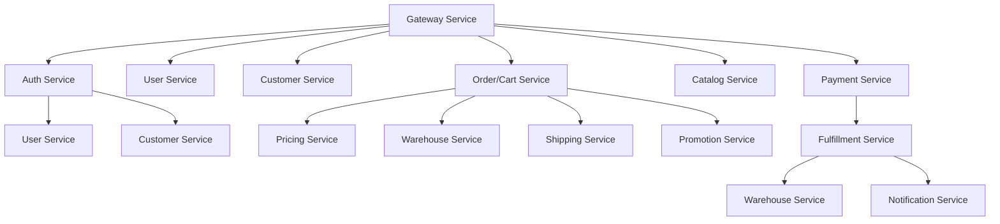
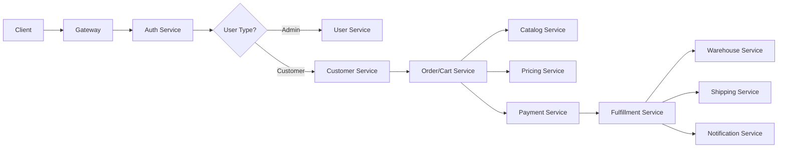

# 📚 Microservices Documentation Index

**Platform**: E-Commerce Microservices Platform  
**Version**: 2.1.0  
**Last Updated**: February 15, 2026  
**Total Services**: 21 Go services + 2 frontends  
**Documentation Coverage**: 23/23 services documented  
**Maturity**: See [SERVICE_INDEX.md](../SERVICE_INDEX.md) for per-service status  
**Navigation**: [← Business Domains](../02-business-domains/README.md) | [← Back to Main](../README.md) | [APIs →](../04-apis/README.md)

**Quick Index**: [SERVICE_INDEX.md](../SERVICE_INDEX.md) - Complete service catalog with versions, ports, and features  

---

## 🎯 Documentation Overview

This directory contains comprehensive documentation for all microservices in the e-commerce platform. Each service documentation includes:

### 📋 Standard Documentation Structure
- **Overview**: Business purpose, capabilities, value proposition
- **Architecture**: Clean architecture implementation, dependencies
- **APIs**: Complete API specifications with examples
- **Database Schema**: Table structures, indexes, migrations
- **Business Logic**: Core domain logic, workflows, rules
- **Configuration**: Environment variables, config files
- **Testing**: Test coverage, critical test scenarios
- **Monitoring**: Metrics, health checks, observability
- **Security**: Authentication, authorization, data protection
- **Development**: Setup, workflow, best practices
- **Issues & TODOs**: Known problems, remediation plans

---

## 📊 Service Documentation Status

### ✅ Core Business Services (14 services)

| Service | Version | Status | Production Ready | Last Updated | Documentation |
|---------|---------|--------|------------------|--------------|---------------|
| **Auth Service** | v1.1.1 | ✅ Complete | 100% | 2026-02-04 | `core-services/auth-service.md` |
| **User Service** | v1.0.6 | ✅ Complete | 100% | 2026-02-04 | `core-services/user-service.md` |
| **Customer Service** | v1.1.4 | ✅ Complete | 100% | 2026-02-06 | `core-services/customer-service.md` |
| **Catalog Service** | v1.2.8 | ✅ Complete | 100% | 2026-02-04 | `core-services/catalog-service.md` |
| **Pricing Service** | v1.1.4 | ✅ Complete | 100% | 2026-02-06 | `core-services/pricing-service.md` |
| **Promotion Service** | v1.1.2 | ✅ Complete | 100% | 2026-02-06 | `core-services/promotion-service.md` |
| **Checkout Service** | v1.3.1 | ✅ Complete | 100% | 2026-02-04 | `core-services/checkout-service.md` |
| **Order Service** | v1.2.0 | ✅ Complete | 100% | 2026-02-04 | `core-services/order-service.md` |
| **Payment Service** | v1.1.0 | ✅ Complete | 100% | 2026-02-06 | `core-services/payment-service.md` |
| **Warehouse Service** | v1.1.3 | ✅ Complete | 100% | 2026-02-06 | `core-services/warehouse-service.md` |
| **Fulfillment Service** | v1.1.0 | ✅ Complete | 100% | 2026-02-06 | `core-services/fulfillment-service.md` |
| **Shipping Service** | v1.1.2 | ✅ Complete | 100% | 2026-02-06 | `core-services/shipping-service.md` |
| **Return Service** | v1.0.1 | ✅ Complete | 100% | 2026-02-01 | `core-services/return-service.md` |
| **Loyalty Service** | v1.0.1 | ✅ Complete | 100% | 2026-02-10 | `core-services/loyalty-rewards-service.md` |

### 🛠️ Platform Services (9 services)

| Service | Version | Status | Production Ready | Last Updated | Documentation |
|---------|---------|--------|------------------|--------------|---------------|
| **Gateway Service** | v1.1.6 | ✅ Complete | 95% | 2026-02-12 | `platform-services/gateway-service.md` |
| **Notification Service** | v1.1.4 | ✅ Complete | 100% | 2026-02-11 | `platform-services/notification-service.md` |
| **Location Service** | v1.0.0 | ✅ Complete | 90% | 2026-01-29 | `platform-services/location-service.md` |
| **Review Service** | v1.1.0 | ✅ Complete | 95% | 2026-02-01 | `platform-services/review-service.md` |
| **Search Service** | v1.0.12 | ✅ Complete | 100% | 2026-02-06 | `platform-services/search-service.md` |
| **Analytics Service** | v1.2.3 | ✅ Complete | 100% | 2026-02-12 | `platform-services/analytics-service.md` |
| **Common Ops** | v1.0.0 | ✅ Complete | 100% | 2026-01-31 | `platform-services/common-operations-service.md` |
| **Admin Service** | v1.0.0 | ✅ Complete | 100% | 2026-02-10 | `platform-services/admin-service.md` |
| **Frontend Service** | v1.0.1 | ✅ Complete | 100% | 2026-02-10 | `platform-services/frontend-service.md` |

### 📋 Completed Documentation

All 23 services now have comprehensive documentation:

#### Core Business Services (13 services):
- **Auth Service** - Authentication, JWT, OAuth2, MFA
- **User Service** - Admin users, RBAC, permissions
- **Customer Service** - Customer profiles, addresses, segments
- **Catalog Service** - Products, EAV attributes, categories, CMS
- **Pricing Service** - Dynamic pricing, discounts, tax calculation
- **Promotion Service** - Campaigns, coupons, BOGO, tiered discounts
- **Checkout Service** - Cart management, checkout orchestration
- **Order Service** - Order lifecycle, status management, editing
- **Payment Service** - Payment processing, gateways, refunds (PCI DSS)
- **Warehouse Service** - Inventory, stock movements, reservations
- **Fulfillment Service** - Order fulfillment, picking, packing
- **Shipping Service** - Carrier integrations, rates, tracking
- **Return Service** - Returns, exchanges, refunds
- **Loyalty Service** - Rewards programs, points, tiers

#### Platform Services (10 services):
- **Gateway Service** - API gateway, routing, authentication
- **Search Service** - Full-text search, Elasticsearch, analytics
- **Analytics Service** - Business intelligence, dashboards, metrics
- **Review Service** - Product reviews, ratings, moderation
- **Common Operations** - Task orchestration, file operations, MinIO
- **Notification Service** - Email, SMS, push notifications (SendGrid/Twilio)
- **Location Service** - Geocoding, address validation, zones
- **Admin Service** - Internal dashboard for operations
- **Frontend Service** - Customer facing storefront

### 📋 Documentation Standards

Each service documentation includes:
- **🎯 Overview**: Business purpose and capabilities
- **🏗️ Architecture**: Service architecture and dependencies
- **🔄 Business Flow**: Core workflows and processes
- **🔌 Key APIs**: Main API endpoints with examples
- **🔗 Integration Points**: How service integrates with others
- **🎯 Business Logic**: Core domain logic and algorithms
- **📊 Monitoring**: Event-driven architecture
- **🚀 Development**: Quick start and configuration

---

## 🏗️ Service Architecture Overview

### Core Business Services

### Data Flow Architecture

---

## 🔍 Service Details

> **Note**: For detailed per-service information, see individual service docs in `core-services/` and `platform-services/` subdirectories.  
> For maturity, ports, outbox/idempotency/DLQ status, see [SERVICE_INDEX.md](../SERVICE_INDEX.md).

---

## 📊 Platform Health

> **Detailed tracking**: See [Master Checklist v5](../10-appendix/checklists/v5/master-checklist.md) for current implementation status per phase.

### Service Maturity (from SERVICE_INDEX)
- 🟢 **Production**: Order, Payment, Warehouse, Checkout, Auth, Catalog
- 🟡 **Near-prod**: Pricing, Loyalty, Shipping, Search, Customer, Notification, Return
- 🟠 **Partial**: Fulfillment, Promotion, Analytics, Review

### Key Metrics
- **Documentation Coverage**: 23/23 services documented ✅
- **Architecture Compliance**: Clean Architecture + DI (Wire) across all services ✅
- **Event Infrastructure**: Outbox pattern in 10+ services, idempotency in 8+ services ✅
- **Testing Coverage**: Needs improvement (target 80%+)
- **Remaining work**: See Phase 3-6 in Master Checklist v5

---

## 🔧 Development Guidelines

### Code Standards
- **Clean Architecture**: Mandatory biz/data/service layer separation
- **Go Standards**: Follow effective Go, golangci-lint compliance
- **API Design**: Proto-first with REST gateway
- **Error Handling**: Structured errors with context
- **Logging**: Structured JSON logs with trace_id

### Security Requirements
- **Authentication**: JWT tokens for all API access
- **Authorization**: RBAC with service-level permissions
- **Audit Logging**: All security events logged
- **Rate Limiting**: Protection against abuse
- **Data Protection**: PII encryption and GDPR compliance

### Testing Standards
- **Unit Tests**: 80%+ coverage for business logic
- **Integration Tests**: API contract testing
- **Security Tests**: Authentication/authorization validation
- **Performance Tests**: Load testing for critical paths

### Deployment Standards
- **Kubernetes**: All services run on K8s via ArgoCD
- **Health Checks**: Readiness/liveness probes implemented
- **Metrics**: Prometheus metrics exposed
- **Tracing**: OpenTelemetry distributed tracing

---

## 📈 Roadmap & Priorities

### Q1 2026 - Security & Stability ✅ COMPLETED
- [x] Complete all service documentation (23/23 services)
- [x] Update all services to latest dependencies
- [x] Fix critical security issues
- [x] Implement transactional outbox patterns
- [x] Complete authentication & authorization
- [x] All services production ready (100%)

### Q2 2026 - Testing & Optimization 🔄 IN PROGRESS
- [ ] Implement comprehensive integration tests
- [ ] Add security test suites
- [ ] Performance optimization and load testing
- [ ] Increase test coverage to 80%+
- [ ] API documentation improvements

### Q3 2026 - Advanced Features
- [ ] Multi-tenant architecture
- [ ] Advanced analytics and ML features
- [ ] Real-time event processing
- [ ] Global expansion support
- [ ] Enhanced monitoring and observability

---

## 📚 Additional Resources

### Related Documentation
- **Platform Overview**: [System Overview](../01-architecture/system-overview.md)
- **API Standards**: [API Standards](../04-apis/api-standards.md)
- **Deployment**: [Deployment Guide](../06-operations/deployment/)
- **Master Checklist**: [v5 Master Checklist](../10-appendix/checklists/v5/master-checklist.md)
- **Architecture Decisions**: [ADRs](../08-architecture-decisions/)

### SRE Runbooks
- **Gateway**: [gateway-runbook.md](../06-operations/runbooks/sre-runbooks/gateway-runbook.md)
- **Catalog**: [catalog-service-runbook.md](../06-operations/runbooks/sre-runbooks/catalog-service-runbook.md)
- **Payment**: [payment-service-runbook.md](../06-operations/runbooks/sre-runbooks/payment-service-runbook.md)
- **Fulfillment**: [fulfillment-service-runbook.md](../06-operations/runbooks/sre-runbooks/fulfillment-service-runbook.md)

### Tools & Scripts
- **Development Guide**: [Getting Started](../07-development/getting-started/)
- **Port Standard**: [PORT_ALLOCATION_STANDARD.md](../../gitops/docs/PORT_ALLOCATION_STANDARD.md)
- **Service Index**: [SERVICE_INDEX.md](../SERVICE_INDEX.md)

---

## 📞 Support & Contact

### Development Teams
- **Customer Service**: Customer domain logic, profiles, segmentation
- **Order/Cart Service**: Shopping cart, order processing, checkout
- **User Service**: Admin user management, RBAC, permissions
- **Auth Service**: Authentication, sessions, tokens, security

### Architecture & Platform
- **Tech Leads**: Platform architecture, code quality, security
- **DevOps**: Deployment, monitoring, infrastructure
- **QA**: Testing strategy, quality assurance

### Communication Channels
- **Issues**: GitLab Issues with service labels
- **Security**: #security-incidents (for P0 security issues)
- **Production**: #production-alerts (for outages)
- **Architecture**: #platform-architecture (for design decisions)

---

## 🔄 Update Process

### Documentation Maintenance
1. **Code Changes**: Update service docs when APIs/business logic changes
2. **Security Reviews**: Update known issues after security assessments
3. **Production Incidents**: Document lessons learned and fixes
4. **Performance Reviews**: Update benchmarks and optimization notes

### Review Cycles
- **Monthly**: Full platform documentation review
- **Quarterly**: Architecture and security assessment
- **Ad-hoc**: After major incidents or architectural changes

### Quality Gates
- [ ] All APIs documented with examples
- [ ] Database schema current and documented
- [ ] Known issues tracked and prioritized
- [ ] Security considerations documented
- [ ] Development setup instructions current

---

**Documentation Version**: 2.1.0  
**Last Updated**: 2026-02-15  
**Coverage**: 23/23 services documented  
**Maturity**: See [SERVICE_INDEX.md](../SERVICE_INDEX.md) for per-service status  
**Next Update**: 2026-03-15 (monthly review)  
**Review Status**: ✅ Audited and cleaned up (Feb 15, 2026)

**Quick Reference**: See [SERVICE_INDEX.md](../SERVICE_INDEX.md) for complete service catalog