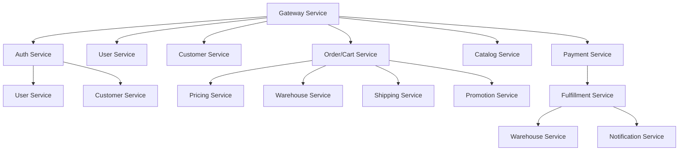
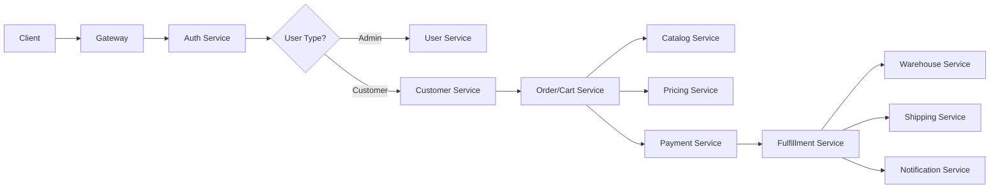

# 📚 Microservices Documentation Index

- **Platform**: E-Commerce Microservices Platform
- **Version**: 2.2.0
- **Last Updated**: March 2, 2026
- **Total Services**: 21 Go services + 2 frontends
- **Documentation Coverage**: 23/23 services documented
- **Maturity Source of Truth**: [SERVICE_INDEX.md](../SERVICE_INDEX.md)
- **Navigation**: [← Business Domains](../02-business-domains/README.md) | [← Back to Main](../README.md) | [APIs →](../04-apis/README.md)
- **Quick Index**: [SERVICE_INDEX.md](../SERVICE_INDEX.md) - Complete service catalog with versions, ports, and features

---

> [!IMPORTANT]
> This page is the documentation index for service guides. For current service maturity, ports, and versions, use [SERVICE_INDEX.md](../SERVICE_INDEX.md). For repository orientation, use [CODEBASE_INDEX.md](../CODEBASE_INDEX.md). For deployment/runtime state, use [../../gitops/README.md](../../gitops/README.md) and the [GitOps review checklist](../10-appendix/checklists/gitops/review_checklist.md).

---

## 🎯 Documentation Overview

This directory contains comprehensive documentation for all microservices in the e-commerce platform. Each service documentation includes:

### 📋 Standard Documentation Structure
- **Overview**: Business purpose, capabilities, value proposition
- **Architecture**: Clean architecture implementation, dependencies
- **APIs**: Complete API specifications with examples
- **Database Schema**: Table structures, indexes, migrations
- **Business Logic**: Core domain logic, workflows, rules
- **Configuration**: Environment variables, config files
- **Testing**: Test coverage, critical test scenarios
- **Monitoring**: Metrics, health checks, observability
- **Security**: Authentication, authorization, data protection
- **Development**: Setup, workflow, best practices
- **Issues & TODOs**: Known problems, remediation plans

---

## 📊 Documentation Status

This directory contains service guides for all 23 deployable services in the repository.

- **Documentation coverage**: 23/23 service guides present
- **Per-service maturity, versions, and ports**: [SERVICE_INDEX.md](../SERVICE_INDEX.md)
- **Codebase map and ownership orientation**: [CODEBASE_INDEX.md](../CODEBASE_INDEX.md)
- **Deployment/runtime status**: [../../gitops/README.md](../../gitops/README.md) and [GitOps review checklist](../10-appendix/checklists/gitops/review_checklist.md)

The lists below group service documentation by domain. They are not the source of truth for rollout readiness.

### 📋 Completed Documentation

All 23 services now have comprehensive documentation:

#### Core Business Services (14 services):
- **Auth Service** - Authentication, JWT, OAuth2, MFA
- **User Service** - Admin users, RBAC, permissions
- **Customer Service** - Customer profiles, addresses, segments
- **Catalog Service** - Products, EAV attributes, categories, CMS
- **Pricing Service** - Dynamic pricing, discounts, tax calculation
- **Promotion Service** - Campaigns, coupons, BOGO, tiered discounts
- **Checkout Service** - Cart management, checkout orchestration
- **Order Service** - Order lifecycle, status management, editing
- **Payment Service** - Payment processing, gateways, refunds (PCI DSS)
- **Warehouse Service** - Inventory, stock movements, reservations
- **Fulfillment Service** - Order fulfillment, picking, packing
- **Shipping Service** - Carrier integrations, rates, tracking
- **Return Service** - Returns, exchanges, refunds
- **Loyalty Service** - Rewards programs, points, tiers

#### Platform Services (9 services):
- **Gateway Service** - API gateway, routing, authentication
- **Search Service** - Full-text search, Elasticsearch, analytics
- **Analytics Service** - Business intelligence, dashboards, metrics
- **Review Service** - Product reviews, ratings, moderation
- **Common Operations** - Task orchestration, file operations, MinIO
- **Notification Service** - Email, SMS, push notifications (SendGrid/Twilio)
- **Location Service** - Geocoding, address validation, zones
- **Admin Service** - Internal dashboard for operations
- **Frontend Service** - Customer facing storefront

### 📋 Documentation Standards

Each service documentation includes:
- **🎯 Overview**: Business purpose and capabilities
- **🏗️ Architecture**: Service architecture and dependencies
- **🔄 Business Flow**: Core workflows and processes
- **🔌 Key APIs**: Main API endpoints with examples
- **🔗 Integration Points**: How service integrates with others
- **🎯 Business Logic**: Core domain logic and algorithms
- **📊 Monitoring**: Event-driven architecture
- **🚀 Development**: Quick start and configuration

---

## 🏗️ Service Architecture Overview

### Core Business Services

```mermaid
graph TB
    A[Gateway Service] --> B[Auth Service]
    A --> C[User Service]
    A --> D[Customer Service]
    A --> E[Order/Cart Service]
    A --> F[Catalog Service]
    A --> G[Payment Service]

    B --> H[User Service]
    B --> I[Customer Service]

    E --> J[Pricing Service]
    E --> K[Warehouse Service]
    E --> L[Shipping Service]
    E --> M[Promotion Service]

    G --> N[Fulfillment Service]
    N --> O[Warehouse Service]
    N --> P[Notification Service]
```

### Data Flow Architecture

```mermaid
graph LR
    A[Client] --> B[Gateway]
    B --> C[Auth Service]
    C --> D{User Type?}
    D -->|Admin| E[User Service]
    D -->|Customer| F[Customer Service]

    F --> G[Order/Cart Service]
    G --> H[Catalog Service]
    G --> I[Pricing Service]
    G --> J[Payment Service]

    J --> K[Fulfillment Service]
    K --> L[Warehouse Service]
    K --> M[Shipping Service]
    K --> N[Notification Service]
```

---

## 🔍 Service Details

> **Note**: For detailed per-service information, see individual service docs in `core-services/` and `platform-services/` subdirectories.  
> For maturity, ports, outbox/idempotency/DLQ status, see [SERVICE_INDEX.md](../SERVICE_INDEX.md).

---

## 📊 Platform Health

### Canonical Status References
- **Service maturity, ports, versions**: [SERVICE_INDEX.md](../SERVICE_INDEX.md)
- **Repository architecture and code map**: [CODEBASE_INDEX.md](../CODEBASE_INDEX.md)
- **Deployment/runtime state**: [../../gitops/README.md](../../gitops/README.md)
- **Active GitOps findings**: [GitOps review checklist](../10-appendix/checklists/gitops/review_checklist.md)

### Documentation Metrics
- **Documentation Coverage**: 23/23 services documented ✅
- **Architecture Compliance**: Clean Architecture + DI (Wire) across all services ✅
- **Event Infrastructure**: Outbox pattern in 10+ services, idempotency in 8+ services ✅
- **Testing Coverage**: Needs improvement (target 80%+)

---

## 🔧 Development Guidelines

### Code Standards
- **Clean Architecture**: Mandatory biz/data/service layer separation
- **Go Standards**: Follow effective Go, golangci-lint compliance
- **API Design**: Proto-first with REST gateway
- **Error Handling**: Structured errors with context
- **Logging**: Structured JSON logs with trace_id

### Security Requirements
- **Authentication**: JWT tokens for all API access
- **Authorization**: RBAC with service-level permissions
- **Audit Logging**: All security events logged
- **Rate Limiting**: Protection against abuse
- **Data Protection**: PII encryption and GDPR compliance

### Testing Standards
- **Unit Tests**: 80%+ coverage for business logic
- **Integration Tests**: API contract testing
- **Security Tests**: Authentication/authorization validation
- **Performance Tests**: Load testing for critical paths

### Deployment Standards
- **Kubernetes**: All services run on K8s via ArgoCD
- **Health Checks**: Readiness/liveness probes implemented
- **Metrics**: Prometheus metrics exposed
- **Tracing**: OpenTelemetry distributed tracing

---

## 📈 Roadmap & Priorities

### Q1 2026 - Security & Stability ✅ COMPLETED
- [x] Complete all service documentation (23/23 services)
- [x] Update all services to latest dependencies
- [x] Fix critical security issues
- [x] Implement transactional outbox patterns
- [x] Complete authentication & authorization
- [x] Align landing-page status reporting to [SERVICE_INDEX.md](../SERVICE_INDEX.md)

### Q2 2026 - Testing & Optimization 🔄 IN PROGRESS
- [ ] Implement comprehensive integration tests
- [ ] Add security test suites
- [ ] Performance optimization and load testing
- [ ] Increase test coverage to 80%+
- [ ] API documentation improvements

### Q3 2026 - Advanced Features
- [ ] Multi-tenant architecture
- [ ] Advanced analytics and ML features
- [ ] Real-time event processing
- [ ] Global expansion support
- [ ] Enhanced monitoring and observability

---

## 📚 Additional Resources

### Related Documentation
- **Platform Overview**: [System Overview](../01-architecture/system-overview.md)
- **API Standards**: [API Standards](../04-apis/api-standards.md)
- **Deployment**: [Deployment Guide](../06-operations/deployment/)
- **Architecture Decisions**: [ADRs](../08-architecture-decisions/)

### SRE Runbooks
- **Gateway**: [gateway-runbook.md](../06-operations/runbooks/sre-runbooks/gateway-runbook.md)
- **Catalog**: [catalog-service-runbook.md](../06-operations/runbooks/sre-runbooks/catalog-service-runbook.md)
- **Payment**: [payment-service-runbook.md](../06-operations/runbooks/sre-runbooks/payment-service-runbook.md)
- **Fulfillment**: [fulfillment-service-runbook.md](../06-operations/runbooks/sre-runbooks/fulfillment-service-runbook.md)

### Tools & Scripts
- **Development Guide**: [Getting Started](../07-development/getting-started/)
- **Port Standard**: [PORT_ALLOCATION_STANDARD.md](../../gitops/docs/PORT_ALLOCATION_STANDARD.md)
- **Service Index**: [SERVICE_INDEX.md](../SERVICE_INDEX.md)

---

## 📞 Support & Contact

### Development Teams
- **Customer Service**: Customer domain logic, profiles, segmentation
- **Order/Cart Service**: Shopping cart, order processing, checkout
- **User Service**: Admin user management, RBAC, permissions
- **Auth Service**: Authentication, sessions, tokens, security

### Architecture & Platform
- **Tech Leads**: Platform architecture, code quality, security
- **DevOps**: Deployment, monitoring, infrastructure
- **QA**: Testing strategy, quality assurance

### Communication Channels
- **Issues**: GitLab Issues with service labels
- **Security**: #security-incidents (for P0 security issues)
- **Production**: #production-alerts (for outages)
- **Architecture**: #platform-architecture (for design decisions)

---

## 🔄 Update Process

### Documentation Maintenance
1. **Code Changes**: Update service docs when APIs/business logic changes
2. **Security Reviews**: Update known issues after security assessments
3. **Production Incidents**: Document lessons learned and fixes
4. **Performance Reviews**: Update benchmarks and optimization notes

### Review Cycles
- **Monthly**: Full platform documentation review
- **Quarterly**: Architecture and security assessment
- **Ad-hoc**: After major incidents or architectural changes

### Quality Gates
- [ ] All APIs documented with examples
- [ ] Database schema current and documented
- [ ] Known issues tracked and prioritized
- [ ] Security considerations documented
- [ ] Development setup instructions current

---

**Documentation Version**: 2.2.0  
**Last Updated**: 2026-03-02  
**Coverage**: 23/23 services documented  
**Maturity**: All services production-ready — see [SERVICE_INDEX.md](../SERVICE_INDEX.md)  
**Review Status**: ✅ Audited and cleaned up (March 2, 2026)

**Quick Reference**: See [SERVICE_INDEX.md](../SERVICE_INDEX.md) for complete service catalog
