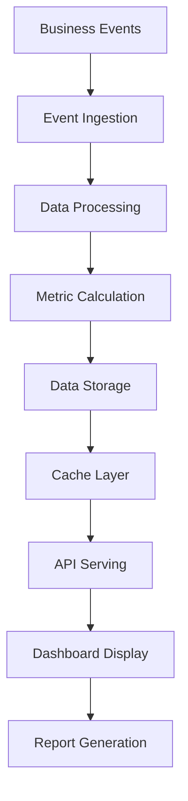

# 📊 Analytics Service - Business Intelligence & Reporting

**Service Name**: Analytics Service  
**Version**: 1.0.0  
**Last Updated**: 2026-01-22  
**Production Ready**: 85%  

---

## 🎯 Overview

Analytics Service cung cấp business intelligence và reporting cho toàn bộ e-commerce platform. Service này aggregate data từ tất cả microservices để tạo insights và dashboards cho business decisions.

### Core Capabilities
- **📈 Real-Time Dashboards**: Live business metrics và KPIs
- **📊 Advanced Analytics**: Customer behavior, sales trends, performance analytics
- **🎯 Customer Insights**: Segmentation, lifetime value, churn analysis
- **💰 Revenue Analytics**: Sales performance, margin analysis, forecasting
- **📦 Inventory Analytics**: Stock turnover, demand forecasting
- **🚀 A/B Testing**: Experiment tracking và statistical analysis
- **📤 Data Export**: Scheduled reports và data exports
- **🔄 Event Processing**: Real-time event aggregation và processing

### Business Value
- **Data-Driven Decisions**: Evidence-based business strategy
- **Performance Monitoring**: Real-time business health monitoring
- **Customer Understanding**: Deep insights into customer behavior
- **Operational Optimization**: Identify bottlenecks và opportunities
- **Revenue Growth**: Optimize pricing và marketing strategies

---

## 🏗️ Architecture

### Service Architecture
```
analytics/
├── cmd/server/                  # Main analytics server
├── internal/
│   ├── domain/                  # Domain models & business logic
│   │   ├── customer/           # Customer analytics domain
│   │   ├── sales/              # Sales analytics domain
│   │   ├── product/            # Product performance domain
│   │   ├── inventory/          # Inventory analytics domain
│   │   └── experiment/         # A/B testing domain
│   ├── usecase/                 # Application use cases
│   │   ├── dashboard/          # Dashboard data aggregation
│   │   ├── reporting/          # Report generation
│   │   ├── alerting/           # Alert management
│   │   └── export/             # Data export functionality
│   ├── repository/              # Data access layer
│   │   ├── postgres/           # PostgreSQL repositories
│   │   └── redis/              # Redis caching
│   ├── infrastructure/          # Infrastructure layer
│   │   ├── database/           # Database connections
│   │   ├── redis/              # Redis connections
│   │   ├── eventbus/           # Event processing
│   │   └── storage/            # File storage for exports
│   ├── handler/                 # HTTP handlers
│   │   ├── dashboard.go        # Dashboard endpoints
│   │   ├── reports.go          # Report endpoints
│   │   ├── metrics.go          # Metrics endpoints
│   │   └── health.go           # Health check
│   ├── config/                  # Configuration
│   └── pkg/                     # Shared packages
├── migrations/                   # Database schema
└── configs/                      # Configuration files
```

### Ports & Dependencies
- **HTTP API**: `:8014` - REST endpoints cho dashboards và reports
- **gRPC API**: `:9014` - Internal communication
- **Database**: PostgreSQL (`analytics_db`) + ClickHouse (future)
- **Cache**: Redis for real-time metrics
- **Storage**: S3/MinIO for report exports

---

## 🔄 Business Flow

### Analytics Data Pipeline



### Detailed Analytics Process

#### 1. Event Ingestion & Processing
```
Microservice Events → Analytics Service
├── Receive events from all services (order, customer, payment, etc.)
├── Validate event schema and data integrity
├── Enrich events with additional context
├── Route events to appropriate processing pipelines
└── Store raw events for audit trail
```

#### 2. Real-Time Metric Calculation
```
Processed Events → Real-Time Metrics
├── Update in-memory counters and gauges
├── Calculate rolling averages and trends
├── Trigger alerts for threshold breaches
├── Update Redis cache for fast access
└── Publish metric updates to dashboards
```

#### 3. Batch Analytics Processing
```
Raw Events → Batch Processing
├── Aggregate events by time windows (hourly, daily, weekly)
├── Calculate complex metrics (cohort analysis, lifetime value)
├── Generate predictive analytics and forecasts
├── Update materialized views for fast queries
└── Generate scheduled reports
```

#### 4. Dashboard & Reporting
```
Calculated Metrics → User Interfaces
├── Serve real-time dashboard data via APIs
├── Generate on-demand reports and exports
├── Support ad-hoc queries and custom analytics
├── Provide data export capabilities
└── Enable self-service analytics for business users
```

---

## 🔌 Key APIs

### Dashboard APIs
```protobuf
// Get dashboard overview
rpc GetDashboardOverview(GetDashboardOverviewRequest) returns (DashboardOverview) {
  option (google.api.http) = {
    get: "/api/v1/analytics/dashboard/overview"
  };
}

// Get sales metrics
rpc GetSalesMetrics(GetSalesMetricsRequest) returns (SalesMetrics) {
  option (google.api.http) = {
    get: "/api/v1/analytics/sales/metrics"
  };
}

// Get customer analytics
rpc GetCustomerAnalytics(GetCustomerAnalyticsRequest) returns (CustomerAnalytics) {
  option (google.api.http) = {
    get: "/api/v1/analytics/customers"
  };
}
```

### Reporting APIs
```protobuf
// Generate sales report
rpc GenerateSalesReport(GenerateSalesReportRequest) returns (ReportResult) {
  option (google.api.http) = {
    post: "/api/v1/analytics/reports/sales"
    body: "*"
  };
}

// Export customer data
rpc ExportCustomerData(ExportCustomerDataRequest) returns (ExportResult) {
  option (google.api.http) = {
    post: "/api/v1/analytics/export/customers"
    body: "*"
  };
}

// Get real-time metrics
rpc GetRealTimeMetrics(GetRealTimeMetricsRequest) returns (RealTimeMetrics) {
  option (google.api.http) = {
    get: "/api/v1/analytics/metrics/realtime"
  };
}
```

### Analytics APIs
```protobuf
// Customer cohort analysis
rpc GetCustomerCohorts(GetCustomerCohortsRequest) returns (CustomerCohorts) {
  option (google.api.http) = {
    get: "/api/v1/analytics/customers/cohorts"
  };
}

// Product performance analysis
rpc GetProductPerformance(GetProductPerformanceRequest) returns (ProductPerformance) {
  option (google.api.http) = {
    get: "/api/v1/analytics/products/performance"
  };
}

// Predictive analytics
rpc GetSalesForecast(GetSalesForecastRequest) returns (SalesForecast) {
  option (google.api.http) = {
    get: "/api/v1/analytics/forecast/sales"
  };
}
```

---

## 📊 Analytics Capabilities

### Real-Time Dashboards

#### Business Overview Dashboard
- **Revenue Metrics**: Daily/weekly/monthly revenue trends
- **Order Metrics**: Order volume, average order value, conversion rates
- **Customer Metrics**: New customers, returning customers, customer acquisition cost
- **Product Metrics**: Top-selling products, inventory turnover, stock levels

#### Operational Dashboard
- **System Performance**: API response times, error rates, service health
- **Fulfillment Metrics**: Order processing time, shipping delays, return rates
- **Payment Analytics**: Payment success rates, chargeback rates, payment method distribution

### Advanced Analytics

#### Customer Analytics
- **Lifetime Value (LTV)**: Customer lifetime value calculations
- **Churn Analysis**: Customer churn prediction và retention analysis
- **Segmentation**: RFM analysis, behavioral clustering
- **Journey Analytics**: Customer touchpoint analysis

#### Sales Analytics
- **Trend Analysis**: Seasonal trends, growth patterns
- **Channel Performance**: Sales by channel, marketing attribution
- **Product Analytics**: Product performance, cross-sell analysis
- **Geographic Analysis**: Sales by region, market penetration

#### Predictive Analytics
- **Demand Forecasting**: Product demand prediction
- **Price Optimization**: Dynamic pricing recommendations
- **Inventory Optimization**: Stock level optimization
- **Customer Behavior**: Purchase prediction, recommendation engine

---

## 🔗 Integration Points

### Order Service Integration
- **Consumes**: All order lifecycle events (`order.created`, `order.confirmed`, `order.shipped`, etc.)
- **Provides**: Order analytics, sales performance data
- **Data Flow**: Order events → Sales metrics → Dashboard updates

### Payment Service Integration
- **Consumes**: Payment events (`payment.success`, `payment.failed`, `refund.processed`)
- **Provides**: Revenue analytics, payment method analysis
- **Data Flow**: Payment events → Revenue tracking → Financial reports

### Customer Service Integration
- **Consumes**: Customer events (`customer.created`, `customer.updated`)
- **Provides**: Customer analytics, segmentation data
- **Data Flow**: Customer events → User behavior analysis → Customer insights

### All Service Integration
- **Consumes**: Events from all microservices for comprehensive analytics
- **Provides**: Cross-service business intelligence
- **Data Flow**: Multi-service events → Unified analytics → Business insights

---

## 🎯 Business Logic

### Real-Time Metric Calculation
```go
func processBusinessEvent(event BusinessEvent) {
    // 1. Update real-time counters
    updateRealTimeMetrics(event)

    // 2. Calculate derived metrics
    calculateDerivedMetrics(event)

    // 3. Check alert thresholds
    checkAlertThresholds(event)

    // 4. Update cache for fast access
    updateCache(event)

    // 5. Queue for batch processing
    queueForBatchProcessing(event)
}

func updateRealTimeMetrics(event BusinessEvent) {
    switch event.Type {
    case "order.confirmed":
        incrementCounter("orders.total")
        incrementCounter("orders.today")
        addToGauge("revenue.today", event.Data["total_amount"])

    case "customer.created":
        incrementCounter("customers.total")
        incrementCounter("customers.today")

    case "payment.success":
        addToGauge("revenue.total", event.Data["amount"])
        incrementCounter("payments.success")
    }
}
```

### Cohort Analysis Implementation
```go
func calculateCustomerCohorts(startDate, endDate time.Time) CustomerCohorts {
    // 1. Define cohort periods (weekly or monthly)
    periods := generateCohortPeriods(startDate, endDate)

    // 2. For each cohort (customers acquired in period)
    cohorts := []Cohort{}
    for _, period := range periods {
        cohort := calculateCohortMetrics(period)
        cohorts = append(cohorts, cohort)
    }

    // 3. Calculate retention rates
    calculateRetentionRates(cohorts)

    // 4. Generate cohort analysis report
    return generateCohortReport(cohorts)
}

func calculateCohortMetrics(period CohortPeriod) Cohort {
    // Get customers acquired in this period
    customers := getCustomersByAcquisitionPeriod(period)

    // Calculate metrics for each subsequent period
    metrics := []CohortMetric{}
    for i := 0; i < 12; i++ { // 12 months retention
        metric := calculateCohortRetention(customers, period, i)
        metrics = append(metrics, metric)
    }

    return Cohort{
        Period: period,
        Size: len(customers),
        Metrics: metrics,
    }
}
```

### A/B Testing Framework
```go
func runABTest(experiment ABExperiment) TestResults {
    // 1. Define experiment parameters
    validateExperiment(experiment)

    // 2. Split traffic/users into variants
    variants := splitTraffic(experiment)

    // 3. Track events for each variant
    trackVariantEvents(experiment, variants)

    // 4. Calculate statistical significance
    results := calculateStatisticalSignificance(experiment, variants)

    // 5. Determine winning variant
    winner := determineWinner(results)

    // 6. Generate experiment report
    return generateExperimentReport(experiment, results, winner)
}

func calculateStatisticalSignificance(experiment ABExperiment, variants []Variant) TestResults {
    results := TestResults{}

    for _, variant := range variants {
        // Calculate conversion rates
        conversionRate := calculateConversionRate(variant)

        // Calculate confidence intervals
        confidenceInterval := calculateConfidenceInterval(variant)

        // Test statistical significance
        isSignificant := testStatisticalSignificance(variant, experiment.ControlVariant)

        results.VariantResults = append(results.VariantResults, VariantResult{
            Variant: variant,
            ConversionRate: conversionRate,
            ConfidenceInterval: confidenceInterval,
            IsSignificant: isSignificant,
        })
    }

    return results
}
```

### Alert Management System
```go
func processAlertRules() {
    // 1. Get all active alert rules
    rules := getActiveAlertRules()

    // 2. For each rule, check conditions
    for _, rule := range rules {
        if evaluateAlertCondition(rule) {
            // 3. Trigger alert
            triggerAlert(rule)

            // 4. Send notifications
            sendAlertNotifications(rule)

            // 5. Log alert event
            logAlertEvent(rule)
        }
    }
}

func evaluateAlertCondition(rule AlertRule) bool {
    // Get current metric value
    currentValue := getCurrentMetricValue(rule.Metric)

    // Evaluate condition based on rule type
    switch rule.ConditionType {
    case "threshold":
        return evaluateThresholdCondition(currentValue, rule.Threshold, rule.Operator)
    case "percentage_change":
        previousValue := getPreviousMetricValue(rule.Metric, rule.TimeWindow)
        return evaluatePercentageChange(currentValue, previousValue, rule.PercentageChange)
    case "anomaly":
        return detectAnomaly(currentValue, rule.Metric, rule.Sensitivity)
    }

    return false
}
```

---

## 📊 Event-Driven Architecture

### Consumed Events (All Services)
- `order.*` - All order lifecycle events
- `payment.*` - All payment events
- `customer.*` - All customer events
- `product.*` - Product-related events
- `shipping.*` - Shipping events
- `fulfillment.*` - Fulfillment events
- `search.*` - Search analytics events

### Published Events
- `analytics.metric.updated` - Real-time metric updates
- `analytics.report.generated` - Report generation completed
- `analytics.alert.triggered` - Alert condition met
- `analytics.anomaly.detected` - Anomaly detected in metrics

---

## 🚀 Development Guide

### Quick Start
```bash
# Setup
cd analytics
go mod download
make migrate-up

# Start dependencies
docker-compose up -d postgres redis

# Run
go run cmd/server/main.go -conf ./configs
```

### Configuration
```yaml
# configs/config.yaml
database:
  host: localhost
  port: 5432
  database: analytics_db
  user: analytics_user
  password: analytics_pass

redis:
  host: localhost
  port: 6379
  db: 1

server:
  http:
    port: 8014
  grpc:
    port: 9014

event_processing:
  batch_size: 100
  worker_count: 5
  retry_attempts: 3

caching:
  metrics_ttl: 300
  dashboard_ttl: 60
  report_cache_ttl: 3600

alerting:
  email_enabled: true
  slack_enabled: false
  sms_enabled: false
```

---

**Service Status**: Production Ready (85%)  
**Critical Path**: Business metrics và alerting  
**Performance Target**: <500ms dashboard loads, <2s report generation  
**Data Volume**: Process 10,000+ events/hour, 100M+ data points