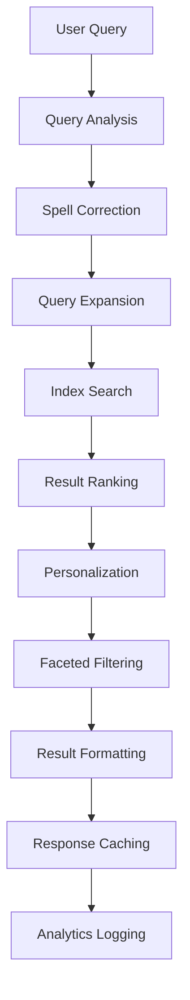

# 🔍 Search Service - AI-Powered Product Discovery

**Service Name**: Search Service  
**Version**: 1.0.0  
**Last Updated**: 2026-01-22  
**Production Ready**: 95%  

---

## 🎯 Overview

Search Service cung cấp AI-powered product search và discovery cho e-commerce platform. Service này sử dụng Elasticsearch để indexing và retrieval với advanced features như fuzzy matching, faceted search, và personalized recommendations.

### Core Capabilities
- **🤖 AI-Powered Search**: Intelligent query understanding và result ranking
- **📊 Real-Time Indexing**: Auto-sync với Catalog, Pricing, Warehouse services
- **🎯 Advanced Filtering**: Faceted search với multiple filter combinations
- **📈 Search Analytics**: Query performance và user behavior insights
- **🔄 Auto-Suggestions**: Query autocomplete và spell correction
- **📱 Mobile Optimization**: Fast search cho mobile devices
- **🌍 Multi-Language**: Unicode support và language-specific processing
- **⚡ Performance**: Sub-second response times

### Business Value
- **Conversion Optimization**: Better search experience tăng conversion
- **Product Discovery**: Help customers find products efficiently
- **Analytics Insights**: Understand customer search behavior
- **Scalability**: Handle high search volume với low latency
- **Personalization**: AI-driven result personalization

---

## 🏗️ Architecture

### Service Architecture
```
search/
├── cmd/
│   ├── search/                   # Main search service
│   ├── worker/                   # Background sync worker
│   └── sync/                     # Manual sync utility
├── internal/
│   ├── biz/                      # Business logic
│   │   ├── search/              # Search operations
│   │   ├── indexing/            # Index management
│   │   ├── analytics/           # Search analytics
│   │   └── suggestions/         # Auto-suggestions
│   ├── data/                     # Data access
│   │   ├── elasticsearch/       # Elasticsearch client
│   │   ├── postgres/            # PostgreSQL for metadata
│   │   └── redis/               # Redis for caching
│   ├── service/                  # gRPC/HTTP API layer
│   └── client/                   # External service clients
├── api/search/v1/                # Protocol buffers
├── migrations/                   # Database schema
└── configs/                      # Configuration
```

### Ports & Dependencies
- **HTTP API**: `:8004` - REST endpoints
- **gRPC API**: `:9004` - Internal communication
- **Database**: PostgreSQL (`search_db`) + Elasticsearch
- **Cache**: Redis for query caching và suggestions
- **External Services**: Catalog, Pricing, Warehouse services

---

## 🔄 Business Flow

### Search Query Processing Workflow



### Detailed Search Process

#### 1. Query Analysis & Processing
```
User Query → Search Analysis
├── Parse query string
├── Detect language and intent
├── Extract keywords and filters
├── Apply spell correction if needed
├── Expand query with synonyms
└── Generate search query for Elasticsearch
```

#### 2. Index Search & Retrieval
```
Processed Query → Elasticsearch
├── Execute multi-field search
├── Apply filters and facets
├── Score results by relevance
├── Apply personalization boosts
├── Paginate results
└── Return raw search results
```

#### 3. Result Enrichment & Formatting
```
Raw Results → Enriched Response
├── Fetch additional data (pricing, stock, images)
├── Apply business rules (availability, promotions)
├── Format for frontend consumption
├── Add metadata (total count, facets, suggestions)
└── Cache formatted results
```

#### 4. Analytics & Learning
```
Search Interaction → Analytics
├── Log query and results
├── Track user engagement (clicks, conversions)
├── Update search quality metrics
├── Feed data to ML models for improvements
└── Generate search performance reports
```

---

## 🔌 Key APIs

### Product Search
```protobuf
// Search products
rpc SearchProducts(SearchProductsRequest) returns (SearchProductsResponse) {
  option (google.api.http) = {
    get: "/api/v1/search/products"
  };
}

// Advanced search with filters
rpc AdvancedSearch(AdvancedSearchRequest) returns (AdvancedSearchResponse) {
  option (google.api.http) = {
    post: "/api/v1/search/advanced"
    body: "*"
  };
}
```

**Search Request:**
```json
{
  "query": "iPhone 14",
  "filters": {
    "category": ["smartphones"],
    "brand": ["apple"],
    "price_range": {"min": 500, "max": 1500},
    "in_stock": true,
    "rating": {"min": 4.0}
  },
  "sort": {
    "field": "relevance",
    "order": "desc"
  },
  "pagination": {
    "page": 1,
    "limit": 20
  },
  "personalization": {
    "user_id": "user-123",
    "location": "VN"
  }
}
```

### Auto-Suggestions
```protobuf
// Get search suggestions
rpc GetSuggestions(GetSuggestionsRequest) returns (GetSuggestionsResponse) {
  option (google.api.http) = {
    get: "/api/v1/search/suggestions"
  };
}

// Get trending searches
rpc GetTrendingSearches(GetTrendingSearchesRequest) returns (GetTrendingSearchesResponse) {
  option (google.api.http) = {
    get: "/api/v1/search/trending"
  };
}
```

### Index Management
```protobuf
// Manual reindex product
rpc ReindexProduct(ReindexProductRequest) returns (ReindexProductResponse) {
  option (google.api.http) = {
    post: "/api/v1/search/admin/reindex/product/{product_id}"
  };
}

// Bulk reindex
rpc BulkReindex(BulkReindexRequest) returns (BulkReindexResponse) {
  option (google.api.http) = {
    post: "/api/v1/search/admin/reindex/bulk"
    body: "*"
  };
}
```

### Analytics
```protobuf
// Get search analytics
rpc GetSearchAnalytics(GetSearchAnalyticsRequest) returns (GetSearchAnalyticsResponse) {
  option (google.api.http) = {
    get: "/api/v1/search/analytics"
  };
}

// Get zero results queries
rpc GetZeroResultsQueries(GetZeroResultsQueriesRequest) returns (GetZeroResultsQueriesResponse) {
  option (google.api.http) = {
    get: "/api/v1/search/analytics/zero-results"
  };
}
```

---

## 🔍 Search Features

### AI-Powered Search Capabilities

#### Query Understanding
- **Intent Detection**: Classify search intent (product, category, brand)
- **Entity Extraction**: Extract brands, categories, specifications
- **Query Expansion**: Add synonyms and related terms
- **Context Awareness**: Consider user history và preferences

#### Result Ranking
- **Relevance Scoring**: BM25 + custom business rules
- **Personalization**: Boost based on user behavior
- **Business Rules**: Prioritize in-stock, highly-rated products
- **A/B Testing**: Test different ranking algorithms

#### Advanced Features
- **Fuzzy Matching**: Handle typos và variations
- **Partial Matching**: Search within product names/descriptions
- **Phrase Matching**: Exact phrase matching for quotes
- **Field Boosting**: Weight different fields differently

### Faceted Search
```json
{
  "facets": {
    "category": [
      {"value": "smartphones", "count": 150},
      {"value": "laptops", "count": 89},
      {"value": "tablets", "count": 45}
    ],
    "brand": [
      {"value": "apple", "count": 120},
      {"value": "samsung", "count": 95},
      {"value": "google", "count": 34}
    ],
    "price_range": [
      {"value": "0-500", "count": 200},
      {"value": "500-1000", "count": 150},
      {"value": "1000-2000", "count": 89}
    ],
    "rating": [
      {"value": "4-5", "count": 180},
      {"value": "3-4", "count": 120},
      {"value": "0-3", "count": 45}
    ]
  }
}
```

---

## 🔗 Integration Points

### Catalog Service Integration
- **Consumes**: `catalog.product.created`, `catalog.product.updated`, `catalog.product.deleted`
- **Provides**: Search indexing và product discovery
- **Data Flow**: Product changes → Auto-reindexing → Updated search results

### Pricing Service Integration
- **Consumes**: `pricing.price.updated`, `pricing.price.deleted`
- **Provides**: Price-filtered search results
- **Data Flow**: Price changes → Index updates → Accurate price filtering

### Warehouse Service Integration
- **Consumes**: `warehouse.inventory.changed`
- **Provides**: Stock-filtered search results
- **Data Flow**: Stock changes → Availability updates → In-stock filtering

### Customer Service Integration (Future)
- **Consumes**: `customer.search.history`
- **Provides**: Personalized search results
- **Data Flow**: Search behavior → Personalization → Better results

---

## 🎯 Business Logic

### Real-Time Indexing Process
```go
func processCatalogEvent(event CatalogEvent) {
    switch event.Type {
    case "product.created", "product.updated":
        // 1. Fetch complete product data
        product := fetchProductData(event.ProductID)

        // 2. Transform for search index
        searchDoc := transformProductToSearchDoc(product)

        // 3. Update Elasticsearch index
        updateElasticsearchIndex(searchDoc)

        // 4. Invalidate relevant caches
        invalidateSearchCaches(product.Category, product.Brand)

        // 5. Update search analytics
        updateIndexStatistics(product)

    case "product.deleted":
        // 1. Remove from Elasticsearch
        deleteFromElasticsearch(event.ProductID)

        // 2. Clean up caches
        cleanupProductCaches(event.ProductID)
    }
}
```

### Search Query Processing
```go
func executeSearch(query SearchQuery) SearchResults {
    // 1. Build Elasticsearch query
    esQuery := buildElasticsearchQuery(query)

    // 2. Execute search
    rawResults := elasticsearch.Search(esQuery)

    // 3. Apply business rules
    filteredResults := applyBusinessRules(rawResults, query)

    // 4. Enrich with additional data
    enrichedResults := enrichSearchResults(filteredResults)

    // 5. Generate facets
    facets := generateFacets(rawResults)

    // 6. Log search analytics
    logSearchAnalytics(query, enrichedResults)

    return SearchResults{
        Products: enrichedResults,
        Facets: facets,
        TotalCount: rawResults.TotalCount,
        Suggestions: generateSuggestions(query),
    }
}
```

### Personalization Engine
```go
func personalizeResults(userID string, results []Product) []Product {
    if userID == "" {
        return results // No personalization for anonymous users
    }

    // 1. Get user preferences
    preferences := getUserPreferences(userID)

    // 2. Get search history
    history := getSearchHistory(userID)

    // 3. Calculate personalization scores
    personalizedResults := []Product{}
    for _, product := range results {
        score := calculatePersonalizationScore(product, preferences, history)
        product.PersonalizationScore = score
        personalizedResults = append(personalizedResults, product)
    }

    // 4. Re-sort by combined relevance + personalization
    sort.Slice(personalizedResults, func(i, j int) bool {
        combinedScoreI := personalizedResults[i].RelevanceScore + personalizedResults[i].PersonalizationScore
        combinedScoreJ := personalizedResults[j].RelevanceScore + personalizedResults[j].PersonalizationScore
        return combinedScoreI > combinedScoreJ
    })

    return personalizedResults
}
```

### Auto-Suggestions Algorithm
```go
func generateSuggestions(query string, userID string) []Suggestion {
    suggestions := []Suggestion{}

    // 1. Query completion suggestions
    querySuggestions := getQueryCompletions(query)

    // 2. Popular searches
    popularSuggestions := getPopularSearches(query)

    // 3. Personalized suggestions
    if userID != "" {
        personalizedSuggestions := getPersonalizedSuggestions(query, userID)
        suggestions = append(suggestions, personalizedSuggestions...)
    }

    // 4. Category suggestions
    categorySuggestions := getCategorySuggestions(query)

    // 5. Brand suggestions
    brandSuggestions := getBrandSuggestions(query)

    // 6. Combine and deduplicate
    allSuggestions := append(suggestions, querySuggestions...)
    allSuggestions = append(allSuggestions, popularSuggestions...)
    allSuggestions = append(allSuggestions, categorySuggestions...)
    allSuggestions = append(allSuggestions, brandSuggestions...)

    return deduplicateAndRank(allSuggestions)
}
```

---

## 📊 Event-Driven Architecture

### Published Events
- `search.index.updated` - Search index updated
- `search.query.executed` - Search query executed
- `search.product.clicked` - Product clicked in search results
- `search.analytics.updated` - Search analytics updated

### Consumed Events
- `catalog.product.created` - Index new product
- `catalog.product.updated` - Update product in index
- `catalog.product.deleted` - Remove product from index
- `catalog.attribute.config_changed` - Reindex affected products
- `pricing.price.updated` - Update price in index
- `warehouse.inventory.changed` - Update availability in index

---

## 🚀 Development Guide

### Quick Start
```bash
# Setup
cd search
go mod download
make migrate-up

# Start Elasticsearch
docker run -d -p 9200:9200 -p 9300:9300 elasticsearch:7.10.1

# Generate API
make api
make wire

# Run
make run
```

### Elasticsearch Configuration
```yaml
# configs/config.yaml
elasticsearch:
  urls: ["http://localhost:9200"]
  index_name: "products"
  settings:
    number_of_shards: 3
    number_of_replicas: 1

indexing:
  batch_size: 100
  refresh_interval: "30s"
  retry_attempts: 3

search:
  max_results: 10000
  default_page_size: 20
  fuzzy_matching: true
  personalization_enabled: true

caching:
  redis_addr: "localhost:6379"
  suggestion_ttl: 3600
  result_ttl: 300
```

---

**Service Status**: Production Ready (95%)  
**Critical Path**: Product search và indexing  
**Performance Target**: <200ms search response, <500ms indexing  
**Index Size**: 25,000+ products with full-text search