# 👥 Customer Journey Workflows

**Purpose**: End-to-end customer-facing processes and user experience flows  
**Navigation**: [← Workflows](../README.md) | [← Back to Main](../../README.md) | [Operational Flows →](../operational-flows/README.md)

---

## 📋 **Overview**

This section contains detailed documentation of customer-facing workflows that span the entire customer lifecycle from initial discovery to post-purchase support. These workflows are based on actual implementation across our 19-service microservices platform and provide comprehensive coverage of the customer experience.

### **🎯 Customer Journey Scope**

Our customer journey documentation covers three critical phases of the customer lifecycle:

1. **🔍 Discovery & Engagement** - Product search, browsing, and initial engagement
2. **🛒 Purchase & Transaction** - Shopping cart, checkout, and payment processing  
3. **📦 Post-Purchase Experience** - Order tracking, returns, and ongoing relationship

---

## 📚 **Customer Journey Workflows**

### **[Browse to Purchase](browse-to-purchase.md)**
**Complete shopping journey from discovery to delivery**

- **Scope**: End-to-end purchase workflow across 6 phases
- **Services**: 12 services involved (Gateway, Search, Catalog, Checkout, Order, Payment, Fulfillment, Shipping, Notification, Analytics, Loyalty, Review)
- **Duration**: 15-45 minutes typical customer session
- **Key Features**: Product discovery, cart management, checkout orchestration, payment processing, order fulfillment

**Business Impact**: Direct revenue generation, conversion optimization, customer acquisition

### **[Account Management](account-management.md)**
**Customer registration, profile, and authentication flows**

- **Scope**: Complete account lifecycle management
- **Services**: 8 services involved (Gateway, Auth, Customer, User, Notification, Order, Loyalty, Analytics)
- **Duration**: 5-10 minutes registration, ongoing profile management
- **Key Features**: Registration, email verification, authentication, profile management, security settings

**Business Impact**: Customer retention, data quality, security compliance, personalization

### **[Returns & Exchanges](returns-exchanges.md)**
**Return and exchange processes with refund workflows**

- **Scope**: Complete returns lifecycle from request to refund
- **Services**: 9 services involved (Gateway, Return, Order, Payment, Catalog, Shipping, Warehouse, Notification, Analytics)
- **Duration**: 5-7 days typical return processing
- **Key Features**: Return eligibility, approval workflow, shipping logistics, inspection, refund processing

**Business Impact**: Customer satisfaction, inventory management, fraud prevention, cost optimization

### **[Loyalty & Rewards](loyalty-rewards.md)**
**Customer loyalty program and rewards journey**

- **Scope**: Complete loyalty program participation from enrollment to redemption
- **Services**: 6 services involved (Gateway, Loyalty, Customer, Order, Notification, Analytics)
- **Duration**: Ongoing customer relationship with real-time points earning
- **Key Features**: Points earning, tier progression, reward redemption, referral program

**Business Impact**: Customer retention, lifetime value increase, repeat purchase encouragement

### **[Product Reviews](product-reviews.md)**
**Product review and rating customer experience**

- **Scope**: Complete review lifecycle from submission to publication
- **Services**: 6 services involved (Gateway, Review, Order, User, Notification, Analytics)
- **Duration**: 5-30 minutes review submission, 1-24 hours moderation
- **Key Features**: Review submission, content moderation, helpful voting, review discovery

**Business Impact**: Customer trust, product feedback, purchase decision support

---

## 🔄 **Customer Journey Flow Overview**

```mermaid
graph TB
    subgraph "Phase 1: Discovery & Engagement"
        A[🔍 Product Search] --> B[📦 Product Details]
        B --> C[⭐ Reviews & Ratings]
        C --> D[🛒 Add to Cart]
    end
    
    subgraph "Phase 2: Account & Authentication"
        E[👤 Registration] --> F[📧 Email Verification]
        F --> G[🔐 Login/Authentication]
        G --> H[📝 Profile Setup]
    end
    
    subgraph "Phase 3: Purchase & Payment"
        D --> I[🛒 Cart Management]
        I --> J[📋 Checkout Process]
        J --> K[💳 Payment Processing]
        K --> L[✅ Order Confirmation]
    end
    
    subgraph "Phase 4: Fulfillment & Delivery"
        L --> M[📦 Order Fulfillment]
        M --> N[🚚 Shipping & Tracking]
        N --> O[📬 Delivery Confirmation]
    end
    
    subgraph "Phase 5: Post-Purchase Experience"
        O --> P[⭐ Product Review]
        O --> Q[🎁 Loyalty Points]
        O --> R[↩️ Returns/Exchanges]
        P --> S[🔄 Repeat Purchase]
    end
    
    H --> I
    G --> I
```

---

## 📊 **Customer Journey Analytics**

### **Journey Performance Metrics**

| Journey Stage | Conversion Rate | Avg. Time | Drop-off Points |
|---------------|----------------|-----------|-----------------|
| **Discovery → Cart** | 15-25% | 8 minutes | Product page, pricing |
| **Cart → Checkout** | 70-80% | 3 minutes | Shipping costs, registration |
| **Checkout → Payment** | 85-95% | 2 minutes | Payment method, errors |
| **Payment → Confirmation** | 95-98% | 30 seconds | Payment processing |
| **Post-Purchase Engagement** | 40-60% | Ongoing | Review requests, loyalty |

### **Customer Lifecycle Value**

| Customer Segment | Avg. Order Value | Lifetime Value | Return Rate |
|------------------|------------------|----------------|-------------|
| **New Customers** | ₫850,000 | ₫2,500,000 | 8-12% |
| **Returning Customers** | ₫1,200,000 | ₫5,000,000 | 5-8% |
| **Loyalty Members** | ₫1,500,000 | ₫8,000,000 | 3-5% |
| **VIP Customers** | ₫2,500,000 | ₫15,000,000 | 2-3% |

---

## 🎯 **Customer Experience Optimization**

### **Personalization Features**

**Discovery Personalization:**
- **Search Results**: Personalized based on browsing history
- **Product Recommendations**: AI-powered suggestions
- **Price Optimization**: Dynamic pricing based on customer segment
- **Content Localization**: Vietnamese language and cultural preferences

**Purchase Experience:**
- **Saved Payment Methods**: Secure payment method storage
- **Address Book**: Multiple delivery addresses
- **Order History**: Easy reordering from past purchases
- **Wishlist Management**: Save items for later purchase

**Post-Purchase Engagement:**
- **Order Tracking**: Real-time delivery updates
- **Loyalty Rewards**: Points earning and redemption
- **Review Incentives**: Rewards for product reviews
- **Return Simplification**: Easy return process

### **Mobile Experience Optimization**

**Mobile-First Design:**
- **Responsive UI**: Optimized for mobile devices
- **Touch Interactions**: Gesture-based navigation
- **Fast Loading**: Optimized for mobile networks
- **Offline Capability**: Basic functionality without internet

**Mobile-Specific Features:**
- **One-Touch Checkout**: Simplified mobile checkout
- **Mobile Payments**: Support for mobile wallets
- **Push Notifications**: Order updates and promotions
- **Location Services**: Store locator and delivery tracking

---

## 🔒 **Customer Data & Privacy**

### **Data Collection & Usage**

**Customer Data Types:**
- **Profile Data**: Name, email, phone, addresses
- **Behavioral Data**: Browsing history, search queries, purchase patterns
- **Preference Data**: Product preferences, communication preferences
- **Transaction Data**: Order history, payment methods, returns

**Data Usage Purposes:**
- **Personalization**: Customized shopping experience
- **Analytics**: Business intelligence and optimization
- **Marketing**: Targeted campaigns and promotions
- **Support**: Customer service and issue resolution

### **Privacy Compliance**

**GDPR Compliance:**
- **Consent Management**: Explicit consent for data collection
- **Data Portability**: Customer data export capabilities
- **Right to Deletion**: Account and data deletion options
- **Data Minimization**: Collect only necessary data

**Security Measures:**
- **Data Encryption**: All PII encrypted at rest and in transit
- **Access Controls**: Role-based access to customer data
- **Audit Logging**: Complete audit trail for data access
- **Regular Security Reviews**: Quarterly security assessments

---

## 🚀 **Customer Journey Optimization Roadmap**

### **Current Capabilities (88% Complete)**

**✅ Implemented Features:**
- Complete product discovery and search
- Secure customer registration and authentication
- Full checkout and payment processing
- Order tracking and fulfillment
- Returns and refund processing
- Basic loyalty program
- Email and SMS notifications

### **Near-Term Enhancements (Q1 2026)**

**🔄 In Development:**
- **Advanced Personalization**: AI-powered product recommendations
- **Social Login**: Facebook, Google, Apple ID integration
- **Mobile App**: Native iOS and Android applications
- **Live Chat Support**: Real-time customer support
- **Advanced Analytics**: Customer journey analytics dashboard

### **Future Roadmap (Q2-Q4 2026)**

**🚧 Planned Features:**
- **Voice Commerce**: Voice-activated shopping
- **AR/VR Experience**: Virtual product try-on
- **Subscription Services**: Recurring order management
- **Social Commerce**: Social media integration
- **International Expansion**: Multi-currency and multi-language

---

## 📋 **Customer Journey Testing**

### **End-to-End Testing Scenarios**

**Critical Path Testing:**
1. **New Customer Journey**: Registration → Browse → Purchase → Delivery
2. **Returning Customer**: Login → Reorder → Express Checkout
3. **Return Process**: Return Request → Approval → Refund
4. **Mobile Experience**: Complete journey on mobile devices
5. **Error Recovery**: Handle payment failures, inventory issues

**Performance Testing:**
- **Load Testing**: 10,000 concurrent users
- **Stress Testing**: Peak traffic scenarios (sales events)
- **Endurance Testing**: 24-hour continuous operation
- **Mobile Performance**: 3G network conditions

### **Customer Experience Monitoring**

**Real-Time Monitoring:**
- **Conversion Funnel**: Track drop-offs at each stage
- **Page Performance**: Load times and error rates
- **Payment Success**: Payment processing success rates
- **Customer Satisfaction**: Real-time feedback collection

**Business Intelligence:**
- **Customer Segmentation**: Behavioral analysis and grouping
- **Journey Analytics**: Path analysis and optimization opportunities
- **Predictive Analytics**: Churn prediction and retention strategies
- **A/B Testing**: Continuous experience optimization

---

## 🎯 **Success Metrics & KPIs**

### **Customer Acquisition Metrics**
- **Registration Conversion**: >15% of visitors register
- **Email Verification**: >90% complete verification
- **First Purchase**: >60% make first purchase within 30 days
- **Customer Acquisition Cost**: <₫200,000 per customer

### **Customer Engagement Metrics**
- **Session Duration**: >8 minutes average
- **Pages per Session**: >5 pages average
- **Return Visitor Rate**: >40% within 30 days
- **Mobile Usage**: >60% of traffic from mobile

### **Customer Satisfaction Metrics**
- **Net Promoter Score**: >50 NPS
- **Customer Satisfaction**: >4.5/5 rating
- **Return Rate**: <8% of orders
- **Support Resolution**: <24 hours average

### **Revenue Metrics**
- **Conversion Rate**: >3% overall conversion
- **Average Order Value**: >₫1,000,000
- **Customer Lifetime Value**: >₫5,000,000
- **Repeat Purchase Rate**: >40% within 6 months

---

## 📞 **Customer Support Integration**

### **Support Channels**
- **Live Chat**: Real-time support during business hours
- **Email Support**: 24-hour response time
- **Phone Support**: Vietnamese language support
- **Self-Service**: FAQ, knowledge base, video tutorials

### **Support Integration Points**
- **Order Issues**: Direct integration with order management
- **Payment Problems**: Real-time payment status checking
- **Return Support**: Streamlined return process initiation
- **Account Help**: Profile and authentication assistance

---

## 📖 **How to Use This Documentation**

### **For Product Managers**
- **Journey Optimization**: Identify improvement opportunities
- **Feature Planning**: Understand current capabilities and gaps
- **Customer Research**: Use journey maps for user research
- **Performance Tracking**: Monitor journey metrics and KPIs

### **For UX/UI Designers**
- **User Flow Design**: Create intuitive user experiences
- **Wireframe Creation**: Design based on actual workflows
- **Usability Testing**: Test against documented journeys
- **Mobile Optimization**: Ensure mobile-first design

### **For Developers**
- **API Integration**: Understand service interactions
- **Frontend Development**: Implement customer-facing features
- **Performance Optimization**: Optimize critical path performance
- **Error Handling**: Implement robust error recovery

### **For QA Engineers**
- **Test Case Design**: Create comprehensive test scenarios
- **User Acceptance Testing**: Validate against journey requirements
- **Performance Testing**: Test journey performance under load
- **Cross-Platform Testing**: Ensure consistent experience

---

**Last Updated**: January 30, 2026  
**Platform Status**: 88% Complete, Customer Journey Ready for Production  
**Maintained By**: Customer Experience & Product Team