# 👤 Customer Account Management Workflow

**Last Updated**: January 29, 2026  
**Status**: Based on Actual Implementation  
**Services Involved**: 8 services for complete account lifecycle  
**Navigation**: [← Customer Journey](README.md) | [← Workflows](../README.md)

---

## 📋 **Overview**

This document describes the complete customer account management workflow including registration, authentication, profile management, and account lifecycle operations based on the actual implementation of our microservices platform.

### **Business Context**
- **Domain**: Customer Identity & Account Management
- **Objective**: Secure and seamless customer account experience
- **Success Criteria**: High registration conversion, secure authentication, active user engagement
- **Key Metrics**: Registration completion rate, login success rate, profile completeness

---

## 🏗️ **Service Architecture**

### **Primary Services**
| Service | Role | Completion | Key Responsibilities |
|---------|------|------------|---------------------|
| 🚪 **Gateway Service** | Entry Point | 95% | Request routing, rate limiting, CORS |
| 🔐 **Auth Service** | Authentication | 95% | JWT tokens, OAuth2, MFA, session management |
| 👤 **Customer Service** | Profile Management | 95% | Customer data, addresses, preferences |
| 👥 **User Service** | Admin Users | 95% | Admin user management, RBAC |
| 📧 **Notification Service** | Communication | 90% | Email verification, notifications |
| 🛒 **Order Service** | Order History | 90% | Customer order tracking |
| 🎁 **Loyalty Service** | Rewards | 95% | Points, tiers, rewards tracking |
| 📈 **Analytics Service** | Behavior Tracking | 85% | User behavior, engagement metrics |

---

## 🔄 **Account Management Workflows**

### **Phase 1: Customer Registration**

#### **1.1 Registration Initiation**
**Services**: Gateway → Auth → Customer → Notification

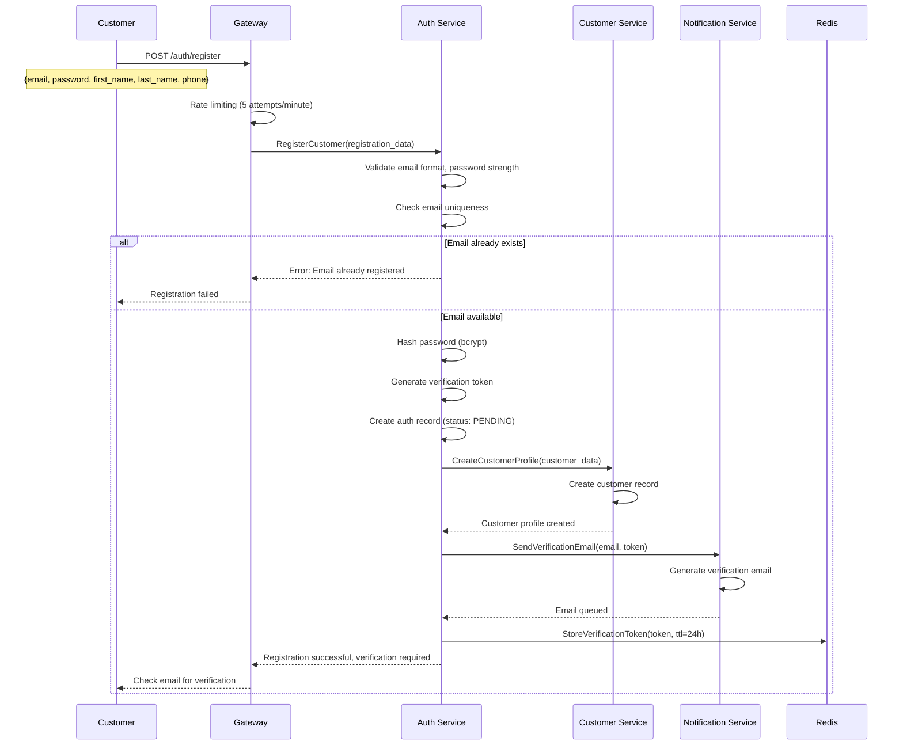
```mermaid
sequenceDiagram
    participant C as Customer
    participant G as Gateway
    participant A as Auth Service
    participant CUS as Customer Service
    participant N as Notification Service
    participant Cache as Redis
    
    C->>G: POST /auth/register
    Note over C: {email, password, first_name, last_name, phone}
    
    G->>G: Rate limiting (5 attempts/minute)
    G->>A: RegisterCustomer(registration_data)
    
    A->>A: Validate email format, password strength
    A->>A: Check email uniqueness
    
    alt Email already exists
        A-->>G: Error: Email already registered
        G-->>C: Registration failed
    else Email available
        A->>A: Hash password (bcrypt)
        A->>A: Generate verification token
        A->>A: Create auth record (status: PENDING)
        
        A->>CUS: CreateCustomerProfile(customer_data)
        CUS->>CUS: Create customer record
        CUS-->>A: Customer profile created
        
        A->>N: SendVerificationEmail(email, token)
        N->>N: Generate verification email
        N-->>A: Email queued
        
        A->>Cache: StoreVerificationToken(token, ttl=24h)
        A-->>G: Registration successful, verification required
        G-->>C: Check email for verification
    end
```

**Registration Validation Rules:**
- **Email**: Valid format, unique across system
- **Password**: Minimum 8 characters, mixed case, numbers, special chars
- **Phone**: Valid Vietnamese phone format (+84)
- **Name**: Required fields, no special characters
- **Rate Limiting**: 5 registration attempts per minute per IP

#### **1.2 Email Verification**
**Services**: Gateway → Auth → Customer → Notification

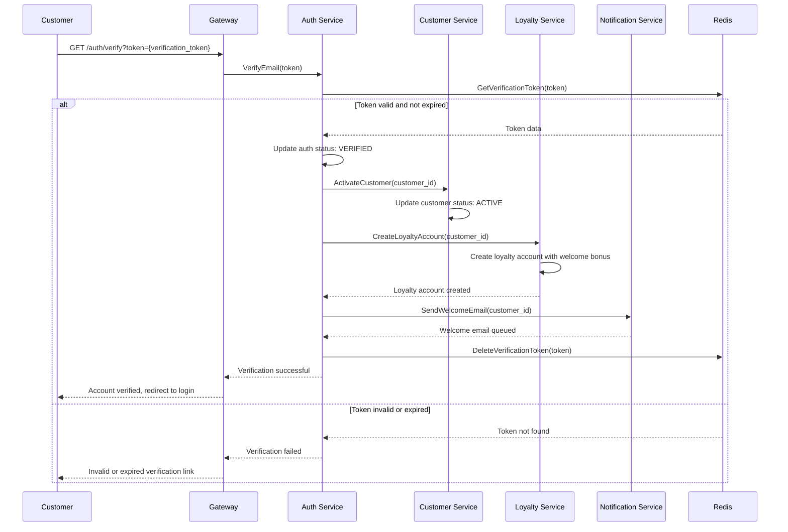
```mermaid
sequenceDiagram
    participant C as Customer
    participant G as Gateway
    participant A as Auth Service
    participant CUS as Customer Service
    participant L as Loyalty Service
    participant N as Notification Service
    participant Cache as Redis
    
    C->>G: GET /auth/verify?token={verification_token}
    G->>A: VerifyEmail(token)
    
    A->>Cache: GetVerificationToken(token)
    alt Token valid and not expired
        Cache-->>A: Token data
        A->>A: Update auth status: VERIFIED
        A->>CUS: ActivateCustomer(customer_id)
        CUS->>CUS: Update customer status: ACTIVE
        
        A->>L: CreateLoyaltyAccount(customer_id)
        L->>L: Create loyalty account with welcome bonus
        L-->>A: Loyalty account created
        
        A->>N: SendWelcomeEmail(customer_id)
        N-->>A: Welcome email queued
        
        A->>Cache: DeleteVerificationToken(token)
        A-->>G: Verification successful
        G-->>C: Account verified, redirect to login
    else Token invalid or expired
        Cache-->>A: Token not found
        A-->>G: Verification failed
        G-->>C: Invalid or expired verification link
    end
```

**Verification Features:**
- **Token Expiry**: 24-hour validity
- **Single Use**: Token deleted after successful verification
- **Welcome Bonus**: Loyalty points awarded on verification
- **Account Activation**: Customer status updated to ACTIVE

---

### **Phase 2: Authentication & Login**

#### **2.1 Standard Login**
**Services**: Gateway → Auth → Customer

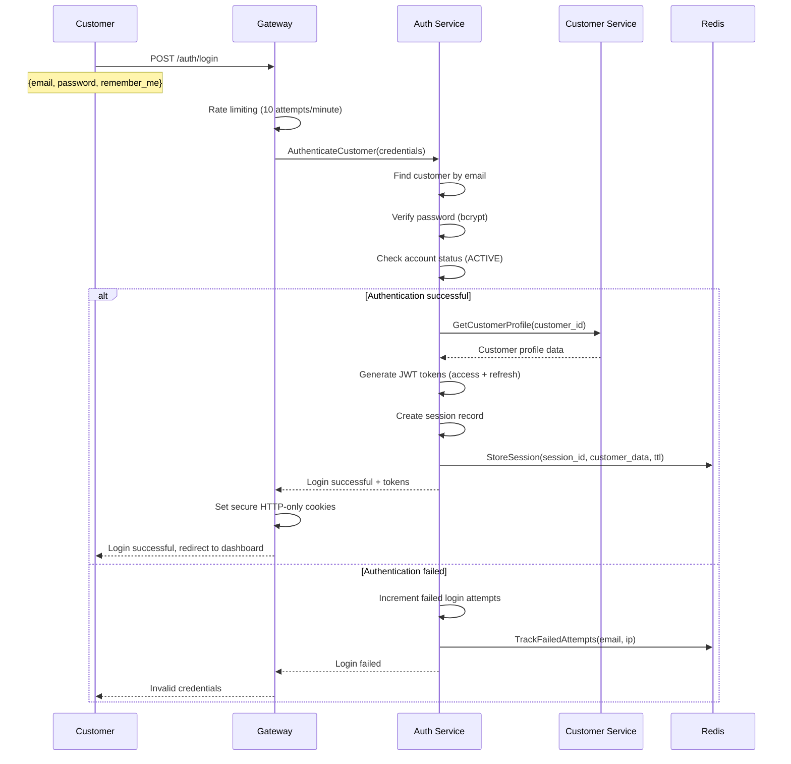
```mermaid
sequenceDiagram
    participant C as Customer
    participant G as Gateway
    participant A as Auth Service
    participant CUS as Customer Service
    participant Cache as Redis
    
    C->>G: POST /auth/login
    Note over C: {email, password, remember_me}
    
    G->>G: Rate limiting (10 attempts/minute)
    G->>A: AuthenticateCustomer(credentials)
    
    A->>A: Find customer by email
    A->>A: Verify password (bcrypt)
    A->>A: Check account status (ACTIVE)
    
    alt Authentication successful
        A->>CUS: GetCustomerProfile(customer_id)
        CUS-->>A: Customer profile data
        
        A->>A: Generate JWT tokens (access + refresh)
        A->>A: Create session record
        A->>Cache: StoreSession(session_id, customer_data, ttl)
        
        A-->>G: Login successful + tokens
        G->>G: Set secure HTTP-only cookies
        G-->>C: Login successful, redirect to dashboard
    else Authentication failed
        A->>A: Increment failed login attempts
        A->>Cache: TrackFailedAttempts(email, ip)
        A-->>G: Login failed
        G-->>C: Invalid credentials
    end
```

**Login Security Features:**
- **Rate Limiting**: 10 attempts per minute per IP
- **Account Lockout**: 5 failed attempts = 15-minute lockout
- **Secure Tokens**: JWT with 1-hour access token, 30-day refresh token
- **Session Management**: Redis-based session storage
- **Remember Me**: Extended refresh token validity (90 days)

#### **2.2 Multi-Factor Authentication (MFA)**
**Services**: Auth → Notification

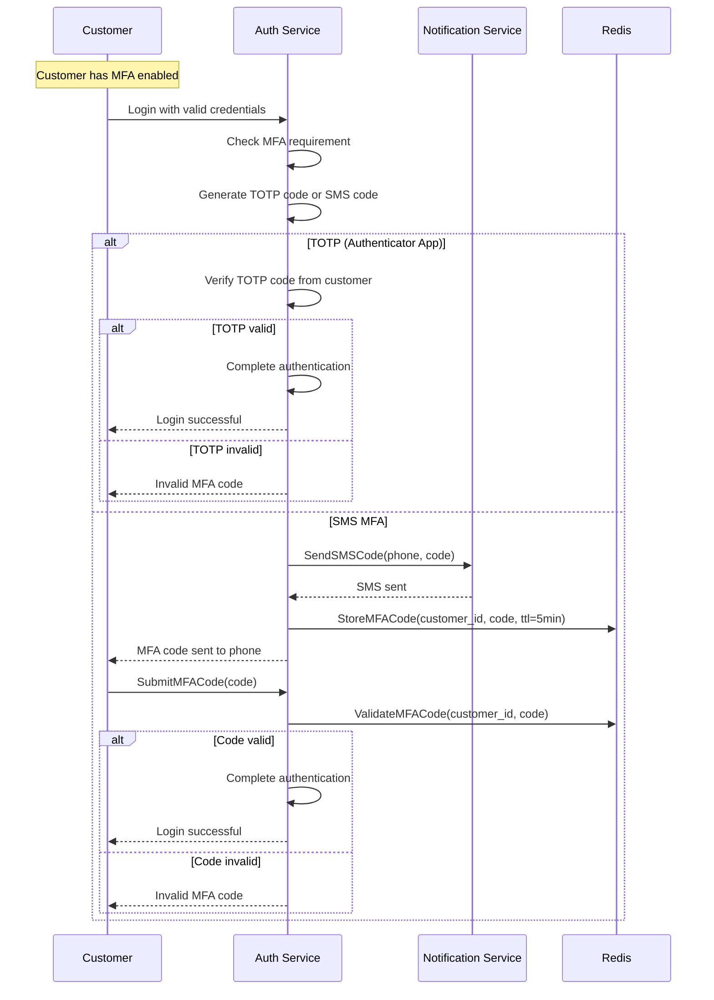
```mermaid
sequenceDiagram
    participant C as Customer
    participant A as Auth Service
    participant N as Notification Service
    participant Cache as Redis
    
    Note over C: Customer has MFA enabled
    
    C->>A: Login with valid credentials
    A->>A: Check MFA requirement
    A->>A: Generate TOTP code or SMS code
    
    alt TOTP (Authenticator App)
        A->>A: Verify TOTP code from customer
        alt TOTP valid
            A->>A: Complete authentication
            A-->>C: Login successful
        else TOTP invalid
            A-->>C: Invalid MFA code
        end
    else SMS MFA
        A->>N: SendSMSCode(phone, code)
        N-->>A: SMS sent
        A->>Cache: StoreMFACode(customer_id, code, ttl=5min)
        A-->>C: MFA code sent to phone
        
        C->>A: SubmitMFACode(code)
        A->>Cache: ValidateMFACode(customer_id, code)
        alt Code valid
            A->>A: Complete authentication
            A-->>C: Login successful
        else Code invalid
            A-->>C: Invalid MFA code
        end
    end
```

#### **2.3 OAuth2 Social Login**
**Services**: Gateway → Auth → Customer

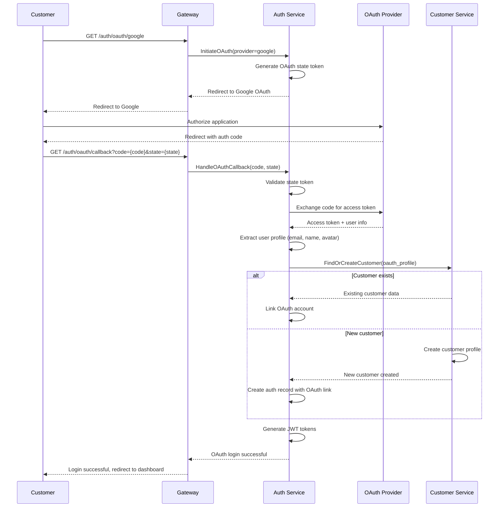
```mermaid
sequenceDiagram
    participant C as Customer
    participant G as Gateway
    participant A as Auth Service
    participant OAuth as OAuth Provider
    participant CUS as Customer Service
    
    C->>G: GET /auth/oauth/google
    G->>A: InitiateOAuth(provider=google)
    A->>A: Generate OAuth state token
    A-->>G: Redirect to Google OAuth
    G-->>C: Redirect to Google
    
    C->>OAuth: Authorize application
    OAuth-->>C: Redirect with auth code
    C->>G: GET /auth/oauth/callback?code={code}&state={state}
    
    G->>A: HandleOAuthCallback(code, state)
    A->>A: Validate state token
    A->>OAuth: Exchange code for access token
    OAuth-->>A: Access token + user info
    
    A->>A: Extract user profile (email, name, avatar)
    A->>CUS: FindOrCreateCustomer(oauth_profile)
    
    alt Customer exists
        CUS-->>A: Existing customer data
        A->>A: Link OAuth account
    else New customer
        CUS->>CUS: Create customer profile
        CUS-->>A: New customer created
        A->>A: Create auth record with OAuth link
    end
    
    A->>A: Generate JWT tokens
    A-->>G: OAuth login successful
    G-->>C: Login successful, redirect to dashboard
```

**Supported OAuth Providers:**
- **Google**: Google accounts integration
- **Facebook**: Facebook login
- **GitHub**: Developer-focused login
- **Apple**: iOS app integration (future)

---

### **Phase 3: Profile Management**

#### **3.1 Profile Information Update**
**Services**: Gateway → Customer → Auth

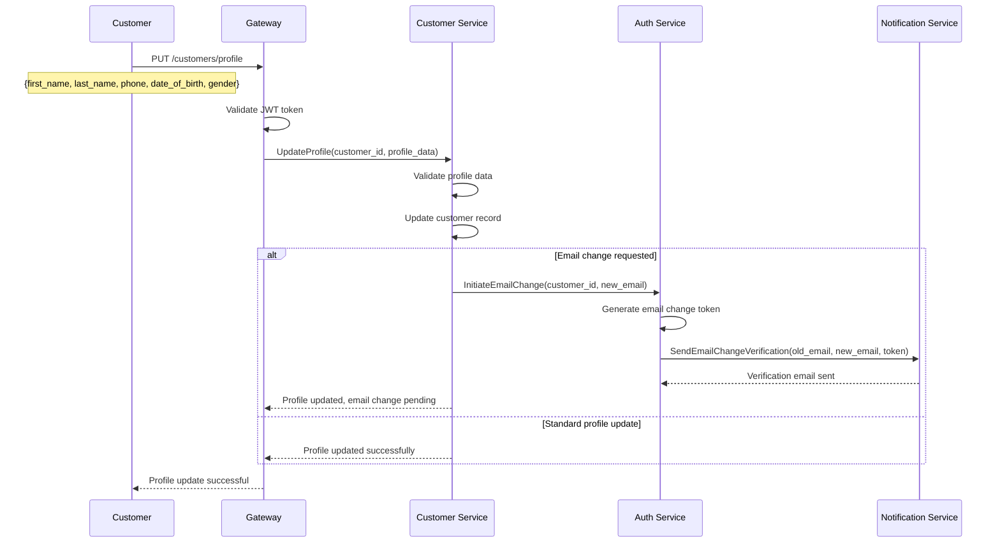
```mermaid
sequenceDiagram
    participant C as Customer
    participant G as Gateway
    participant CUS as Customer Service
    participant A as Auth Service
    participant N as Notification Service
    
    C->>G: PUT /customers/profile
    Note over C: {first_name, last_name, phone, date_of_birth, gender}
    
    G->>G: Validate JWT token
    G->>CUS: UpdateProfile(customer_id, profile_data)
    
    CUS->>CUS: Validate profile data
    CUS->>CUS: Update customer record
    
    alt Email change requested
        CUS->>A: InitiateEmailChange(customer_id, new_email)
        A->>A: Generate email change token
        A->>N: SendEmailChangeVerification(old_email, new_email, token)
        N-->>A: Verification email sent
        CUS-->>G: Profile updated, email change pending
    else Standard profile update
        CUS-->>G: Profile updated successfully
    end
    
    G-->>C: Profile update successful
```

#### **3.2 Address Management**
**Services**: Gateway → Customer

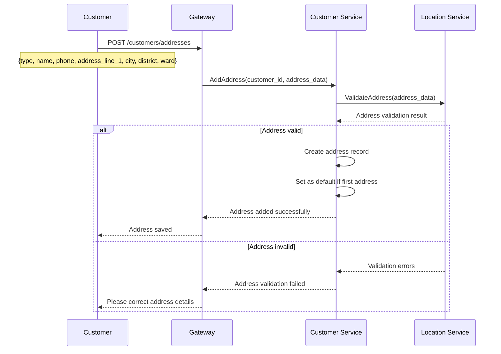
```mermaid
sequenceDiagram
    participant C as Customer
    participant G as Gateway
    participant CUS as Customer Service
    participant LOC as Location Service
    
    C->>G: POST /customers/addresses
    Note over C: {type, name, phone, address_line_1, city, district, ward}
    
    G->>CUS: AddAddress(customer_id, address_data)
    CUS->>LOC: ValidateAddress(address_data)
    LOC-->>CUS: Address validation result
    
    alt Address valid
        CUS->>CUS: Create address record
        CUS->>CUS: Set as default if first address
        CUS-->>G: Address added successfully
        G-->>C: Address saved
    else Address invalid
        LOC-->>CUS: Validation errors
        CUS-->>G: Address validation failed
        G-->>C: Please correct address details
    end
```

**Address Management Features:**
- **Multiple Addresses**: Unlimited addresses per customer
- **Address Types**: Home, Office, Other
- **Default Address**: Automatic selection for checkout
- **Address Validation**: Vietnamese address format validation
- **Geocoding**: Latitude/longitude for delivery optimization

#### **3.3 Password Management**
**Services**: Gateway → Auth → Notification

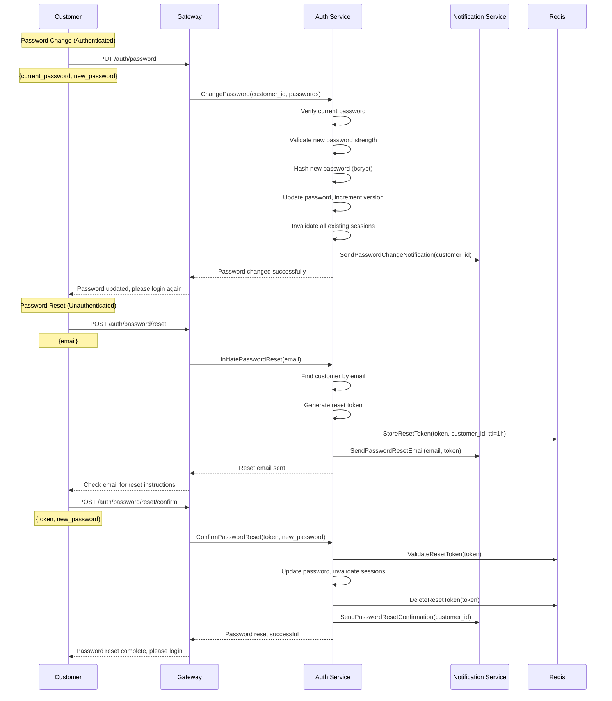
```mermaid
sequenceDiagram
    participant C as Customer
    participant G as Gateway
    participant A as Auth Service
    participant N as Notification Service
    participant Cache as Redis
    
    Note over C: Password Change (Authenticated)
    C->>G: PUT /auth/password
    Note over C: {current_password, new_password}
    
    G->>A: ChangePassword(customer_id, passwords)
    A->>A: Verify current password
    A->>A: Validate new password strength
    A->>A: Hash new password (bcrypt)
    A->>A: Update password, increment version
    A->>A: Invalidate all existing sessions
    A->>N: SendPasswordChangeNotification(customer_id)
    A-->>G: Password changed successfully
    G-->>C: Password updated, please login again
    
    Note over C: Password Reset (Unauthenticated)
    C->>G: POST /auth/password/reset
    Note over C: {email}
    
    G->>A: InitiatePasswordReset(email)
    A->>A: Find customer by email
    A->>A: Generate reset token
    A->>Cache: StoreResetToken(token, customer_id, ttl=1h)
    A->>N: SendPasswordResetEmail(email, token)
    A-->>G: Reset email sent
    G-->>C: Check email for reset instructions
    
    C->>G: POST /auth/password/reset/confirm
    Note over C: {token, new_password}
    
    G->>A: ConfirmPasswordReset(token, new_password)
    A->>Cache: ValidateResetToken(token)
    A->>A: Update password, invalidate sessions
    A->>Cache: DeleteResetToken(token)
    A->>N: SendPasswordResetConfirmation(customer_id)
    A-->>G: Password reset successful
    G-->>C: Password reset complete, please login
```

---

### **Phase 4: Account Security & Privacy**

#### **4.1 Multi-Factor Authentication Setup**
**Services**: Gateway → Auth → Notification

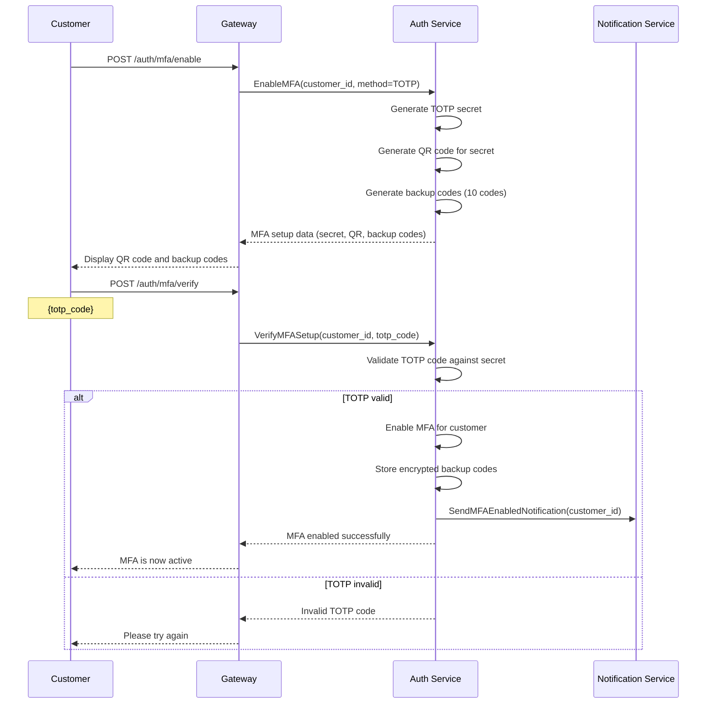
```mermaid
sequenceDiagram
    participant C as Customer
    participant G as Gateway
    participant A as Auth Service
    participant N as Notification Service
    
    C->>G: POST /auth/mfa/enable
    G->>A: EnableMFA(customer_id, method=TOTP)
    
    A->>A: Generate TOTP secret
    A->>A: Generate QR code for secret
    A->>A: Generate backup codes (10 codes)
    A-->>G: MFA setup data (secret, QR, backup codes)
    G-->>C: Display QR code and backup codes
    
    C->>G: POST /auth/mfa/verify
    Note over C: {totp_code}
    
    G->>A: VerifyMFASetup(customer_id, totp_code)
    A->>A: Validate TOTP code against secret
    
    alt TOTP valid
        A->>A: Enable MFA for customer
        A->>A: Store encrypted backup codes
        A->>N: SendMFAEnabledNotification(customer_id)
        A-->>G: MFA enabled successfully
        G-->>C: MFA is now active
    else TOTP invalid
        A-->>G: Invalid TOTP code
        G-->>C: Please try again
    end
```

#### **4.2 Privacy & Data Management**
**Services**: Gateway → Customer → Auth → Analytics

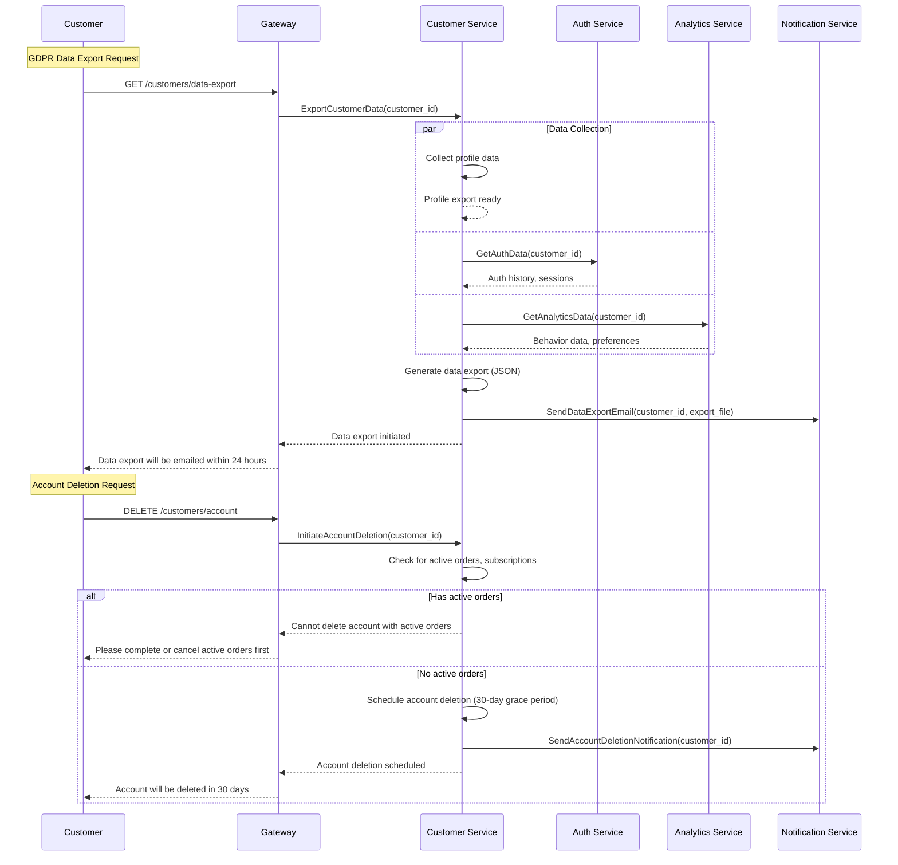
```mermaid
sequenceDiagram
    participant C as Customer
    participant G as Gateway
    participant CUS as Customer Service
    participant A as Auth Service
    participant AN as Analytics Service
    participant N as Notification Service
    
    Note over C: GDPR Data Export Request
    C->>G: GET /customers/data-export
    G->>CUS: ExportCustomerData(customer_id)
    
    par Data Collection
        CUS->>CUS: Collect profile data
        CUS-->>CUS: Profile export ready
    and
        CUS->>A: GetAuthData(customer_id)
        A-->>CUS: Auth history, sessions
    and
        CUS->>AN: GetAnalyticsData(customer_id)
        AN-->>CUS: Behavior data, preferences
    end
    
    CUS->>CUS: Generate data export (JSON)
    CUS->>N: SendDataExportEmail(customer_id, export_file)
    CUS-->>G: Data export initiated
    G-->>C: Data export will be emailed within 24 hours
    
    Note over C: Account Deletion Request
    C->>G: DELETE /customers/account
    G->>CUS: InitiateAccountDeletion(customer_id)
    
    CUS->>CUS: Check for active orders, subscriptions
    alt Has active orders
        CUS-->>G: Cannot delete account with active orders
        G-->>C: Please complete or cancel active orders first
    else No active orders
        CUS->>CUS: Schedule account deletion (30-day grace period)
        CUS->>N: SendAccountDeletionNotification(customer_id)
        CUS-->>G: Account deletion scheduled
        G-->>C: Account will be deleted in 30 days
    end
```

---

### **Phase 5: Account Analytics & Insights**

#### **5.1 Customer Behavior Tracking**
**Services**: Analytics → Customer

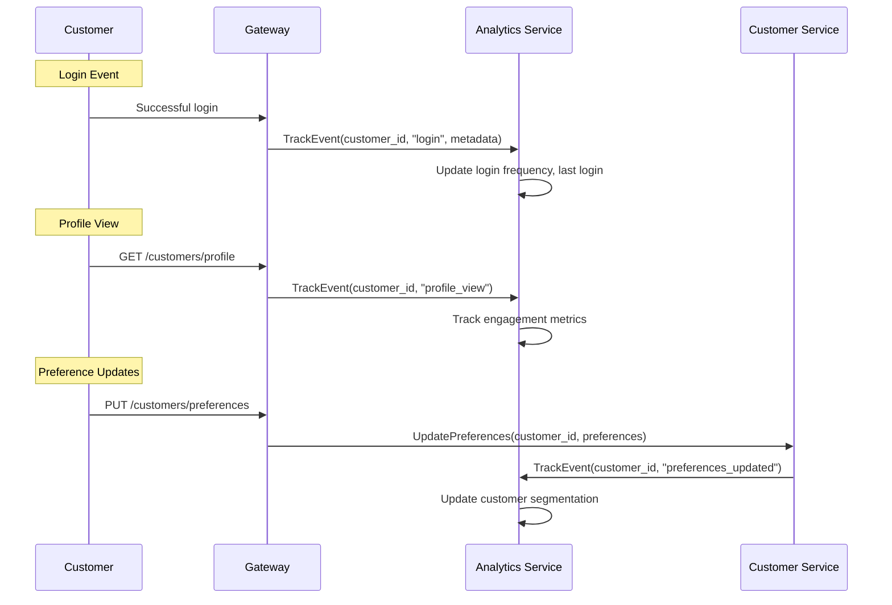
```mermaid
sequenceDiagram
    participant C as Customer
    participant G as Gateway
    participant AN as Analytics Service
    participant CUS as Customer Service
    
    Note over C: Login Event
    C->>G: Successful login
    G->>AN: TrackEvent(customer_id, "login", metadata)
    AN->>AN: Update login frequency, last login
    
    Note over C: Profile View
    C->>G: GET /customers/profile
    G->>AN: TrackEvent(customer_id, "profile_view")
    AN->>AN: Track engagement metrics
    
    Note over C: Preference Updates
    C->>G: PUT /customers/preferences
    G->>CUS: UpdatePreferences(customer_id, preferences)
    CUS->>AN: TrackEvent(customer_id, "preferences_updated")
    AN->>AN: Update customer segmentation
```

#### **5.2 Customer Insights Dashboard**
**Services**: Gateway → Customer → Analytics → Order → Loyalty

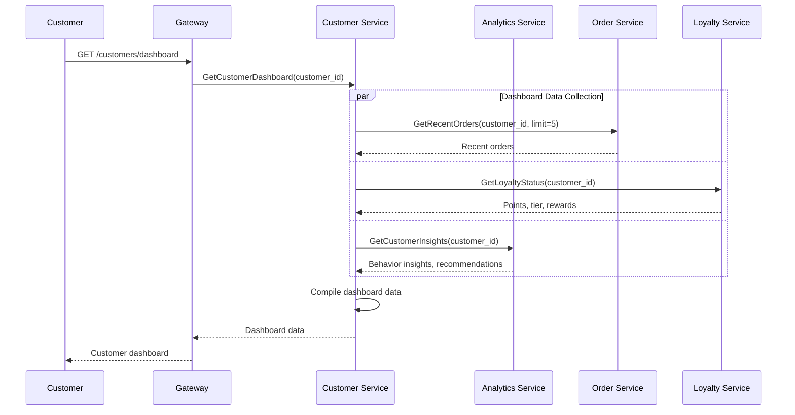
```mermaid
sequenceDiagram
    participant C as Customer
    participant G as Gateway
    participant CUS as Customer Service
    participant AN as Analytics Service
    participant O as Order Service
    participant L as Loyalty Service
    
    C->>G: GET /customers/dashboard
    G->>CUS: GetCustomerDashboard(customer_id)
    
    par Dashboard Data Collection
        CUS->>O: GetRecentOrders(customer_id, limit=5)
        O-->>CUS: Recent orders
    and
        CUS->>L: GetLoyaltyStatus(customer_id)
        L-->>CUS: Points, tier, rewards
    and
        CUS->>AN: GetCustomerInsights(customer_id)
        AN-->>CUS: Behavior insights, recommendations
    end
    
    CUS->>CUS: Compile dashboard data
    CUS-->>G: Dashboard data
    G-->>C: Customer dashboard
```

**Dashboard Features:**
- **Recent Orders**: Last 5 orders with status
- **Loyalty Status**: Points balance, tier, available rewards
- **Recommendations**: Personalized product suggestions
- **Account Health**: Profile completeness, security status
- **Activity Summary**: Login frequency, engagement metrics

---

## 📊 **Event Flow Architecture**

### **Key Events Published**

**Authentication Events:**
- `auth.customer.registered` → Analytics, Loyalty
- `auth.customer.verified` → Analytics, Loyalty
- `auth.customer.login` → Analytics
- `auth.customer.logout` → Analytics
- `auth.mfa.enabled` → Analytics, Notification
- `auth.password.changed` → Analytics, Notification

**Profile Events:**
- `customer.profile.updated` → Analytics
- `customer.address.added` → Analytics
- `customer.preferences.updated` → Analytics, Recommendation
- `customer.account.deleted` → Analytics (anonymized)

**Security Events:**
- `auth.login.failed` → Security monitoring
- `auth.account.locked` → Security monitoring, Notification
- `auth.suspicious.activity` → Security monitoring, Notification

---

## 🎯 **Business Rules & Validation**

### **Registration Rules**
- **Email Uniqueness**: One account per email address
- **Password Policy**: Minimum 8 chars, complexity requirements
- **Phone Validation**: Vietnamese phone number format
- **Age Restriction**: Minimum 13 years old
- **Verification Required**: Email verification mandatory

### **Authentication Rules**
- **Session Duration**: 1 hour access token, 30-day refresh token
- **Failed Login Lockout**: 5 attempts = 15-minute lockout
- **MFA Requirement**: Optional for customers, mandatory for high-value accounts
- **OAuth Linking**: Multiple OAuth providers per account allowed

### **Profile Management Rules**
- **Email Change**: Requires verification of both old and new email
- **Phone Change**: SMS verification required
- **Address Limit**: Maximum 10 addresses per customer
- **Data Export**: GDPR compliance, 24-hour delivery
- **Account Deletion**: 30-day grace period, irreversible after

---

## 📈 **Performance Metrics & SLAs**

### **Target Performance**
| Operation | Target Latency (P95) | Target Throughput |
|-----------|---------------------|-------------------|
| Registration | <500ms | 100 registrations/sec |
| Login | <200ms | 500 logins/sec |
| Profile Update | <300ms | 200 updates/sec |
| Password Reset | <400ms | 50 resets/sec |
| MFA Verification | <100ms | 1000 verifications/sec |

### **Business Metrics**
| Metric | Target | Current |
|--------|--------|---------|
| Registration Completion | >80% | Tracking |
| Email Verification Rate | >90% | Tracking |
| Login Success Rate | >95% | Tracking |
| Profile Completeness | >70% | Tracking |
| MFA Adoption | >30% | Tracking |

---

## 🔒 **Security & Compliance**

### **Security Measures**
- **Password Hashing**: bcrypt with salt rounds
- **JWT Security**: RS256 signing, short-lived tokens
- **Rate Limiting**: Comprehensive rate limiting on all endpoints
- **Session Security**: Secure HTTP-only cookies
- **MFA Support**: TOTP and SMS-based authentication

### **Compliance Features**
- **GDPR Compliance**: Data export, deletion, consent management
- **Data Encryption**: All PII encrypted at rest
- **Audit Logging**: Complete authentication and profile change logs
- **Privacy Controls**: Granular privacy settings
- **Data Retention**: Configurable data retention policies

---

## 🚨 **Error Handling & Recovery**

### **Common Error Scenarios**

**Registration Failures:**
- **Email Exists**: Suggest login or password reset
- **Weak Password**: Provide password strength feedback
- **Invalid Data**: Field-specific validation errors
- **Service Unavailable**: Queue registration, process later

**Authentication Failures:**
- **Invalid Credentials**: Increment failed attempts, suggest reset
- **Account Locked**: Show lockout duration, suggest alternatives
- **MFA Failures**: Provide backup code option
- **Token Expired**: Automatic refresh token flow

**Profile Update Failures:**
- **Validation Errors**: Field-specific error messages
- **Duplicate Data**: Suggest alternatives or corrections
- **Service Unavailable**: Retry with exponential backoff

### **Recovery Mechanisms**
- **Email Verification**: Resend verification email option
- **Password Reset**: Multiple reset methods (email, SMS)
- **Account Recovery**: Support ticket system for complex issues
- **Data Recovery**: Backup and restore capabilities

---

## 📋 **Integration Points**

### **External Integrations**
- **OAuth Providers**: Google, Facebook, GitHub
- **Email Service**: SendGrid, AWS SES
- **SMS Service**: Twilio, local providers
- **Analytics**: Google Analytics, custom analytics
- **Security**: reCAPTCHA, fraud detection services

### **Internal Service Dependencies**
- **Critical Path**: Gateway → Auth → Customer
- **Supporting Services**: Notification, Analytics, Loyalty
- **Data Services**: Order (history), Review (preferences)

---

---

## 🔄 **Complete Account Management Event Flow**

### **Event Architecture Summary**


```mermaid
graph TB
    subgraph "Authentication Events"
        A1[auth.customer.registered]
        A2[auth.customer.verified]
        A3[auth.customer.login]
        A4[auth.customer.logout]
        A5[auth.mfa.enabled]
        A6[auth.password.changed]
        A7[auth.oauth.linked]
    end
    
    subgraph "Profile Events"
        P1[customer.profile.updated]
        P2[customer.address.added]
        P3[customer.preferences.updated]
        P4[customer.email.changed]
        P5[customer.phone.verified]
    end
    
    subgraph "Security Events"
        S1[auth.login.failed]
        S2[auth.account.locked]
        S3[auth.suspicious.activity]
        S4[auth.password.reset]
        S5[auth.session.expired]
    end
    
    subgraph "Privacy Events"
        PR1[customer.data.exported]
        PR2[customer.account.deleted]
        PR3[customer.consent.updated]
    end
    
    A1 --> Analytics
    A1 --> Loyalty
    A2 --> Analytics
    A3 --> Analytics
    P1 --> Analytics
    P2 --> Analytics
    S1 --> Security
    S2 --> Notification
    PR1 --> Compliance
    PR2 --> Compliance
```

### **Event Payload Examples**

#### **Customer Registration Event**
```json
{
  "event_id": "evt_reg_123456789",
  "event_type": "auth.customer.registered",
  "timestamp": "2026-01-30T10:30:00Z",
  "version": "1.0",
  "data": {
    "customer_id": "cust_789012345",
    "email": "customer@example.com",
    "first_name": "John",
    "last_name": "Doe",
    "phone": "+84901234567",
    "registration_source": "website",
    "marketing_consent": true,
    "ip_address": "192.168.1.100",
    "user_agent": "Mozilla/5.0...",
    "referral_code": "REF123"
  },
  "metadata": {
    "correlation_id": "corr_reg_123456789",
    "service": "auth-service",
    "version": "1.2.3"
  }
}
```

#### **Profile Update Event**
```json
{
  "event_id": "evt_prof_987654321",
  "event_type": "customer.profile.updated",
  "timestamp": "2026-01-30T14:45:00Z",
  "version": "1.0",
  "data": {
    "customer_id": "cust_789012345",
    "updated_fields": ["first_name", "date_of_birth", "gender"],
    "previous_values": {
      "first_name": "John",
      "date_of_birth": null,
      "gender": null
    },
    "new_values": {
      "first_name": "Jonathan",
      "date_of_birth": "1990-05-15",
      "gender": "male"
    },
    "updated_by": "customer",
    "ip_address": "192.168.1.100"
  },
  "metadata": {
    "correlation_id": "corr_prof_987654321",
    "service": "customer-service",
    "version": "1.1.0"
  }
}
```

---

## 🎯 **Account Management KPIs & Metrics**

### **Registration Funnel Metrics**
| Stage | Target Conversion | Current Performance |
|-------|------------------|-------------------|
| Landing → Registration Start | 15% | Tracking |
| Registration Start → Complete | 85% | Tracking |
| Registration → Email Verification | 90% | Tracking |
| Email Verification → First Login | 95% | Tracking |
| First Login → Profile Completion | 70% | Tracking |

### **Authentication Performance**
| Metric | Target | Current | Monitoring |
|--------|--------|---------|------------|
| Login Success Rate | >95% | Tracking | Real-time |
| Login Response Time | <200ms | Tracking | Real-time |
| MFA Adoption Rate | >30% | Tracking | Weekly |
| Password Reset Success | >90% | Tracking | Daily |
| OAuth Login Success | >98% | Tracking | Real-time |

### **Profile Management Metrics**
| Metric | Target | Current | Frequency |
|--------|--------|---------|-----------|
| Profile Completeness | >70% | Tracking | Weekly |
| Address Completion | >80% | Tracking | Weekly |
| Phone Verification | >60% | Tracking | Weekly |
| Email Change Success | >95% | Tracking | Daily |
| Data Export Requests | <1% | Tracking | Monthly |

### **Security Metrics**
| Metric | Target | Current | Alert Threshold |
|--------|--------|---------|----------------|
| Failed Login Rate | <5% | Tracking | >10% |
| Account Lockouts | <1% | Tracking | >2% |
| Suspicious Activity | <0.1% | Tracking | >0.5% |
| Password Strength | >90% strong | Tracking | <80% |
| Session Security | 100% secure | Tracking | <100% |

---

## 🔧 **Technical Implementation Details**

### **Database Schema Overview**

#### **Auth Service Tables**
```sql
-- Customer authentication records
CREATE TABLE customer_auth (
    id UUID PRIMARY KEY,
    customer_id UUID NOT NULL,
    email VARCHAR(255) UNIQUE NOT NULL,
    password_hash VARCHAR(255) NOT NULL,
    password_version INTEGER DEFAULT 1,
    status VARCHAR(50) DEFAULT 'PENDING',
    mfa_enabled BOOLEAN DEFAULT FALSE,
    mfa_secret VARCHAR(255),
    failed_login_attempts INTEGER DEFAULT 0,
    locked_until TIMESTAMP,
    last_login TIMESTAMP,
    created_at TIMESTAMP DEFAULT NOW(),
    updated_at TIMESTAMP DEFAULT NOW()
);

-- OAuth provider links
CREATE TABLE oauth_providers (
    id UUID PRIMARY KEY,
    customer_id UUID NOT NULL,
    provider VARCHAR(50) NOT NULL,
    provider_user_id VARCHAR(255) NOT NULL,
    access_token TEXT,
    refresh_token TEXT,
    expires_at TIMESTAMP,
    created_at TIMESTAMP DEFAULT NOW(),
    UNIQUE(provider, provider_user_id)
);

-- Active sessions
CREATE TABLE customer_sessions (
    id UUID PRIMARY KEY,
    customer_id UUID NOT NULL,
    session_token VARCHAR(255) UNIQUE NOT NULL,
    refresh_token VARCHAR(255) UNIQUE,
    expires_at TIMESTAMP NOT NULL,
    ip_address INET,
    user_agent TEXT,
    created_at TIMESTAMP DEFAULT NOW()
);
```

#### **Customer Service Tables**
```sql
-- Customer profiles
CREATE TABLE customers (
    id UUID PRIMARY KEY,
    email VARCHAR(255) UNIQUE NOT NULL,
    first_name VARCHAR(100) NOT NULL,
    last_name VARCHAR(100) NOT NULL,
    phone VARCHAR(20),
    date_of_birth DATE,
    gender VARCHAR(20),
    status VARCHAR(50) DEFAULT 'ACTIVE',
    marketing_consent BOOLEAN DEFAULT FALSE,
    profile_completeness INTEGER DEFAULT 0,
    created_at TIMESTAMP DEFAULT NOW(),
    updated_at TIMESTAMP DEFAULT NOW()
);

-- Customer addresses
CREATE TABLE customer_addresses (
    id UUID PRIMARY KEY,
    customer_id UUID NOT NULL,
    type VARCHAR(50) DEFAULT 'HOME',
    name VARCHAR(100) NOT NULL,
    phone VARCHAR(20),
    address_line_1 VARCHAR(255) NOT NULL,
    address_line_2 VARCHAR(255),
    city VARCHAR(100) NOT NULL,
    district VARCHAR(100) NOT NULL,
    ward VARCHAR(100) NOT NULL,
    postal_code VARCHAR(20),
    is_default BOOLEAN DEFAULT FALSE,
    latitude DECIMAL(10, 8),
    longitude DECIMAL(11, 8),
    created_at TIMESTAMP DEFAULT NOW(),
    updated_at TIMESTAMP DEFAULT NOW()
);

-- Customer preferences
CREATE TABLE customer_preferences (
    id UUID PRIMARY KEY,
    customer_id UUID NOT NULL,
    language VARCHAR(10) DEFAULT 'vi',
    currency VARCHAR(10) DEFAULT 'VND',
    timezone VARCHAR(50) DEFAULT 'Asia/Ho_Chi_Minh',
    email_notifications BOOLEAN DEFAULT TRUE,
    sms_notifications BOOLEAN DEFAULT TRUE,
    push_notifications BOOLEAN DEFAULT TRUE,
    marketing_emails BOOLEAN DEFAULT FALSE,
    created_at TIMESTAMP DEFAULT NOW(),
    updated_at TIMESTAMP DEFAULT NOW()
);
```

### **API Endpoints Summary**

#### **Authentication Endpoints**
```yaml
# Registration & Verification
POST /auth/register
POST /auth/verify
POST /auth/resend-verification

# Login & Logout
POST /auth/login
POST /auth/logout
POST /auth/refresh

# OAuth
GET /auth/oauth/{provider}
GET /auth/oauth/callback

# Password Management
POST /auth/password/reset
POST /auth/password/reset/confirm
PUT /auth/password

# MFA Management
POST /auth/mfa/enable
POST /auth/mfa/disable
POST /auth/mfa/verify
GET /auth/mfa/backup-codes
```

#### **Customer Management Endpoints**
```yaml
# Profile Management
GET /customers/profile
PUT /customers/profile
DELETE /customers/account

# Address Management
GET /customers/addresses
POST /customers/addresses
PUT /customers/addresses/{id}
DELETE /customers/addresses/{id}

# Preferences
GET /customers/preferences
PUT /customers/preferences

# Privacy & Data
GET /customers/data-export
POST /customers/consent
GET /customers/dashboard
```

### **Caching Strategy**

#### **Redis Cache Keys**
```yaml
# Session Management
session:{session_id} -> customer_data (TTL: 1 hour)
refresh:{refresh_token} -> session_id (TTL: 30 days)

# Authentication
auth_attempts:{email}:{ip} -> attempt_count (TTL: 15 minutes)
verification:{token} -> customer_id (TTL: 24 hours)
reset_token:{token} -> customer_id (TTL: 1 hour)
mfa_code:{customer_id} -> code (TTL: 5 minutes)

# Profile Data
customer:{customer_id} -> profile_data (TTL: 1 hour)
addresses:{customer_id} -> address_list (TTL: 1 hour)
preferences:{customer_id} -> preferences (TTL: 6 hours)

# Security
locked_account:{customer_id} -> lock_info (TTL: 15 minutes)
suspicious_ip:{ip} -> activity_log (TTL: 24 hours)
```

---

## 🔄 **Integration Patterns**

### **Service Communication Patterns**

#### **Synchronous (gRPC)**
```protobuf
// Auth Service → Customer Service
service CustomerService {
  rpc CreateCustomerProfile(CreateCustomerRequest) returns (Customer);
  rpc GetCustomerProfile(GetCustomerRequest) returns (Customer);
  rpc UpdateCustomerStatus(UpdateStatusRequest) returns (UpdateStatusResponse);
}

// Customer Service → Location Service
service LocationService {
  rpc ValidateAddress(ValidateAddressRequest) returns (AddressValidationResponse);
  rpc GetLocationData(GetLocationRequest) returns (LocationData);
}
```

#### **Asynchronous (Events)**
```yaml
# Event Publishing Pattern
Publisher: auth-service
Topic: customer.auth.events
Events:
  - auth.customer.registered
  - auth.customer.verified
  - auth.customer.login
  - auth.mfa.enabled

Subscribers:
  - analytics-service (all events)
  - loyalty-service (registered, verified)
  - notification-service (all events)
  - customer-service (profile updates)
```

### **Data Consistency Patterns**

#### **Eventual Consistency**
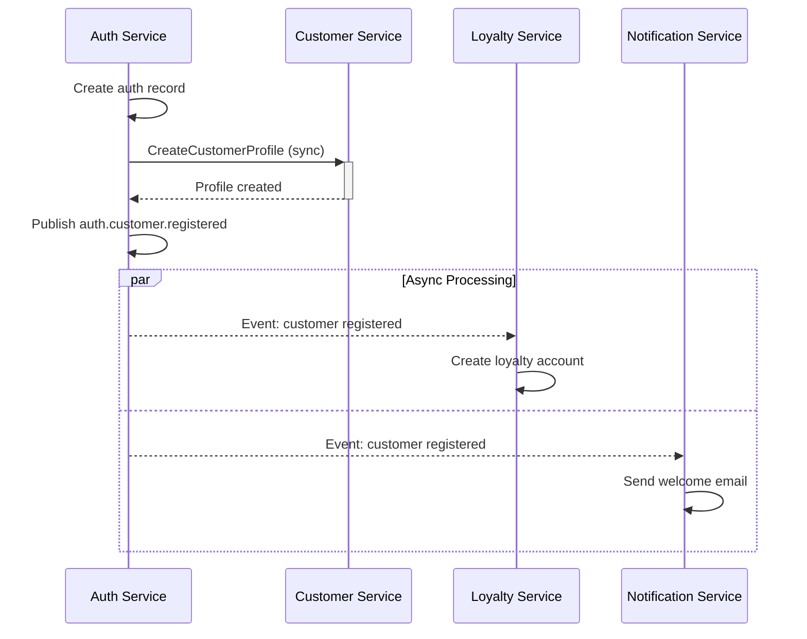
```mermaid
sequenceDiagram
    participant A as Auth Service
    participant C as Customer Service
    participant L as Loyalty Service
    participant N as Notification Service
    
    A->>A: Create auth record
    A->>+C: CreateCustomerProfile (sync)
    C-->>-A: Profile created
    
    A->>A: Publish auth.customer.registered
    
    par Async Processing
        A-->>L: Event: customer registered
        L->>L: Create loyalty account
    and
        A-->>N: Event: customer registered
        N->>N: Send welcome email
    end
```

#### **Saga Pattern for Complex Operations**
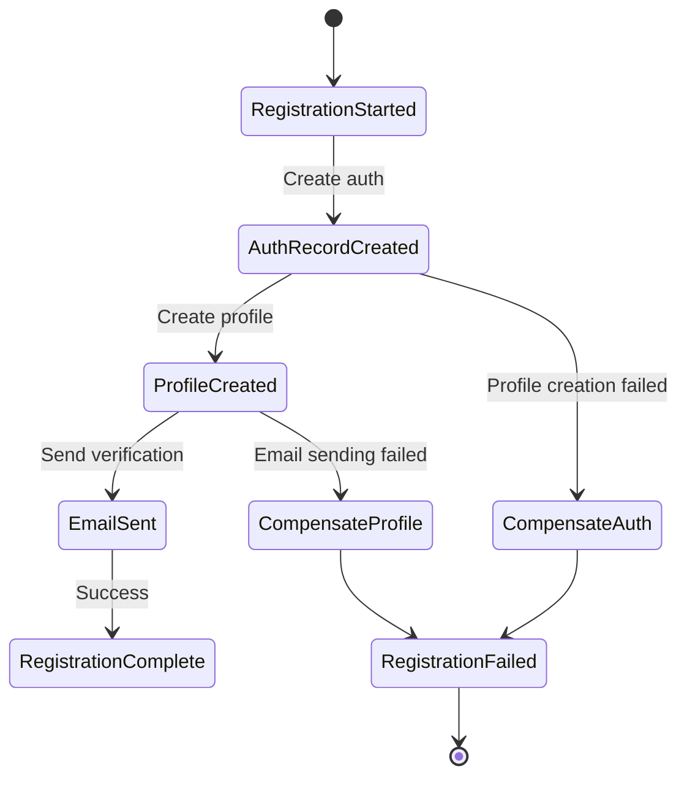
```mermaid
stateDiagram-v2
    [*] --> RegistrationStarted
    RegistrationStarted --> AuthRecordCreated: Create auth
    AuthRecordCreated --> ProfileCreated: Create profile
    ProfileCreated --> EmailSent: Send verification
    EmailSent --> RegistrationComplete: Success
    
    AuthRecordCreated --> CompensateAuth: Profile creation failed
    ProfileCreated --> CompensateProfile: Email sending failed
    CompensateAuth --> RegistrationFailed
    CompensateProfile --> RegistrationFailed
    RegistrationFailed --> [*]
```

---

## 🚨 **Disaster Recovery & Business Continuity**

### **Backup Strategies**
- **Database Backups**: Daily full backups, hourly incremental
- **Session Data**: Redis cluster with replication
- **File Storage**: Customer avatars and documents in S3 with versioning
- **Configuration**: Infrastructure as Code with version control

### **Recovery Procedures**
- **RTO (Recovery Time Objective)**: 4 hours
- **RPO (Recovery Point Objective)**: 1 hour
- **Failover**: Automated failover to secondary region
- **Data Recovery**: Point-in-time recovery capabilities

### **Business Continuity**
- **Service Degradation**: Graceful degradation with core functionality
- **Communication**: Automated status page updates
- **Customer Impact**: Minimal disruption with cached data
- **Recovery Validation**: Automated testing of recovery procedures

---

**Document Status**: ✅ Complete Implementation-Based Documentation  
**Last Updated**: January 30, 2026  
**Next Review**: February 29, 2026  
**Maintained By**: Customer Experience & Security Team