# 🛍️ Complete Customer Journey: Browse to Purchase

**Last Updated**: January 29, 2026  
**Status**: Based on Actual Implementation  
**Services Involved**: 15 services across the complete customer journey  
**Navigation**: [← Customer Journey](README.md) | [← Workflows](../README.md)

---

## 📋 **Overview**

This document describes the complete end-to-end customer journey from product discovery to order delivery, based on the actual implementation of our 19-service microservices platform. The workflow spans multiple services and includes all business logic, event flows, and integration points.

### **Business Context**
- **Domain**: Complete E-Commerce Customer Experience
- **Objective**: Convert visitors to customers through seamless shopping experience
- **Success Criteria**: Order completion with customer satisfaction
- **Key Metrics**: Conversion rate (target: 3-5%), cart abandonment rate, order completion time

---

## 🏗️ **Service Architecture**

### **Primary Services**
| Service | Role | Completion | Key Responsibilities |
|---------|------|------------|---------------------|
| 🚪 **Gateway Service** | Entry Point | 95% | Request routing, authentication, rate limiting |
| 🔍 **Search Service** | Discovery | 95% | Product search, filtering, recommendations |
| 📦 **Catalog Service** | Product Data | 95% | Product details, categories, attributes |
| 💰 **Pricing Service** | Price Calculation | 92% | Dynamic pricing, tax calculation |
| 📊 **Warehouse Service** | Stock Data | 90% | Inventory levels, availability |
| 🛍️ **Checkout Service** | Cart & Checkout | 90% | Cart management, checkout orchestration |
| 🎯 **Promotion Service** | Discounts | 92% | Coupon validation, discount calculation |
| 💳 **Payment Service** | Payment Processing | 95% | Multi-gateway payment processing |
| 🛒 **Order Service** | Order Management | 90% | Order creation, status management |
| 📋 **Fulfillment Service** | Order Processing | 92% | Pick, pack, ship workflow |
| 🚚 **Shipping Service** | Logistics | 85% | Multi-carrier shipping, tracking |
| 📧 **Notification Service** | Communication | 90% | Email, SMS, push notifications |
| ⭐ **Review Service** | Feedback | 85% | Product reviews, ratings |
| 🎁 **Loyalty Service** | Rewards | 95% | Points, tiers, rewards |
| 👤 **Customer Service** | Profile Data | 95% | Customer profiles, preferences |

---

## 🔄 **Complete Customer Journey Flow**

### **Phase 1: Discovery & Browsing**

#### **1.1 Product Search & Discovery**
**Services**: Gateway → Search → Catalog → Warehouse → Pricing

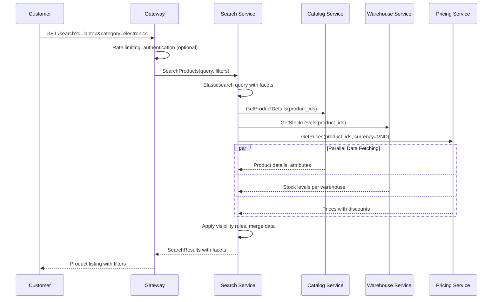

**Key Features:**
- **Full-text Search**: Elasticsearch with Vietnamese language support
- **Faceted Search**: Category, brand, price range, ratings filters
- **Real-time Stock**: Warehouse-specific availability
- **Dynamic Pricing**: Real-time price calculation with promotions
- **Visibility Rules**: Age restrictions, geo-restrictions, customer segments

#### **1.2 Product Detail View**
**Services**: Gateway → Catalog → Pricing → Warehouse → Review

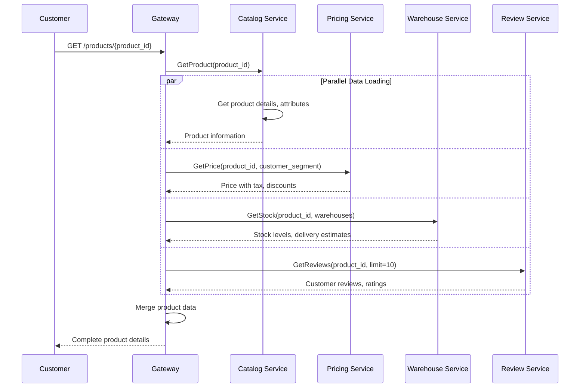

**Product Data Includes:**
- **Basic Info**: Name, description, SKU, brand
- **Attributes**: EAV system (Tier 1: hot attributes, Tier 2: flexible attributes)
- **Pricing**: Base price, discounts, tax-inclusive price
- **Availability**: Stock levels per warehouse, delivery estimates
- **Reviews**: Customer ratings, review summaries
- **Recommendations**: Related products, frequently bought together

---

### **Phase 2: Cart Management & Engagement**

#### **2.1 Add to Cart**
**Services**: Gateway → Checkout → Catalog → Pricing → Warehouse

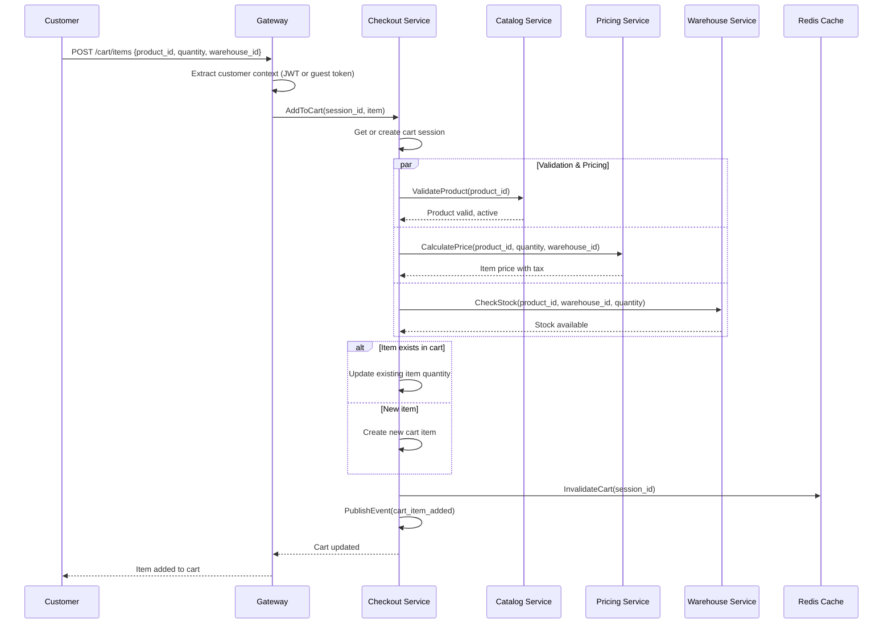

**Business Rules:**
- **Stock Validation**: Must have sufficient stock in selected warehouse
- **Price Calculation**: Real-time pricing with customer-specific discounts
- **Quantity Limits**: Maximum quantity per item (configurable)
- **Product Validation**: Product must be active and available
- **Session Management**: Guest sessions converted to customer sessions on login

#### **2.2 Cart Management Operations**
**Services**: Checkout Service (primary)

**Supported Operations:**
- **Update Quantity**: Recalculate pricing and validate stock
- **Remove Item**: Clean removal with cache invalidation
- **Apply Coupon**: Promotion service integration
- **Cart Merge**: Guest to customer cart merge on login
- **Cart Refresh**: Handle price/stock changes

#### **2.3 Promotion Application**
**Services**: Checkout → Promotion → Customer

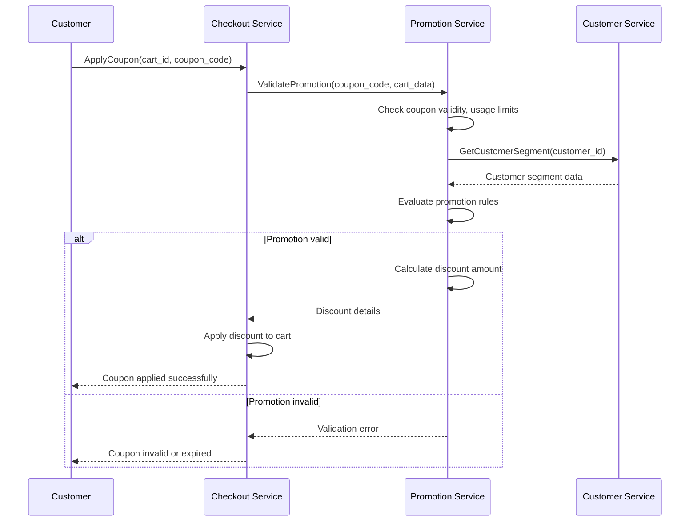

---

### **Phase 3: Checkout Process**

#### **3.1 Checkout Initiation**
**Services**: Gateway → Checkout → Warehouse → Shipping

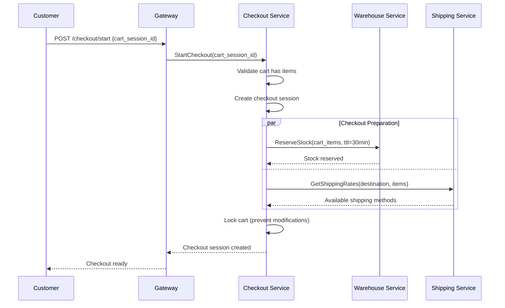

#### **3.2 Shipping & Address Selection**
**Services**: Checkout → Shipping → Customer

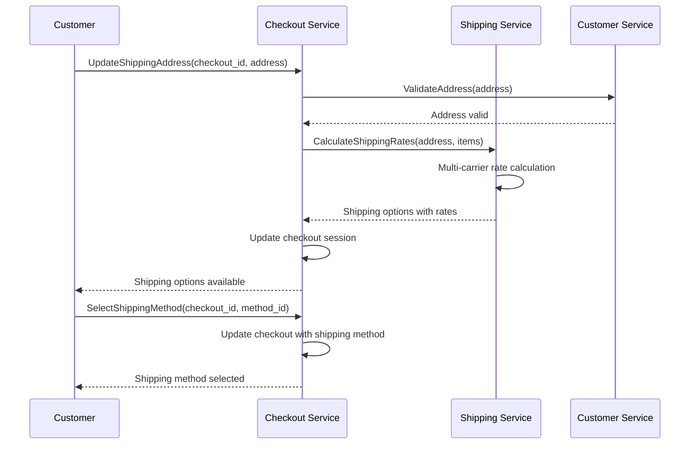

#### **3.3 Payment Method Selection**
**Services**: Checkout → Payment

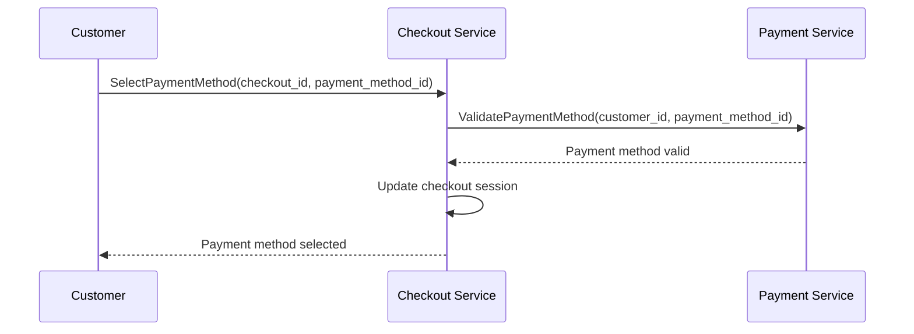

---

### **Phase 4: Order Creation & Payment**

#### **4.1 Order Preview**
**Services**: Checkout → Pricing → Promotion → Shipping

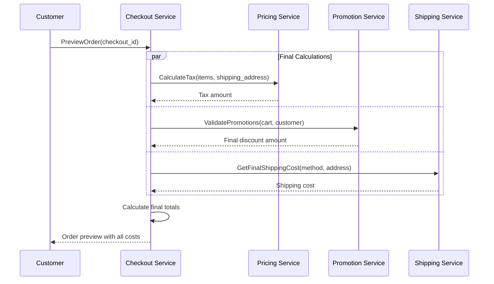

#### **4.2 Order Confirmation & Payment**
**Services**: Checkout → Order → Payment → Warehouse → Notification

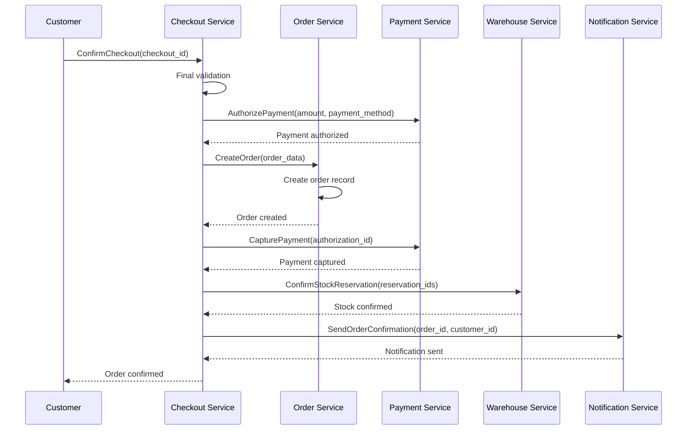

**Payment Methods Supported:**
- **Credit/Debit Cards**: Stripe integration
- **E-wallets**: PayPal, VNPay, MoMo
- **Bank Transfer**: VNPay integration
- **Cash on Delivery**: COD with shipping validation

---

### **Phase 5: Order Fulfillment**

#### **5.1 Fulfillment Creation**
**Services**: Order → Fulfillment → Warehouse

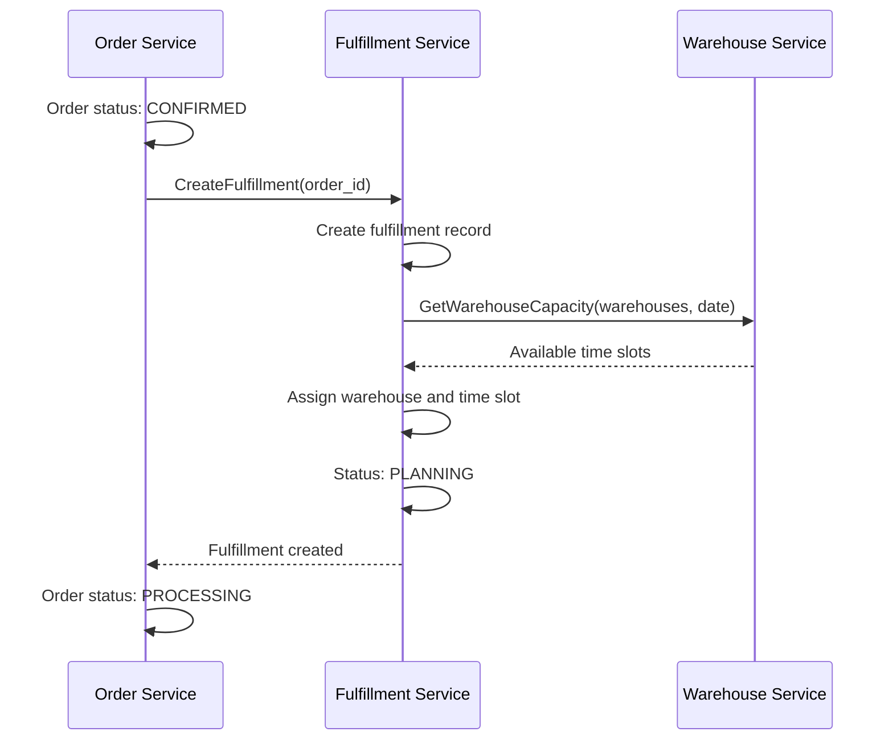

#### **5.2 Pick, Pack, Ship Workflow**
**Services**: Fulfillment → Warehouse → Shipping → Notification

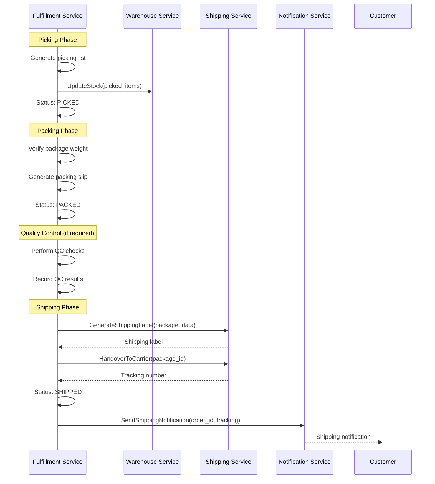

**Quality Control Rules:**
- **High-value orders** (≥1M VND): 100% QC required
- **Random sampling**: 10% of all orders
- **Manual QC**: Admin-triggered for specific orders
- **QC checks**: Item count, weight verification, defect inspection

---

### **Phase 6: Delivery & Post-Purchase**

#### **6.1 Delivery Tracking**
**Services**: Shipping → Notification → Order

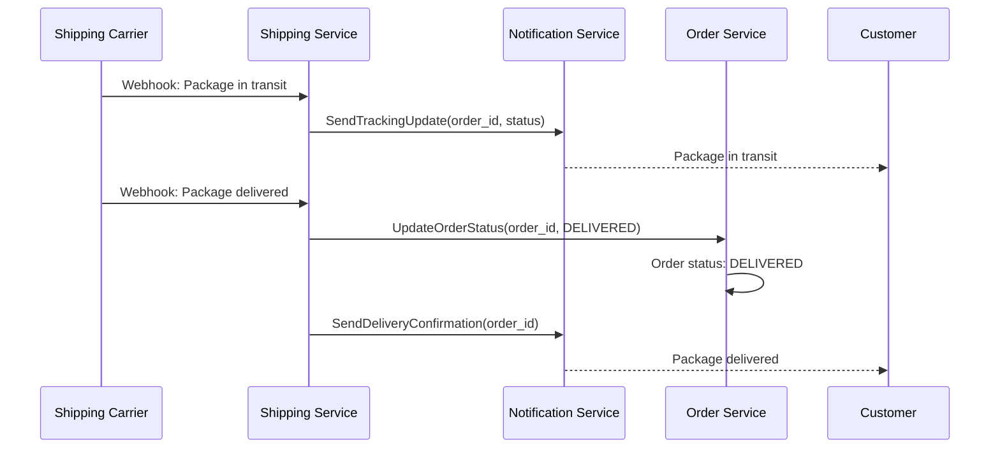

#### **6.2 Post-Purchase Experience**
**Services**: Review → Loyalty → Analytics

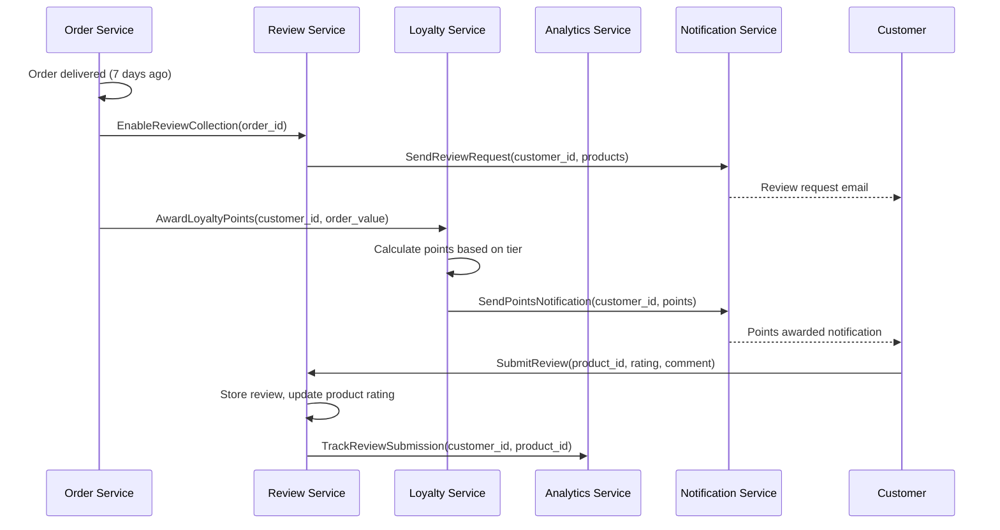

---

## 📊 **Event Flow Architecture**

### **Key Events Published**

**Search & Discovery Events:**
- `search.query.executed` → Analytics Service
- `product.viewed` → Analytics Service
- `search.result.clicked` → Analytics Service

**Cart & Checkout Events:**
- `cart.item.added` → Analytics Service
- `cart.item.removed` → Analytics Service
- `cart.abandoned` → Notification Service (abandoned cart emails)
- `checkout.started` → Analytics Service
- `checkout.completed` → Analytics Service

**Order Events:**
- `order.created` → Fulfillment, Notification, Analytics
- `order.confirmed` → Fulfillment, Notification, Analytics
- `order.shipped` → Notification, Analytics, Loyalty
- `order.delivered` → Review, Loyalty, Analytics

**Payment Events:**
- `payment.authorized` → Order Service
- `payment.captured` → Order Service, Notification
- `payment.failed` → Order Service, Notification

**Fulfillment Events:**
- `fulfillment.created` → Warehouse Service
- `fulfillment.picked` → Warehouse Service
- `fulfillment.packed` → Shipping Service
- `fulfillment.shipped` → Notification Service

---

## 🎯 **Business Rules & Validation**

### **Cart Management Rules**
- **Maximum items per cart**: 50 items
- **Maximum quantity per item**: 99 units
- **Stock validation**: Real-time stock checking
- **Price recalculation**: On every cart modification
- **Session timeout**: 24 hours for guest, 30 days for customers

### **Checkout Validation Rules**
- **Minimum order value**: 50,000 VND
- **Maximum order value**: 50,000,000 VND
- **Stock reservation**: 30-minute TTL
- **Address validation**: Required for shipping
- **Payment method validation**: Must belong to customer

### **Order Processing Rules**
- **Payment authorization**: Required before order creation
- **Stock confirmation**: Must confirm reservations
- **Fulfillment assignment**: Based on warehouse capacity
- **Quality control**: High-value orders require QC

---

## 📈 **Performance Metrics & SLAs**

### **Target Performance**
| Operation | Target Latency (P95) | Target Throughput |
|-----------|---------------------|-------------------|
| Product Search | <100ms | 1,000 queries/sec |
| Add to Cart | <200ms | 500 operations/sec |
| Checkout Start | <300ms | 100 operations/sec |
| Order Creation | <500ms | 50 orders/sec |
| Payment Processing | <2s | 25 payments/sec |

### **Business Metrics**
| Metric | Target | Current |
|--------|--------|---------|
| Conversion Rate | 3-5% | Tracking |
| Cart Abandonment | <70% | Tracking |
| Order Completion Time | <5 minutes | Tracking |
| Customer Satisfaction | >4.5/5 | Tracking |

---

## 🔒 **Security & Compliance**

### **Security Measures**
- **JWT Authentication**: All customer operations
- **Rate Limiting**: Prevent abuse and DDoS
- **Input Validation**: All user inputs sanitized
- **PCI DSS Compliance**: Payment data protection
- **GDPR Compliance**: Customer data protection

### **Audit Trails**
- **Customer Actions**: All cart and order operations logged
- **Payment Transactions**: Complete payment audit trail
- **Order Changes**: Full order lifecycle tracking
- **Security Events**: Authentication and authorization events

---

## 🚨 **Error Handling & Recovery**

### **Common Error Scenarios**

**Stock Unavailability:**
- **Detection**: Real-time stock checking
- **Response**: Remove item from cart, notify customer
- **Recovery**: Suggest alternatives, backorder option

**Payment Failures:**
- **Detection**: Payment gateway response
- **Response**: Retry payment, alternative methods
- **Recovery**: Hold cart for 15 minutes, send recovery email

**Service Unavailability:**
- **Detection**: Circuit breaker patterns
- **Response**: Graceful degradation, cached data
- **Recovery**: Automatic retry with exponential backoff

### **Compensation Patterns**
- **Order Creation Failure**: Release stock reservations, void payment
- **Payment Capture Failure**: Cancel order, release stock
- **Fulfillment Failure**: Retry or cancel order with refund

---

## 📋 **Integration Points**

### **External Integrations**
- **Payment Gateways**: Stripe, PayPal, VNPay, MoMo
- **Shipping Carriers**: GHN, Grab, VNPay Shipping, MoMo
- **Email Service**: SendGrid, AWS SES
- **SMS Service**: Twilio, local providers
- **Analytics**: Google Analytics, custom analytics

### **Internal Service Dependencies**
- **Critical Path**: Gateway → Search/Catalog → Checkout → Order → Payment → Fulfillment
- **Supporting Services**: Pricing, Promotion, Warehouse, Shipping, Notification
- **Data Services**: Customer, Review, Loyalty, Analytics

---

## 🔄 **Continuous Improvement**

### **Optimization Opportunities**
- **Search Performance**: Elasticsearch optimization, caching strategies
- **Cart Performance**: Redis optimization, session management
- **Checkout Conversion**: A/B testing, UX improvements
- **Payment Success**: Gateway optimization, retry strategies

### **Monitoring & Analytics**
- **Real-time Dashboards**: Order flow monitoring
- **Business Intelligence**: Conversion funnel analysis
- **Performance Monitoring**: Service latency and throughput
- **Customer Feedback**: Review analysis, satisfaction surveys

---

**Document Status**: ✅ Complete Implementation-Based Documentation  
**Last Updated**: January 29, 2026  
**Next Review**: February 29, 2026  
**Maintained By**: Customer Experience & Architecture Team