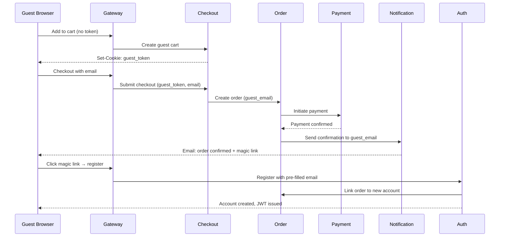

# Guest Checkout Flow

**Purpose**: Guest cart management, anonymous checkout, cart merge on login, post-purchase account creation  
**Services**: Gateway, Checkout, Order, Payment, Notification, Auth, Customer  
**Pattern Reference**: Shopify, Lazada (Malaysia/Thailand markets)

---

## Overview

Not all buyers want to register before purchasing. Guest checkout removes friction and increases conversion. The key challenges are: cart persistence, data collection without registration, and seamless account creation post-purchase.

---

## 1. Guest Cart Creation

**Trigger**: Unauthenticated user adds first item to cart.

```
Guest → Gateway (no auth token) → Checkout Service
    1. Generate guest session token (UUID, stored in cookie / localStorage)
    2. Create ephemeral cart bound to guest token
    3. Return Set-Cookie: guest_token=<uuid>; Max-Age=2592000 (30 days)
```

**Business rules**:
- Guest cart TTL: 30 days from last activity
- Guest cart is stored server-side (not just client-side) for resilience
- Same guest_token across browser sessions (cookie-based)
- Max 50 items in guest cart (same as authenticated cart)

---

## 2. Guest Cart Operations

All standard cart operations work identically for guest vs. authenticated:
- Add / update / remove items
- Apply promotions (platform-wide promotions only; user-specific vouchers require login)
- View shipping estimates (address entered ad-hoc)

**Restrictions for guest cart**:
- No loyalty points redemption (requires login)
- No user-specific vouchers (requires login)
- No saved addresses (must enter fresh each checkout)
- No order history linkage

---

## 3. Guest Checkout Flow

```
Guest (with guest_token) → Checkout Service

Step 1: Cart Review
    → Validate all items (active, in stock, price unchanged)

Step 2: Shipping Address Entry
    → Guest enters: name, phone, full address
    → Location Service: validate city/postal code
    → Show available shipping methods + estimated delivery dates

Step 3: Shipping Method Selection

Step 4: Platform Promotion Application
    → Platform-wide promotions auto-applied
    → Platform voucher input (if not user-specific)

Step 5: Payment Method Selection
    → Available: Card, COD, Digital Wallet (no saved methods)
    → No BNPL for guest (identity verification required)

Step 6: Email Collection (MANDATORY for guest)
    → "Where should we send your order confirmation?"
    → Input: email address
    → UI: soft prompt to register ("Create an account to track all orders")

Step 7: Order Summary → Submit

Step 8: Order Creation
    → Order Service: create order with guest_email, guest_phone
    → Guest token → order mapping stored
    → Inventory reservation
    → Payment initiation
```

---

## 4. Cart Merge on Login

**Trigger**: Guest with active cart logs in or registers.

```
Guest (with guest_token) → Auth Service → Login successful
    → Checkout Service: merge_carts(guest_token, user_id)
        1. Load guest cart items
        2. Load existing user cart (if any)
        3. Merge strategy:
           - If same SKU: take MAX quantity (favor guest cart qty)
           - If conflicts: keep both items, show user to review
        4. Transfer to user cart, invalidate guest cart
        5. Preserve any applied guest promotions
```

**Business rules**:
- If guest cart is empty, no merge needed
- Merge is idempotent (safe to call multiple times with same guest_token)
- Guest token invalidated after merge
- User is notified: "Your cart has been updated with [N] item(s)"

---

## 5. Post-Purchase Account Creation

**Trigger**: Guest order confirmed (payment captured).

```
Order Service → order.placed event → Notification Service
    → Send order confirmation to guest_email
    → In email: "Create account to track your order + earn points"
    → Include magic link: POST /auth/register-from-order?token=<signed_token>
        Token contains: guest_email, order_id, expires_in: 7 days

Guest clicks magic link → Auth Service
    → Pre-fill registration: email (from order), name (from shipping address)
    → Guest sets password
    → Account created + order linked to new account
    → Loyalty points retrospectively awarded for guest order
    → Guest token invalidated, new JWT issued
```

**Business rules**:
- Magic link token: signed JWT, 7-day expiry
- Do NOT send more than 1 account creation prompt per guest order
- If guest already has account with same email → prompt to login and link order
- Post-registration: entire guest order history linked to account (if email matches)

---

## 6. Guest Order Tracking

**Trigger**: Guest wants to track their order without an account.

```
Guest → GET /orders/track?email=<email>&order_id=<id>
    → Order Service: verify (email + order_id) matches guest_email
    → Return order status + tracking info (read-only, no mutations allowed)
```

**Security rules**:
- Rate limit: max 5 lookup attempts per IP per 15 minutes
- Do not expose full order details — mask: last 4 of card, partial address
- Do not expose other orders associated with same email

---

## 7. Guest Data Retention (GDPR / PDPA)

| Data | Retention | After |
|---|---|---|
| Guest cart | 30 days idle | Auto-purge |
| Guest order (no account created) | 2 years | Masked, anonymized |
| Guest email on order | 2 years → deleted on erasure request | GDPR right to erasure |
| Guest shipping address | 2 years → deleted on erasure request | GDPR right to erasure |

---

## State Machine

```
[Anonymous Session]
        │
   Add to Cart
        │
[Guest Cart Active]
        │
   ┌────┴────────────┐
   │                 │
Login / Register  Proceed to Checkout
   │                 │
Cart Merge    Email Collected
   │                 │
[User Cart]    Payment Initiated
                     │
               [Guest Order Created]
                     │
               ┌─────┴──────┐
               │             │
         Post-Purchase    No Action
         Magic Link
               │
         [Account Created + Order Linked]
```

---

## Events Published

| Event | Published By | When |
|---|---|---|
| `cart.guest_created` | Checkout Service | First item added to guest cart |
| `cart.merged` | Checkout Service | Guest cart merged into user cart |
| `order.placed_guest` | Order Service | Guest order confirmed |
| `customer.account_created_from_order` | Auth Service | Post-purchase account creation |

---

## Sequence Diagram



---

**Last Updated**: 2026-02-21  
**Owner**: Customer Experience Team
