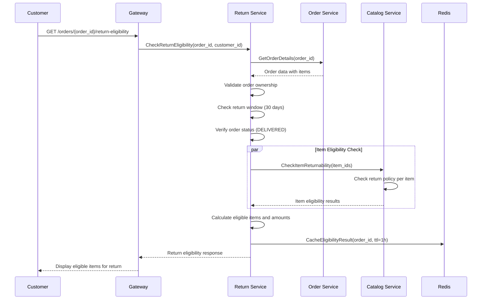
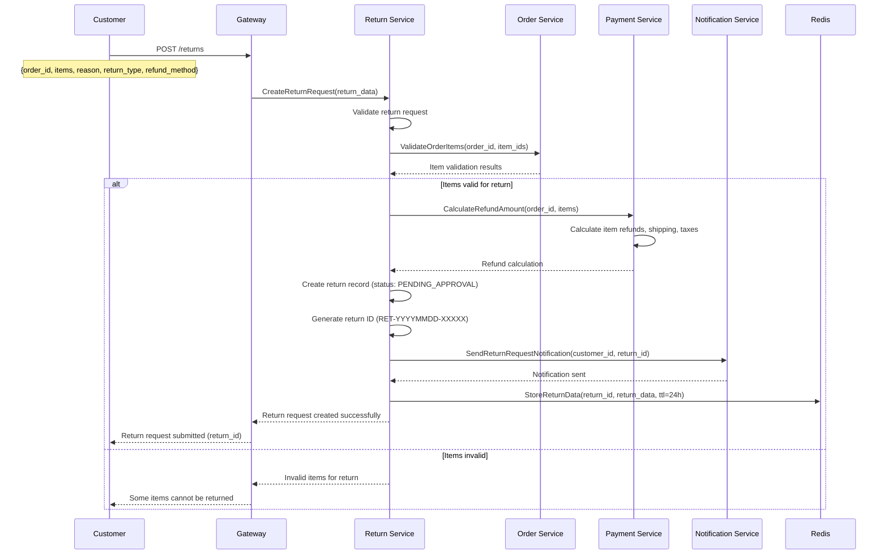
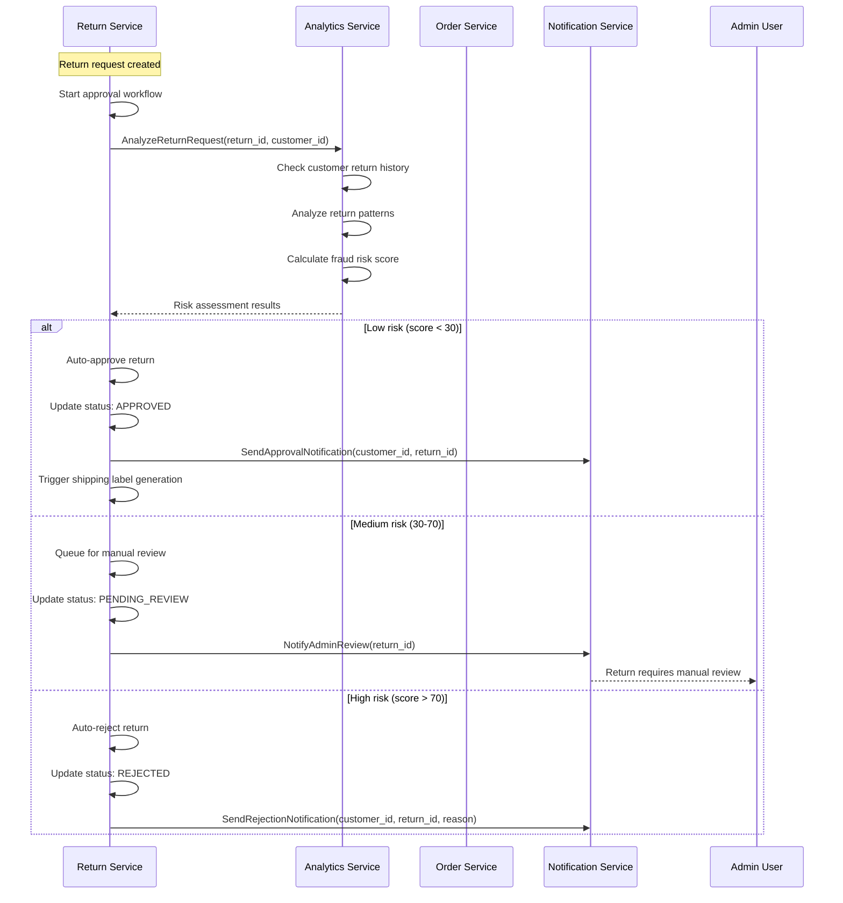
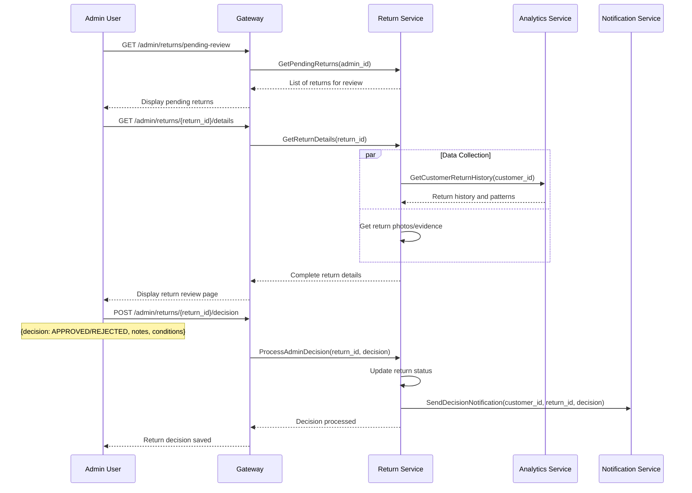
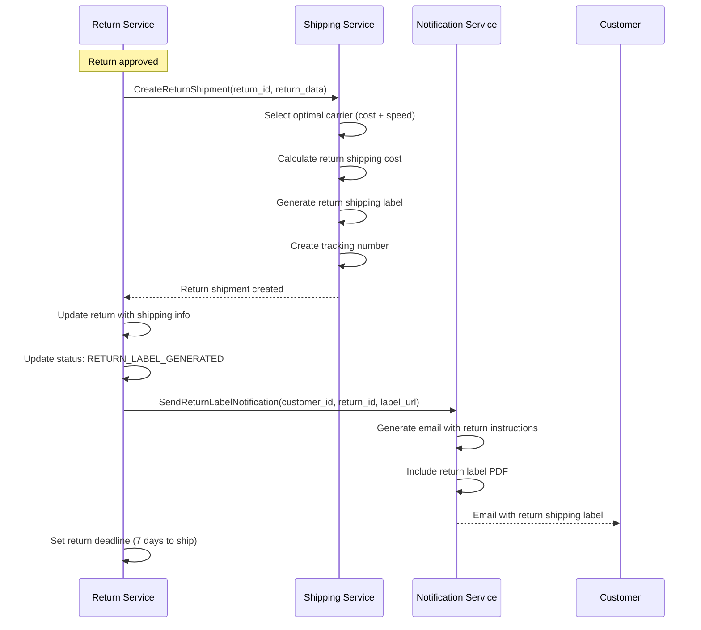
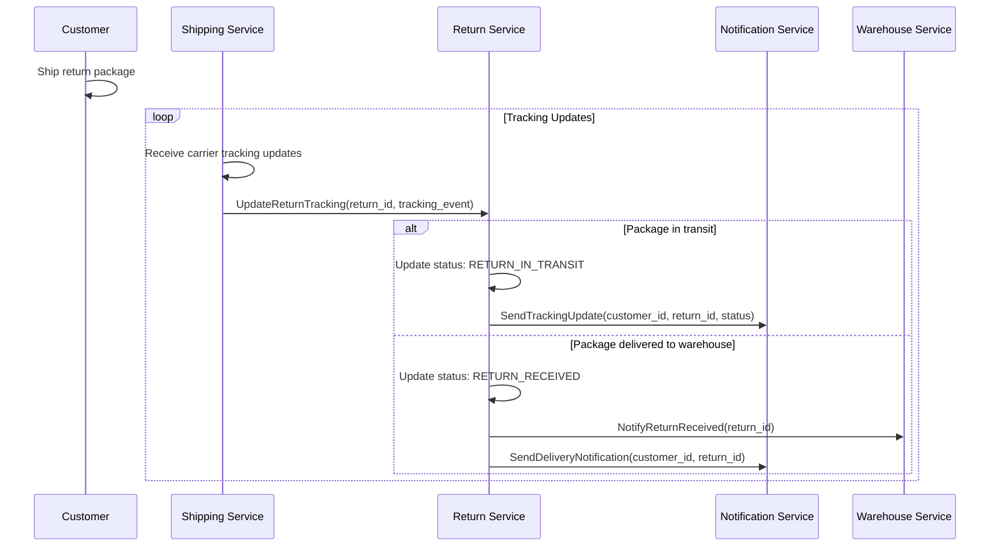
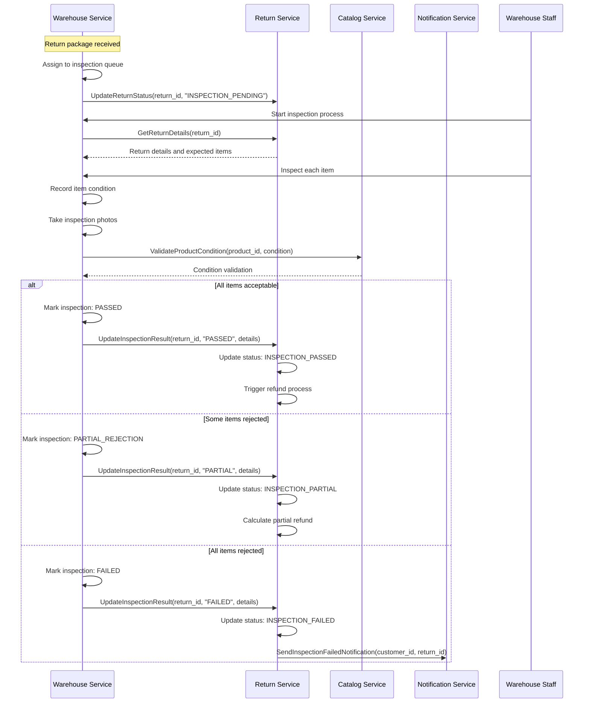
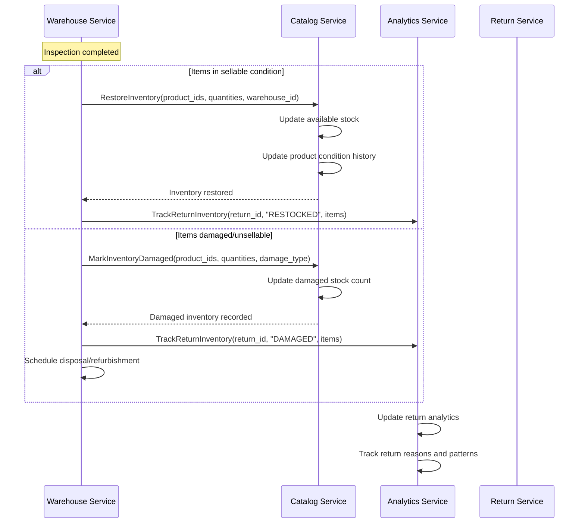
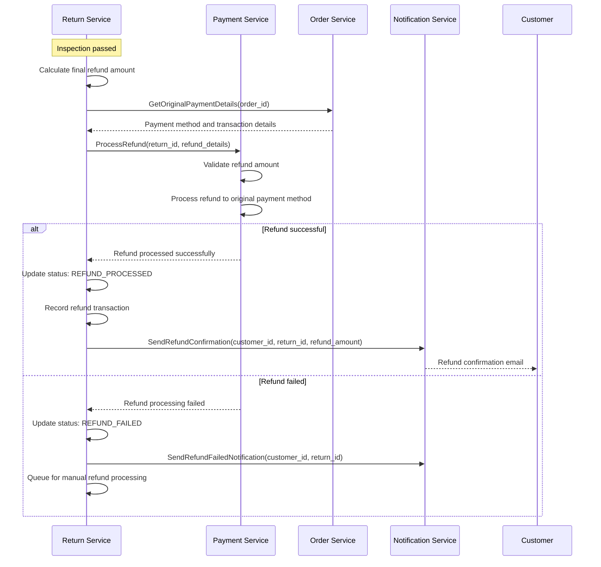
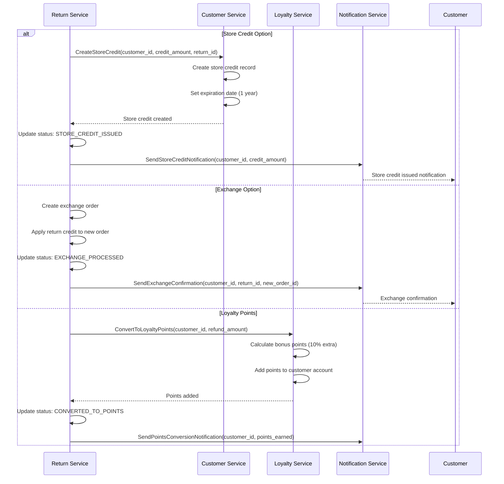

# ↩️ Returns & Exchanges Workflow

**Last Updated**: January 30, 2026  
**Status**: Based on Actual Implementation  
**Services Involved**: 9 services for complete returns lifecycle  
**Navigation**: [← Customer Journey](README.md) | [← Workflows](../README.md)

---

## 📋 **Overview**

This document describes the complete returns and exchanges workflow including return request initiation, approval process, shipping logistics, inspection, and refund processing based on the actual implementation of our microservices platform.

### **Business Context**
- **Domain**: Returns & Refund Management
- **Objective**: Seamless and efficient returns process for customer satisfaction
- **Success Criteria**: High return approval rate, fast processing, customer retention
- **Key Metrics**: Return processing time, refund accuracy, customer satisfaction

---

## 🏗️ **Service Architecture**

### **Primary Services**
| Service | Role | Completion | Key Responsibilities |
|---------|------|------------|---------------------|
| 🚪 **Gateway Service** | Entry Point | 95% | Request routing, authentication |
| ↩️ **Return Service** | Return Management | 85% | Return requests, approvals, lifecycle |
| 🛒 **Order Service** | Order Data | 90% | Order validation, item verification |
| 💳 **Payment Service** | Refund Processing | 95% | Payment reversals, refund calculations |
| 📦 **Catalog Service** | Product Data | 95% | Product validation, return eligibility |
| 🚚 **Shipping Service** | Return Logistics | 85% | Return shipping labels, tracking |
| 📊 **Warehouse Service** | Inventory Management | 90% | Stock updates, quality inspection |
| 📧 **Notification Service** | Communication | 90% | Return status updates, confirmations |
| 📈 **Analytics Service** | Return Analytics | 85% | Return patterns, fraud detection |

---

## 🔄 **Returns & Exchanges Workflow**

### **Phase 1: Return Request Initiation**

#### **1.1 Return Eligibility Check**
**Services**: Gateway → Return → Order → Catalog



**Return Eligibility Rules:**
- **Time Window**: 30 days from delivery date
- **Order Status**: Must be DELIVERED or PARTIALLY_DELIVERED
- **Item Condition**: New, unopened, with original packaging
- **Restricted Items**: Perishables, personalized items, intimate apparel
- **Return Limit**: Maximum 3 returns per order

#### **1.2 Return Request Creation**
**Services**: Gateway → Return → Order → Payment → Notification



**Return Request Data:**
```json
{
  "return_id": "RET-20260130-12345",
  "order_id": "ORD-20260115-67890",
  "customer_id": "cust_789012345",
  "return_type": "REFUND", // REFUND, EXCHANGE, STORE_CREDIT
  "items": [
    {
      "item_id": "item_123",
      "product_id": "prod_456",
      "quantity": 1,
      "reason": "DEFECTIVE",
      "condition": "UNOPENED",
      "refund_amount": 299000
    }
  ],
  "total_refund": 299000,
  "refund_method": "ORIGINAL_PAYMENT",
  "return_reason": "Product arrived damaged",
  "status": "PENDING_APPROVAL",
  "created_at": "2026-01-30T10:30:00Z"
}
```

---

### **Phase 2: Return Approval Process**

#### **2.1 Automated Approval System**
**Services**: Return → Analytics → Order



**Risk Assessment Factors:**
- **Customer History**: Previous return rate, fraud incidents
- **Return Frequency**: Returns within 30 days
- **Order Value**: High-value items require review
- **Return Reason**: Suspicious or inconsistent reasons
- **Item Condition**: Claimed condition vs. purchase history

#### **2.2 Manual Review Process**
**Services**: Return → Admin Dashboard → Analytics



---

### **Phase 3: Return Shipping & Logistics**

#### **3.1 Return Shipping Label Generation**
**Services**: Return → Shipping → Notification



**Return Shipping Features:**
- **Free Return Shipping**: For defective or wrong items
- **Customer Paid**: For change of mind returns
- **Carrier Selection**: Optimal carrier based on location and cost
- **Tracking**: Full tracking from pickup to warehouse
- **Insurance**: High-value items automatically insured

#### **3.2 Return Package Tracking**
**Services**: Shipping → Return → Notification



---

### **Phase 4: Return Inspection & Processing**

#### **4.1 Warehouse Inspection Process**
**Services**: Warehouse → Return → Catalog



**Inspection Criteria:**
- **Physical Condition**: Damage, wear, completeness
- **Packaging**: Original packaging, labels, accessories
- **Authenticity**: Product verification, serial numbers
- **Hygiene**: Cleanliness, odor, contamination
- **Functionality**: Electronic items tested for functionality

#### **4.2 Inventory Update Process**
**Services**: Warehouse → Catalog → Analytics



---

### **Phase 5: Refund Processing**

#### **5.1 Refund Calculation & Processing**
**Services**: Return → Payment → Order → Notification



**Refund Calculation Logic:**
```json
{
  "refund_calculation": {
    "item_refund": 299000,
    "shipping_refund": 25000, // If return due to seller error
    "tax_refund": 29900,
    "promotion_adjustment": -15000, // Deduct promotion if applicable
    "restocking_fee": 0, // For change of mind returns
    "total_refund": 338900
  },
  "refund_method": "ORIGINAL_PAYMENT",
  "processing_time": "3-5 business days",
  "currency": "VND"
}
```

#### **5.2 Store Credit & Exchange Processing**
**Services**: Return → Customer → Loyalty → Notification



---

## 📊 **Event Flow Architecture**

### **Key Events Published**

**Return Request Events:**
- `return.request.created` → Analytics, Notification
- `return.request.approved` → Shipping, Notification
- `return.request.rejected` → Analytics, Notification
- `return.label.generated` → Customer, Notification

**Return Processing Events:**
- `return.package.received` → Warehouse, Analytics
- `return.inspection.started` → Analytics
- `return.inspection.completed` → Payment, Analytics
- `return.refund.processed` → Customer, Analytics, Loyalty

**Inventory Events:**
- `inventory.returned` → Catalog, Analytics
- `inventory.damaged` → Catalog, Analytics
- `inventory.restocked` → Catalog, Search

### **Event Payload Example**

```json
{
  "event_id": "evt_ret_123456789",
  "event_type": "return.refund.processed",
  "timestamp": "2026-01-30T16:45:00Z",
  "version": "1.0",
  "data": {
    "return_id": "RET-20260130-12345",
    "order_id": "ORD-20260115-67890",
    "customer_id": "cust_789012345",
    "refund_amount": 338900,
    "refund_method": "ORIGINAL_PAYMENT",
    "currency": "VND",
    "items_returned": [
      {
        "item_id": "item_123",
        "product_id": "prod_456",
        "quantity": 1,
        "condition": "GOOD",
        "refund_amount": 299000
      }
    ],
    "processing_time_hours": 48,
    "inspection_result": "PASSED"
  },
  "metadata": {
    "correlation_id": "corr_ret_123456789",
    "service": "return-service",
    "version": "1.0.0"
  }
}
```

---

## 🎯 **Business Rules & Validation**

### **Return Eligibility Rules**
- **Time Limit**: 30 days from delivery date
- **Condition**: Items must be in original condition
- **Packaging**: Original packaging required
- **Usage**: Minimal usage allowed (electronics tested only)
- **Restrictions**: No returns on perishables, intimate items, personalized products

### **Refund Processing Rules**
- **Original Payment**: Refund to original payment method
- **Processing Time**: 3-5 business days for card refunds
- **Partial Refunds**: Prorated based on inspection results
- **Shipping Costs**: Refunded only for seller errors
- **Restocking Fee**: 15% for change of mind returns on electronics

### **Exchange Rules**
- **Same Product**: Exchange for same product in different size/color
- **Price Difference**: Customer pays/receives difference
- **Availability**: Subject to stock availability
- **Shipping**: Free exchange shipping for defective items

---

## 📈 **Performance Metrics & SLAs**

### **Target Performance**
| Operation | Target Latency (P95) | Target Throughput |
|-----------|---------------------|-------------------|
| Return Request | <500ms | 100 requests/sec |
| Approval Decision | <2s | 50 decisions/sec |
| Label Generation | <3s | 200 labels/sec |
| Refund Processing | <5s | 100 refunds/sec |
| Inspection Update | <300ms | 500 updates/sec |

### **Business SLAs**
| Process | Target SLA | Current Performance |
|---------|------------|-------------------|
| Return Approval | 24 hours | Tracking |
| Label Generation | 2 hours | Tracking |
| Inspection Processing | 48 hours | Tracking |
| Refund Processing | 5 business days | Tracking |
| Customer Response | 2 hours | Tracking |

### **Key Business Metrics**
| Metric | Target | Current | Frequency |
|--------|--------|---------|-----------|
| Return Rate | <10% | Tracking | Daily |
| Return Approval Rate | >85% | Tracking | Daily |
| Inspection Pass Rate | >80% | Tracking | Daily |
| Refund Success Rate | >98% | Tracking | Daily |
| Customer Satisfaction | >4.0/5 | Tracking | Weekly |

---

## 🔒 **Security & Compliance**

### **Security Measures**
- **Authentication**: All return operations require customer authentication
- **Authorization**: Customers can only access their own returns
- **Data Encryption**: All PII encrypted in transit and at rest
- **Audit Logging**: Complete audit trail for all return operations
- **Fraud Detection**: ML-based fraud detection for suspicious patterns

### **Compliance Features**
- **GDPR**: Right to data deletion, export, and correction
- **Consumer Protection**: Compliance with Vietnamese consumer protection laws
- **Financial Compliance**: PCI DSS compliance for refund processing
- **Data Retention**: Configurable data retention policies
- **Audit Trails**: Complete operation logging for compliance

---

## 🚨 **Error Handling & Recovery**

### **Common Error Scenarios**

**Return Request Failures:**
- **Invalid Order**: Order not found or not eligible
- **Time Expired**: Return window exceeded
- **Item Restrictions**: Non-returnable items selected
- **System Unavailable**: Service temporarily unavailable

**Processing Failures:**
- **Inspection Delays**: Warehouse capacity issues
- **Refund Failures**: Payment gateway issues
- **Shipping Issues**: Carrier service disruptions
- **Inventory Errors**: Stock update failures

### **Recovery Mechanisms**
- **Retry Logic**: Exponential backoff for transient failures
- **Dead Letter Queues**: Failed events for manual processing
- **Compensation**: Automatic compensation for system errors
- **Manual Override**: Admin tools for exception handling

---

## 📋 **Integration Points**

### **External Integrations**
- **Shipping Carriers**: FedEx, UPS, DHL, local carriers
- **Payment Gateways**: Stripe, PayPal, VNPay for refunds
- **Inspection Tools**: Barcode scanners, photo capture systems
- **Customer Support**: Zendesk, Freshdesk integration

### **Internal Service Dependencies**
- **Critical Path**: Return → Order → Payment → Warehouse
- **Supporting Services**: Notification, Analytics, Catalog
- **Data Services**: Customer (profiles), Shipping (logistics)

---

## Seller Appeal Process

When a return is approved by the platform against a seller's objection, sellers can appeal.

### Seller Appeal Flow

```
Return Service → return.approved event → Notification Service
    → Seller notification: "Return #RET-123 approved against your store"
    → Seller Centre: appeal button visible for 5 days after decision

Seller → Submit appeal:
    - Reason: evidence that buyer claim is false
    - Attachments: original dispatch photos, weight records, packing video
    → Return Service: create appeal record
    → SELLER_OPS admin queue

SELLER_OPS Admin:
    → Review: buyer evidence vs. seller evidence
    → Decision within 3 business days

    If seller wins appeal:
        → Return Service: reverse refund (if not yet processed) OR deduct from buyer store credit
        → Update: return status = APPEAL_SELLER_WON
        → Escrow: release funds back to seller
        → Notification: seller + buyer informed

    If buyer wins appeal:
        → Return Service: confirm original decision
        → Update: return status = APPEAL_DISMISSED
        → Seller: deducted from escrow (if not already done)
        → Notification: seller informed, final decision
```

**Appeal rules**:
- Max 1 appeal per return
- Seller must submit within 5 days of return decision
- Platform decision after appeal is final

---

## Chargeback vs. Platform Return — Conflict Handling

A buyer may file both a platform return AND a card chargeback for the same order.

```
Scenario: Return approved + refund processed, then buyer also files chargeback.

Payment Service detects chargeback on order with existing refund:
    → Check: refund_record WHERE order_id = chargeback.order_id
    → If refund already processed:
        → Prepare evidence: refund confirmation, refund timestamp, payment gateway refund ID
        → Submit to gateway: representment showing refund already issued
        → Gateway forwards to card network → chargeback dismissed
        → Log: chargeback.won_with_refund_evidence

Scenario: Chargeback filed before return is processed.
    → Order Service: flag order chargeback_in_progress = true
    → Return Service: pause refund processing for this return
    → FINANCE_ADMIN: decide — either fight chargeback (if fraudulent buyer)
      or let chargeback proceed (effectively same as refund, faster)
    → If chargeback succeeded:
        → Payment Service: funds reversed by bank
        → Return Service: cancel pending refund (double refund prevention)
        → Inventory: proceed with return item restock or quarantine
```

---

## Partial Refund Negotiation

For cases where full refund is disputed (item partially damaged, some accessories missing).

### Buyer-Seller Mediation Flow

```
Warehouse inspection → PARTIAL_REJECTION (some items accepted, some rejected)
    → Return Service: calculate partial_refund_amount
    → Notification to buyer: "We can refund ₫X for accepted items"

If buyer rejects partial refund offer:

    Buyer → Dispute escalation:
        Return Service: status = PARTIAL_DISPUTE
        CS Agent assigned

    CS Agent:
        → Review inspection photos + buyer's claim
        → Options:
            a) Accept buyer's full refund claim (over-approve)
            b) Stand by partial (send detailed inspection report to buyer)
            c) Offer compromise: ₫Y midpoint amount + store credit for remainder

        → Platform-funded resolution if product was misrepresented by seller:
            → Full refund approved, deduct from seller escrow

    Resolution:
        → CS Agent: record final_refund_amount with reason
        → Payment Service: process final_refund_amount
        → Notification: buyer + seller informed of final resolution
```

**Key principle**: In SEA markets (Shopee/Lazada model), platform absorbs disputed amounts where buyer satisfaction is at risk, then recovers from seller if seller-fault is proven.

---

## Changelog

### Version 2.0 (2026-02-21)
- Added seller appeal process with evidence submission and admin arbitration
- Added chargeback vs. platform return conflict handling and double-refund prevention
- Added partial refund negotiation and CS mediation flow

### Version 1.0 (2026-01-30)
- Initial returns workflow documentation

---

**Last Updated**: 2026-02-21  
**Maintained By**: Returns Management & Customer Experience Team