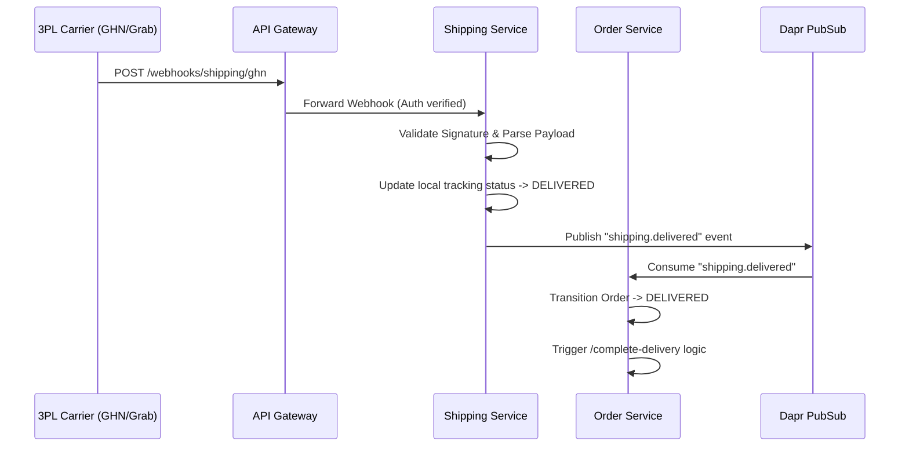
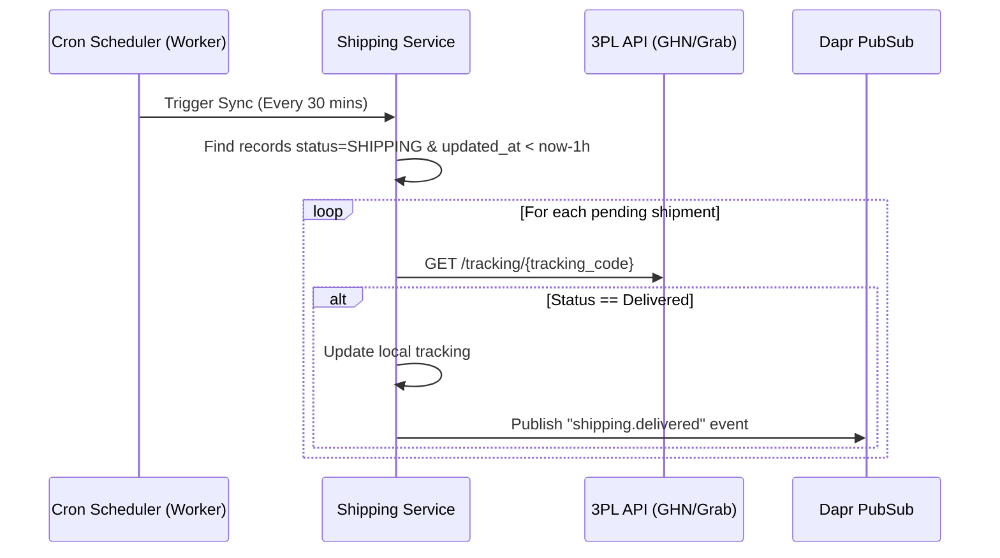

# 🚚 3PL Delivery & Webhook Flow

## Overview
This document describes the business workflow for syncing and completing order deliveries via Third-Party Logistics (3PL) partners such as GHN and Grab. It covers the transition of an order from the `SHIPPING` state to the `DELIVERED` state.

## Core Mechanisms
The delivery completion process utilizes a dual-engine approach to ensure data consistency and prompt updates:
1. **Real-time Webhook Engine**: Passive listening for instant updates from carriers.
2. **Scheduled Cronjob Engine**: Active polling for fallback synchronization.

---

## 1. Real-time Webhook Flow

When a 3PL driver completes a delivery, the carrier's system triggers a webhook to our Gateway, which routes it to the `shipping` service.

### Business Rules for Webhooks:
- **Signature Verification**: Every webhook payload must be cryptographically verified using the carrier's shared secret to prevent spoofing.
- **Idempotency**: Webhook events are processed using an Idempotency Key (usually `carrier_tracking_code` + `status`) to safely handle duplicate webhooks sent by the carrier.

---

## 2. Cronjob Polling Flow (Fallback)

Because webhooks can be missed (due to network drops, carrier timeouts, or gateway outages), a scheduled Cronjob runs periodically to reconcile orders that have been stuck in the `SHIPPING` state for an extended period.

### Business Rules for Polling:
- **Batching**: The cronjob processes tracking codes in batches to avoid rate limits from the 3PL providers.
- **Delay Buffer**: Polling only targets shipments that haven't been updated for at least 1-2 hours to give the webhook engine priority.

---

## 3. The `complete-delivery` Internal API

Once an order is confirmed delivered (either via webhook or cronjob), the `Order` service invokes its internal `complete-delivery` engine.

### Downstream Effects:
1. **Financial Capture**: If the order was COD (Cash on Delivery), the system marks the payment status as pending reconciliation with the 3PL.
2. **Loyalty Points**: Customers are credited with loyalty points/rewards upon successful delivery.
3. **Return Window Activation**: The return policy timer (e.g., 7-day return) begins precisely at the `delivered_at` timestamp.
