# 🔗 Integration Flows

**Purpose**: System integrations and data synchronization workflows  
**Navigation**: [← Workflows](../README.md) | [← Back to Main](../../README.md) | [Sequence Diagrams →](../sequence-diagrams/README.md)

---

## 📋 **Overview**

This section contains detailed documentation of system integration workflows that enable seamless communication and data synchronization across our 19-service microservices platform. These workflows focus on event-driven architecture, real-time data synchronization, external API integrations, and search indexing processes.

### **🎯 Integration Scope**

Our integration flow documentation covers the critical system integration patterns that enable our distributed architecture:

1. **🔄 Event-Driven Communication** - Asynchronous service communication via events
2. **📊 Real-Time Data Sync** - Consistent data across services and systems
3. **🌐 External API Integration** - Third-party service integrations
4. **🔍 Search & Analytics** - Data indexing and business intelligence

---

## 📚 **Integration Flow Documents**

### **[Event Processing](event-processing.md)**
**Event-driven architecture flows across 19 services**

- **Scope**: Complete event lifecycle from publishing to consumption
- **Services**: All 19 services participate in event-driven architecture
- **Technology**: Dapr Pub/Sub with Redis Streams, PostgreSQL Event Store
- **Key Features**: Event publishing, routing, consumption, saga orchestration, error handling

**Business Impact**: System decoupling, scalability, reliability, audit trails, real-time processing

### **[Data Synchronization](data-synchronization.md)** 🚧
**Real-time data sync patterns (product, price, stock)**

- **Scope**: Real-time data consistency across services and external systems
- **Services**: 8 services involved (Catalog, Search, Warehouse, Pricing, Gateway, Analytics, Cache, External APIs)
- **Technology**: Change Data Capture (CDC), Event Sourcing, Redis Caching
- **Key Features**: Real-time sync, conflict resolution, eventual consistency, performance optimization

**Business Impact**: Data consistency, performance optimization, customer experience, operational efficiency

### **[External APIs](external-apis.md)** 🚧
**Third-party integrations (payment gateways, shipping carriers)**

- **Scope**: Integration with external service providers and APIs
- **Services**: 6 services involved (Payment, Shipping, Notification, Auth, Analytics, Gateway)
- **Technology**: REST APIs, Webhooks, OAuth2, Circuit Breakers
- **Key Features**: Multi-provider support, failover, rate limiting, security, monitoring

**Business Impact**: Service reliability, vendor diversification, cost optimization, feature expansion

### **[Search Indexing](search-indexing.md)** 🚧
**Elasticsearch indexing and search workflows**

- **Scope**: Real-time search index management and optimization
- **Services**: 5 services involved (Search, Catalog, Warehouse, Analytics, Gateway)
- **Technology**: Elasticsearch, Real-time indexing, Search analytics
- **Key Features**: Real-time indexing, search optimization, analytics, performance monitoring

**Business Impact**: Search performance, product discovery, customer experience, business intelligence

---

## 🔄 **Integration Architecture Overview**

```mermaid
graph TB
    subgraph "Event-Driven Integration"
        A[🔄 Event Publishing] --> B[📨 Event Routing]
        B --> C[🎯 Event Consumption]
        C --> D[🔄 Saga Orchestration]
    end
    
    subgraph "Data Synchronization"
        E[📊 Change Detection] --> F[🔄 Real-time Sync]
        F --> G[🗄️ Cache Updates]
        G --> H[📈 Analytics Updates]
    end
    
    subgraph "External Integration"
        I[🌐 API Calls] --> J[🔒 Authentication]
        J --> K[⚡ Rate Limiting]
        K --> L[🛡️ Circuit Breakers]
    end
    
    subgraph "Search Integration"
        M[🔍 Index Updates] --> N[📊 Search Analytics]
        N --> O[🎯 Query Optimization]
        O --> P[📈 Performance Monitoring]
    end
    
    A --> E
    E --> I
    I --> M
```

---

## 📊 **Integration Performance Metrics**

### **Event Processing Performance**

| Metric | Target | Current | Impact |
|--------|--------|---------|--------|
| **Event Publishing Latency** | <10ms (P95) | Tracking | System responsiveness |
| **Event Processing Latency** | <100ms (P95) | Tracking | Business process speed |
| **Event Throughput** | 50,000 events/sec | Tracking | System scalability |
| **Delivery Success Rate** | >99.9% | Tracking | Data consistency |
| **Processing Success Rate** | >99.5% | Tracking | Business continuity |

### **Data Synchronization Performance**

| Metric | Target | Current | Impact |
|--------|--------|---------|--------|
| **Sync Latency** | <500ms (P95) | Tracking | Data freshness |
| **Sync Success Rate** | >99.9% | Tracking | Data consistency |
| **Conflict Resolution Time** | <1 second | Tracking | System stability |
| **Cache Hit Rate** | >95% | Tracking | Performance optimization |
| **Data Freshness** | <1 minute | Tracking | Customer experience |

### **External API Performance**

| Metric | Target | Current | Impact |
|--------|--------|---------|--------|
| **API Response Time** | <2 seconds (P95) | Tracking | Customer experience |
| **API Success Rate** | >99% | Tracking | Service reliability |
| **Failover Time** | <30 seconds | Tracking | Service continuity |
| **Rate Limit Compliance** | 100% | Tracking | Service stability |
| **Circuit Breaker Efficiency** | >95% | Tracking | Error prevention |

### **Search Integration Performance**

| Metric | Target | Current | Impact |
|--------|--------|---------|--------|
| **Index Update Latency** | <1 second | Tracking | Search freshness |
| **Search Response Time** | <100ms (P95) | Tracking | User experience |
| **Index Success Rate** | >99.9% | Tracking | Search accuracy |
| **Search Accuracy** | >95% relevance | Tracking | Customer satisfaction |
| **Index Size Optimization** | <10GB per index | Tracking | Cost optimization |

---

## 🎯 **Integration Patterns & Best Practices**

### **Event-Driven Patterns**

**Publisher-Subscriber Pattern:**
- **Decoupled Communication**: Services communicate without direct dependencies
- **Scalable Architecture**: Easy to add new subscribers without changing publishers
- **Reliable Delivery**: At-least-once delivery with deduplication
- **Event Sourcing**: Complete audit trail and replay capability

**Saga Pattern:**
- **Distributed Transactions**: Manage complex workflows across multiple services
- **Compensation Logic**: Automatic rollback for failed transactions
- **State Management**: Persistent saga state for recovery and monitoring
- **Timeout Handling**: Configurable timeouts with automatic compensation

### **Data Synchronization Patterns**

**Change Data Capture (CDC):**
- **Real-time Sync**: Immediate propagation of data changes
- **Low Latency**: Minimal delay between source and target systems
- **Conflict Resolution**: Strategies for handling concurrent updates
- **Performance Optimization**: Efficient change detection and propagation

**Event Sourcing:**
- **Immutable Events**: Complete history of all data changes
- **Replay Capability**: Rebuild system state from events
- **Audit Trails**: Complete audit trail for compliance
- **Temporal Queries**: Query system state at any point in time

### **External Integration Patterns**

**Circuit Breaker Pattern:**
- **Fault Tolerance**: Prevent cascade failures from external services
- **Automatic Recovery**: Automatic detection and recovery from failures
- **Fallback Strategies**: Graceful degradation when services unavailable
- **Monitoring**: Real-time monitoring of external service health

**Retry Pattern:**
- **Transient Fault Handling**: Automatic retry for temporary failures
- **Exponential Backoff**: Intelligent retry timing to avoid overwhelming services
- **Jitter**: Random delay to prevent thundering herd problems
- **Dead Letter Queues**: Handle permanently failed requests

### **Search Integration Patterns**

**Real-time Indexing:**
- **Immediate Updates**: Search index updated in real-time
- **Bulk Operations**: Efficient batch updates for large changes
- **Index Optimization**: Automatic index optimization and maintenance
- **Performance Monitoring**: Real-time search performance tracking

**Search Analytics:**
- **Query Analysis**: Understanding search patterns and performance
- **Result Optimization**: Improving search relevance and accuracy
- **User Behavior**: Tracking search behavior for business insights
- **A/B Testing**: Testing search algorithm improvements

---

## 🔧 **Integration Technology Stack**

### **Event Processing Technologies**

**Dapr (Distributed Application Runtime):**
- **Pub/Sub**: Event publishing and subscription
- **State Management**: Distributed state management
- **Service Invocation**: Secure service-to-service communication
- **Bindings**: External system integration

**Redis Streams:**
- **Event Storage**: Persistent event storage with ordering
- **Consumer Groups**: Scalable event consumption
- **Message Replay**: Event replay capability
- **High Performance**: Low-latency event processing

### **Data Synchronization Technologies**

**Change Data Capture (CDC):**
- **Debezium**: Open-source CDC platform
- **PostgreSQL Logical Replication**: Native database replication
- **Event Streaming**: Real-time change event streaming
- **Conflict Resolution**: Automated conflict detection and resolution

**Caching Technologies:**
- **Redis Cluster**: Distributed caching for high availability
- **Cache Invalidation**: Intelligent cache invalidation strategies
- **Cache Warming**: Proactive cache population
- **Performance Optimization**: Cache hit rate optimization

### **External Integration Technologies**

**API Gateway:**
- **Kong**: High-performance API gateway
- **Rate Limiting**: Configurable rate limiting per API
- **Authentication**: OAuth2, JWT, API key authentication
- **Monitoring**: Real-time API performance monitoring

**HTTP Clients:**
- **Resilient HTTP**: Circuit breakers, retries, timeouts
- **Connection Pooling**: Efficient connection management
- **Load Balancing**: Distribute requests across multiple endpoints
- **SSL/TLS**: Secure communication with external services

### **Search Technologies**

**Elasticsearch:**
- **Full-text Search**: Advanced search capabilities
- **Real-time Indexing**: Immediate search index updates
- **Analytics**: Search analytics and reporting
- **Scalability**: Horizontal scaling for large datasets

**Search Optimization:**
- **Query DSL**: Advanced query construction
- **Aggregations**: Real-time analytics and faceting
- **Relevance Tuning**: Search result relevance optimization
- **Performance Monitoring**: Search performance tracking

---

## 🚀 **Integration Optimization Roadmap**

### **Current Capabilities (88% Complete)**

**✅ Implemented Features:**
- Event-driven architecture with Dapr and Redis Streams
- Real-time data synchronization across core services
- Multi-gateway payment processing integration
- Multi-carrier shipping integration
- Elasticsearch-based product search
- Comprehensive monitoring and alerting

### **Near-Term Enhancements (Q1 2026)**

**🔄 In Development:**
- **Advanced Event Analytics**: Machine learning-based event pattern analysis
- **Intelligent Caching**: AI-powered cache optimization
- **Enhanced Circuit Breakers**: Predictive failure detection
- **Search Personalization**: AI-powered personalized search results

### **Future Roadmap (Q2-Q4 2026)**

**🚧 Planned Features:**
- **Event Mesh Architecture**: Advanced event routing and transformation
- **Real-time ML Integration**: Real-time machine learning model serving
- **Blockchain Integration**: Supply chain transparency and verification
- **Edge Computing**: Distributed processing for global scalability

---

## 📋 **Integration Compliance & Standards**

### **Industry Standards**

**Integration Standards:**
- **OpenAPI 3.0**: Standardized API documentation and contracts
- **CloudEvents**: Standardized event format and metadata
- **JSON Schema**: Event payload validation and documentation
- **OAuth2/OIDC**: Secure authentication and authorization

**Data Standards:**
- **ISO 8601**: Standardized date and time formats
- **UTF-8**: Unicode text encoding standard
- **JSON**: Lightweight data interchange format
- **Protocol Buffers**: Efficient binary serialization

### **Security Standards**

**Communication Security:**
- **TLS 1.3**: Secure communication encryption
- **mTLS**: Mutual authentication for service-to-service communication
- **JWT**: Secure token-based authentication
- **API Keys**: Secure API access control

**Data Security:**
- **Encryption at Rest**: Database and file encryption
- **Encryption in Transit**: Network communication encryption
- **Key Management**: Secure cryptographic key management
- **Access Controls**: Role-based access control (RBAC)

---

## 📖 **How to Use This Documentation**

### **For Integration Engineers**
- **System Design**: Understand integration patterns and best practices
- **Implementation Planning**: Plan integration implementations and dependencies
- **Troubleshooting**: Diagnose and resolve integration issues
- **Performance Optimization**: Optimize integration performance and reliability

### **For Platform Architects**
- **Architecture Planning**: Design scalable and resilient integration architecture
- **Technology Selection**: Choose appropriate integration technologies
- **Standards Definition**: Define integration standards and patterns
- **Capacity Planning**: Plan integration infrastructure capacity

### **For DevOps Engineers**
- **Deployment Planning**: Deploy and manage integration infrastructure
- **Monitoring Setup**: Implement comprehensive integration monitoring
- **Incident Response**: Respond to integration-related incidents
- **Performance Tuning**: Optimize integration infrastructure performance

### **For Business Analysts**
- **Integration Impact**: Understand business impact of integration decisions
- **Requirements Gathering**: Define integration requirements and constraints
- **Process Optimization**: Identify integration optimization opportunities
- **Compliance Management**: Ensure integration compliance with regulations

---

## 🎯 **Success Metrics & KPIs**

### **Integration Reliability Metrics**
- **System Uptime**: >99.9% across all integrations
- **Error Rate**: <0.1% for critical integrations
- **Recovery Time**: <15 minutes for integration failures
- **Data Consistency**: >99.99% across synchronized systems

### **Integration Performance Metrics**
- **Latency**: <100ms for real-time integrations
- **Throughput**: 50,000+ events/second capacity
- **Scalability**: Linear scaling with load
- **Resource Efficiency**: <80% resource utilization

### **Business Impact Metrics**
- **Customer Experience**: >4.5/5 satisfaction rating
- **Operational Efficiency**: 30% reduction in manual processes
- **Cost Optimization**: 20% reduction in integration costs
- **Time to Market**: 50% faster feature delivery

### **Compliance Metrics**
- **Security Compliance**: 100% compliance with security standards
- **Data Privacy**: 100% GDPR compliance
- **Audit Trail**: 100% of transactions auditable
- **Regulatory Compliance**: 100% compliance with local regulations

---

**Last Updated**: January 30, 2026  
**Platform Status**: 88% Complete, Integration Flows Production Ready  
**Maintained By**: Platform Integration & Architecture Team