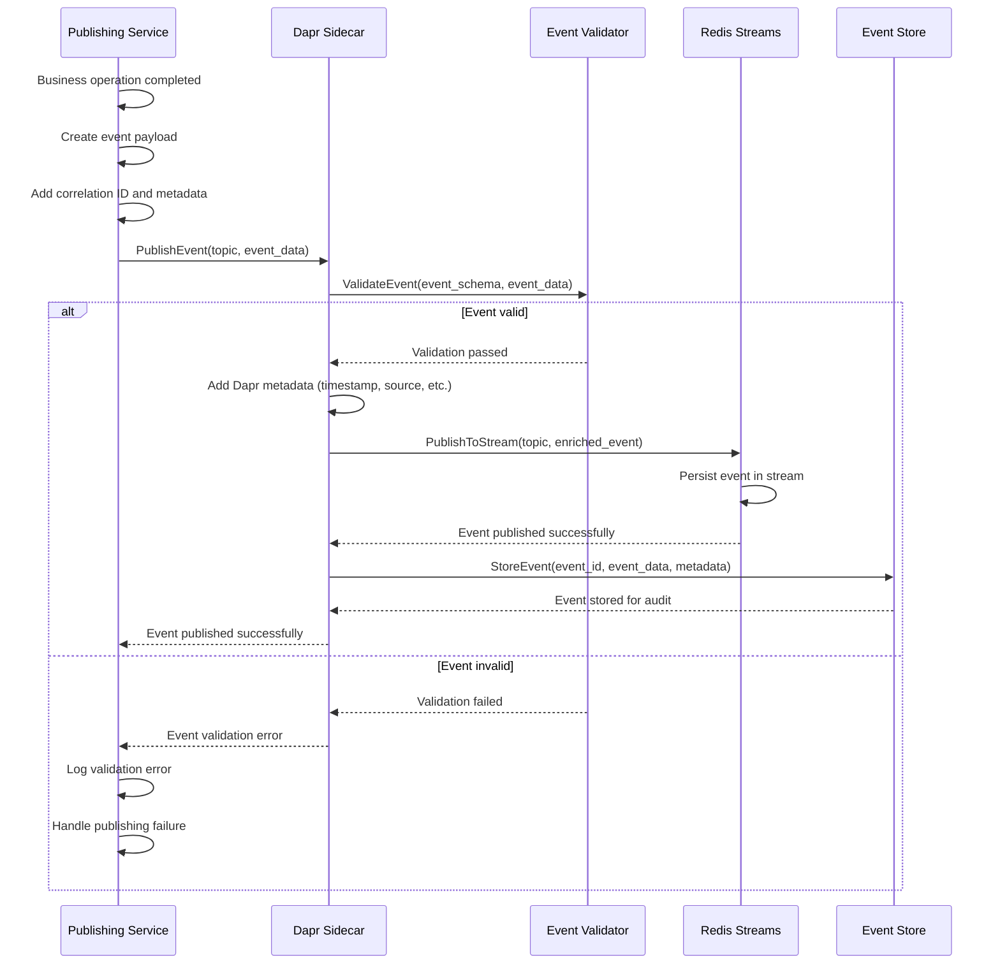
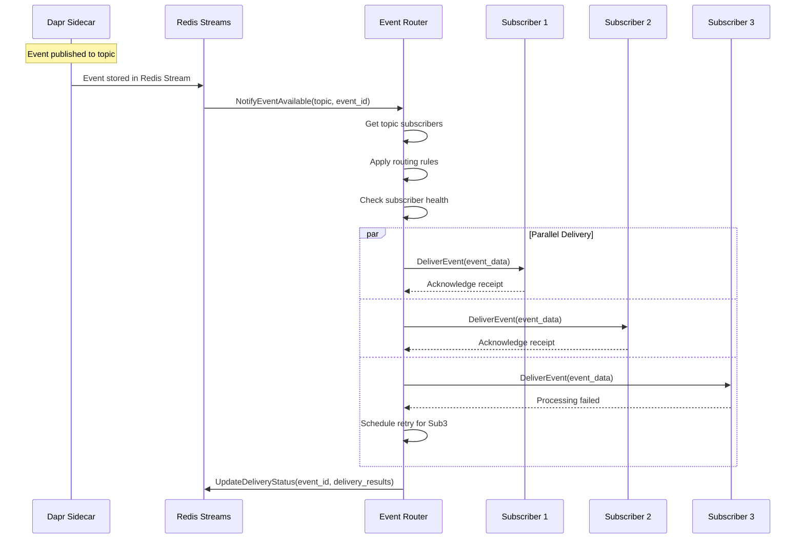
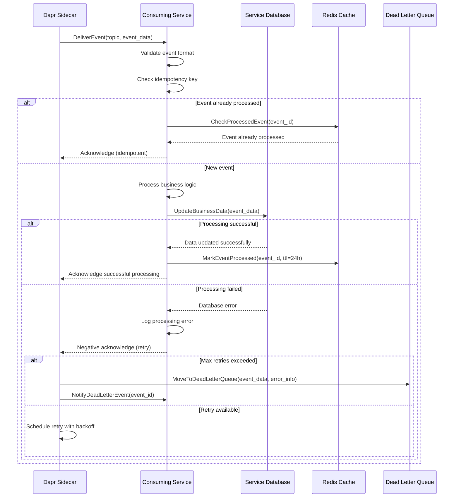
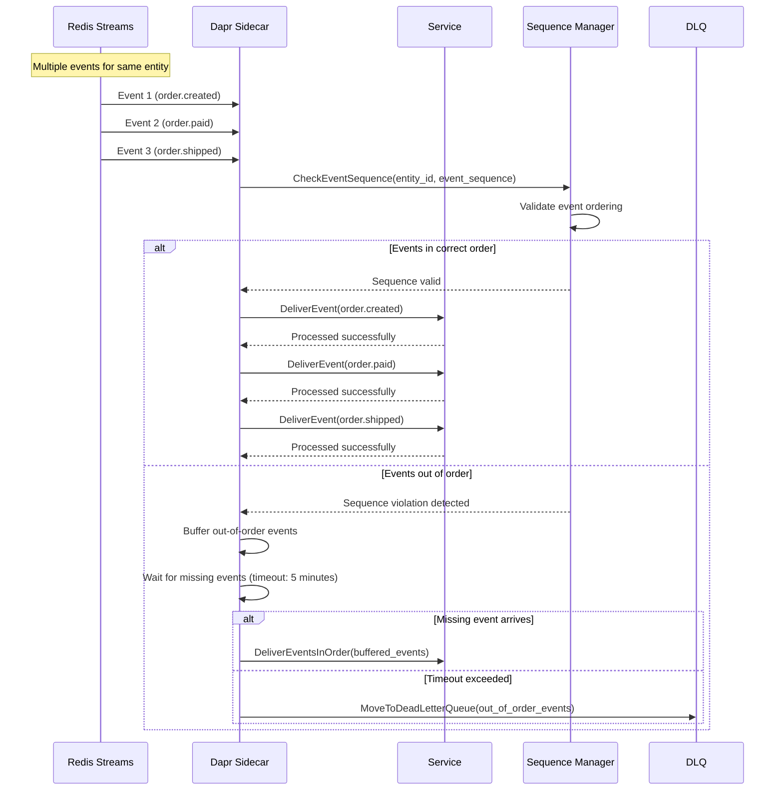
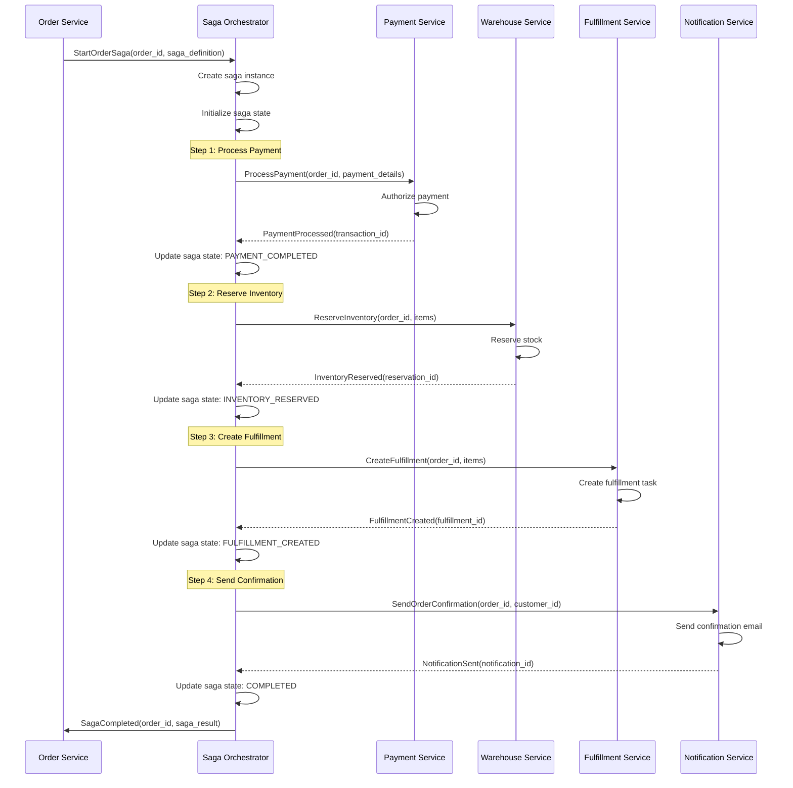
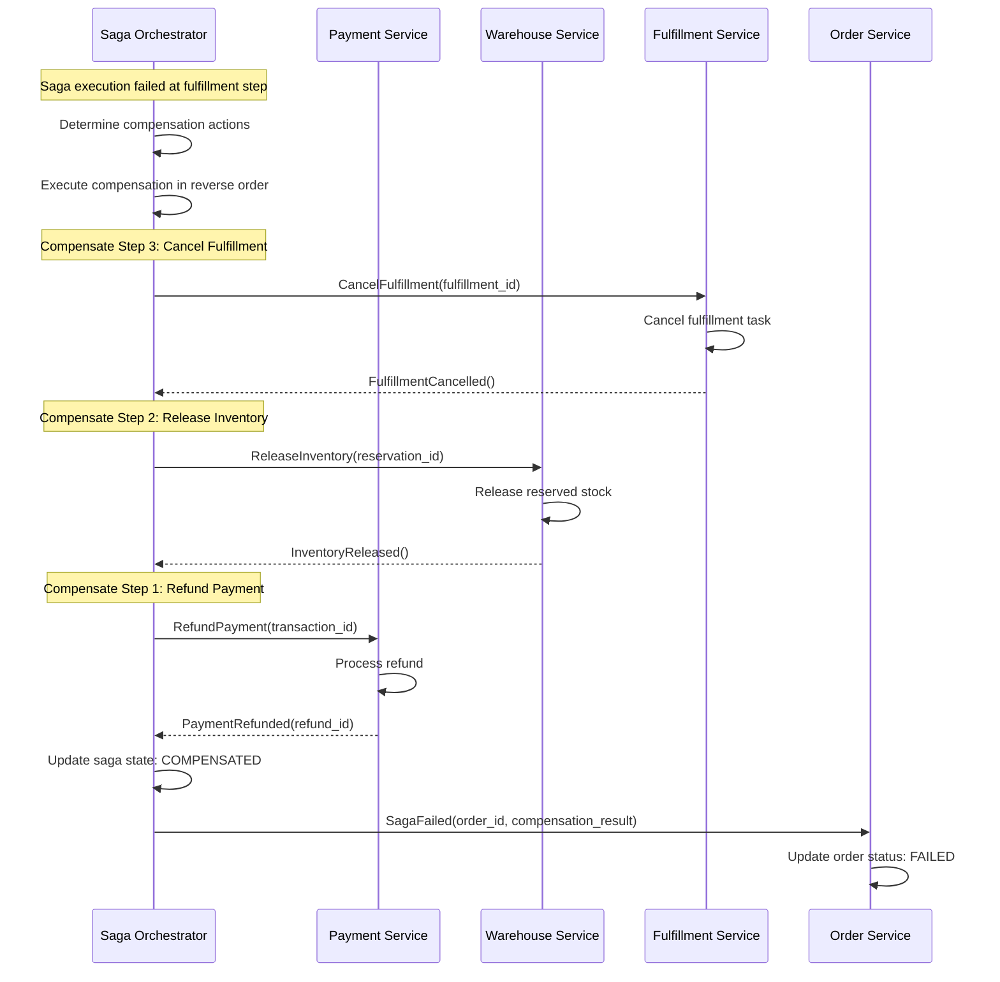
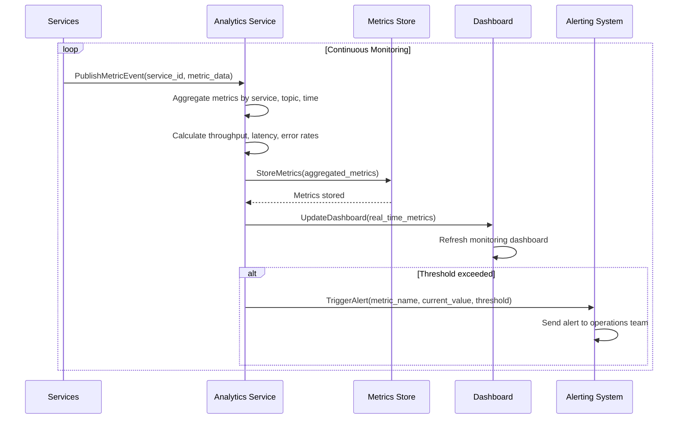
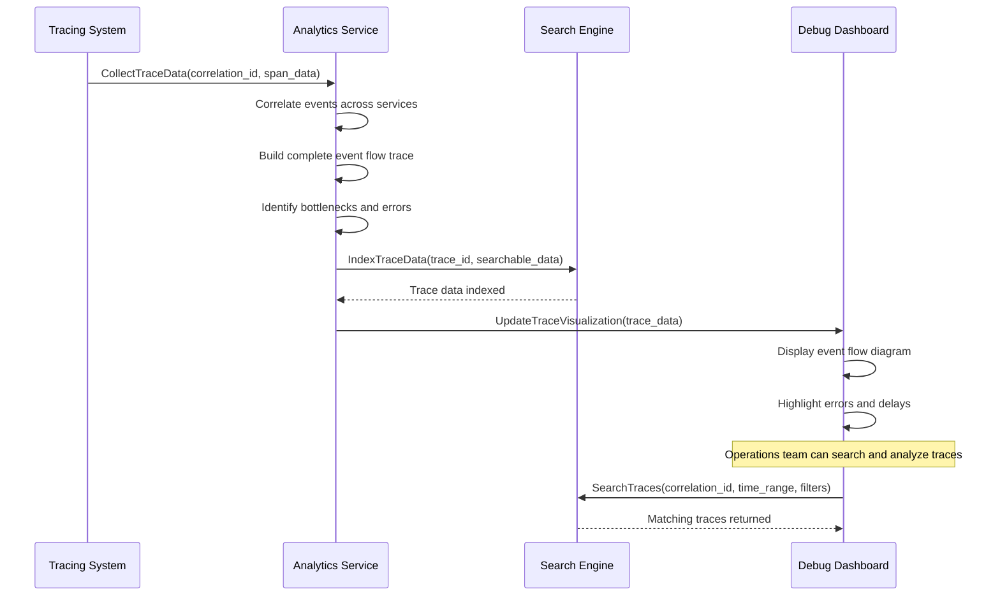

# 🔄 Event Processing Workflow

**Last Updated**: January 30, 2026  
**Status**: Based on Actual Implementation  
**Services Involved**: All 19 services participate in event-driven architecture  
**Navigation**: [← Integration Flows](README.md) | [← Workflows](../README.md)

---

## 📋 **Overview**

This document describes the complete event processing workflow including event publishing, routing, consumption, and error handling across our event-driven microservices architecture based on the actual implementation using Dapr Pub/Sub with Redis.

### **Business Context**
- **Domain**: System Integration & Communication
- **Objective**: Reliable, scalable, and decoupled service communication
- **Success Criteria**: High throughput, low latency, guaranteed delivery, fault tolerance
- **Key Metrics**: Event throughput, processing latency, delivery success rate, error rate

---

## 🏗️ **Service Architecture**

### **Event Infrastructure**
| Component | Role | Technology | Key Responsibilities |
|-----------|------|------------|---------------------|
| 🔄 **Dapr Sidecar** | Event Broker | Dapr Runtime | Event routing, retry logic, dead letter queues |
| 🗄️ **Redis Streams** | Message Store | Redis | Event persistence, ordering, replay capability |
| 🚪 **Gateway Service** | Event Gateway | Go + Kratos | Event validation, rate limiting, authentication |
| 📊 **Event Store** | Event Persistence | PostgreSQL | Event sourcing, audit trails, compliance |
| 📈 **Analytics Service** | Event Analytics | Go + ClickHouse | Event metrics, monitoring, business intelligence |

### **Event Participants (All 19 Services)**
| Service Category | Services | Event Role |
|------------------|----------|------------|
| **Core Commerce** | Order, Checkout, Return, Payment | High-volume publishers and consumers |
| **Product & Inventory** | Catalog, Search, Warehouse, Pricing, Promotion | Real-time data synchronization |
| **Fulfillment & Logistics** | Fulfillment, Shipping, Location | Workflow orchestration |
| **Customer & User** | Customer, Auth, User, Review | Profile and behavior tracking |
| **Intelligence & Communication** | Analytics, Notification, Loyalty | Event processing and reactions |
| **Infrastructure** | Gateway | Event routing and security |

---

## 🔄 **Event Processing Workflow**

### **Phase 1: Event Publishing**

#### **1.1 Event Creation & Validation**
**Services**: Any Service → Dapr Sidecar → Redis



**Event Publishing Features:**
- **Schema Validation**: JSON Schema validation for all events
- **Correlation Tracking**: Unique correlation IDs for request tracing
- **Metadata Enrichment**: Automatic addition of service, version, timestamp
- **Retry Logic**: Automatic retry with exponential backoff
- **Dead Letter Queue**: Failed events stored for manual processing

#### **1.2 Event Routing & Topic Management**
**Services**: Dapr → Redis → Subscribers



**Event Routing Features:**
- **Topic-based Routing**: Events routed based on topic subscriptions
- **Pattern Matching**: Wildcard and regex pattern subscriptions
- **Load Balancing**: Round-robin delivery for multiple instances
- **Health Checking**: Skip unhealthy subscribers temporarily
- **Delivery Guarantees**: At-least-once delivery with deduplication

---

### **Phase 2: Event Consumption**

#### **2.1 Event Subscription & Processing**
**Services**: Dapr Sidecar → Consuming Service



**Event Consumption Features:**
- **Idempotency**: Duplicate event detection and handling
- **Transactional Processing**: Database transactions for consistency
- **Error Handling**: Comprehensive error handling and retry logic
- **Monitoring**: Processing metrics and health monitoring
- **Backpressure**: Flow control for high-volume events

#### **2.2 Event Ordering & Sequencing**
**Services**: Redis Streams → Dapr → Services



**Event Ordering Features:**
- **Partition Keys**: Events with same key processed in order
- **Sequence Numbers**: Monotonic sequence numbers for ordering
- **Buffer Management**: Temporary buffering of out-of-order events
- **Timeout Handling**: Configurable timeouts for missing events
- **Conflict Resolution**: Strategies for handling sequence violations

---

### **Phase 3: Event Orchestration & Sagas**

#### **3.1 Distributed Transaction Management**
**Services**: Saga Orchestrator → Multiple Services



#### **3.2 Compensation & Rollback Handling**
**Services**: Saga Orchestrator → Services (Compensation)



**Saga Management Features:**
- **State Persistence**: Saga state stored for recovery
- **Compensation Logic**: Automatic rollback for failed transactions
- **Timeout Handling**: Configurable timeouts for each saga step
- **Retry Strategies**: Configurable retry policies per step
- **Monitoring**: Real-time saga execution monitoring

---

### **Phase 4: Event Analytics & Monitoring**

#### **4.1 Real-time Event Metrics**
**Services**: All Services → Analytics → Monitoring Dashboard



#### **4.2 Event Tracing & Debugging**
**Services**: Distributed Tracing → Analytics



**Event Analytics Features:**
- **Real-time Metrics**: Live event processing statistics
- **Distributed Tracing**: End-to-end event flow visualization
- **Error Analysis**: Automatic error pattern detection
- **Performance Monitoring**: Latency and throughput analysis
- **Business Intelligence**: Event-driven business insights

---

## 📊 **Event Architecture Overview**

### **Event Categories & Topics**

#### **Core Business Events (High Volume)**
```yaml
# Order Domain Events
order.created: 5000 events/hour
order.confirmed: 4800 events/hour
order.paid: 4500 events/hour
order.shipped: 4200 events/hour
order.delivered: 4000 events/hour

# Inventory Domain Events
inventory.reserved: 8000 events/hour
inventory.allocated: 4500 events/hour
inventory.picked: 4200 events/hour
inventory.restocked: 1000 events/hour

# Payment Domain Events
payment.authorized: 5000 events/hour
payment.captured: 4500 events/hour
payment.refunded: 200 events/hour
payment.failed: 100 events/hour
```

#### **System Events (Medium Volume)**
```yaml
# Customer Domain Events
customer.registered: 500 events/hour
customer.verified: 450 events/hour
customer.profile.updated: 200 events/hour

# Catalog Domain Events
catalog.product.created: 50 events/hour
catalog.product.updated: 200 events/hour
catalog.price.changed: 1000 events/hour

# Search Domain Events
search.index.updated: 1500 events/hour
search.query.performed: 10000 events/hour
```

#### **Operational Events (Low Volume)**
```yaml
# System Health Events
service.health.check: 1140 events/hour (every 30s per service)
service.deployment: 10 events/hour
service.error: 50 events/hour

# Analytics Events
analytics.report.generated: 24 events/hour
analytics.alert.triggered: 10 events/hour
```

### **Event Schema Standards**

#### **Base Event Schema**
```json
{
  "$schema": "https://json-schema.org/draft/2020-12/schema",
  "type": "object",
  "required": ["event_id", "event_type", "timestamp", "version", "data", "metadata"],
  "properties": {
    "event_id": {
      "type": "string",
      "pattern": "^evt_[a-z]+_[0-9]+$",
      "description": "Unique event identifier"
    },
    "event_type": {
      "type": "string",
      "pattern": "^[a-z]+\\.[a-z]+\\.[a-z]+$",
      "description": "Event type in domain.entity.action format"
    },
    "timestamp": {
      "type": "string",
      "format": "date-time",
      "description": "Event creation timestamp in ISO 8601 format"
    },
    "version": {
      "type": "string",
      "pattern": "^[0-9]+\\.[0-9]+$",
      "description": "Event schema version"
    },
    "data": {
      "type": "object",
      "description": "Event-specific payload data"
    },
    "metadata": {
      "type": "object",
      "required": ["correlation_id", "service", "version"],
      "properties": {
        "correlation_id": {
          "type": "string",
          "description": "Request correlation identifier"
        },
        "service": {
          "type": "string",
          "description": "Publishing service name"
        },
        "version": {
          "type": "string",
          "description": "Publishing service version"
        }
      }
    }
  }
}
```

#### **Domain-Specific Event Examples**

**Order Event:**
```json
{
  "event_id": "evt_ord_123456789",
  "event_type": "order.created",
  "timestamp": "2026-01-30T10:30:00Z",
  "version": "1.0",
  "data": {
    "order_id": "ORD-20260130-12345",
    "customer_id": "cust_789012345",
    "total_amount": 1500000,
    "currency": "VND",
    "items": [
      {
        "product_id": "prod_456",
        "quantity": 2,
        "unit_price": 750000
      }
    ],
    "delivery_address": {
      "city": "Ho Chi Minh City",
      "district": "District 1"
    }
  },
  "metadata": {
    "correlation_id": "corr_checkout_123456789",
    "service": "order-service",
    "version": "1.2.0"
  }
}
```

**Inventory Event:**
```json
{
  "event_id": "evt_inv_987654321",
  "event_type": "inventory.reserved",
  "timestamp": "2026-01-30T10:25:00Z",
  "version": "1.0",
  "data": {
    "product_id": "prod_456",
    "warehouse_id": "WH-HCM-001",
    "quantity_reserved": 2,
    "reservation_id": "res_123456789",
    "customer_id": "cust_789012345",
    "expires_at": "2026-01-30T11:00:00Z"
  },
  "metadata": {
    "correlation_id": "corr_checkout_123456789",
    "service": "warehouse-service",
    "version": "1.1.0"
  }
}
```

---

## 🎯 **Event Processing Rules & Patterns**

### **Event Publishing Rules**
- **Transactional Outbox**: Events published as part of database transaction
- **At-Least-Once Delivery**: Guaranteed event delivery with deduplication
- **Schema Evolution**: Backward-compatible schema changes only
- **Event Ordering**: Events for same entity published in order
- **Retention Policy**: Events retained for 30 days in Redis, 1 year in Event Store

### **Event Consumption Rules**
- **Idempotency**: All event handlers must be idempotent
- **Error Handling**: Comprehensive error handling with retry logic
- **Dead Letter Queues**: Failed events moved to DLQ after max retries
- **Processing Timeouts**: Configurable timeouts for event processing
- **Backpressure**: Flow control to prevent consumer overload

### **Saga Patterns**
- **Orchestration**: Centralized saga orchestrator for complex workflows
- **Choreography**: Decentralized event-driven workflows for simple cases
- **Compensation**: Automatic rollback for failed distributed transactions
- **State Persistence**: Saga state persisted for recovery and monitoring
- **Timeout Handling**: Configurable timeouts with automatic compensation

---

## 📈 **Performance Metrics & SLAs**

### **Target Performance**
| Metric | Target | Current | Monitoring |
|--------|--------|---------|------------|
| **Event Publishing Latency** | <10ms (P95) | Tracking | Real-time |
| **Event Processing Latency** | <100ms (P95) | Tracking | Real-time |
| **Event Throughput** | 50,000 events/sec | Tracking | Real-time |
| **Delivery Success Rate** | >99.9% | Tracking | Real-time |
| **Processing Success Rate** | >99.5% | Tracking | Real-time |

### **Business SLAs**
| Process | Target SLA | Current Performance |
|---------|------------|-------------------|
| **Critical Events** | <1 second end-to-end | Tracking |
| **Standard Events** | <5 seconds end-to-end | Tracking |
| **Batch Events** | <1 minute end-to-end | Tracking |
| **Event Recovery** | <15 minutes | Tracking |

### **System Health Metrics**
| Metric | Target | Current | Alert Threshold |
|--------|--------|---------|----------------|
| **Redis Availability** | >99.99% | Tracking | <99.9% |
| **Dapr Sidecar Health** | >99.9% | Tracking | <99% |
| **Dead Letter Queue Size** | <100 events | Tracking | >500 events |
| **Event Lag** | <1 second | Tracking | >10 seconds |
| **Memory Usage** | <80% | Tracking | >90% |

---

## 🔒 **Security & Compliance**

### **Event Security**
- **Authentication**: Service-to-service authentication via mTLS
- **Authorization**: Topic-based access control
- **Encryption**: Event payloads encrypted in transit and at rest
- **Audit Logging**: Complete audit trail for all events
- **Data Privacy**: PII encryption and access controls

### **Compliance Features**
- **Event Sourcing**: Complete audit trail for compliance
- **Data Retention**: Configurable retention policies
- **GDPR Compliance**: Right to deletion and data export
- **Regulatory Reporting**: Automated compliance reporting
- **Access Controls**: Role-based access to event data

---

## 🚨 **Error Handling & Recovery**

### **Common Error Scenarios**

**Publishing Failures:**
- **Redis Unavailable**: Temporary Redis connectivity issues
- **Schema Validation**: Invalid event format or missing fields
- **Rate Limiting**: Publisher exceeding rate limits
- **Network Issues**: Temporary network connectivity problems

**Consumption Failures:**
- **Processing Errors**: Business logic failures in event handlers
- **Database Issues**: Database connectivity or constraint violations
- **Timeout Errors**: Event processing exceeding timeout limits
- **Resource Exhaustion**: Consumer running out of memory or CPU

### **Recovery Mechanisms**
- **Automatic Retry**: Exponential backoff retry for transient failures
- **Circuit Breakers**: Prevent cascade failures across services
- **Dead Letter Queues**: Manual processing of failed events
- **Event Replay**: Replay events from Event Store for recovery
- **Health Monitoring**: Automatic detection and alerting of issues

---

## 📋 **Integration Points**

### **External Integrations**
- **Monitoring Systems**: Prometheus, Grafana, Jaeger integration
- **Alerting Systems**: PagerDuty, Slack integration for alerts
- **Log Aggregation**: ELK stack for centralized logging
- **Business Intelligence**: Data warehouse integration for analytics

### **Internal Service Dependencies**
- **Critical Infrastructure**: Redis, PostgreSQL, Dapr runtime
- **All Services**: Every service participates in event architecture
- **Monitoring Services**: Analytics, notification services

---

**Document Status**: ✅ Complete Implementation-Based Documentation  
**Last Updated**: January 30, 2026  
**Next Review**: February 29, 2026  
**Maintained By**: Platform Architecture & Integration Team