# 🔄 Real-Time Data Synchronization

**Purpose**: Real-time data synchronization patterns across microservices  
**Services**: All 19 services with event-driven synchronization  
**Complexity**: High - Multi-directional data consistency

---

## 📋 **Overview**

Real-time data synchronization ensures data consistency across all microservices using event-driven architecture. This workflow handles the immediate propagation of data changes to maintain system-wide consistency and enable real-time features.

### **Key Objectives**
- **Data Consistency**: Ensure all services have up-to-date data
- **Low Latency**: Sub-second synchronization for critical data
- **Scalability**: Handle high-volume data changes efficiently
- **Fault Tolerance**: Handle service failures without data loss

---

## 🔄 **Synchronization Architecture**

### **Event-Driven Synchronization**
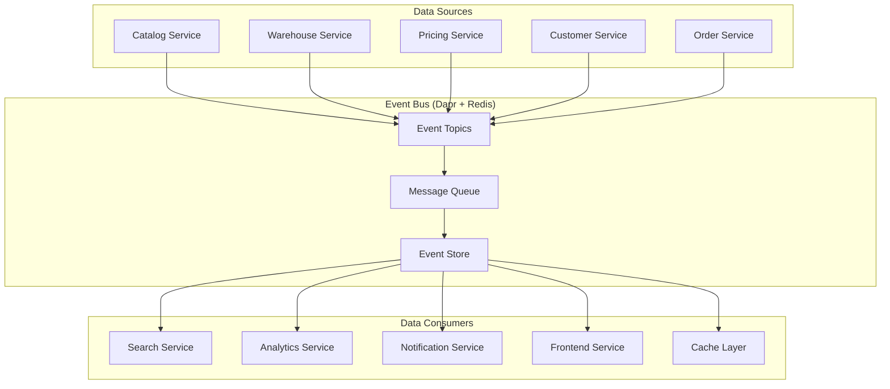
```mermaid
graph TB
    subgraph "Data Sources"
        A[Catalog Service]
        B[Warehouse Service]
        C[Pricing Service]
        D[Customer Service]
        E[Order Service]
    end
    
    subgraph "Event Bus (Dapr + Redis)"
        F[Event Topics]
        G[Message Queue]
        H[Event Store]
    end
    
    subgraph "Data Consumers"
        I[Search Service]
        J[Analytics Service]
        K[Notification Service]
        L[Frontend Service]
        M[Cache Layer]
    end
    
    A --> F
    B --> F
    C --> F
    D --> F
    E --> F
    
    F --> G
    G --> H
    
    H --> I
    H --> J
    H --> K
    H --> L
    H --> M
```

---

## 📦 **Product Data Synchronization**

### **Product Creation & Updates**
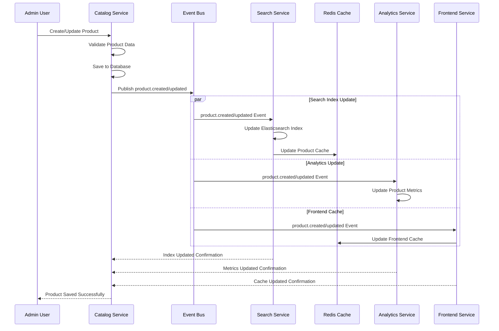
```mermaid
sequenceDiagram
    participant Admin as Admin User
    participant Catalog as Catalog Service
    participant EventBus as Event Bus
    participant Search as Search Service
    participant Cache as Redis Cache
    participant Analytics as Analytics Service
    participant Frontend as Frontend Service

    Admin->>Catalog: Create/Update Product
    Catalog->>Catalog: Validate Product Data
    Catalog->>Catalog: Save to Database
    Catalog->>EventBus: Publish product.created/updated
    
    par Search Index Update
        EventBus->>Search: product.created/updated Event
        Search->>Search: Update Elasticsearch Index
        Search->>Cache: Update Product Cache
    and Analytics Update
        EventBus->>Analytics: product.created/updated Event
        Analytics->>Analytics: Update Product Metrics
    and Frontend Cache
        EventBus->>Frontend: product.created/updated Event
        Frontend->>Cache: Update Frontend Cache
    end
    
    Search-->>Catalog: Index Updated Confirmation
    Analytics-->>Catalog: Metrics Updated Confirmation
    Frontend-->>Catalog: Cache Updated Confirmation
    Catalog-->>Admin: Product Saved Successfully
```

### **Product Attribute Synchronization**
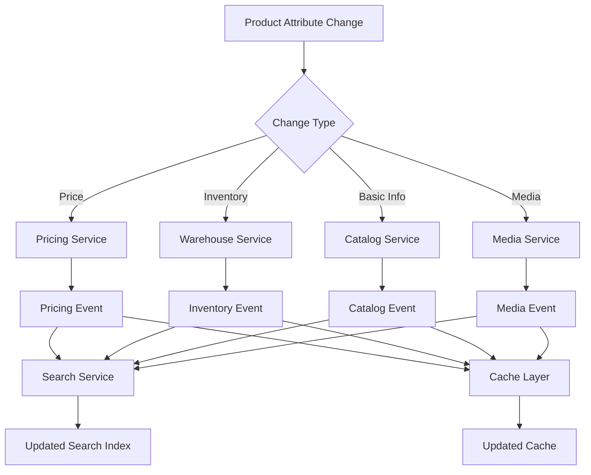
```mermaid
flowchart TD
    A[Product Attribute Change] --> B{Change Type}
    B -->|Price| C[Pricing Service]
    B -->|Inventory| D[Warehouse Service]
    B -->|Basic Info| E[Catalog Service]
    B -->|Media| F[Media Service]
    
    C --> G[Pricing Event]
    D --> H[Inventory Event]
    E --> I[Catalog Event]
    F --> J[Media Event]
    
    G --> K[Search Service]
    H --> K
    I --> K
    J --> K
    
    G --> L[Cache Layer]
    H --> L
    I --> L
    J --> L
    
    K --> M[Updated Search Index]
    L --> N[Updated Cache]
```

---

## 💰 **Pricing Data Synchronization**

### **Dynamic Price Updates**
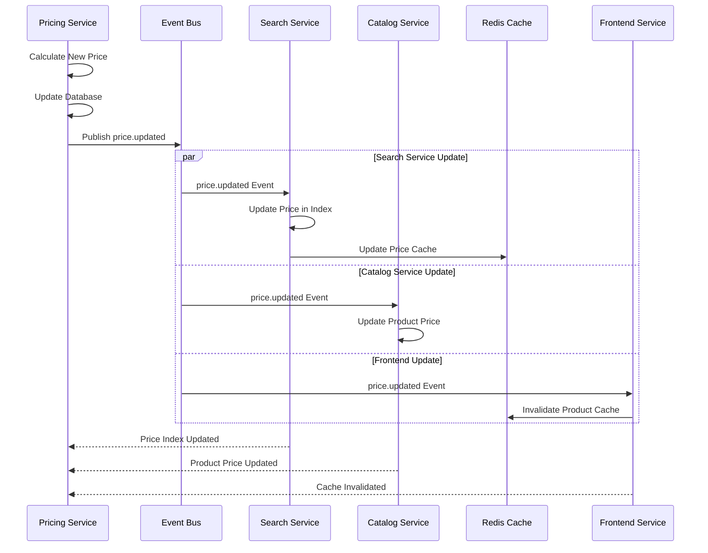
```mermaid
sequenceDiagram
    participant Pricing as Pricing Service
    participant EventBus as Event Bus
    participant Search as Search Service
    participant Catalog as Catalog Service
    participant Cache as Redis Cache
    participant Frontend as Frontend Service

    Pricing->>Pricing: Calculate New Price
    Pricing->>Pricing: Update Database
    Pricing->>EventBus: Publish price.updated
    
    par Search Service Update
        EventBus->>Search: price.updated Event
        Search->>Search: Update Price in Index
        Search->>Cache: Update Price Cache
    and Catalog Service Update
        EventBus->>Catalog: price.updated Event
        Catalog->>Catalog: Update Product Price
    and Frontend Update
        EventBus->>Frontend: price.updated Event
        Frontend->>Cache: Invalidate Product Cache
    end
    
    Search-->>Pricing: Price Index Updated
    Catalog-->>Pricing: Product Price Updated
    Frontend-->>Pricing: Cache Invalidated
```

### **Promotion Price Synchronization**
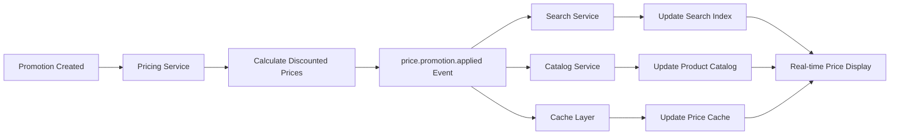
```mermaid
flowchart LR
    A[Promotion Created] --> B[Pricing Service]
    B --> C[Calculate Discounted Prices]
    C --> D[price.promotion.applied Event]
    D --> E[Search Service]
    D --> F[Catalog Service]
    D --> G[Cache Layer]
    
    E --> H[Update Search Index]
    F --> I[Update Product Catalog]
    G --> J[Update Price Cache]
    
    H --> K[Real-time Price Display]
    I --> K
    J --> K
```

---

## 📦 **Inventory Synchronization**

### **Real-time Stock Updates**
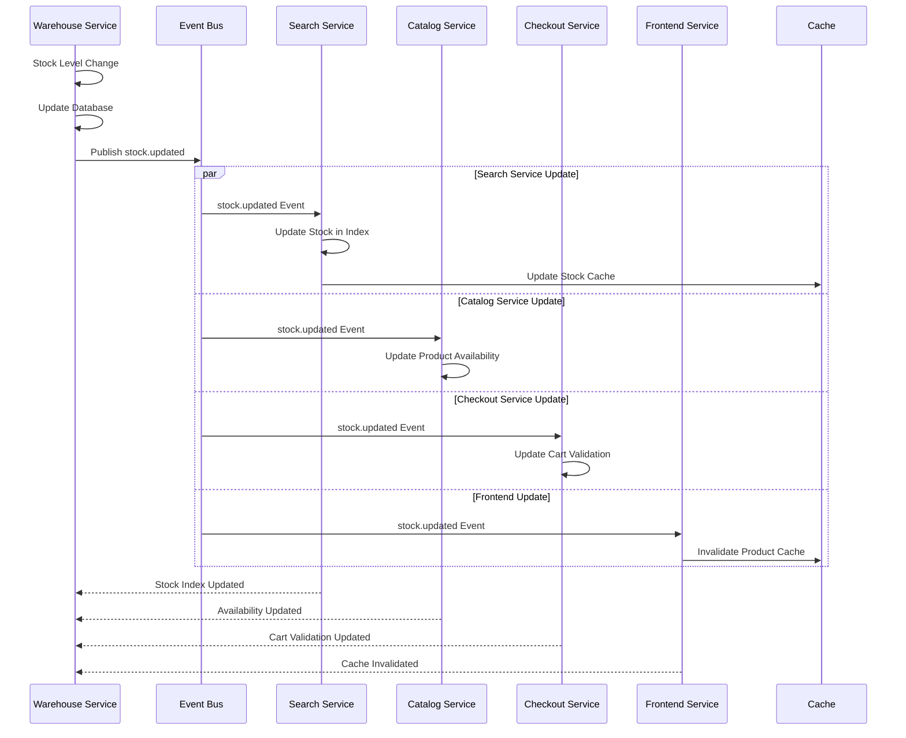
```mermaid
sequenceDiagram
    participant Warehouse as Warehouse Service
    participant EventBus as Event Bus
    participant Search as Search Service
    participant Catalog as Catalog Service
    participant Checkout as Checkout Service
    participant Frontend as Frontend Service

    Warehouse->>Warehouse: Stock Level Change
    Warehouse->>Warehouse: Update Database
    Warehouse->>EventBus: Publish stock.updated
    
    par Search Service Update
        EventBus->>Search: stock.updated Event
        Search->>Search: Update Stock in Index
        Search->>Cache: Update Stock Cache
    and Catalog Service Update
        EventBus->>Catalog: stock.updated Event
        Catalog->>Catalog: Update Product Availability
    and Checkout Service Update
        EventBus->>Checkout: stock.updated Event
        Checkout->>Checkout: Update Cart Validation
    and Frontend Update
        EventBus->>Frontend: stock.updated Event
        Frontend->>Cache: Invalidate Product Cache
    end
    
    Search-->>Warehouse: Stock Index Updated
    Catalog-->>Warehouse: Availability Updated
    Checkout-->>Warehouse: Cart Validation Updated
    Frontend-->>Warehouse: Cache Invalidated
```

### **Stock Reservation Synchronization**
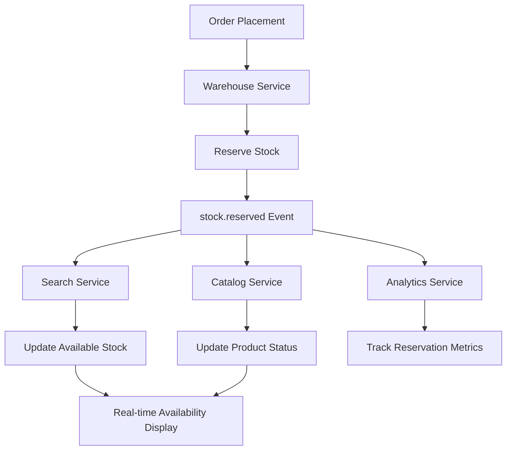
```mermaid
flowchart TD
    A[Order Placement] --> B[Warehouse Service]
    B --> C[Reserve Stock]
    C --> D[stock.reserved Event]
    
    D --> E[Search Service]
    D --> F[Catalog Service]
    D --> G[Analytics Service]
    
    E --> H[Update Available Stock]
    F --> I[Update Product Status]
    G --> J[Track Reservation Metrics]
    
    H --> K[Real-time Availability Display]
    I --> K
```

---

## 👥 **Customer Data Synchronization**

### **Customer Profile Updates**
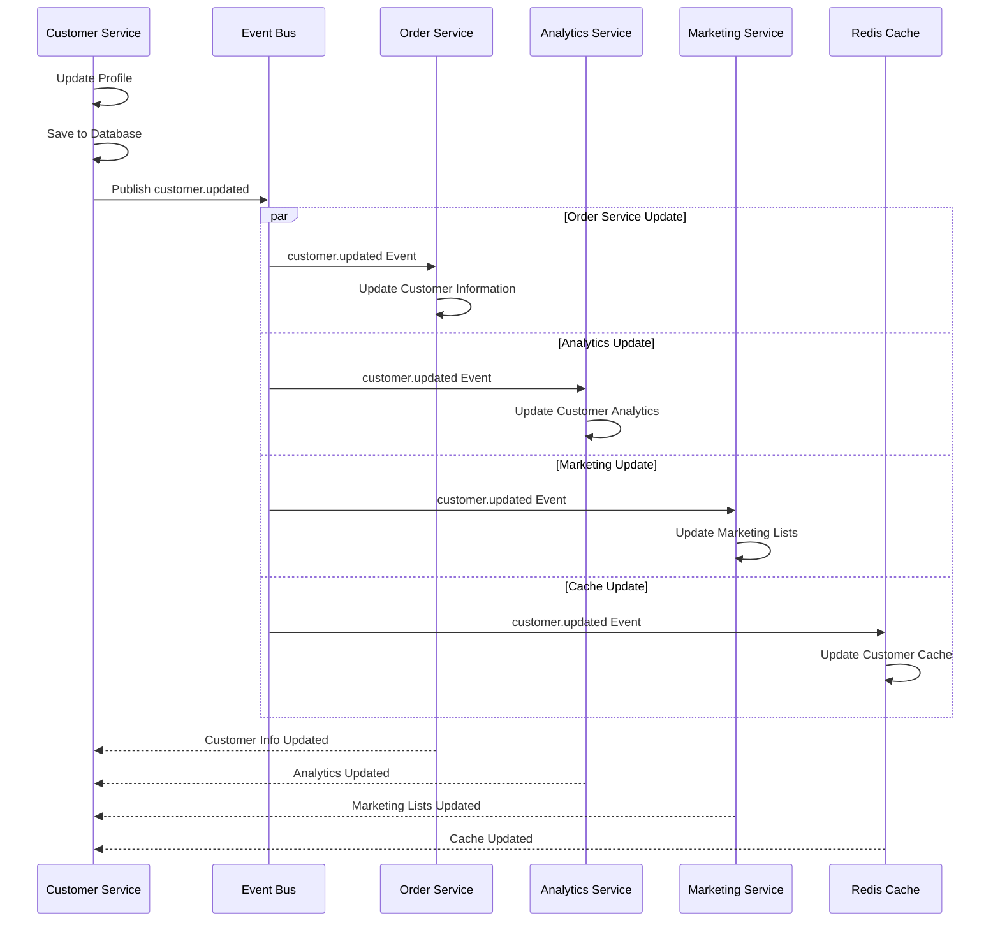
```mermaid
sequenceDiagram
    participant Customer as Customer Service
    participant EventBus as Event Bus
    participant Order as Order Service
    participant Analytics as Analytics Service
    participant Marketing as Marketing Service
    participant Cache as Redis Cache

    Customer->>Customer: Update Profile
    Customer->>Customer: Save to Database
    Customer->>EventBus: Publish customer.updated
    
    par Order Service Update
        EventBus->>Order: customer.updated Event
        Order->>Order: Update Customer Information
    and Analytics Update
        EventBus->>Analytics: customer.updated Event
        Analytics->>Analytics: Update Customer Analytics
    and Marketing Update
        EventBus->>Marketing: customer.updated Event
        Marketing->>Marketing: Update Marketing Lists
    and Cache Update
        EventBus->>Cache: customer.updated Event
        Cache->>Cache: Update Customer Cache
    end
    
    Order-->>Customer: Customer Info Updated
    Analytics-->>Customer: Analytics Updated
    Marketing-->>Customer: Marketing Lists Updated
    Cache-->>Customer: Cache Updated
```

### **Customer Preferences Synchronization**
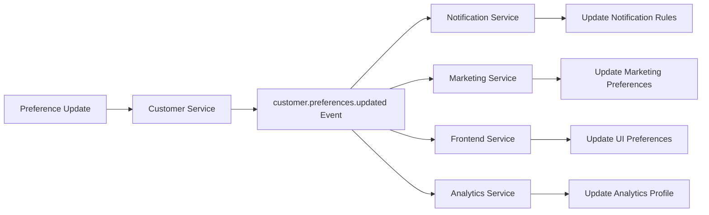
```mermaid
flowchart LR
    A[Preference Update] --> B[Customer Service]
    B --> C[customer.preferences.updated Event]
    C --> D[Notification Service]
    C --> E[Marketing Service]
    C --> F[Frontend Service]
    C --> G[Analytics Service]
    
    D --> H[Update Notification Rules]
    E --> I[Update Marketing Preferences]
    F --> J[Update UI Preferences]
    G --> K[Update Analytics Profile]
```

---

## 🔄 **Order Data Synchronization**

### **Order Status Updates**
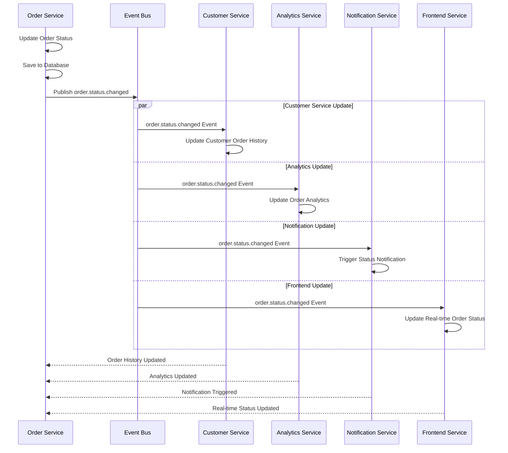
```mermaid
sequenceDiagram
    participant Order as Order Service
    participant EventBus as Event Bus
    participant Customer as Customer Service
    participant Analytics as Analytics Service
    participant Notification as Notification Service
    participant Frontend as Frontend Service

    Order->>Order: Update Order Status
    Order->>Order: Save to Database
    Order->>EventBus: Publish order.status.changed
    
    par Customer Service Update
        EventBus->>Customer: order.status.changed Event
        Customer->>Customer: Update Customer Order History
    and Analytics Update
        EventBus->>Analytics: order.status.changed Event
        Analytics->>Analytics: Update Order Analytics
    and Notification Update
        EventBus->>Notification: order.status.changed Event
        Notification->>Notification: Trigger Status Notification
    and Frontend Update
        EventBus->>Frontend: order.status.changed Event
        Frontend->>Frontend: Update Real-time Order Status
    end
    
    Customer-->>Order: Order History Updated
    Analytics-->>Order: Analytics Updated
    Notification-->>Order: Notification Triggered
    Frontend-->>Order: Real-time Status Updated
```

---

## 🔧 **Synchronization Patterns**

### **1. Event Sourcing Pattern**
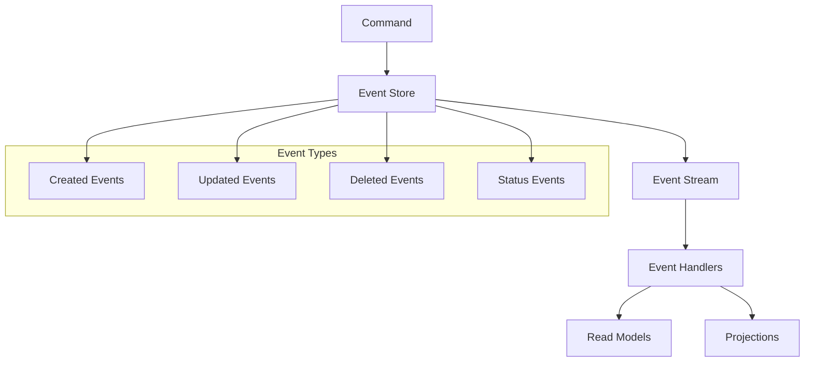
```mermaid
graph TB
    A[Command] --> B[Event Store]
    B --> C[Event Stream]
    C --> D[Event Handlers]
    D --> E[Read Models]
    D --> F[Projections]
    
    subgraph "Event Types"
        G[Created Events]
        H[Updated Events]
        I[Deleted Events]
        J[Status Events]
    end
    
    B --> G
    B --> H
    B --> I
    B --> J
```

### **2. CQRS Pattern**
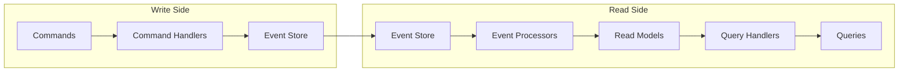
```mermaid
graph LR
    subgraph "Write Side"
        A[Commands] --> B[Command Handlers]
        B --> C[Event Store]
    end
    
    subgraph "Read Side"
        D[Event Store] --> E[Event Processors]
        E --> F[Read Models]
        F --> G[Query Handlers]
        G --> H[Queries]
    end
    
    C --> D
```

### **3. Saga Pattern**
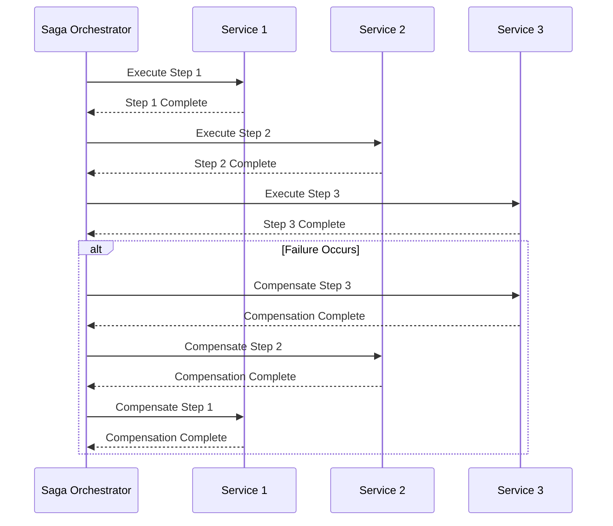
```mermaid
sequenceDiagram
    participant Orchestrator as Saga Orchestrator
    participant Service1 as Service 1
    participant Service2 as Service 2
    participant Service3 as Service 3

    Orchestrator->>Service1: Execute Step 1
    Service1-->>Orchestrator: Step 1 Complete
    
    Orchestrator->>Service2: Execute Step 2
    Service2-->>Orchestrator: Step 2 Complete
    
    Orchestrator->>Service3: Execute Step 3
    Service3-->>Orchestrator: Step 3 Complete
    
    alt Failure Occurs
        Orchestrator->>Service3: Compensate Step 3
        Service3-->>Orchestrator: Compensation Complete
        Orchestrator->>Service2: Compensate Step 2
        Service2-->>Orchestrator: Compensation Complete
        Orchestrator->>Service1: Compensate Step 1
        Service1-->>Orchestrator: Compensation Complete
    end
```

---

## 📊 **Performance Optimization**

### **Batch Processing**
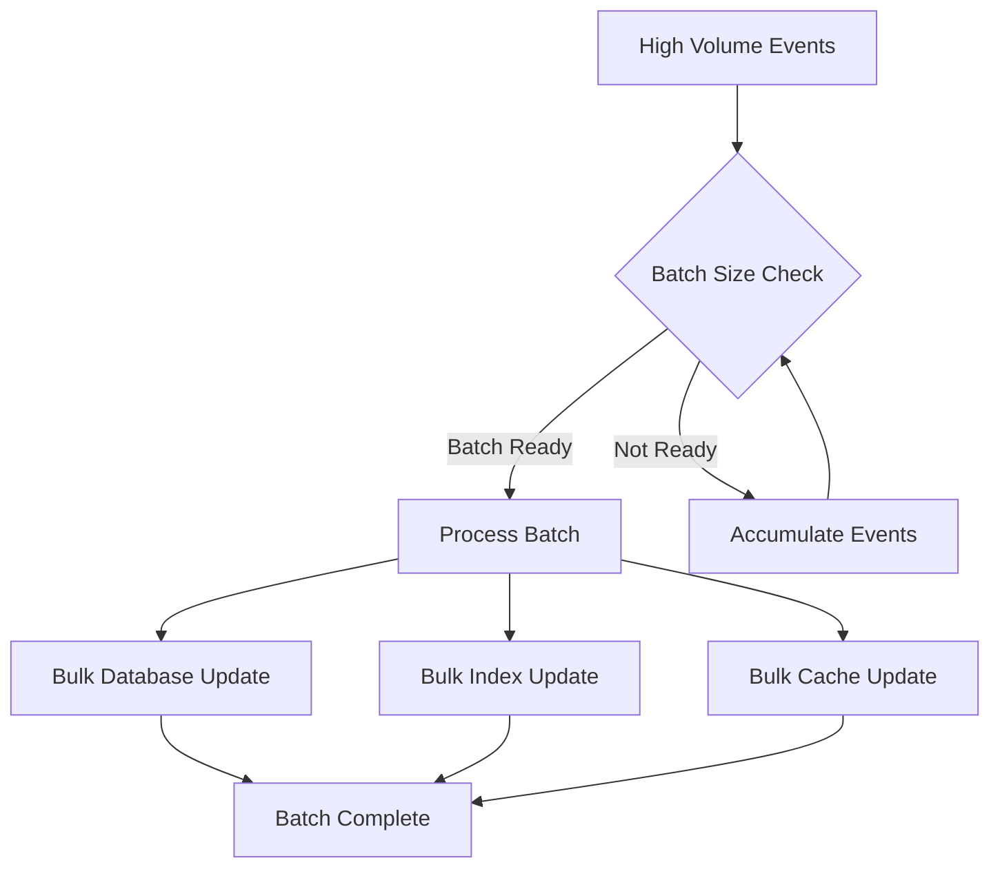
```mermaid
flowchart TD
    A[High Volume Events] --> B{Batch Size Check}
    B -->|Batch Ready| C[Process Batch]
    B -->|Not Ready| D[Accumulate Events]
    D --> B
    C --> E[Bulk Database Update]
    C --> F[Bulk Index Update]
    C --> G[Bulk Cache Update]
    E --> H[Batch Complete]
    F --> H
    G --> H
```

### **Event Filtering**
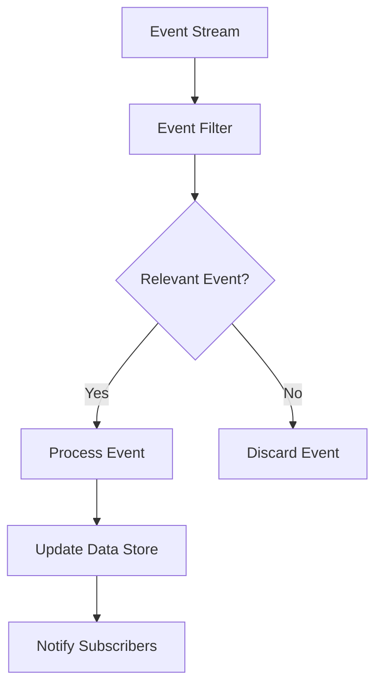
```mermaid
graph TB
    A[Event Stream] --> B[Event Filter]
    B --> C{Relevant Event?}
    C -->|Yes| D[Process Event]
    C -->|No| E[Discard Event]
    D --> F[Update Data Store]
    F --> G[Notify Subscribers]
```

### **Caching Strategy**
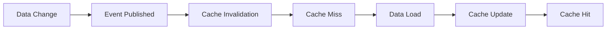
```mermaid
graph LR
    A[Data Change] --> B[Event Published]
    B --> C[Cache Invalidation]
    C --> D[Cache Miss]
    D --> E[Data Load]
    E --> F[Cache Update]
    F --> G[Cache Hit]
```

---

## 🔍 **Monitoring & Observability**

### **Synchronization Metrics**
```mermaid
gauge
    title Synchronization Success Rate
    99.8% : Excellent
```

### **Key Performance Indicators**
- **Event Processing Latency**: < 100ms (p95)
- **Data Consistency**: 99.9% accuracy
- **Event Throughput**: 10,000 events/second
- **Error Rate**: < 0.1%
- **Recovery Time**: < 30 seconds

### **Monitoring Dashboard**
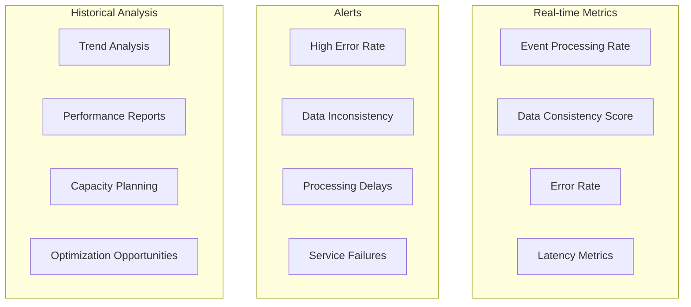
```mermaid
graph TB
    subgraph "Real-time Metrics"
        A[Event Processing Rate]
        B[Data Consistency Score]
        C[Error Rate]
        D[Latency Metrics]
    end
    
    subgraph "Alerts"
        E[High Error Rate]
        F[Data Inconsistency]
        G[Processing Delays]
        H[Service Failures]
    end
    
    subgraph "Historical Analysis"
        I[Trend Analysis]
        J[Performance Reports]
        K[Capacity Planning]
        L[Optimization Opportunities]
    end
```

---

## 🚨 **Error Handling & Recovery**

### **Retry Mechanism**
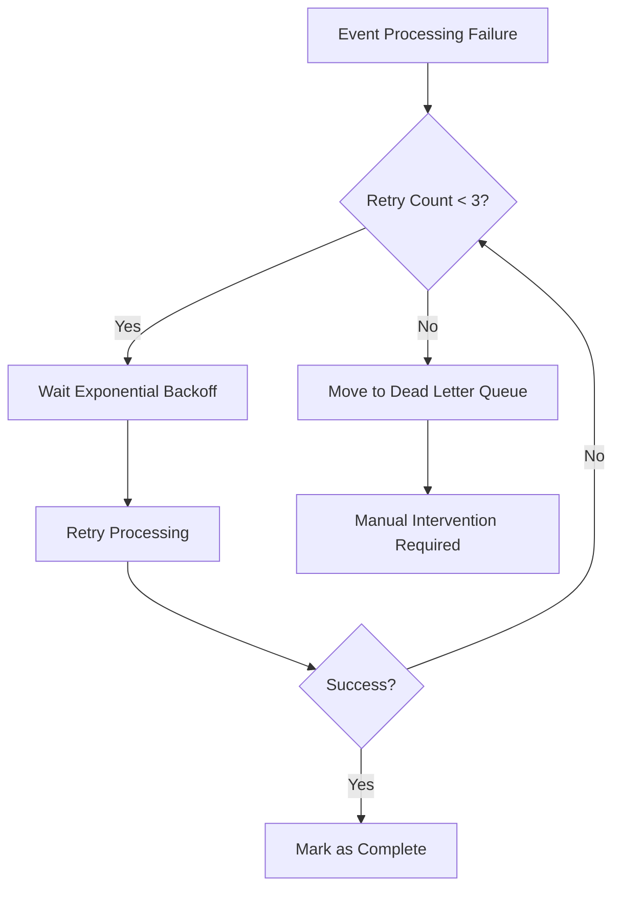
```mermaid
flowchart TD
    A[Event Processing Failure] --> B{Retry Count < 3?}
    B -->|Yes| C[Wait Exponential Backoff]
    C --> D[Retry Processing]
    D --> E{Success?}
    E -->|Yes| F[Mark as Complete]
    E -->|No| B
    B -->|No| G[Move to Dead Letter Queue]
    G --> H[Manual Intervention Required]
```

### **Data Reconciliation**
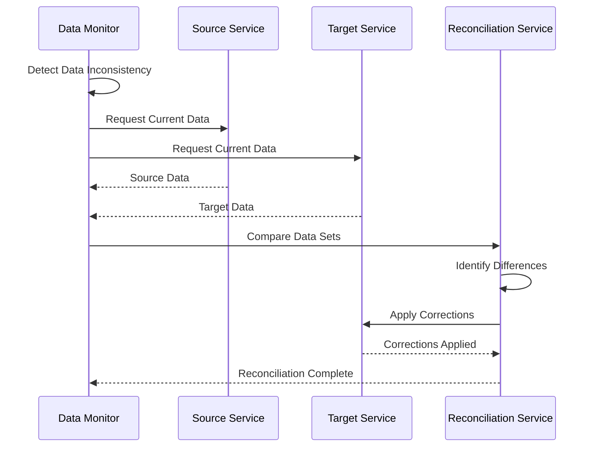
```mermaid
sequenceDiagram
    participant Monitor as Data Monitor
    participant Source as Source Service
    participant Target as Target Service
    participant Reconciliation as Reconciliation Service

    Monitor->>Monitor: Detect Data Inconsistency
    Monitor->>Source: Request Current Data
    Monitor->>Target: Request Current Data
    Source-->>Monitor: Source Data
    Target-->>Monitor: Target Data
    Monitor->>Reconciliation: Compare Data Sets
    Reconciliation->>Reconciliation: Identify Differences
    Reconciliation->>Target: Apply Corrections
    Target-->>Reconciliation: Corrections Applied
    Reconciliation-->>Monitor: Reconciliation Complete
```

---

## 🔐 **Security & Compliance**

### **Data Privacy**
- **PII Protection**: Encrypt sensitive customer data
- **Access Control**: Role-based data access
- **Audit Logging**: Complete data change audit trail
- **Data Retention**: Comply with data retention policies

### **Data Governance**
- **Data Classification**: Classify data by sensitivity
- **Change Management**: Controlled data modifications
- **Compliance Monitoring**: Ensure regulatory compliance
- **Data Lineage**: Track data flow and transformations

---

## 🚀 **Future Enhancements**

### **Planned Improvements**
- **Event Streaming**: Apache Kafka for high-throughput events
- **Change Data Capture**: Real-time database change detection
- **Graph Database**: Neo4j for complex relationship tracking
- **Machine Learning**: Predictive data synchronization

### **Technology Roadmap**
- **Q1 2026**: Enhanced event filtering and routing
- **Q2 2026**: Advanced caching strategies
- **Q3 2026**: Real-time analytics integration
- **Q4 2026**: AI-powered data optimization

---

**Last Updated**: February 2, 2026  
**Maintained By**: Data Architecture Team  
**Review Frequency**: Monthly
