# 🏭 Operational Flows

**Purpose**: Internal business operations and backend processes  
**Navigation**: [← Workflows](../README.md) | [← Back to Main](../../README.md) | [Integration Flows →](../integration-flows/README.md)

---

## 📋 **Overview**

This section contains detailed documentation of internal operational workflows that power our e-commerce platform behind the scenes. These workflows focus on business operations, inventory management, fulfillment processes, and system optimizations that ensure smooth platform operation.

### **🎯 Operational Scope**

Our operational flow documentation covers the critical backend processes that enable customer-facing experiences:

1. **📦 Order Processing** - From order confirmation to shipment
2. **📊 Inventory Operations** - Stock management and optimization
3. **💰 Financial Operations** - Pricing, payments, and reconciliation
4. **🚚 Logistics Operations** - Shipping, fulfillment, and delivery
5. **🔧 System Operations** - Maintenance, monitoring, and optimization

---

## 📚 **Operational Flow Documents**

### **[Order Fulfillment](order-fulfillment.md)**
**Complete order processing and fulfillment workflow**

- **Scope**: End-to-end fulfillment from order confirmation to shipment
- **Services**: 8 services involved (Gateway, Fulfillment, Order, Warehouse, Catalog, Shipping, Notification, Analytics)
- **Duration**: 2-24 hours depending on priority and complexity
- **Key Features**: Warehouse assignment, picking optimization, packing, quality control, shipping preparation

**Business Impact**: Operational efficiency, customer satisfaction, cost optimization, quality assurance

### **[Inventory Management](inventory-management.md)**
**Stock management, reservations, and capacity planning**

- **Scope**: Complete inventory lifecycle across multiple warehouses
- **Services**: 7 services involved (Gateway, Warehouse, Catalog, Search, Order, Fulfillment, Analytics)
- **Duration**: Real-time updates with periodic reconciliation
- **Key Features**: Real-time tracking, reservations, replenishment, multi-warehouse coordination

**Business Impact**: Stock accuracy, cost optimization, demand fulfillment, operational efficiency

### **[Payment Processing](payment-processing.md)** 🚧
**Multi-gateway payment flows and reconciliation**

- **Scope**: Payment authorization, capture, refunds, and reconciliation
- **Services**: 6 services involved (Gateway, Payment, Order, Customer, Notification, Analytics)
- **Duration**: Real-time processing with daily reconciliation
- **Key Features**: Multi-gateway support, fraud detection, PCI compliance, automated reconciliation

**Business Impact**: Revenue security, compliance, customer trust, operational efficiency

### **[Pricing & Promotions](pricing-promotions.md)** 🚧
**Dynamic pricing and promotion management**

- **Scope**: Price calculation, promotion application, and campaign management
- **Services**: 5 services involved (Gateway, Pricing, Promotion, Catalog, Analytics)
- **Duration**: Real-time pricing with campaign scheduling
- **Key Features**: Dynamic pricing rules, promotion engine, campaign management, A/B testing

**Business Impact**: Revenue optimization, competitive positioning, marketing effectiveness

### **[Shipping & Logistics](shipping-logistics.md)** 🚧
**Multi-carrier shipping and delivery tracking**

- **Scope**: Carrier selection, rate calculation, tracking, and delivery management
- **Services**: 6 services involved (Gateway, Shipping, Fulfillment, Location, Notification, Analytics)
- **Duration**: Real-time rate calculation with tracking updates
- **Key Features**: Multi-carrier integration, rate optimization, tracking, delivery management

**Business Impact**: Delivery efficiency, cost optimization, customer satisfaction

### **[Quality Control](quality-control.md)** 🚧
**Fulfillment quality control and inspection processes**

- **Scope**: Quality assurance throughout the fulfillment process
- **Services**: 4 services involved (Fulfillment, Warehouse, Analytics, Notification)
- **Duration**: 10-30 minutes per inspection
- **Key Features**: Automated QC triggers, inspection workflows, quality metrics, continuous improvement

**Business Impact**: Product quality, customer satisfaction, return reduction, brand protection

---

## 🔄 **Operational Flow Overview**

```mermaid
graph TB
    subgraph "Order Processing Operations"
        A[📋 Order Fulfillment] --> B[📦 Picking & Packing]
        B --> C[🔍 Quality Control]
        C --> D[🚚 Shipping Preparation]
    end
    
    subgraph "Inventory Operations"
        E[📊 Stock Tracking] --> F[🔄 Reservations]
        F --> G[📈 Replenishment]
        G --> H[🏭 Multi-Warehouse Sync]
    end
    
    subgraph "Financial Operations"
        I[💰 Dynamic Pricing] --> J[🎯 Promotions]
        J --> K[💳 Payment Processing]
        K --> L[📊 Reconciliation]
    end
    
    subgraph "Logistics Operations"
        M[🚚 Carrier Selection] --> N[📦 Rate Calculation]
        N --> O[🏷️ Label Generation]
        O --> P[📍 Tracking & Delivery]
    end
    
    A --> E
    E --> I
    I --> M
```

---

## 📊 **Operational Performance Metrics**

### **Fulfillment Operations**

| Metric | Target | Current | Impact |
|--------|--------|---------|--------|
| **Order Fulfillment Time** | <24 hours | Tracking | Customer satisfaction |
| **Picking Accuracy** | >99.5% | Tracking | Quality, returns |
| **Packing Efficiency** | 12 orders/hour | Tracking | Cost optimization |
| **QC Pass Rate** | >98% | Tracking | Quality assurance |
| **Shipping Label Accuracy** | >99.9% | Tracking | Delivery success |

### **Inventory Operations**

| Metric | Target | Current | Impact |
|--------|--------|---------|--------|
| **Stock Accuracy** | >99.5% | Tracking | Availability, sales |
| **Inventory Turnover** | >12x/year | Tracking | Cash flow, efficiency |
| **Stockout Rate** | <1% | Tracking | Customer satisfaction |
| **Replenishment Lead Time** | <7 days | Tracking | Stock availability |
| **Transfer Efficiency** | <48 hours | Tracking | Stock optimization |

### **Financial Operations**

| Metric | Target | Current | Impact |
|--------|--------|---------|--------|
| **Payment Success Rate** | >98% | Tracking | Revenue capture |
| **Pricing Response Time** | <100ms | Tracking | Customer experience |
| **Promotion Accuracy** | >99.9% | Tracking | Customer trust |
| **Reconciliation Accuracy** | >99.99% | Tracking | Financial integrity |
| **Fraud Detection Rate** | >95% | Tracking | Security, losses |

### **Logistics Operations**

| Metric | Target | Current | Impact |
|--------|--------|---------|--------|
| **Carrier Selection Time** | <2 seconds | Tracking | Checkout experience |
| **Rate Accuracy** | >99.9% | Tracking | Cost management |
| **Tracking Update Frequency** | Every 4 hours | Tracking | Customer visibility |
| **Delivery Success Rate** | >95% | Tracking | Customer satisfaction |
| **Shipping Cost Optimization** | 15% savings | Tracking | Profitability |

---

## 🎯 **Operational Excellence Framework**

### **Process Standardization**

**Standard Operating Procedures (SOPs):**
- **Fulfillment SOPs**: Standardized picking, packing, and shipping procedures
- **Inventory SOPs**: Stock receiving, counting, and adjustment procedures
- **Quality SOPs**: Inspection criteria and quality control procedures
- **Emergency SOPs**: Incident response and recovery procedures

**Process Documentation:**
- **Visual Work Instructions**: Step-by-step visual guides for warehouse operations
- **Training Materials**: Comprehensive training programs for operational staff
- **Performance Standards**: Clear metrics and expectations for each role
- **Continuous Improvement**: Regular process review and optimization

### **Automation & Technology**

**Warehouse Automation:**
- **Barcode Scanning**: Mandatory scanning for all inventory movements
- **Automated Sorting**: Conveyor systems for efficient order processing
- **Pick Path Optimization**: AI-powered route optimization for pickers
- **Quality Control Systems**: Automated weight verification and photo documentation

**System Integration:**
- **Real-time Synchronization**: Immediate updates across all systems
- **Event-driven Architecture**: Automated workflows triggered by business events
- **API-first Design**: Seamless integration between operational systems
- **Data Analytics**: Real-time operational dashboards and insights

### **Quality Management**

**Quality Assurance Programs:**
- **Six Sigma**: Data-driven process improvement methodology
- **Lean Operations**: Waste reduction and efficiency optimization
- **ISO 9001**: Quality management system certification
- **Continuous Monitoring**: Real-time quality metrics and alerts

**Performance Management:**
- **KPI Dashboards**: Real-time operational performance monitoring
- **SLA Tracking**: Service level agreement compliance monitoring
- **Root Cause Analysis**: Systematic problem identification and resolution
- **Benchmarking**: Industry best practice comparison and adoption

---

## 🔧 **Operational Technology Stack**

### **Core Systems**

**Warehouse Management System (WMS):**
- **Inventory Tracking**: Real-time stock level monitoring
- **Task Management**: Work assignment and progress tracking
- **Location Management**: Optimal storage location assignment
- **Performance Analytics**: Operational efficiency metrics

**Enterprise Resource Planning (ERP):**
- **Financial Integration**: Accounting and cost management
- **Procurement Management**: Supplier relationship and purchasing
- **Reporting & Analytics**: Business intelligence and reporting
- **Compliance Management**: Regulatory compliance tracking

### **Integration Technologies**

**Message Queuing:**
- **Dapr Pub/Sub**: Event-driven communication between services
- **Redis Streams**: High-performance message streaming
- **Dead Letter Queues**: Failed message handling and recovery
- **Message Ordering**: Guaranteed message sequence for critical operations

**Data Synchronization:**
- **Change Data Capture (CDC)**: Real-time database synchronization
- **Event Sourcing**: Complete audit trail and replay capability
- **CQRS Pattern**: Optimized read/write operations
- **Eventual Consistency**: Distributed system data consistency

### **Monitoring & Observability**

**Operational Monitoring:**
- **Prometheus**: Metrics collection and alerting
- **Grafana**: Operational dashboards and visualization
- **Jaeger**: Distributed tracing for performance analysis
- **ELK Stack**: Centralized logging and log analysis

**Business Intelligence:**
- **Real-time Analytics**: Live operational performance metrics
- **Predictive Analytics**: Demand forecasting and capacity planning
- **Anomaly Detection**: Automated identification of operational issues
- **Performance Optimization**: Data-driven process improvement

---

## 🚀 **Operational Optimization Roadmap**

### **Current Capabilities (88% Complete)**

**✅ Implemented Features:**
- Real-time inventory tracking across multiple warehouses
- Automated order fulfillment workflow with quality control
- Multi-gateway payment processing with fraud detection
- Dynamic pricing engine with promotion management
- Multi-carrier shipping with rate optimization
- Comprehensive operational analytics and reporting

### **Near-Term Enhancements (Q1 2026)**

**🔄 In Development:**
- **Advanced Warehouse Automation**: Robotic picking and packing systems
- **AI-Powered Demand Forecasting**: Machine learning demand prediction
- **Predictive Quality Control**: AI-based quality issue prediction
- **Advanced Analytics**: Real-time operational optimization recommendations

### **Future Roadmap (Q2-Q4 2026)**

**🚧 Planned Features:**
- **Fully Automated Fulfillment**: Lights-out warehouse operations
- **Blockchain Supply Chain**: End-to-end supply chain transparency
- **IoT Integration**: Smart sensors for real-time operational monitoring
- **Autonomous Logistics**: Self-optimizing logistics and delivery networks

---

## 📋 **Operational Compliance & Standards**

### **Industry Standards**

**Quality Management:**
- **ISO 9001**: Quality management system certification
- **ISO 14001**: Environmental management system
- **OHSAS 18001**: Occupational health and safety management
- **GMP**: Good Manufacturing Practices for product handling

**Security & Compliance:**
- **SOC 2**: Security and availability controls
- **PCI DSS**: Payment card industry data security standards
- **GDPR**: General data protection regulation compliance
- **Local Regulations**: Vietnamese commerce and labor law compliance

### **Audit & Reporting**

**Internal Audits:**
- **Monthly Operational Reviews**: Performance against targets
- **Quarterly Process Audits**: Compliance with SOPs and standards
- **Annual System Audits**: Technology and security assessments
- **Continuous Improvement Reviews**: Process optimization opportunities

**External Compliance:**
- **Regulatory Reporting**: Government compliance reporting
- **Customer Audits**: Customer-requested operational audits
- **Certification Renewals**: Ongoing certification maintenance
- **Third-party Assessments**: Independent operational assessments

---

## 📖 **How to Use This Documentation**

### **For Operations Managers**
- **Process Optimization**: Identify improvement opportunities in operational workflows
- **Performance Management**: Monitor KPIs and implement improvement initiatives
- **Resource Planning**: Understand capacity requirements and staffing needs
- **Compliance Management**: Ensure adherence to standards and regulations

### **For System Administrators**
- **System Integration**: Understand service dependencies and integration points
- **Performance Monitoring**: Implement monitoring and alerting for operational systems
- **Capacity Planning**: Plan infrastructure capacity for operational workloads
- **Disaster Recovery**: Implement backup and recovery procedures

### **For Business Analysts**
- **Process Analysis**: Analyze operational efficiency and identify bottlenecks
- **Cost Optimization**: Identify opportunities for cost reduction and efficiency gains
- **Data Analysis**: Leverage operational data for business insights
- **Requirements Gathering**: Define requirements for operational system enhancements

### **For Quality Assurance**
- **Process Validation**: Ensure operational processes meet quality standards
- **Test Planning**: Design tests for operational workflows and systems
- **Compliance Testing**: Validate compliance with industry standards
- **Performance Testing**: Test operational systems under load conditions

---

## 🎯 **Success Metrics & KPIs**

### **Operational Efficiency Metrics**
- **Overall Equipment Effectiveness (OEE)**: >85%
- **Labor Productivity**: >95% of standard
- **Process Cycle Time**: <target for each process
- **Resource Utilization**: >80% for critical resources

### **Quality Metrics**
- **Defect Rate**: <0.5% across all processes
- **Customer Complaints**: <1% of orders
- **Return Rate**: <5% of orders
- **Quality Score**: >4.5/5 customer rating

### **Financial Metrics**
- **Operational Cost per Order**: <₫50,000
- **Inventory Carrying Cost**: <15% of inventory value
- **Labor Cost per Order**: <₫30,000
- **Total Cost of Ownership**: Optimized year-over-year

### **Customer Impact Metrics**
- **Order Fulfillment Time**: <24 hours
- **Delivery Accuracy**: >99%
- **Customer Satisfaction**: >4.5/5
- **Net Promoter Score**: >50

---

**Last Updated**: January 30, 2026  
**Platform Status**: 88% Complete, Operational Flows Production Ready  
**Maintained By**: Operations & Process Excellence Team