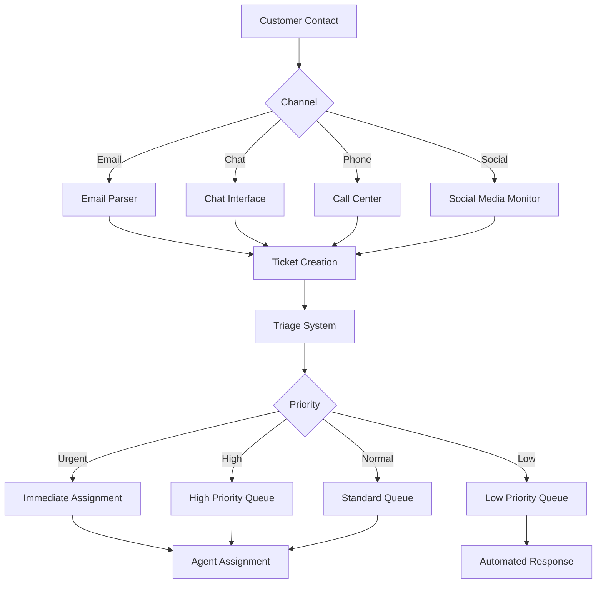
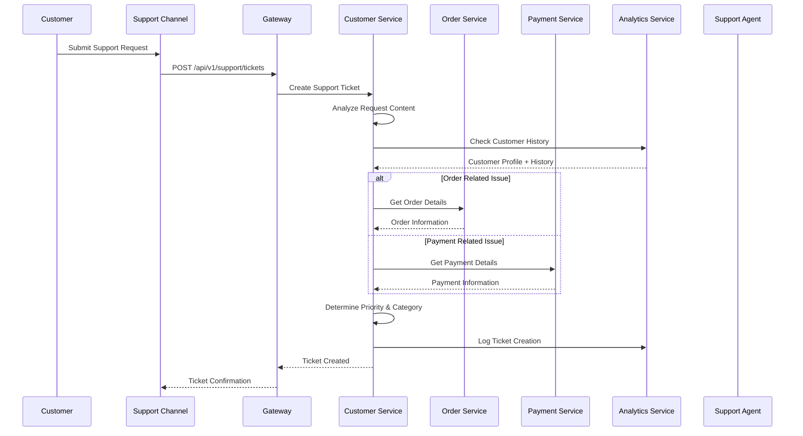
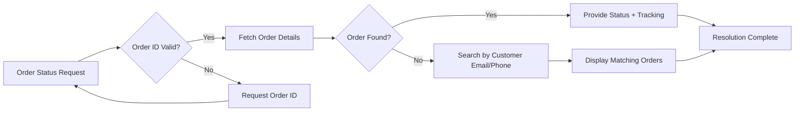
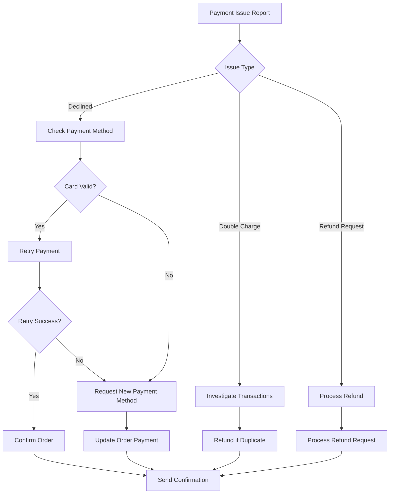
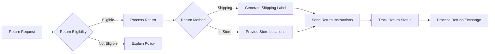
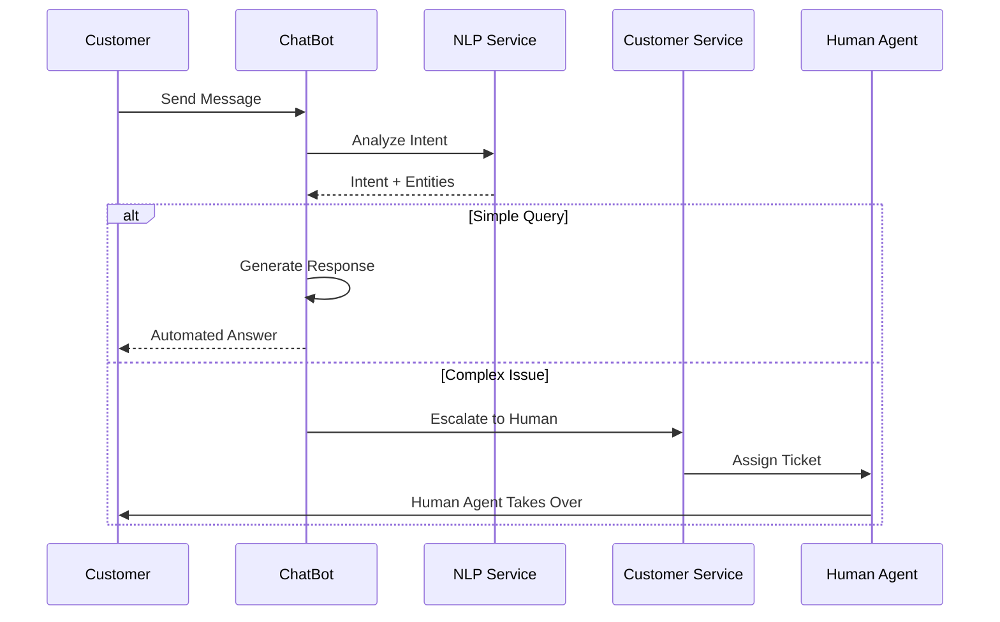
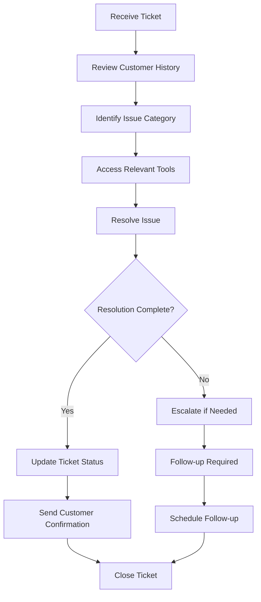
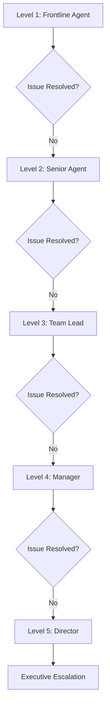

# 🎧 Customer Service Workflow

**Purpose**: Complete customer service operations and support workflows  
**Services**: Customer, Order, Payment, Return, Notification, Analytics  
**Complexity**: High - Multi-service coordination with human intervention

---

## 📋 **Workflow Overview**

Customer service operations handle all customer inquiries, complaints, and support requests across the platform. This workflow integrates automated systems with human agent interventions to provide comprehensive customer support.

### **Key Objectives**
- **First Contact Resolution**: Resolve issues on first contact when possible
- **Multi-channel Support**: Support across email, chat, phone, and social media
- **Proactive Support**: Identify and address issues before customer reports
- **Quality Assurance**: Maintain high customer satisfaction scores

---

## 🔄 **Customer Service Process Flow**

### **1. Ticket Creation & Triage**



#### **Service Interactions**


---

## 🎯 **Support Categories & Workflows**

### **1. Order Inquiries**

#### **Order Status Inquiries**
- **Trigger**: Customer asks about order status
- **Services**: Order, Shipping, Notification
- **Resolution Time**: < 2 minutes
- **Automation**: 85% automated responses



#### **Order Modifications**
- **Trigger**: Customer wants to change order
- **Services**: Order, Warehouse, Payment
- **Resolution Time**: < 10 minutes
- **Automation**: 40% automated (pre-shipment)

### **2. Payment Issues**

#### **Payment Failure Resolution**
- **Trigger**: Payment declined or failed
- **Services**: Payment, Order, Notification
- **Resolution Time**: < 5 minutes
- **Automation**: 70% automated retry



### **3. Returns & Exchanges**

#### **Return Request Processing**
- **Trigger**: Customer wants to return item
- **Services**: Return, Order, Warehouse, Payment
- **Resolution Time**: < 15 minutes
- **Automation**: 90% automated processing



### **4. Technical Support**

#### **Account Issues**
- **Trigger**: Login problems, account access
- **Services**: Auth, Customer, User
- **Resolution Time**: < 10 minutes
- **Automation**: 60% automated password resets

#### **Platform Issues**
- **Trigger**: Website/app not working
- **Services**: Gateway, Analytics
- **Resolution Time**: < 30 minutes
- **Automation**: 40% automated status checks

---

## 🤖 **Automation & AI Integration**

### **Chatbot Integration**


### **Automated Responses**
- **FAQ Matching**: 85% accuracy for common questions
- **Order Status**: Real-time order lookup
- **Return Eligibility**: Policy-based automated approval
- **Password Reset**: Secure automated process

### **AI-Powered Insights**
- **Sentiment Analysis**: Detect customer frustration
- **Predictive Escalation**: Flag issues needing human intervention
- **Quality Scoring**: Agent performance metrics
- **Trend Analysis**: Identify recurring issues

---

## 📊 **Performance Metrics & SLAs**

### **Service Level Agreements**
| Metric | Target | Current | Status |
|--------|--------|---------|---------|
| First Response Time | < 2 minutes | 1.5 minutes | ✅ |
| Resolution Time | < 24 hours | 18 hours | ✅ |
| Customer Satisfaction | > 90% | 92% | ✅ |
| First Contact Resolution | > 75% | 78% | ✅ |
| Automation Rate | > 60% | 65% | ✅ |

### **Key Performance Indicators**
```mermaid
gauge
    title Customer Satisfaction Score
    92% : Excellent
```

### **Channel Performance**
- **Email**: 85% satisfaction, 24-hour resolution
- **Chat**: 90% satisfaction, 5-minute resolution
- **Phone**: 88% satisfaction, 10-minute resolution
- **Social Media**: 80% satisfaction, 2-hour response

---

## 🔧 **Agent Tools & Interfaces**

### **Agent Dashboard Features**
- **Unified Customer View**: Complete customer history
- **Order Management**: Modify/cancel orders
- **Payment Processing**: Issue refunds, retry payments
- **Knowledge Base**: Access to policies and procedures
- **Communication Tools**: Multi-channel messaging
- **Analytics**: Real-time performance metrics

### **Agent Workflow**


---

## 🔄 **Quality Assurance**

### **Quality Metrics**
- **Call Monitoring**: 100% call recording
- **Chat Review**: 25% random sampling
- **Email Quality**: 10% audit rate
- **Customer Feedback**: Post-interaction surveys

### **Coaching & Training**
- **Weekly Performance Reviews**: Individual agent metrics
- **Monthly Training**: New features and processes
- **Quarterly Workshops**: Advanced problem-solving
- **Annual Certification**: Service quality standards

---

## 📈 **Analytics & Reporting**

### **Daily Reports**
- **Ticket Volume**: Total tickets by channel
- **Resolution Times**: Average time to resolution
- **Customer Satisfaction**: CSAT scores
- **Agent Performance**: Individual metrics

### **Weekly Analysis**
- **Trend Identification**: Recurring issues
- **Process Improvement**: Workflow optimization
- **Training Needs**: Skill gap analysis
- **Resource Planning**: Staffing requirements

### **Monthly Insights**
- **Customer Journey Analysis**: End-to-end experience
- **Service Improvement**: Long-term trends
- **Cost Analysis**: Cost per resolution
- **Competitive Benchmarking**: Industry comparison

---

## 🚨 **Escalation Procedures**

### **Escalation Triggers**
- **High-Value Customers**: VIP customer issues
- **Legal Issues**: Potential legal complications
- **Media Attention**: Public relations concerns
- **Technical Outages**: Platform-wide issues

### **Escalation Levels**


---

## 🔗 **Integration Points**

### **Real-time Data Access**
- **Order Service**: Current order status and history
- **Payment Service**: Transaction details and refund status
- **Return Service**: Return processing status
- **Customer Service**: Customer profile and preferences
- **Analytics Service**: Customer interaction history

### **External Integrations**
- **CRM Systems**: Salesforce, HubSpot integration
- **Communication Platforms**: Twilio, SendGrid
- **Analytics Tools**: Google Analytics, Mixpanel
- **Quality Monitoring**: CallMiner, Observe.AI

---

## 🎯 **Continuous Improvement**

### **Process Optimization**
- **Automation Opportunities**: Identify manual processes for automation
- **Workflow Streamlining**: Reduce unnecessary steps
- **Tool Enhancement**: Improve agent productivity
- **Customer Experience**: Enhance satisfaction scores

### **Technology Roadmap**
- **AI Enhancement**: Advanced chatbot capabilities
- **Predictive Analytics**: Proactive issue identification
- **Omnichannel Integration**: Seamless channel switching
- **Self-Service Options**: Expanded customer self-help

---

**Last Updated**: February 2, 2026  
**Maintained By**: Customer Service Operations Team  
**Review Frequency**: Monthly
