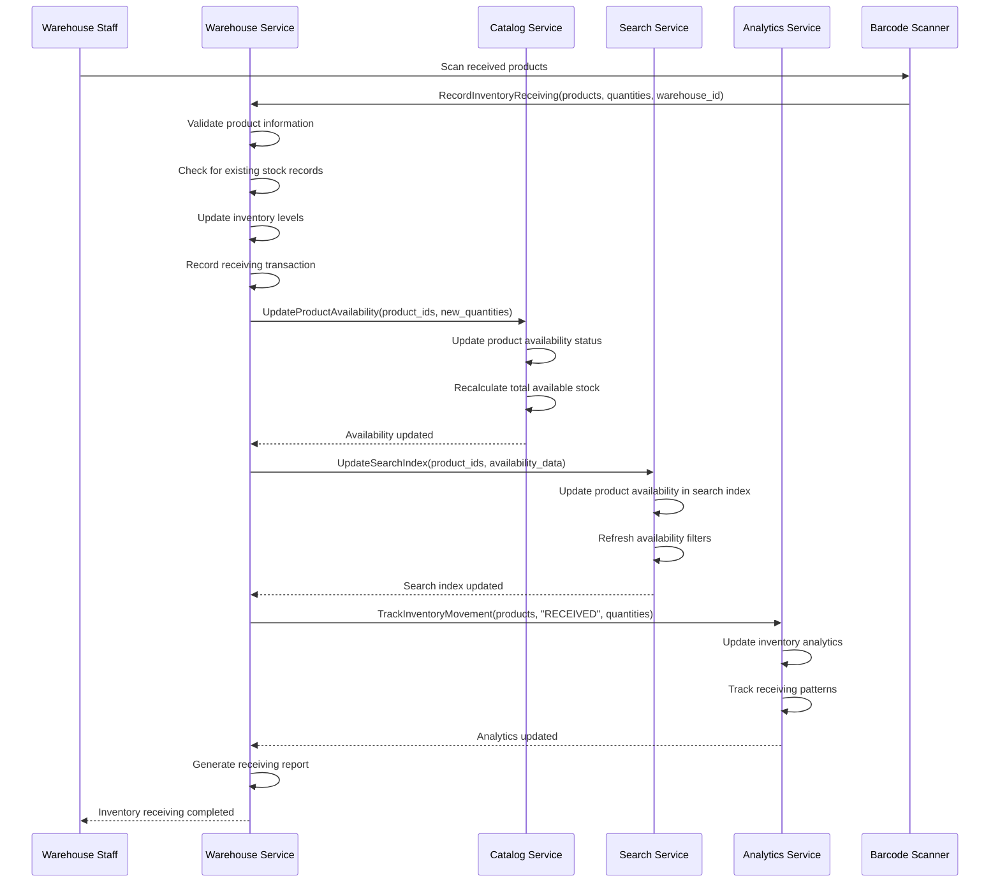
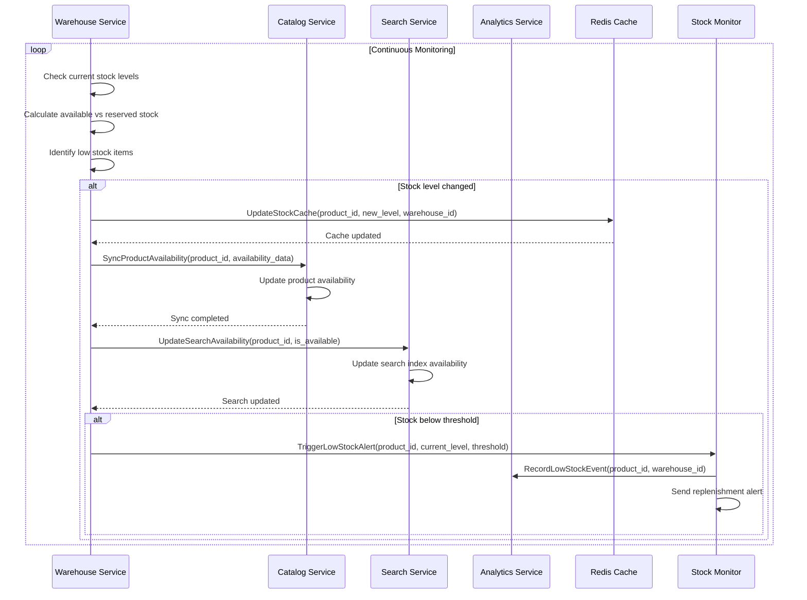
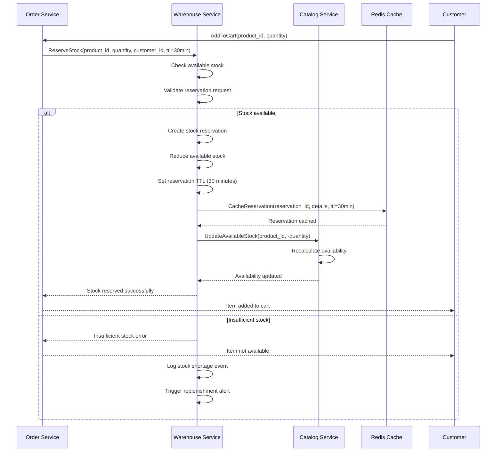
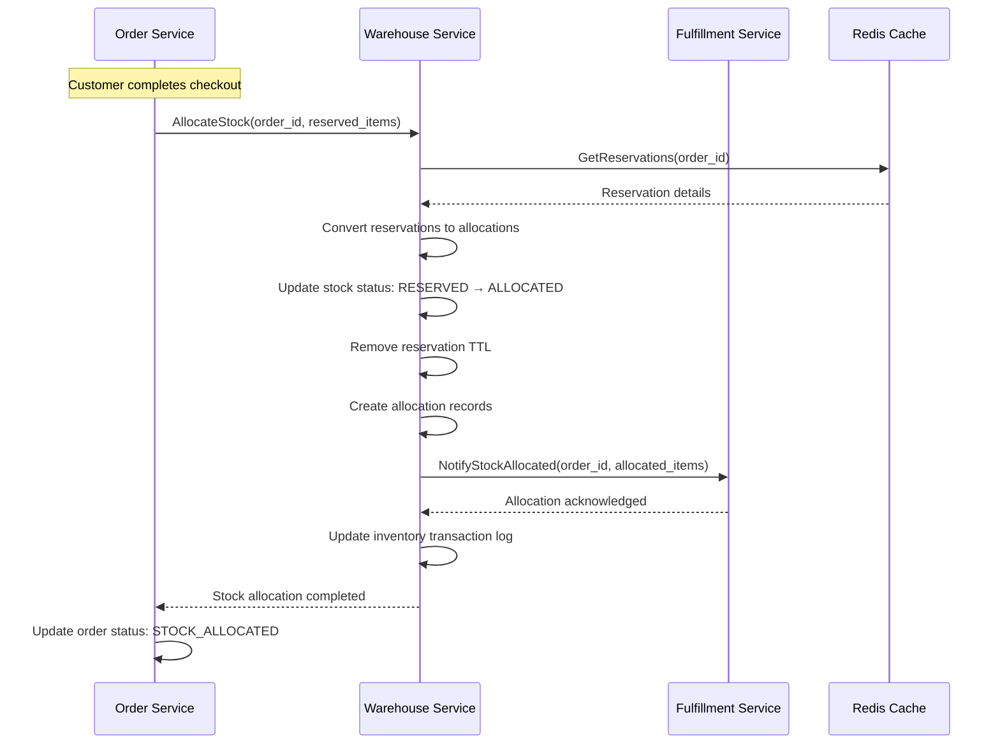
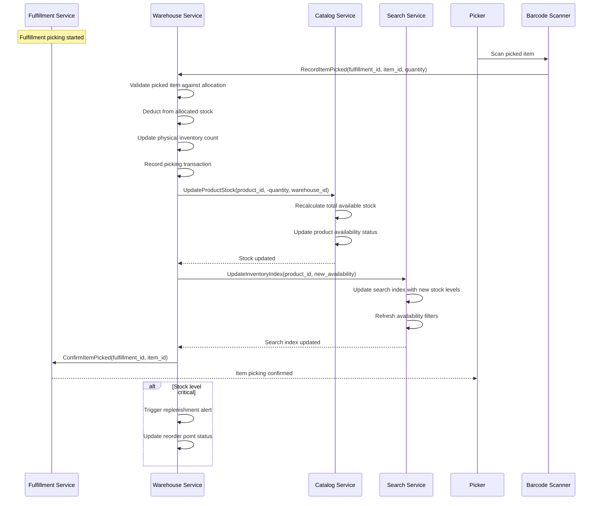
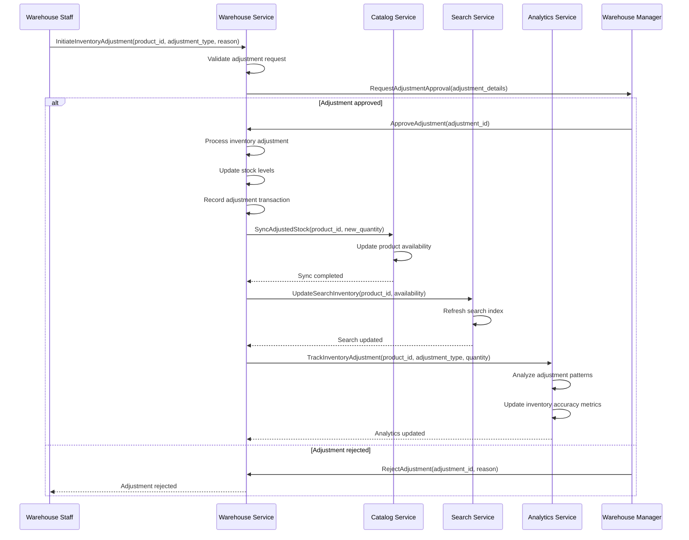
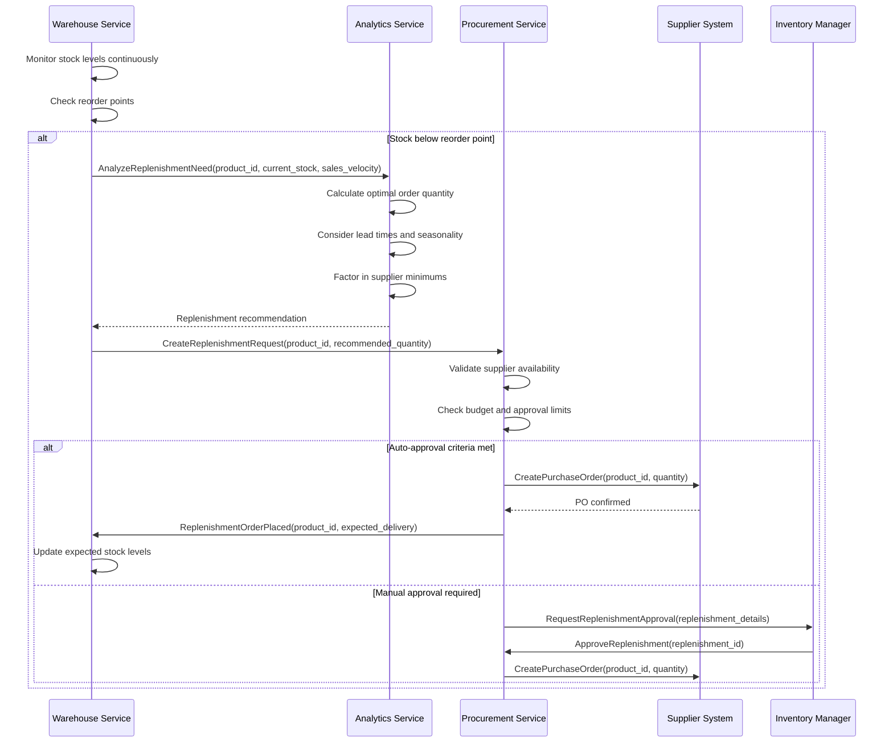
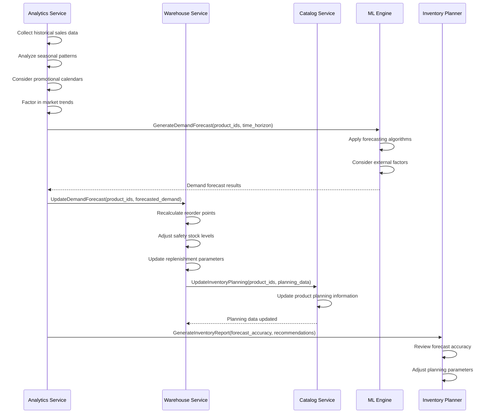
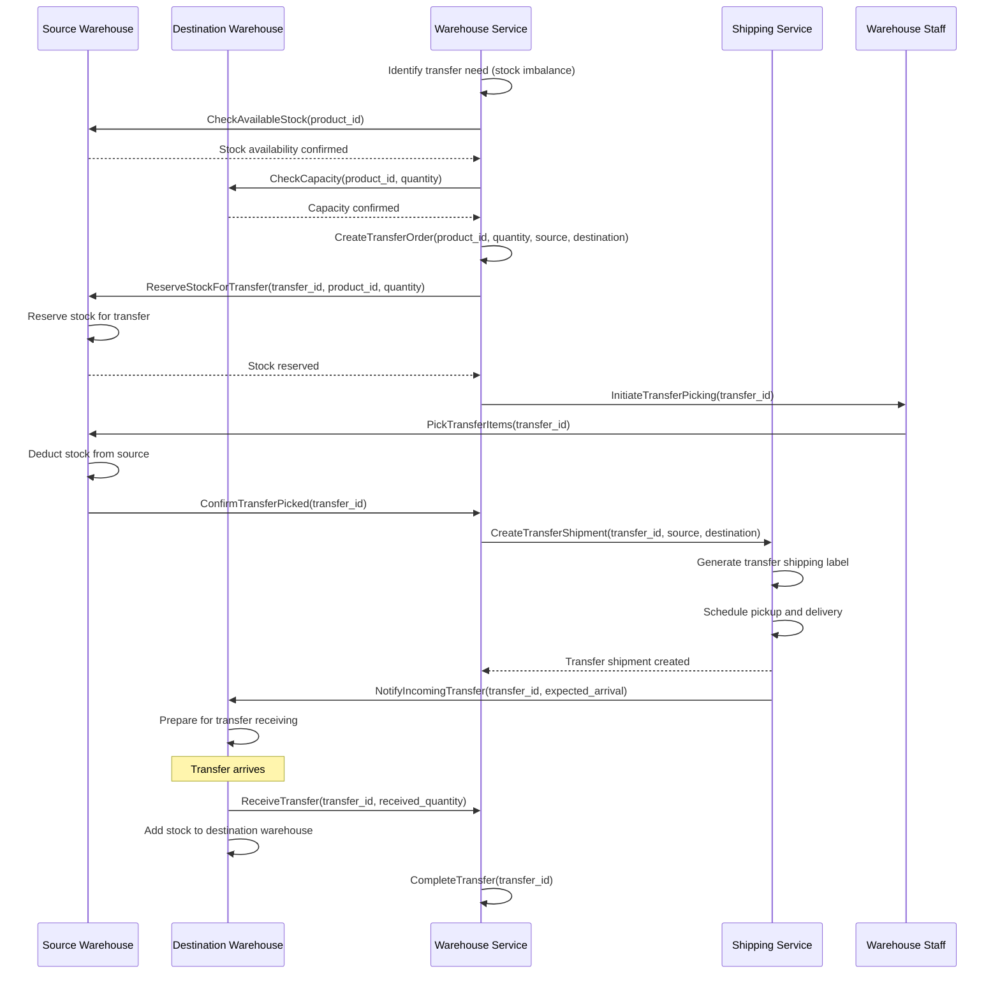
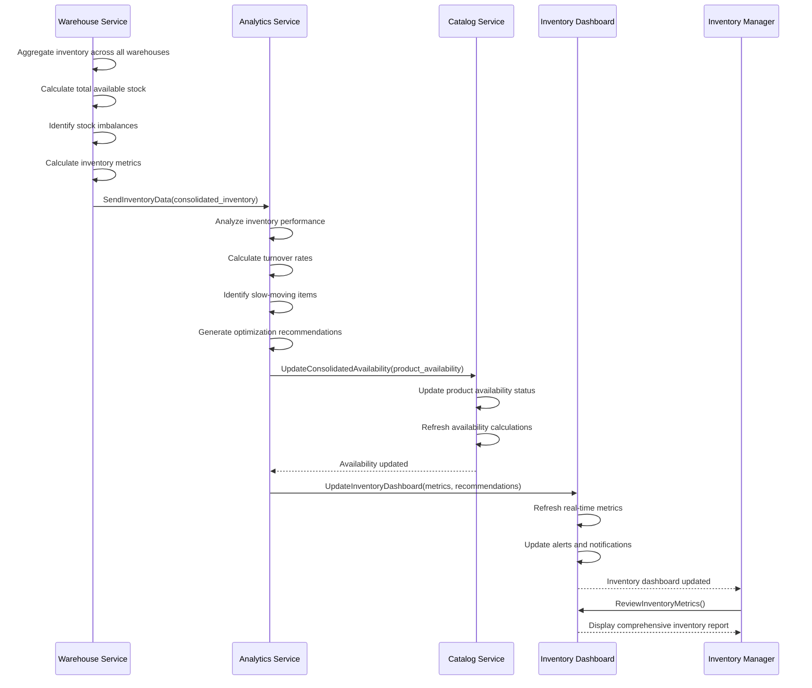

# 📊 Inventory Management Workflow

**Last Updated**: January 30, 2026  
**Status**: Based on Actual Implementation  
**Services Involved**: 7 services for complete inventory lifecycle  
**Navigation**: [← Operational Flows](README.md) | [← Workflows](../README.md)

---

## 📋 **Overview**

This document describes the complete inventory management workflow including stock tracking, reservations, allocations, replenishment, and synchronization across multiple warehouses based on the actual implementation of our microservices platform.

### **Business Context**
- **Domain**: Inventory & Stock Management
- **Objective**: Accurate real-time inventory tracking and optimal stock levels
- **Success Criteria**: Zero stockouts, minimal overstock, accurate availability
- **Key Metrics**: Stock accuracy, turnover rate, availability, carrying cost

---

## 🏗️ **Service Architecture**

### **Primary Services**
| Service | Role | Completion | Key Responsibilities |
|---------|------|------------|---------------------|
| 🚪 **Gateway Service** | Entry Point | 95% | Request routing, authentication |
| 📊 **Warehouse Service** | Inventory Management | 90% | Stock tracking, reservations, capacity |
| 📦 **Catalog Service** | Product Data | 95% | Product information, availability sync |
| 🔍 **Search Service** | Search Index | 95% | Real-time availability updates |
| 🛒 **Order Service** | Demand Management | 90% | Stock reservations, allocations |
| 📋 **Fulfillment Service** | Stock Consumption | 92% | Inventory deduction, picking updates |
| 📈 **Analytics Service** | Inventory Intelligence | 85% | Demand forecasting, optimization |

---

## 🔄 **Inventory Management Workflow**

### **Phase 1: Stock Tracking & Real-Time Updates**

#### **1.1 Inventory Receiving & Initial Stock Entry**
**Services**: Warehouse → Catalog → Search → Analytics



**Receiving Process Features:**
- **Barcode Verification**: Mandatory scanning for all received items
- **Quality Inspection**: Condition check during receiving
- **Batch Tracking**: Lot numbers and expiration dates
- **Location Assignment**: Optimal storage location allocation
- **Real-time Updates**: Immediate availability updates across systems

#### **1.2 Real-Time Stock Level Monitoring**
**Services**: Warehouse → Catalog → Search → Analytics



**Stock Monitoring Features:**
- **Real-time Tracking**: Continuous stock level monitoring
- **Multi-warehouse View**: Consolidated inventory across locations
- **Threshold Alerts**: Automated low stock notifications
- **Availability Sync**: Real-time updates to catalog and search
- **Performance Optimization**: Redis caching for fast access

---

### **Phase 2: Stock Reservations & Allocations**

#### **2.1 Order-Based Stock Reservation**
**Services**: Order → Warehouse → Catalog



**Reservation Management:**
- **Time-based Reservations**: 30-minute TTL for cart items
- **Automatic Release**: Expired reservations automatically released
- **Priority Handling**: VIP customers get priority reservations
- **Batch Reservations**: Efficient handling of multiple items
- **Conflict Resolution**: Handle concurrent reservation requests

#### **2.2 Order Confirmation & Stock Allocation**
**Services**: Order → Warehouse → Fulfillment



---

### **Phase 3: Inventory Consumption & Fulfillment**

#### **3.1 Picking & Stock Deduction**
**Services**: Fulfillment → Warehouse → Catalog → Search



#### **3.2 Inventory Adjustments & Corrections**
**Services**: Warehouse → Catalog → Search → Analytics



**Adjustment Types:**
- **Physical Count Corrections**: Cycle count discrepancies
- **Damage Adjustments**: Damaged or defective items
- **Loss Adjustments**: Theft, shrinkage, or missing items
- **Return Adjustments**: Returned items back to stock
- **Transfer Adjustments**: Inter-warehouse transfers

---

### **Phase 4: Replenishment & Procurement**

#### **4.1 Automated Replenishment Triggers**
**Services**: Warehouse → Analytics → Procurement



#### **4.2 Demand Forecasting & Planning**
**Services**: Analytics → Warehouse → Catalog



**Forecasting Features:**
- **Machine Learning**: AI-powered demand prediction
- **Seasonal Adjustments**: Account for seasonal variations
- **Promotional Impact**: Factor in marketing campaigns
- **External Factors**: Weather, events, market trends
- **Accuracy Tracking**: Continuous forecast improvement

---

### **Phase 5: Multi-Warehouse Coordination**

#### **5.1 Inter-Warehouse Stock Transfers**
**Services**: Warehouse → Fulfillment → Shipping



#### **5.2 Consolidated Inventory Reporting**
**Services**: Warehouse → Analytics → Catalog



---

## 📊 **Event Flow Architecture**

### **Key Events Published**

**Stock Movement Events:**
- `inventory.received` → Catalog, Search, Analytics
- `inventory.reserved` → Order, Analytics
- `inventory.allocated` → Fulfillment, Analytics
- `inventory.picked` → Catalog, Search, Analytics
- `inventory.adjusted` → Catalog, Search, Analytics

**Replenishment Events:**
- `inventory.low_stock` → Procurement, Analytics
- `inventory.reorder_triggered` → Procurement, Analytics
- `inventory.replenishment_ordered` → Analytics
- `inventory.replenishment_received` → Catalog, Search, Analytics

**Transfer Events:**
- `inventory.transfer_initiated` → Analytics
- `inventory.transfer_shipped` → Analytics
- `inventory.transfer_received` → Catalog, Search, Analytics

### **Event Payload Example**

```json
{
  "event_id": "evt_inv_123456789",
  "event_type": "inventory.picked",
  "timestamp": "2026-01-30T14:30:00Z",
  "version": "1.0",
  "data": {
    "product_id": "prod_456",
    "warehouse_id": "WH-HCM-001",
    "quantity_picked": 2,
    "remaining_stock": 48,
    "allocated_stock": 12,
    "available_stock": 36,
    "fulfillment_id": "FUL-20260130-12345",
    "picker_id": "staff_789",
    "location": "A-12-03",
    "batch_number": "BATCH-2026-001",
    "cost_per_unit": 150000,
    "total_cost": 300000
  },
  "metadata": {
    "correlation_id": "corr_inv_123456789",
    "service": "warehouse-service",
    "version": "1.1.0"
  }
}
```

---

## 🎯 **Business Rules & Validation**

### **Stock Reservation Rules**
- **Reservation TTL**: 30 minutes for cart items, 24 hours for saved items
- **Priority Reservations**: VIP customers get priority access
- **Concurrent Handling**: First-come-first-served for simultaneous requests
- **Minimum Quantities**: Respect supplier minimum order quantities
- **Maximum Reservations**: Limit per customer to prevent hoarding

### **Replenishment Rules**
- **Reorder Points**: Dynamic based on lead time and demand velocity
- **Safety Stock**: Minimum 7 days of average demand
- **Economic Order Quantity**: Optimize order sizes for cost efficiency
- **Supplier Lead Times**: Factor in supplier delivery schedules
- **Budget Constraints**: Respect procurement budget limits

### **Transfer Rules**
- **Stock Imbalance Threshold**: Transfer when variance >20%
- **Transfer Minimums**: Minimum transfer quantity to justify cost
- **Capacity Constraints**: Respect destination warehouse capacity
- **Priority Items**: Fast-moving items get transfer priority
- **Cost Optimization**: Consider transfer costs vs. stockout costs

---

## 📈 **Performance Metrics & SLAs**

### **Target Performance**
| Operation | Target Latency (P95) | Target Throughput |
|-----------|---------------------|-------------------|
| Stock Check | <50ms | 10,000 checks/sec |
| Stock Reservation | <100ms | 1,000 reservations/sec |
| Stock Allocation | <200ms | 500 allocations/sec |
| Inventory Update | <100ms | 2,000 updates/sec |
| Availability Sync | <500ms | 1,000 syncs/sec |

### **Business SLAs**
| Process | Target SLA | Current Performance |
|---------|------------|-------------------|
| Stock Availability | 99.9% accuracy | Tracking |
| Reservation Response | <100ms | Tracking |
| Replenishment Lead Time | <7 days | Tracking |
| Transfer Processing | <48 hours | Tracking |
| Inventory Sync | <1 minute | Tracking |

### **Key Business Metrics**
| Metric | Target | Current | Frequency |
|--------|--------|---------|-----------|
| Stock Accuracy | >99.5% | Tracking | Daily |
| Inventory Turnover | >12x/year | Tracking | Monthly |
| Stockout Rate | <1% | Tracking | Daily |
| Carrying Cost | <15% of inventory value | Tracking | Monthly |
| Forecast Accuracy | >85% | Tracking | Weekly |

---

## 🔒 **Security & Compliance**

### **Security Measures**
- **Access Control**: Role-based access to inventory functions
- **Audit Trails**: Complete tracking of all inventory movements
- **Data Encryption**: Encrypted inventory and cost data
- **Barcode Verification**: Mandatory scanning for all transactions
- **Approval Workflows**: Multi-level approval for adjustments

### **Compliance Features**
- **Inventory Accounting**: FIFO/LIFO cost accounting methods
- **Regulatory Compliance**: Food safety, pharmaceutical regulations
- **Audit Support**: Complete transaction history and documentation
- **Tax Compliance**: Accurate inventory valuation for tax purposes
- **Quality Standards**: ISO 9001 inventory management compliance

---

## 🚨 **Error Handling & Recovery**

### **Common Error Scenarios**

**Stock Discrepancies:**
- **Physical vs System**: Cycle count discrepancies
- **Reservation Conflicts**: Concurrent reservation attempts
- **Allocation Failures**: Insufficient stock for allocation
- **Sync Failures**: Catalog/search synchronization issues

**System Failures:**
- **Database Connectivity**: Temporary database unavailability
- **Cache Failures**: Redis cache unavailability
- **Service Timeouts**: Slow response from dependent services
- **Network Issues**: Inter-service communication failures

### **Recovery Mechanisms**
- **Automatic Retry**: Exponential backoff for transient failures
- **Circuit Breakers**: Prevent cascade failures
- **Fallback Strategies**: Use cached data when services unavailable
- **Manual Reconciliation**: Tools for resolving discrepancies
- **Emergency Procedures**: Manual override capabilities

---

## 📋 **Integration Points**

### **External Integrations**
- **Supplier Systems**: EDI, API integration for replenishment
- **Barcode Systems**: Zebra, Honeywell scanning equipment
- **WMS Systems**: Warehouse management system integration
- **ERP Systems**: Enterprise resource planning integration
- **Accounting Systems**: Cost accounting and valuation

### **Internal Service Dependencies**
- **Critical Path**: Warehouse → Catalog → Search
- **Supporting Services**: Order, Fulfillment, Analytics
- **Data Services**: Product (catalog), Customer (preferences)

---

**Document Status**: ✅ Complete Implementation-Based Documentation  
**Last Updated**: January 30, 2026  
**Next Review**: February 29, 2026  
**Maintained By**: Inventory Management & Operations Team