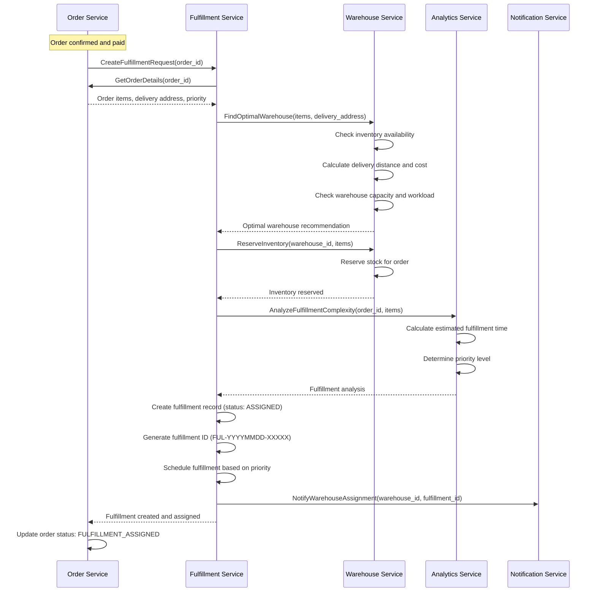
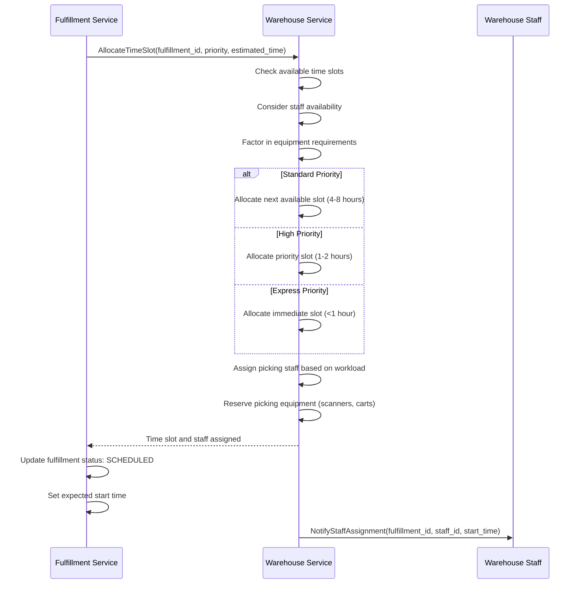
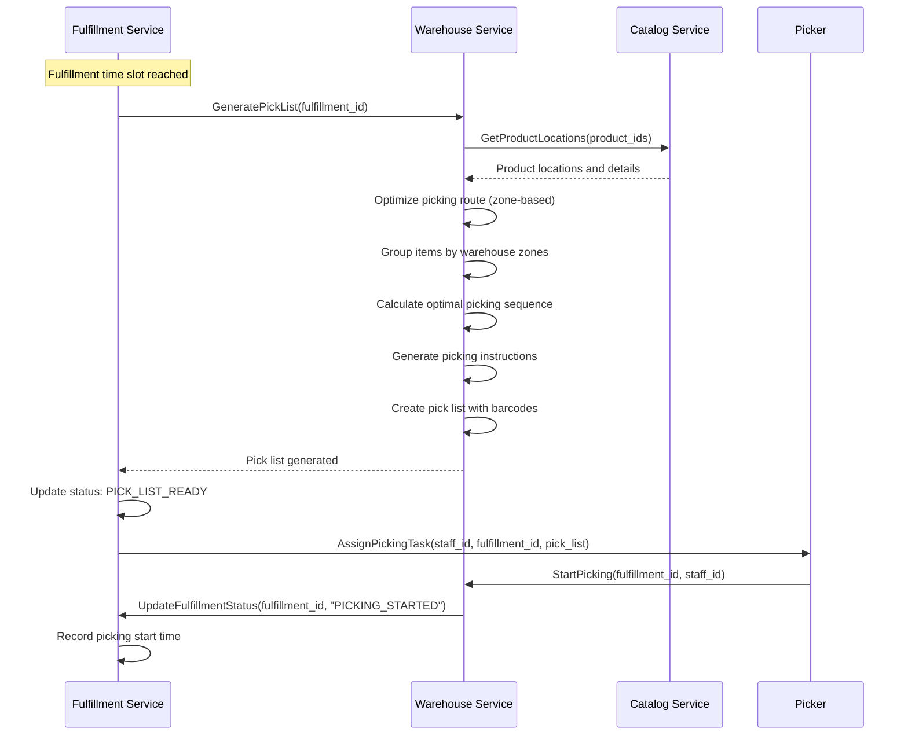
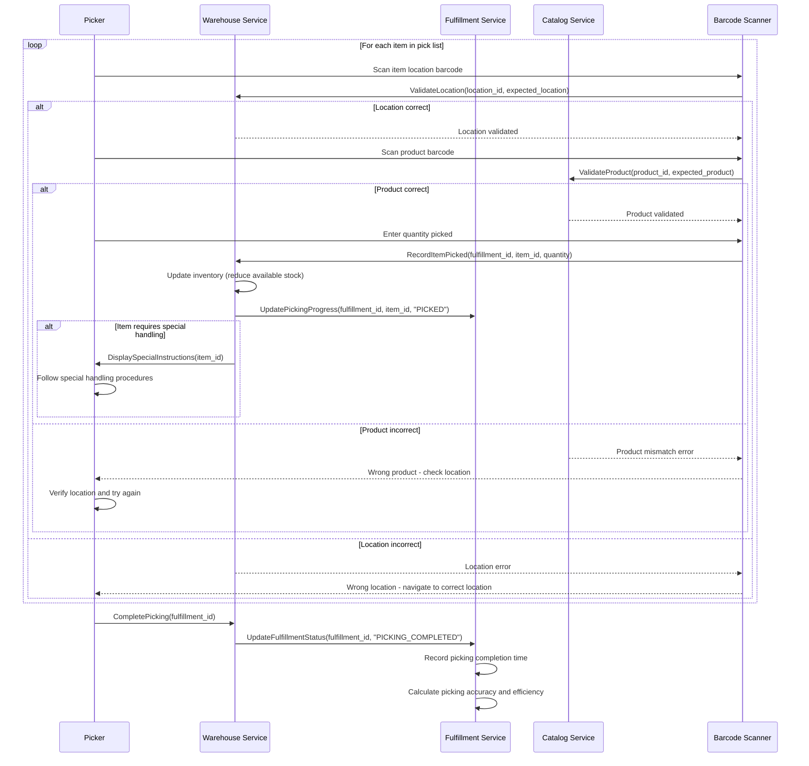
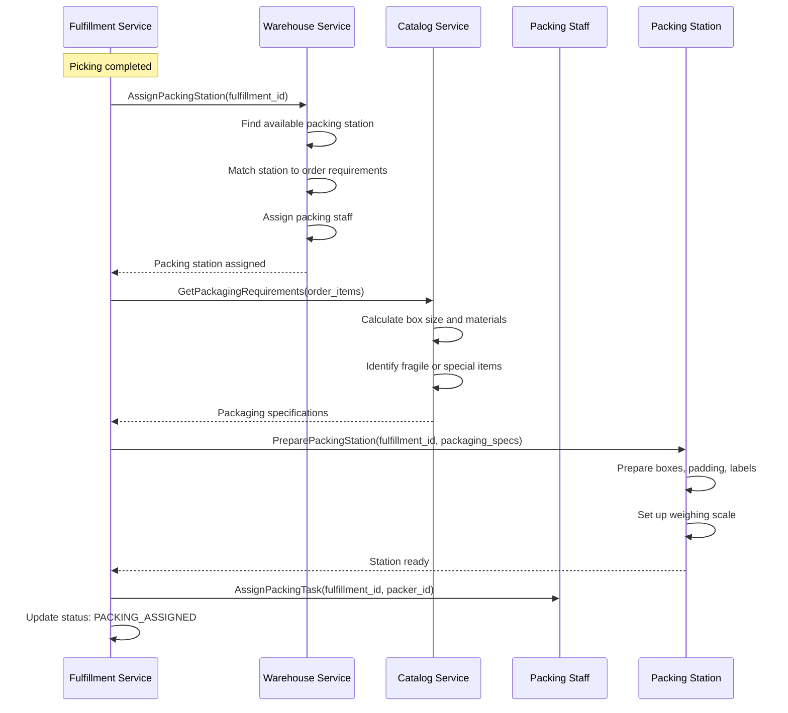
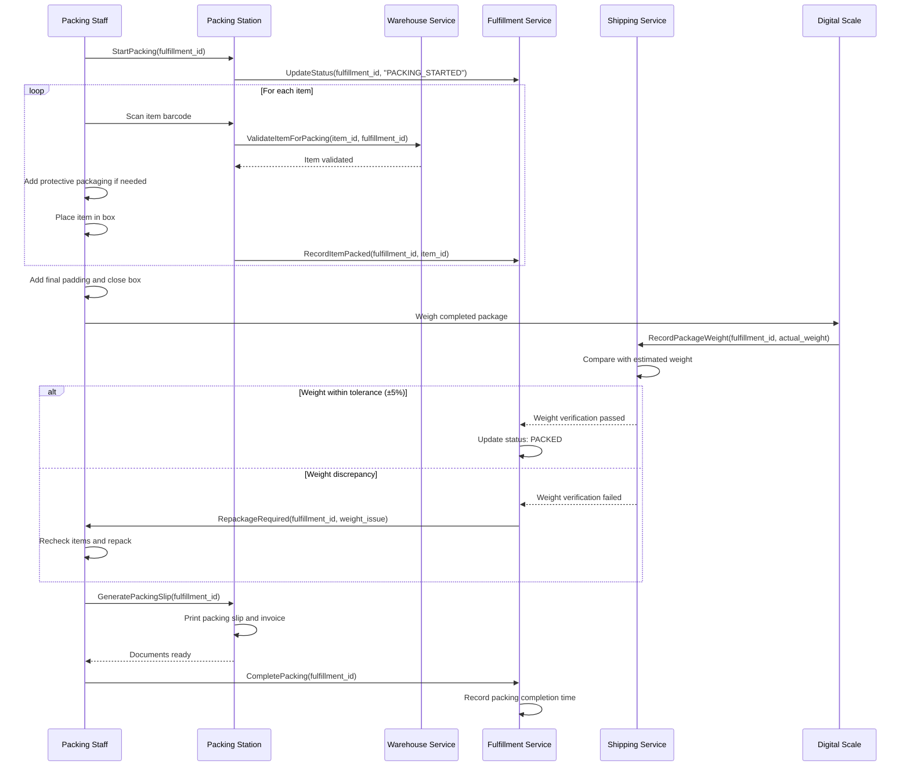
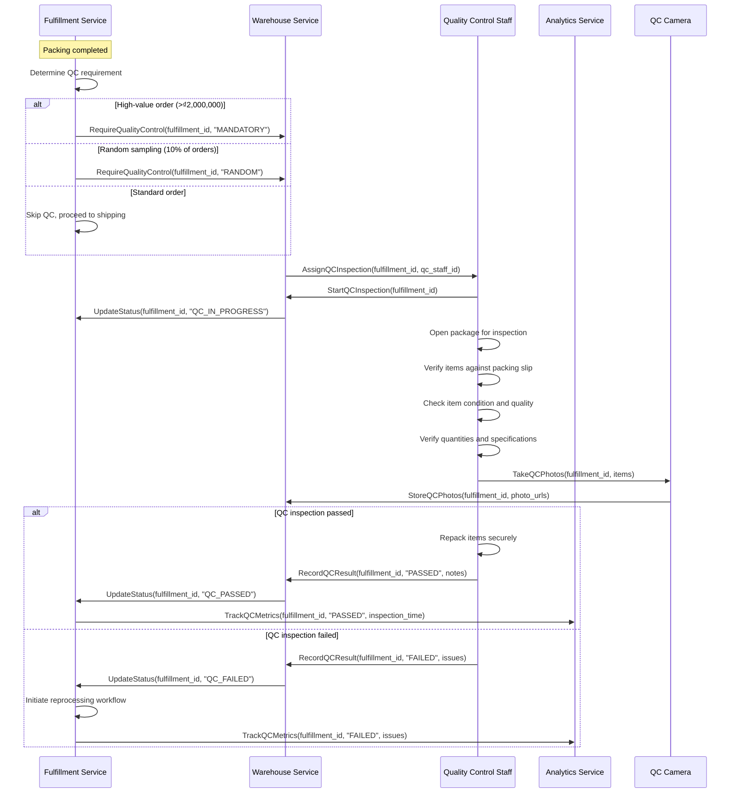
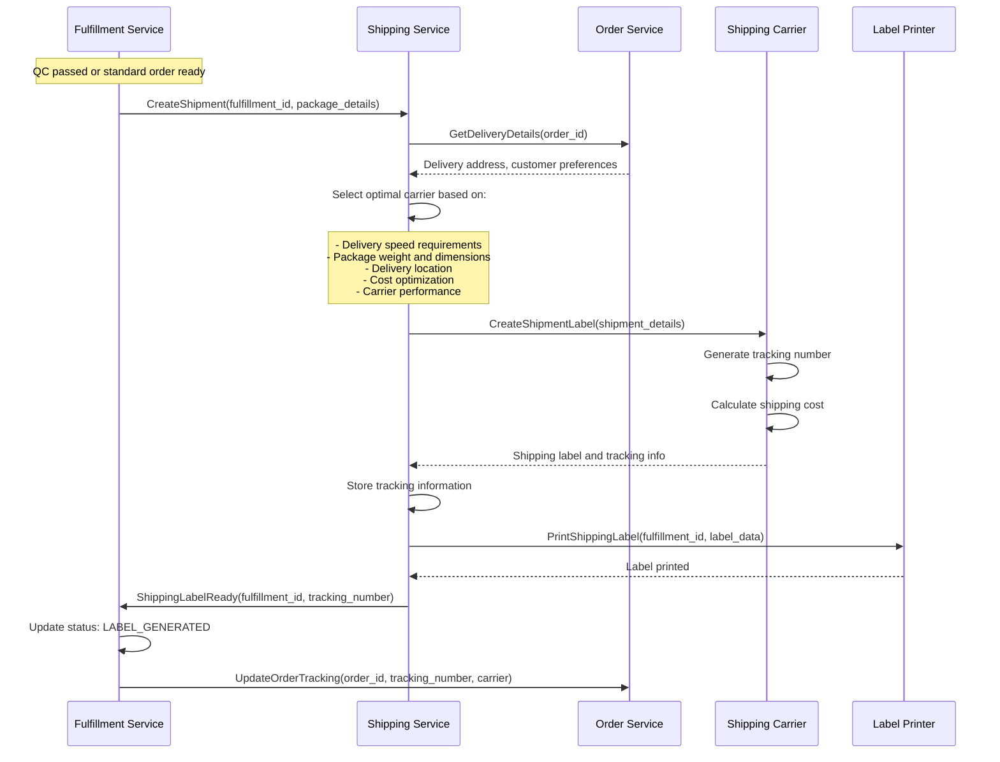
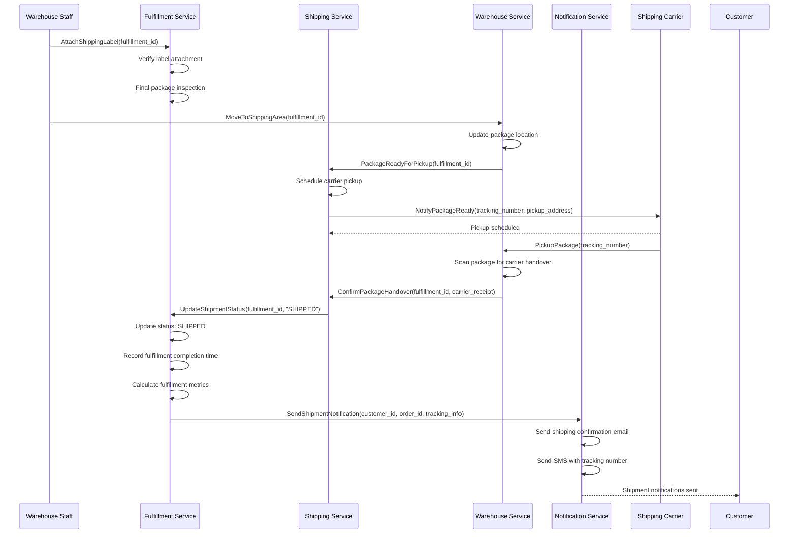

# 📋 Order Fulfillment Workflow

**Last Updated**: January 30, 2026  
**Status**: Based on Actual Implementation  
**Services Involved**: 8 services for complete fulfillment lifecycle  
**Navigation**: [← Operational Flows](README.md) | [← Workflows](../README.md)

---

## 📋 **Overview**

This document describes the complete order fulfillment workflow including warehouse assignment, picking, packing, quality control, and shipping preparation based on the actual implementation of our microservices platform.

### **Business Context**
- **Domain**: Order Fulfillment & Logistics
- **Objective**: Efficient and accurate order processing from confirmation to shipment
- **Success Criteria**: Fast fulfillment, high accuracy, quality assurance
- **Key Metrics**: Fulfillment time, accuracy rate, quality score, cost per shipment

**Used in**: [Browse to Purchase (Customer Journey)](../customer-journey/browse-to-purchase.md) — Phase 5 Order Fulfillment (create fulfillment, pick, pack, QC, ship). This workflow doc provides the detailed fulfillment lifecycle; the customer journey doc shows the high-level sequence within the end-to-end flow.

**Fulfillment creation trigger and idempotency**: Fulfillment is created when Order Service publishes event `order_status_changed` with `new_status == "confirmed"` (order confirmed and paid). Fulfillment Service subscribes to this topic and creates the fulfillment record; it also accepts a direct gRPC `CreateFulfillment` call. Both paths are **idempotent**: duplicate events or duplicate API calls for the same order return the existing fulfillment without creating a second one.

---

## 🏗️ **Service Architecture**

### **Primary Services**
| Service | Role | Completion | Key Responsibilities |
|---------|------|------------|---------------------|
| 🚪 **Gateway Service** | Entry Point | 95% | Request routing, authentication |
| 📋 **Fulfillment Service** | Orchestration | 92% | Fulfillment workflow, task management |
| 🛒 **Order Service** | Order Data | 90% | Order details, status updates |
| 📊 **Warehouse Service** | Inventory Management | 90% | Stock allocation, capacity management |
| 📦 **Catalog Service** | Product Data | 95% | Product details, packaging requirements |
| 🚚 **Shipping Service** | Logistics | 85% | Carrier selection, label generation |
| 📧 **Notification Service** | Communication | 90% | Status updates, alerts |
| 📈 **Analytics Service** | Performance Tracking | 85% | Fulfillment metrics, optimization |

---

## 🔄 **Order Fulfillment Workflow**

### **Phase 1: Fulfillment Planning**

#### **1.1 Order Assignment & Warehouse Selection**
**Services**: Fulfillment → Order → Warehouse → Analytics



**Warehouse Selection Criteria:**
- **Inventory Availability**: All items in stock
- **Geographic Proximity**: Closest to delivery address
- **Capacity**: Available fulfillment slots
- **Performance**: Historical accuracy and speed
- **Cost Optimization**: Shipping and handling costs

#### **1.2 Time Slot Allocation & Staff Assignment**
**Services**: Fulfillment → Warehouse



---

### **Phase 2: Order Picking Process**

#### **2.1 Pick List Generation & Optimization**
**Services**: Fulfillment → Warehouse → Catalog



**Pick List Optimization:**
- **Zone-Based Routing**: Minimize travel time between locations
- **Batch Picking**: Group multiple orders when possible
- **Priority Sequencing**: High-priority orders picked first
- **Equipment Optimization**: Match picking tools to item types
- **Staff Specialization**: Assign based on staff expertise

#### **2.2 Item Picking & Verification**
**Services**: Warehouse → Fulfillment → Catalog



**Picking Quality Controls:**
- **Barcode Verification**: Mandatory scanning for all items
- **Location Validation**: Ensure correct picking location
- **Quantity Verification**: Double-check quantities
- **Special Handling**: Fragile, hazardous, or high-value items
- **Real-time Tracking**: Live progress updates

---

### **Phase 3: Packing & Quality Control**

#### **3.1 Packing Station Assignment & Preparation**
**Services**: Fulfillment → Warehouse → Catalog



#### **3.2 Item Packing & Weight Verification**
**Services**: Fulfillment → Warehouse → Shipping



**Packing Standards:**
- **Box Selection**: Right-sized packaging to minimize waste
- **Protection**: Adequate padding for fragile items
- **Weight Limits**: Comply with carrier weight restrictions
- **Documentation**: Include packing slip and invoice
- **Branding**: Consistent packaging presentation

#### **3.3 Quality Control Inspection**
**Services**: Fulfillment → Warehouse → Analytics



**Quality Control Criteria:**
- **Item Accuracy**: Correct products and quantities
- **Condition Check**: No damage or defects
- **Completeness**: All accessories and documentation included
- **Packaging Quality**: Secure and professional packaging
- **Documentation**: Accurate packing slip and labels

#### **3.4 QC Failure and Compensation**

When QC inspection **fails** (e.g. wrong item, defect, missing photo), Fulfillment Service runs compensation so stock and stakeholders are consistent:

1. **Status**: Fulfillment is updated with `QCPassed = false` (and optional `qc_failed` status if used).
2. **Release stock**: Fulfillment calls Warehouse Service `ReleaseReservation(reservation_id)` so the reserved stock returns to available inventory for re-pick or replacement.
3. **Notify**: Fulfillment publishes event `fulfillments.fulfillment.qc.failed` with `fulfillment_id`, `order_id`, `order_number`, `reason`, `checked_at`, and optional `reservation_id`. Notification Service (or other subscribers) can send alerts to staff or customers.
4. **Return to packing** (optional): Per [fulfillment-shipping-flow.mmd](../sequence-diagrams/fulfillment-shipping-flow.mmd), the flow may return to packing for repack and re-inspect, or request replacement items from Warehouse.

This aligns with Phase 4 of the fulfillment-shipping-flow sequence diagram (QC fail path and error handling).

---

### **Phase 4: Shipping Preparation**

#### **4.1 Shipping Label Generation**
**Services**: Fulfillment → Shipping → Order



#### **4.2 Final Packaging & Handover**
**Services**: Fulfillment → Shipping → Warehouse → Notification



---

## 📊 **Event Flow Architecture**

### **Key Events Published**

**Fulfillment Lifecycle Events:**
- `fulfillment.created` → Analytics, Notification
- `fulfillment.assigned` → Warehouse, Analytics
- `fulfillment.picking.started` → Analytics
- `fulfillment.picking.completed` → Analytics
- `fulfillment.packing.started` → Analytics
- `fulfillment.packing.completed` → Shipping, Analytics
- `fulfillment.qc.completed` → Analytics
- `fulfillment.shipped` → Order, Customer, Analytics, Notification

**Inventory Events:**
- `inventory.reserved` → Catalog, Analytics
- `inventory.picked` → Catalog, Analytics
- `inventory.allocated` → Catalog, Analytics

**Quality Events:**
- `qc.inspection.started` → Analytics
- `qc.inspection.passed` → Analytics
- `qc.inspection.failed` → Analytics, Notification

### **Event Payload Example**

```json
{
  "event_id": "evt_ful_123456789",
  "event_type": "fulfillment.shipped",
  "timestamp": "2026-01-30T18:30:00Z",
  "version": "1.0",
  "data": {
    "fulfillment_id": "FUL-20260130-12345",
    "order_id": "ORD-20260130-67890",
    "warehouse_id": "WH-HCM-001",
    "tracking_number": "1Z999AA1234567890",
    "carrier": "FedEx",
    "package_weight": 2.5,
    "package_dimensions": {
      "length": 30,
      "width": 20,
      "height": 15
    },
    "fulfillment_metrics": {
      "total_time_hours": 4.5,
      "picking_time_minutes": 45,
      "packing_time_minutes": 30,
      "qc_time_minutes": 15,
      "accuracy_rate": 100
    },
    "items_shipped": [
      {
        "item_id": "item_123",
        "product_id": "prod_456",
        "quantity": 1,
        "condition": "NEW"
      }
    ]
  },
  "metadata": {
    "correlation_id": "corr_ful_123456789",
    "service": "fulfillment-service",
    "version": "1.2.0"
  }
}
```

---

## 🎯 **Business Rules & Validation**

### **Fulfillment Priority Rules**
- **Express Orders**: <2 hours fulfillment time
- **High-Value Orders**: >₫2,000,000 require mandatory QC
- **Fragile Items**: Special handling and packaging requirements
- **Bulk Orders**: >10 items may require batch processing
- **International Orders**: Additional documentation and customs requirements

### **Quality Control Rules**
- **Mandatory QC**: Orders >₫2,000,000, electronics, fragile items
- **Random Sampling**: 10% of standard orders
- **Inspection Criteria**: Accuracy, condition, completeness, packaging
- **Failure Handling**: Automatic reprocessing for failed QC
- **Documentation**: Photo evidence for all QC inspections

### **Shipping Rules**
- **Carrier Selection**: Based on speed, cost, and reliability
- **Weight Limits**: Maximum 30kg per package
- **Dimension Limits**: Maximum 100cm x 60cm x 60cm
- **Restricted Items**: Hazardous materials, liquids, batteries
- **Insurance**: Automatic insurance for orders >₫1,000,000

---

## 📈 **Performance Metrics & SLAs**

### **Target Performance**
| Operation | Target Latency | Target Throughput |
|-----------|----------------|-------------------|
| Fulfillment Assignment | <30s | 1000 assignments/hour |
| Pick List Generation | <60s | 500 lists/hour |
| Item Picking | <2 min/item | 30 items/hour/picker |
| Packing Process | <5 min/order | 12 orders/hour/packer |
| QC Inspection | <10 min/order | 6 orders/hour/inspector |
| Label Generation | <30s | 2000 labels/hour |

### **Business SLAs**
| Fulfillment Type | Target SLA | Current Performance |
|------------------|------------|-------------------|
| Express Orders | <2 hours | Tracking |
| Standard Orders | <24 hours | Tracking |
| Bulk Orders | <48 hours | Tracking |
| International Orders | <72 hours | Tracking |

### **Key Business Metrics**
| Metric | Target | Current | Frequency |
|--------|--------|---------|-----------|
| Fulfillment Accuracy | >99.5% | Tracking | Real-time |
| On-Time Fulfillment | >95% | Tracking | Daily |
| QC Pass Rate | >98% | Tracking | Daily |
| Cost per Shipment | <₫50,000 | Tracking | Weekly |
| Customer Satisfaction | >4.5/5 | Tracking | Weekly |

---

## 🔒 **Security & Compliance**

### **Security Measures**
- **Access Control**: Role-based access to fulfillment areas
- **Inventory Security**: Barcode tracking for all movements
- **Quality Assurance**: Photo documentation for high-value items
- **Audit Trails**: Complete tracking of all fulfillment activities
- **Data Protection**: Encrypted customer and order information

### **Compliance Features**
- **Inventory Accuracy**: Real-time stock tracking and reconciliation
- **Quality Standards**: ISO 9001 quality management compliance
- **Safety Regulations**: Workplace safety and handling procedures
- **Environmental**: Sustainable packaging and waste reduction
- **Customer Privacy**: Secure handling of customer information

---

## 🚨 **Error Handling & Recovery**

### **Common Error Scenarios**

**Picking Errors:**
- **Item Not Found**: Inventory discrepancy, location error
- **Wrong Item Picked**: Barcode mismatch, human error
- **Quantity Shortage**: Insufficient stock, reservation error
- **Damaged Item**: Item damage during picking

**Packing Errors:**
- **Weight Discrepancy**: Missing items, wrong items
- **Packaging Failure**: Insufficient protection, wrong box size
- **Label Error**: Incorrect shipping information
- **Documentation Missing**: Packing slip, invoice errors

### **Recovery Mechanisms**
- **Automatic Retry**: Retry failed operations with exponential backoff
- **Manual Intervention**: Escalate complex issues to supervisors
- **Inventory Adjustment**: Real-time inventory corrections
- **Quality Recovery**: Reprocessing for failed quality checks
- **Customer Communication**: Proactive notification of delays

---

## 📋 **Integration Points**

### **External Integrations**
- **Shipping Carriers**: FedEx, UPS, DHL, local carriers
- **Barcode Systems**: Zebra, Honeywell scanning equipment
- **Weighing Systems**: Digital scales with API integration
- **Packaging Systems**: Automated packaging equipment
- **Quality Control**: Camera systems, inspection tools

### **Internal Service Dependencies**
- **Critical Path**: Order → Fulfillment → Warehouse → Shipping
- **Supporting Services**: Catalog, Analytics, Notification
- **Data Services**: Customer (addresses), Payment (confirmation)

---

**Document Status**: ✅ Complete Implementation-Based Documentation  
**Last Updated**: January 30, 2026  
**Next Review**: February 29, 2026  
**Maintained By**: Fulfillment Operations & Logistics Team