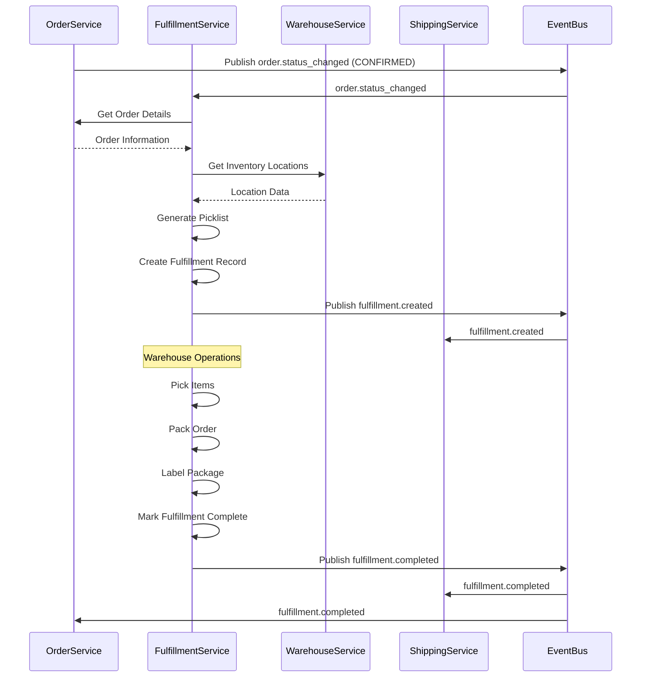
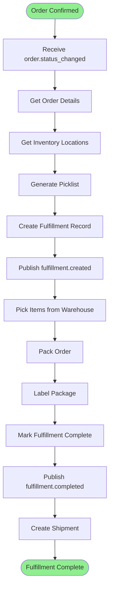

# Fulfillment Process

**Domain:** Fulfillment (DDD)  
**Process ID:** `fulfillment`  
**Version:** `v1.0.0`  
**Last Updated:** 2025-11-17  
**Status:** Active

## Overview

### Business Context

The Fulfillment process handles order fulfillment from order confirmation to shipment creation. This process coordinates picking, packing, and preparing orders for shipment.

### Success Criteria

- Picklist is generated for confirmed orders
- Items are picked from warehouse
- Order is packed and labeled
- Shipment is created
- Fulfillment status is tracked

### Process Scope

**In Scope:**
- Picklist generation
- Picking operations
- Packing operations
- Shipment creation
- Fulfillment status tracking

**Out of Scope:**
- Shipping (handled in Shipping process)
- Inventory management (handled in Warehouse Service)

## Services Involved

| Service | Responsibility | Endpoints |
|---------|---------------|-----------|
| Fulfillment Service | Fulfillment operations | `POST /api/v1/fulfillments`, `POST /api/v1/fulfillments/{id}/picklist` |
| Order Service | Order information | `GET /api/v1/orders/{id}` |
| Warehouse Service | Inventory location | `GET /api/v1/inventory/{sku}` |
| Shipping Service | Shipment creation | `POST /api/v1/shipments` |

## Event Flow

### Event Sequence

| Step | Event Type | Topic | Publisher | Subscribers | Payload Schema |
|------|------------|-------|-----------|--------------|----------------|
| 1 | `order.order.status_changed` | `order.status_changed` | Order Service | Fulfillment | [order.status_changed.schema.json](../json-schema/order.status_changed.schema.json) |
| 2 | `fulfillment.fulfillment.created` | `fulfillment.created` | Fulfillment Service | Shipping, Warehouse | [fulfillment.created.schema.json](../json-schema/fulfillment.created.schema.json) |
| 3 | `fulfillment.fulfillment.completed` | `fulfillment.completed` | Fulfillment Service | Order, Shipping | [fulfillment.completed.schema.json](../json-schema/fulfillment.completed.schema.json) |

## Flow Charts

### Sequence Diagram

### Business Flow Diagram

## Detailed Flow

### Step 1: Fulfillment Creation

**Trigger:** `order.status_changed` event with status CONFIRMED

**Actions:**
1. Get order details
2. Get inventory locations for order items
3. Generate picklist
4. Create fulfillment record
5. Publish `fulfillment.created`

**Services:**
- Fulfillment Service: Creates fulfillment
- Order Service: Provides order information
- Warehouse Service: Provides inventory locations

**Events:**
- Subscribes: `order.order.status_changed`
- Publishes: `fulfillment.fulfillment.created`

### Step 2: Picking

**Trigger:** After fulfillment creation

**Actions:**
1. Execute picklist
2. Pick items from warehouse locations
3. Update fulfillment status

**Services:**
- Fulfillment Service: Manages picking operations

### Step 3: Packing

**Trigger:** After picking complete

**Actions:**
1. Pack items into shipping box
2. Generate shipping label
3. Update fulfillment status

**Services:**
- Fulfillment Service: Manages packing operations

### Step 4: Fulfillment Completion

**Trigger:** After packing complete

**Actions:**
1. Mark fulfillment as complete
2. Publish `fulfillment.completed`
3. Trigger shipment creation

**Services:**
- Fulfillment Service: Completes fulfillment

**Events:**
- Publishes: `fulfillment.fulfillment.completed`

## Related Documentation

- [Fulfillment Service Documentation](../services/fulfillment-service.md)
- [Shipping Process](./shipping-process.md)
- [Order Placement Process](./order-placement-process.md)

