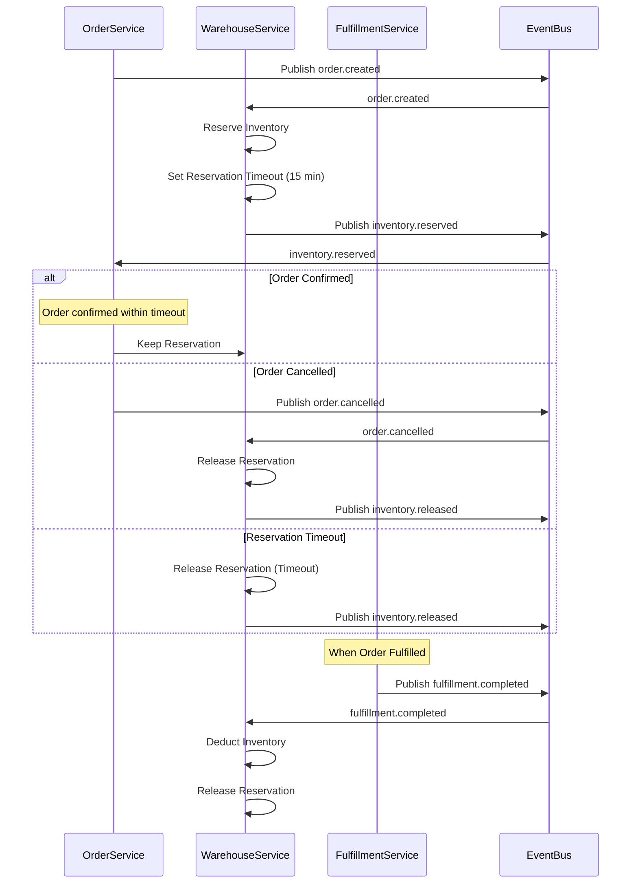
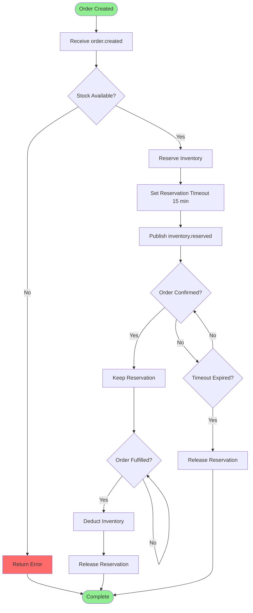
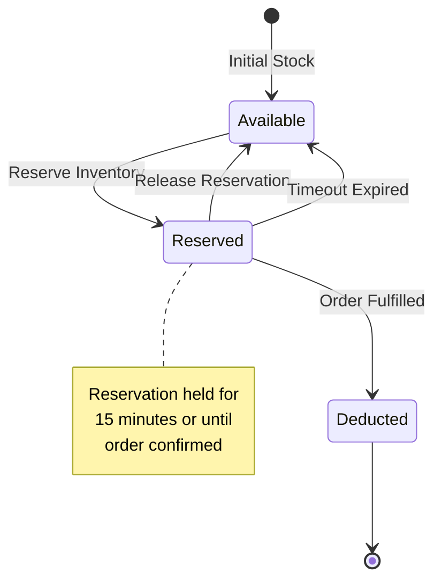

# Inventory Reservation Process

**Domain:** Inventory Management (DDD)  
**Process ID:** `inventory-reservation`  
**Version:** `v1.0.0`  
**Last Updated:** 2025-11-17  
**Status:** Active

## Overview

### Business Context

The Inventory Reservation process handles stock reservation for orders, ensuring inventory is held while orders are being processed. This process prevents overselling and manages reservation timeouts.

### Success Criteria

- Inventory is reserved when order is created
- Reservations are released if order is cancelled
- Reservations expire after timeout period
- Inventory is deducted when order is fulfilled
- Concurrent reservations are handled correctly

### Process Scope

**In Scope:**
- Inventory reservation
- Reservation release
- Reservation timeout
- Inventory deduction
- Reservation status tracking

**Out of Scope:**
- Order creation (handled in Order Placement process)
- Fulfillment (handled in Fulfillment process)

## Services Involved

| Service | Responsibility | Endpoints |
|---------|---------------|-----------|
| Warehouse Service | Inventory management | `POST /api/v1/inventory/reserve`, `POST /api/v1/inventory/release`, `POST /api/v1/inventory/deduct` |
| Order Service | Order status | `GET /api/v1/orders/{id}` |

## Event Flow

### Event Sequence

| Step | Event Type | Topic | Publisher | Subscribers | Payload Schema |
|------|------------|-------|-----------|--------------|----------------|
| 1 | `order.order.created` | `order.created` | Order Service | Warehouse | [order.created.schema.json](../json-schema/order.created.schema.json) |
| 2 | `warehouse.inventory.reserved` | `inventory.reserved` | Warehouse Service | Order | [inventory.reserved.schema.json](../json-schema/inventory.reserved.schema.json) |
| 3 | `order.order.cancelled` | `order.cancelled` | Order Service | Warehouse | [order.cancelled.schema.json](../json-schema/order.cancelled.schema.json) |
| 4 | `warehouse.inventory.released` | `inventory.released` | Warehouse Service | Order | [inventory.released.schema.json](../json-schema/inventory.released.schema.json) |
| 5 | `fulfillment.fulfillment.completed` | `fulfillment.completed` | Fulfillment Service | Warehouse | [fulfillment.completed.schema.json](../json-schema/fulfillment.completed.schema.json) |

## Flow Charts

### Sequence Diagram

### Business Flow Diagram

### State Machine

## Detailed Flow

### Step 1: Inventory Reservation

**Trigger:** `order.created` event received

**Actions:**
1. Check stock availability for all order items
2. Reserve inventory for order
3. Set reservation timeout (15 minutes)
4. Publish `inventory.reserved` event

**Services:**
- Warehouse Service: Reserves inventory

**Events:**
- Subscribes: `order.order.created`
- Publishes: `warehouse.inventory.reserved`

### Step 2: Reservation Management

**Trigger:** Order status changes

**Actions:**
- If order confirmed: Keep reservation
- If order cancelled: Release reservation
- If timeout expired: Release reservation

**Services:**
- Warehouse Service: Manages reservations

**Events:**
- Subscribes: `order.order.status_changed`, `order.order.cancelled`
- Publishes: `warehouse.inventory.released` (if released)

### Step 3: Inventory Deduction

**Trigger:** `fulfillment.completed` event received

**Actions:**
1. Deduct inventory from stock
2. Release reservation
3. Update inventory levels

**Services:**
- Warehouse Service: Deducts inventory

**Events:**
- Subscribes: `fulfillment.fulfillment.completed`

## Error Handling

### Failure Scenarios

| Scenario | Detection | Compensation | Retry Strategy |
|----------|-----------|--------------|----------------|
| Insufficient stock | Stock check fails | Return error, don't create order | N/A |
| Reservation timeout | Timer expires | Release reservation, cancel order if not confirmed | N/A |
| Concurrent reservations | Database lock | Retry reservation | Retry 3 times with exponential backoff |

## Related Documentation

- [Warehouse Service Documentation](../services/warehouse-service.md)
- [Order Placement Process](./order-placement-process.md)
- [Fulfillment Process](./fulfillment-process.md)

