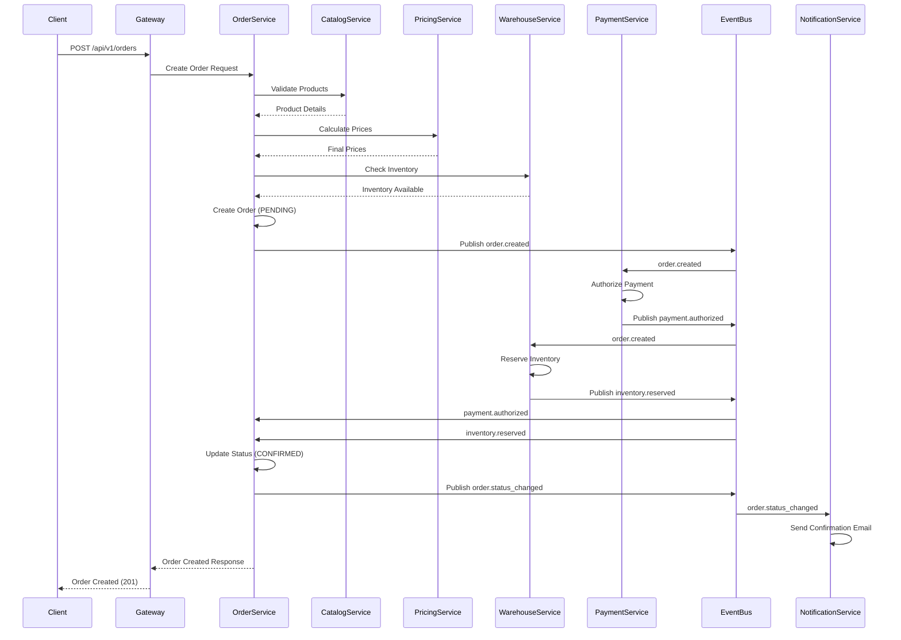
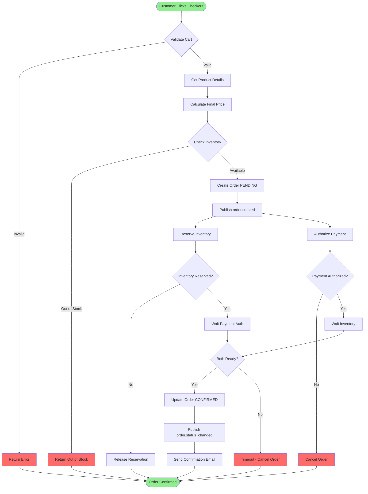
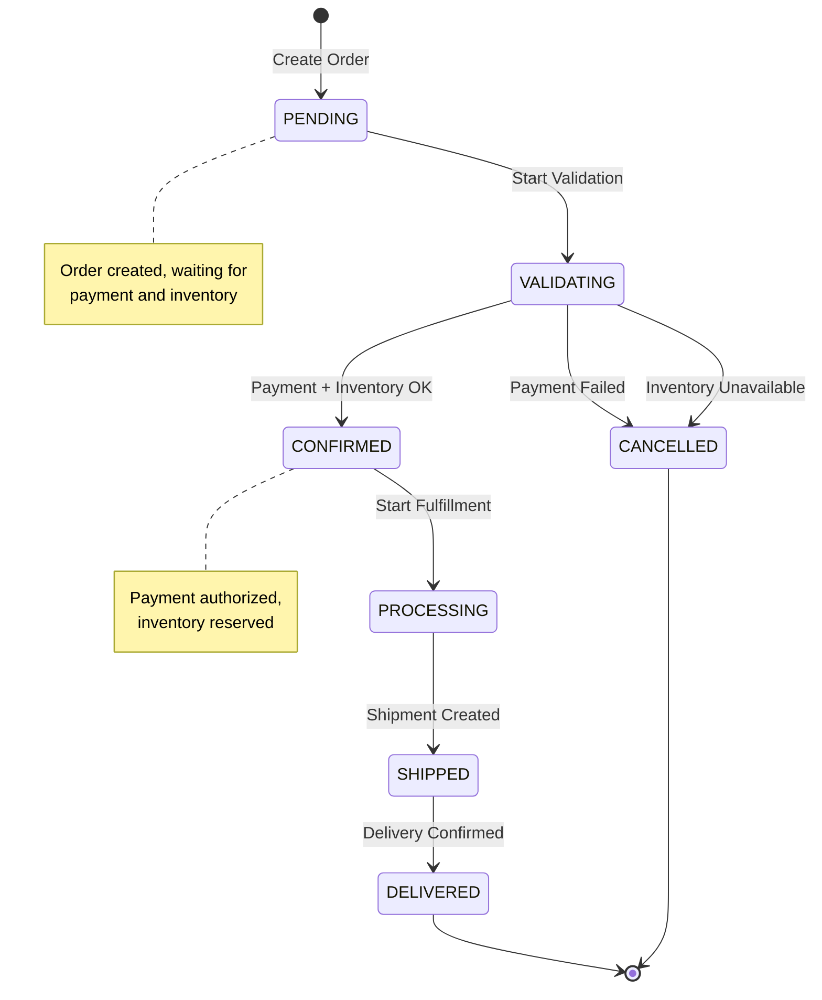
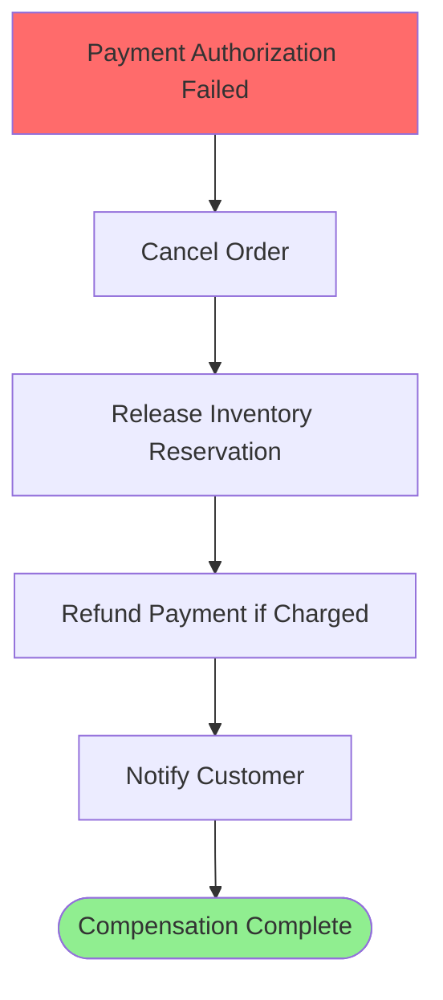

# Order Placement Process

**Domain:** Order Management (DDD)  
**Process ID:** `order-placement`  
**Version:** `v1.0.0`  
**Last Updated:** 2025-11-17  
**Status:** Active

## Overview

### Business Context

The Order Placement process handles the complete flow from cart checkout to order confirmation. This process coordinates multiple services to validate inventory, calculate pricing, process payment, and create the order record.

### Success Criteria

- Order is created with all items validated
- Inventory is reserved for all order items
- Final pricing is calculated and confirmed
- Payment is authorized (or payment method is validated)
- Order status is set to CONFIRMED
- Customer receives order confirmation

### Process Scope

**In Scope:**
- Cart validation
- Inventory availability check
- Price calculation
- Payment authorization
- Order creation
- Inventory reservation
- Order confirmation

**Out of Scope:**
- Payment capture (handled in Payment Processing process)
- Fulfillment (handled in Fulfillment process)
- Shipping (handled in Shipping process)

## Services Involved

| Service | Responsibility | Endpoints |
|---------|---------------|-----------|
| Gateway | Request routing, authentication | `POST /api/v1/orders` |
| Order Service | Order creation and management | `POST /api/v1/orders`, `GET /api/v1/orders/{id}` |
| Catalog Service | Product information and validation | `GET /api/v1/products/{id}`, `GET /api/v1/products/batch` |
| Pricing Service | Price calculation | `POST /api/v1/prices/calculate` |
| Warehouse Service | Inventory availability and reservation | `GET /api/v1/inventory/{sku}`, `POST /api/v1/inventory/reserve` |
| Payment Service | Payment authorization | `POST /api/v1/payments/authorize` |
| Customer Service | Customer information | `GET /api/v1/customers/{id}` |
| Notification Service | Order confirmation notification | `POST /api/v1/notifications` |

### Service Details

#### Order Service
- **Port:** 8004 (HTTP), 9004 (gRPC)
- **Documentation:** [Order Service Docs](../services/order-service.md)
- **API Spec:** [OpenAPI](../openapi/order.openapi.yaml)

#### Catalog Service
- **Port:** 8001 (HTTP), 9001 (gRPC)
- **Documentation:** [Catalog Service Docs](../services/catalog-service.md)
- **API Spec:** [OpenAPI](../openapi/catalog.openapi.yaml)

#### Pricing Service
- **Port:** 8002 (HTTP), 9002 (gRPC)
- **Documentation:** [Pricing Service Docs](../services/pricing-service.md)
- **API Spec:** [OpenAPI](../openapi/pricing.openapi.yaml)

#### Warehouse Service
- **Port:** 8009 (HTTP), 9009 (gRPC)
- **Documentation:** [Warehouse Service Docs](../services/warehouse-service.md)
- **API Spec:** [OpenAPI](../openapi/warehouse.openapi.yaml)

#### Payment Service
- **Port:** 8005 (HTTP), 9005 (gRPC)
- **Documentation:** [Payment Service Docs](../services/payment-service.md)
- **API Spec:** [OpenAPI](../openapi/payment.openapi.yaml)

## Event Flow

### Event Sequence

| Step | Event Type | Topic | Publisher | Subscribers | Payload Schema |
|------|------------|-------|-----------|--------------|----------------|
| 1 | `order.order.created` | `order.created` | Order Service | Payment, Warehouse, Notification, Customer | [order.created.schema.json](../json-schema/order.created.schema.json) |
| 2 | `warehouse.inventory.reserved` | `inventory.reserved` | Warehouse Service | Order | [inventory.reserved.schema.json](../json-schema/inventory.reserved.schema.json) |
| 3 | `payment.payment.authorized` | `payment.authorized` | Payment Service | Order | [payment.authorized.schema.json](../json-schema/payment.authorized.schema.json) |
| 4 | `order.order.status_changed` | `order.status_changed` | Order Service | Fulfillment, Shipping, Notification | [order.status_changed.schema.json](../json-schema/order.status_changed.schema.json) |

### Event Details

#### Event 1: `order.order.created`

**Published By:** Order Service  
**Topic:** `order.created`  
**Schema:** [`order.created.schema.json`](../json-schema/order.created.schema.json)

**Payload:**
```json
{
  "specversion": "1.0",
  "type": "order.order.created",
  "source": "https://api.company.com/services/order-service",
  "id": "550e8400-e29b-41d4-a716-446655440000",
  "time": "2025-11-17T10:00:00Z",
  "datacontenttype": "application/json",
  "data": {
    "orderId": "550e8400-e29b-41d4-a716-446655440001",
    "customerId": "550e8400-e29b-41d4-a716-446655440002",
    "status": "PENDING",
    "totalAmount": 199.99,
    "currency": "USD",
    "items": [
      {
        "productId": "550e8400-e29b-41d4-a716-446655440003",
        "sku": "PROD-001",
        "quantity": 2,
        "price": 99.99
      }
    ]
  },
  "metadata": {
    "correlationId": "550e8400-e29b-41d4-a716-446655440004",
    "traceId": "1234567890abcdef"
  }
}
```

**Subscribers:**
- Payment Service - Initiates payment authorization
- Warehouse Service - Reserves inventory for order items
- Notification Service - Sends order confirmation email
- Customer Service - Updates customer order history

## Flow Charts

### Sequence Diagram



### Business Flow Diagram



### State Machine



## Detailed Flow

### Step 1: Cart Validation

**Trigger:** Customer clicks "Checkout"

**Actions:**
1. Validate cart exists and has items
2. Validate customer session
3. Get customer information

**Services:**
- Gateway: Routes request and validates authentication
- Order Service: Validates cart and retrieves cart items
- Customer Service: Retrieves customer information

**API Calls:**
```bash
# Get cart
curl -X GET http://localhost:8004/api/v1/cart?customerId={customerId} \
  -H "Authorization: Bearer {token}"

# Get customer
curl -X GET http://localhost:8007/api/v1/customers/{customerId} \
  -H "Authorization: Bearer {token}"
```

### Step 2: Product Validation

**Trigger:** After cart validation

**Actions:**
1. Get product details for all cart items
2. Validate products are active
3. Validate SKUs exist

**Services:**
- Catalog Service: Provides product information

**API Calls:**
```bash
# Get products batch
curl -X POST http://localhost:8001/api/v1/products/batch \
  -H "Content-Type: application/json" \
  -d '{"productIds": ["id1", "id2"]}'
```

### Step 3: Price Calculation

**Trigger:** After product validation

**Actions:**
1. Calculate base prices
2. Apply promotions/discounts
3. Calculate taxes
4. Calculate shipping costs
5. Calculate final total

**Services:**
- Pricing Service: Calculates all pricing components

**API Calls:**
```bash
# Calculate prices
curl -X POST http://localhost:8002/api/v1/prices/calculate \
  -H "Content-Type: application/json" \
  -d '{
    "items": [{"sku": "SKU-001", "quantity": 2}],
    "customerId": "customer-id",
    "shippingAddress": {...}
  }'
```

### Step 4: Inventory Check

**Trigger:** After price calculation

**Actions:**
1. Check inventory availability for each SKU
2. Validate quantities are available
3. Check warehouse locations

**Services:**
- Warehouse Service: Provides inventory information

**API Calls:**
```bash
# Check inventory
curl -X GET http://localhost:8009/api/v1/inventory/{sku}?warehouseId={warehouseId}
```

### Step 5: Order Creation

**Trigger:** All validations pass

**Actions:**
1. Create order record with status PENDING
2. Create order items
3. Store calculated prices
4. Publish `order.created` event

**Services:**
- Order Service: Creates order record

**Events:**
- Publishes: `order.order.created`

**API Calls:**
```bash
# Create order
curl -X POST http://localhost:8004/api/v1/orders \
  -H "Content-Type: application/json" \
  -d '{
    "customerId": "customer-id",
    "items": [...],
    "totalAmount": 199.99,
    "currency": "USD"
  }'
```

### Step 6: Inventory Reservation

**Trigger:** `order.created` event received

**Actions:**
1. Reserve inventory for order items
2. Set reservation timeout (15 minutes)
3. Publish `inventory.reserved` event

**Services:**
- Warehouse Service: Reserves inventory

**Events:**
- Subscribes: `order.order.created`
- Publishes: `warehouse.inventory.reserved`

### Step 7: Payment Authorization

**Trigger:** `order.created` event received

**Actions:**
1. Authorize payment method
2. Hold funds (if applicable)
3. Publish `payment.authorized` event

**Services:**
- Payment Service: Authorizes payment

**Events:**
- Subscribes: `order.order.created`
- Publishes: `payment.payment.authorized`

### Step 8: Order Confirmation

**Trigger:** Both `inventory.reserved` and `payment.authorized` events received

**Actions:**
1. Update order status to CONFIRMED
2. Publish `order.status_changed` event
3. Send confirmation notification

**Services:**
- Order Service: Updates order status
- Notification Service: Sends confirmation email

**Events:**
- Subscribes: `warehouse.inventory.reserved`, `payment.payment.authorized`
- Publishes: `order.order.status_changed`

## Error Handling

### Failure Scenarios

| Scenario | Detection | Compensation | Retry Strategy |
|----------|-----------|--------------|----------------|
| Product not found | Catalog Service returns 404 | Return error to customer | N/A |
| Inventory unavailable | Warehouse Service returns insufficient stock | Cancel order, release any reservations | N/A |
| Price calculation fails | Pricing Service timeout | Use cached prices or return error | Retry 3 times with exponential backoff |
| Payment authorization fails | Payment Service returns error | Cancel order, release inventory | N/A |
| Order creation fails | Database error | Rollback transaction | Retry 3 times |
| Inventory reservation timeout | Reservation expires (15 min) | Cancel order if not confirmed | N/A |

### Compensation Flow



### Retry Logic

- **Payment Authorization:** Max 3 retries, exponential backoff (1s, 2s, 4s)
- **Inventory Reservation:** Max 2 retries, linear backoff (5s, 10s)
- **Order Creation:** Max 3 retries, exponential backoff (1s, 2s, 4s)

## Performance Considerations

- **Expected Duration:** 2-5 seconds (end-to-end)
- **Bottlenecks:** 
  - Payment authorization (external gateway)
  - Inventory reservation (database locks)
- **Optimization:**
  - Parallel processing of payment and inventory
  - Cache product and pricing data
  - Async event processing

## Monitoring & Observability

### Key Metrics

| Metric | Threshold | Alert |
|--------|-----------|-------|
| Order creation rate | > 100 orders/min | High traffic |
| Order creation latency (p95) | > 5s | Performance degradation |
| Payment authorization failure rate | > 5% | Payment gateway issues |
| Inventory reservation failure rate | > 2% | Inventory issues |
| Order confirmation rate | < 95% | Process issues |

### Logging

- **Correlation ID:** Tracked across all services via event metadata
- **Trace ID:** Distributed tracing via Jaeger
- **Key Events:** Logged at each step with order ID and customer ID

## Testing

### Test Scenarios

1. **Happy Path**
   - Customer with valid cart, available inventory, valid payment method
   - Expected outcome: Order created and confirmed

2. **Error Scenarios**
   - Out of stock items
   - Invalid payment method
   - Product no longer available
   - Pricing calculation timeout

3. **Edge Cases**
   - Concurrent orders for same inventory
   - Payment authorization timeout
   - Inventory reservation timeout
   - Partial inventory availability

## Related Documentation

- [Event Contracts](../json-schema/) - Event schemas
- [Order Service Documentation](../services/order-service.md)
- [Payment Processing Process](./payment-processing-process.md)
- [Fulfillment Process](./fulfillment-process.md)
- [OpenAPI Specs](../openapi/) - API contracts

## Version History

| Version | Date | Changes | Author |
|---------|------|---------|--------|
| v1.0.0 | 2025-11-17 | Initial version | Architecture Team |

