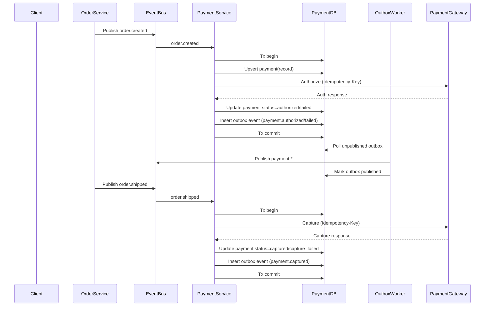
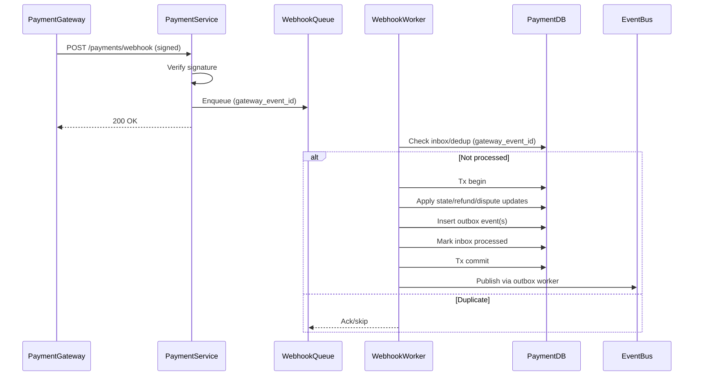

# Payment Processing Process

**Domain:** Payment (DDD)  
**Process ID:** `payment-processing`  
**Version:** `v1.1.0`  
**Last Updated:** 2026-01-11  
**Status:** Active

## Overview

### Business Context

The Payment Processing process handles payment authorization and capture for orders. It integrates with external payment gateways and ensures payment state transitions are safe under retries, duplicates (at-least-once delivery), and partial failures.

This process is designed to work with the accompanying checklist + implementation guide:
- `docs/checklists/payment-processing-logic-checklist.md`

### Success Criteria

- Payment is authorized successfully (or put into a retryable/pending state)
- Payment is captured when order is fulfilled
- Payment status is tracked throughout order lifecycle
- Refunds are processed correctly
- Payment failures are handled safely (no double charge, consistent states)
- Reconciliation detects and escalates mismatches

### Process Scope

**In Scope:**
- Payment authorization
- Payment capture
- Payment status tracking
- Payment gateway integration
- Webhook processing
- Reconciliation & dispute ingestion (operational flows)

**Out of Scope:**
- Order creation (handled in Order Placement process)
- Fulfillment orchestration (handled in Fulfillment process)

## Services Involved

| Service | Responsibility | Endpoints |
|---------|---------------|-----------|
| Payment Service | Payment processing APIs + webhooks | `POST /api/v1/payments/authorize`, `POST /api/v1/payments/capture`, `POST /api/v1/payments/refund`, `POST /api/v1/payments/webhook` |
| Order Service | Order state | `PUT /api/v1/orders/{id}/status` |
| Gateway | Authorization/capture/refund + webhooks | N/A |
| Event Bus | Async integration | N/A |

## Core Principles

### Idempotency

- All mutation endpoints must accept `Idempotency-Key`.
- Gateway calls must use an idempotency key where supported.
- Webhook processing must be idempotent via `gateway_event_id` (or equivalent).

### Delivery Semantics

- Event bus/webhooks are assumed **at-least-once**.
- Consumers must de-duplicate with an **Inbox** (processed event store) and handle out-of-order delivery.

### Reliable Event Publishing (Outbox)

- Payment Service must publish events via **Outbox** to avoid partial failure:
  - DB commit succeeds but publish fails
  - publish succeeds but DB commit fails

## Event Flow

### Event Sequence

| Step | Event Type | Topic | Publisher | Subscribers | Payload Schema |
|------|------------|-------|-----------|-------------|----------------|
| 1 | `order.created` | `order.created` | Order Service | Payment Service | [order.created.schema.json](../json-schema/order.created.schema.json) |
| 2 | `payment.authorized` | `payment.authorized` | Payment Service | Order Service | [payment.authorized.schema.json](../json-schema/payment.authorized.schema.json) |
| 3 | `payment.failed` | `payment.failed` | Payment Service | Order Service | [payment.failed.schema.json](../json-schema/payment.failed.schema.json) |
| 4 | `order.shipped` | `order.shipped` | Fulfillment/Order Service | Payment Service | [order.shipped.schema.json](../json-schema/order.shipped.schema.json) |
| 5 | `payment.captured` | `payment.captured` | Payment Service | Order Service | [payment.captured.schema.json](../json-schema/payment.captured.schema.json) |
| 6 | `gateway.webhook.received` | `gateway.webhook.received` | Payment Service | Payment Service (worker) | N/A |
| 7 | `payment.refunded` | `payment.refunded` | Payment Service | Order Service | [payment.refunded.schema.json](../json-schema/payment.refunded.schema.json) |
| 8 | `payment.dispute.created` | `payment.dispute.created` | Payment Service | Ops/Order Service | N/A |

## Flow Charts

### Sequence Diagram (Authorize/Capture with Outbox + Idempotency)

### Webhook Processing (Idempotent)

## Detailed Flow

### Step 1: Payment Authorization

**Trigger:** `order.created` event received (or direct API depending on architecture).

**Inputs:**
- `order_id`, `amount`, `currency`, `customer_id`
- `Idempotency-Key` (for gateway + internal)

**Actions:**
1. Create or upsert payment record in `pending/authorizing` state.
2. Call gateway authorize using idempotency key.
3. Update payment status:
   - Success -> `authorized`
   - Hard decline -> `failed` (non-retryable)
   - Transient failure -> keep `pending/authorizing` and schedule retry job
4. Insert outbox event (`payment.authorized` or `payment.failed`) in the same DB transaction.

**Events:**
- Subscribes: `order.created`
- Publishes (via outbox): `payment.authorized` or `payment.failed`

### Step 2: Payment Capture

**Trigger:** `order.shipped` event received

**Actions:**
1. Load payment by `order_id`.
2. Validate payment status is `authorized` (or allowed for capture).
3. Call gateway capture using idempotency key.
4. Update payment status:
   - Success -> `captured`
   - Non-retryable -> `capture_failed` + manual review
   - Transient -> retry capture job
5. Insert outbox event `payment.captured`.

**Events:**
- Subscribes: `order.shipped`
- Publishes (via outbox): `payment.captured`

### Step 3: Refunds (optional in this process)

**Trigger:** Admin/customer action or Order Service event

**Actions:**
1. Validate refundable status (`captured/settled`).
2. Call gateway refund with idempotency key.
3. Persist refund record + update payment refunded amounts.
4. Outbox publish `payment.refunded`.

## Operational Sub-Processes

### Reconciliation

**Goal:** detect mismatches between internal records and gateway reality.

**Trigger:** scheduled job (e.g., daily)

**Actions:**
1. Fetch gateway transactions (by date window).
2. Compare with internal payments by `gateway_txn_id` / `order_id`.
3. Produce mismatches:
   - charged but missing internal record
   - internal shows captured but gateway not captured
   - amount mismatch
   - refund mismatch
4. Create ticket/alert and optionally emit event `payment.reconciliation_mismatch`.

### Dispute / Chargeback Handling

**Trigger:** gateway webhook (e.g., `charge.dispute.created`)

**Actions:**
1. Verify webhook, dedupe by `gateway_dispute_id`.
2. Persist dispute record.
3. Alert Ops and optionally freeze related order/customer actions.

## Error Handling

### Failure Scenarios

| Scenario | Detection | Compensation | Retry Strategy |
|----------|-----------|--------------|----------------|
| Authorization fails (hard decline) | Gateway decline code (non-retryable) | Publish `payment.failed` (declined); let Order decide state (e.g. `payment_failed`) | No retry |
| Authorization fails (transient) | Timeout/5xx/network | Keep payment in retryable state, schedule retry job | Backoff + jitter, max attempts; use idempotency key |
| Capture fails (non-retryable) | Invalid auth/already captured/expired | Mark `capture_failed`, manual review + reconcile | No automatic retry |
| Capture fails (transient) | Timeout/5xx/network | Retry capture job | Backoff + jitter, max attempts; use idempotency key |
| DB write fails after gateway success | DB error after auth/capture succeeds | Reconcile via gateway fetch; alert critical | Retry DB/outbox via durable worker; no extra gateway call |
| Duplicate events/webhooks | Same event/webhook delivered again | Inbox/dedup; ignore duplicates | N/A |

## Related Documentation

- `docs/checklists/payment-processing-logic-checklist.md`
- [Payment Service Documentation](../services/payment-service.md)
- [Order Placement Process](./order-placement-process.md)
- [Refund Processing Process](./refund-processing-process.md)
