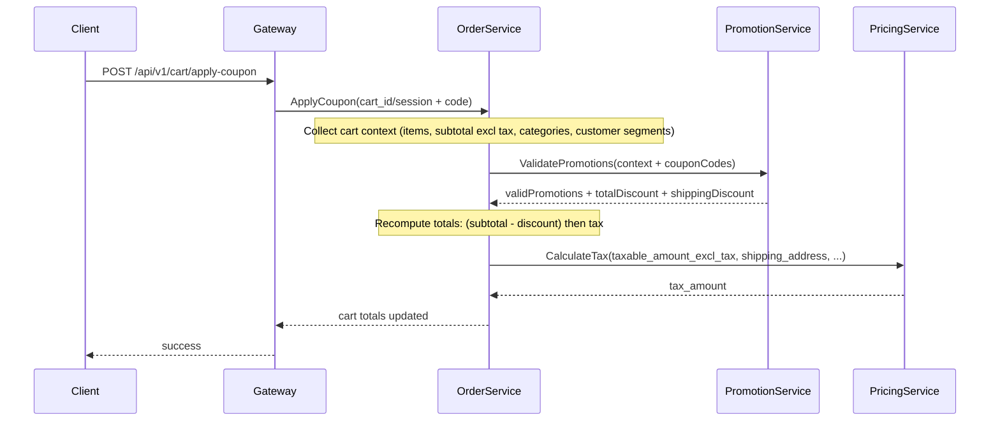
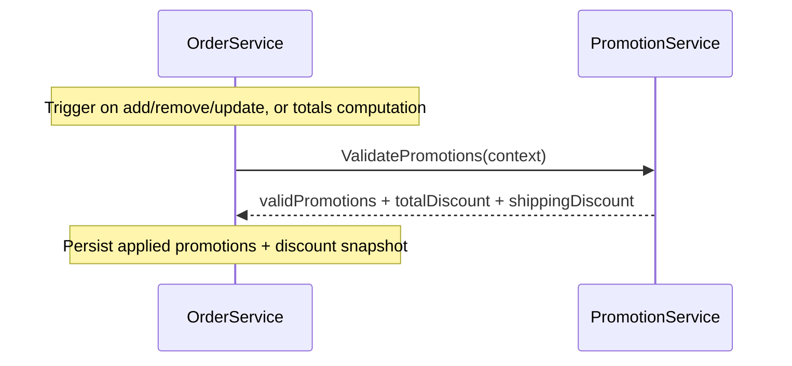

# 🎁 Promotion & Discount Process

**Service:** Promotion Service  
**Process ID:** `promotion-management`  
**Version:** `v1.0.1`  
**Status:** Active

---

## 1. Overview

### Business Context

Promotion & Discount process is responsible for managing all promotional activities, including coupon validation, automatic promotion application, and calculating discount amounts based on a complex set of rules.

### Success Criteria

- Coupons can be validated and applied correctly.
- Automatic (cart-rule) promotions are applied when conditions are met.
- Stacking and priority rules are respected.
- Discount calculation is accurate for various promotion types (percentage, fixed, BOGO, tiered).
- Usage limits (per customer, total) are enforced.

### Process Scope

**In Scope:**
- Coupon code validation.
- Automatic cart rule evaluation.
- Calculation of discount amounts for various promotion types.
- Stacking and priority logic.
- Free shipping promotions.
- Usage limit tracking.

**Out of Scope:**
- Applying the discount to the order total (responsibility of Order/Checkout).
- Tax calculation (handled by Pricing + Order totals).

---

## 2. Services Involved

| Service | Responsibility | Primary Calls |
|---|---|---|
| **Gateway** | Receives public API calls, attaches identity/session/warehouse context. | `POST /api/v1/cart/*`, `POST /api/v1/checkout/*` |
| **Order Service** | Orchestrates cart/checkout, collects context, calls Promotion, applies discount to totals. | Calls Promotion `ValidatePromotions` |
| **Promotion Service** | Authoritative promotion evaluation (coupon + auto rules), returns discounts and applied promotions. | `ValidatePromotions` |
| **Pricing Service** | Computes prices (excl tax) and destination tax at totals stage. | `CalculatePrice`, `CalculateTax` |
| **Shipping Service** | Computes shipping rates; shipping amount is needed for free-shipping discounts. | `CalculateRates` |
| **Catalog/Customer** | Provide enrichment context (categories, segments, groups, attributes). | `GetProduct*`, `GetCustomer*` |

---

## 3. Authoritative Code Locations

### Promotion service

- **Promotion orchestration:** `promotion/internal/biz/promotion.go` → `ValidatePromotions`
- **Condition evaluation:** `promotion/internal/biz/conditions.go`
- **Discount calculation:** `promotion/internal/biz/discount_calculator.go`
- **Free shipping:** `promotion/internal/biz/free_shipping.go`

### Order service integration

- Cart coupon/promo endpoints:
  - `order/internal/service/cart.go` → `ApplyCoupon`, `AutoApplyPromotions`
  - `order/internal/biz/cart/coupon.go`
  - `order/internal/biz/cart/promotion.go`

---

## 4. Core Concepts

- **Campaign**: container for promotions.
- **Promotion**: rule with conditions + actions.
  - `rule_type`: `cart` or `catalog`
  - `priority`: higher processed first
  - `is_stackable`: stackable vs non-stackable
  - `stop_rules_processing`: stops further evaluation when applied
  - `requires_coupon`: requires a valid coupon code
- **Coupon**: code mapped to a promotion; has validity and usage constraints.

---

## 5. End-to-End Integration Pattern (Gateway → Order → Promotion)

### 5.1 Coupon flow (user enters coupon)

### 5.2 Auto-apply promotions flow (cart changes / totals computed)

---

## 6. Promotion Service Logic (as implemented)

### 6.1 Promotion selection

- Fetch active promotions with filters (segments/products/categories/brands + `rule_type = cart`).
- Sort by `priority` descending.
- Validate coupon codes:
  - coupon exists, active, within date range, usage limits, minimum order amount, optional customer binding.
- Evaluate promotions:
  - `isPromotionApplicable(...)` checks minimum order, segments, included/excluded products, usage limits.
  - advanced conditions in `promotion.Conditions` are evaluated via `conditions.go`.
- Stacking resolution:
  - Collect all stackable promotions.
  - Select the best single non-stackable promotion.
  - If `stop_rules_processing` is set on a matched rule, stop processing remaining rules.
- Compute:
  - `TotalDiscount` (capped so it does not exceed order amount)
  - `ShippingDiscount` (free shipping)

### 6.2 Advanced discount actions

Implemented helpers exist for:
- Buy X Get Y (BOGO)
- Tiered discount (quantity/amount)
- Cheapest/most expensive selection

---

## 7. Known Integration Gaps / Required Inputs (CRITICAL)

### 7.1 Cart item quantities and prices must be provided

In `promotion/internal/biz/promotion.go` → `calculatePromotionDiscountAdvanced`, the code currently builds `cartItems` from arrays like `ProductIDs`, `CategoryIDs`, `BrandIDs` but defaults:
- `Quantity = 1`
- `UnitPrice = 0`

This makes advanced promotions (BOGO/tiered/selection) inaccurate unless Order provides and Promotion uses:
- `ProductQuantities[productID]`
- `ProductPrices[productID]`

**Required:** Order → Promotion context must include accurate quantities and unit prices (excl tax) per item, and Promotion must map those into `CartItem` before calculating advanced discounts.

### 7.2 Category/brand mapping must be deterministic

Current request structure allows arrays `ProductIDs`, `CategoryIDs`, `BrandIDs`. For correctness, Order should send a consistent mapping per line item (avoid index-based mismatches).

**Recommended contract:** send an explicit list of cart lines (product_id, category_id, brand_id, qty, unit_price) rather than parallel arrays.

### 7.3 Free shipping discount requires shipping amount

Promotion returns `ShippingDiscount`, but current implementation calls:
- `CalculateFreeShippingDiscount(..., shippingAmount=0, ...)`

**Required:** Order must supply the actual shipping amount (from Shipping service) into promotion validation context when evaluating free-shipping promotions.

---

## 8. Outputs and responsibilities

- Promotion service returns:
  - list of valid/invalid promotions
  - `total_discount` (items discount)
  - `shipping_discount`

- Order service responsibilities:
  - store applied promotions/coupons state
  - apply discounts on excl-tax amounts
  - recompute totals and tax (Magento-like tax timing)

---

## 9. Related Docs

- Cart process: `docs/processes/cart-management-process.md`
- Pricing + tax checklist: `docs/checklists/tax-implementation-checklist-magento-vs-shopify.md`
- Promotion checklist: `docs/checklists/promotion-service-checklist.md`
