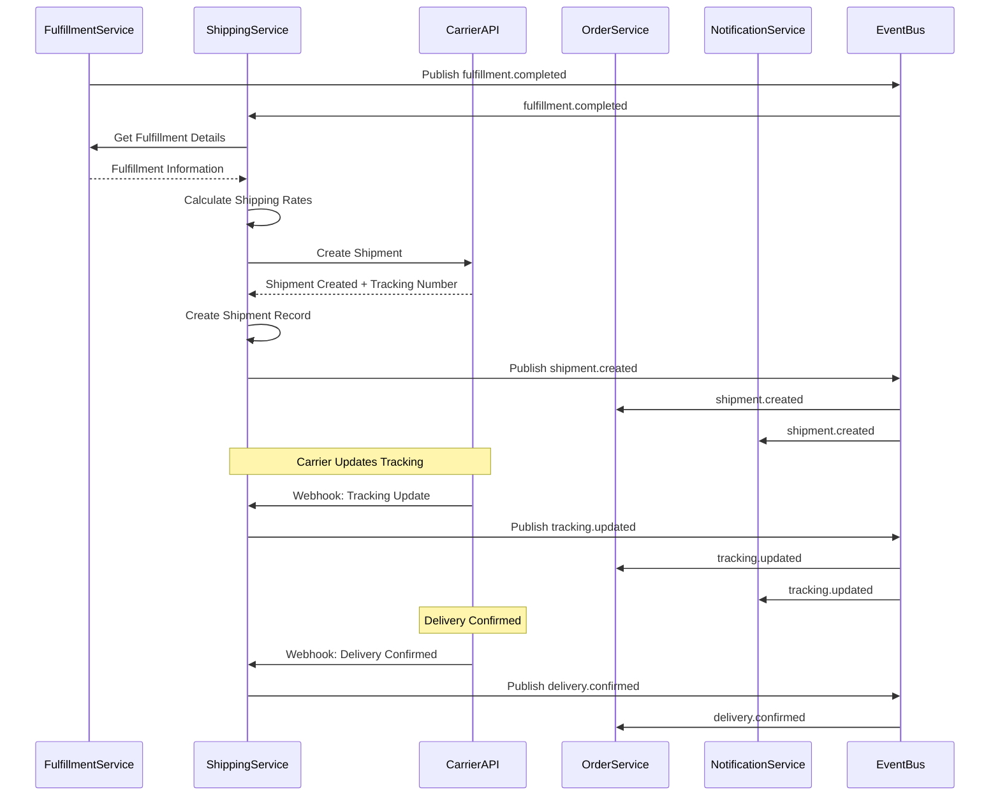
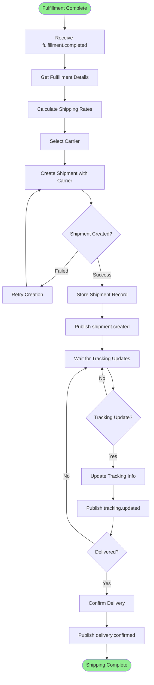

# Shipping Process

**Domain:** Shipping (DDD)  
**Process ID:** `shipping`  
**Version:** `v1.0.0`  
**Last Updated:** 2025-11-17  
**Status:** Active

## Overview

### Business Context

The Shipping process handles shipment creation, carrier integration, and tracking updates. This process coordinates with fulfillment to create shipments and integrate with external carriers (FedEx, UPS, DHL) for shipping services.

### Success Criteria

- Shipment is created when fulfillment is complete
- Shipping rates are calculated accurately
- Carrier integration works correctly
- Tracking information is updated in real-time
- Delivery confirmation is processed

### Process Scope

**In Scope:**
- Shipment creation
- Shipping rate calculation
- Carrier integration
- Tracking updates
- Delivery confirmation

**Out of Scope:**
- Fulfillment (handled in Fulfillment process)
- Payment (handled in Payment Processing process)

## Services Involved

| Service | Responsibility | Endpoints |
|---------|---------------|-----------|
| Shipping Service | Shipment management | `POST /api/v1/shipments`, `GET /api/v1/shipments/{id}/tracking` |
| Fulfillment Service | Fulfillment information | `GET /api/v1/fulfillments/{id}` |
| Order Service | Order information | `GET /api/v1/orders/{id}` |
| Customer Service | Shipping address | `GET /api/v1/customers/{id}/addresses/{addressId}` |

## Event Flow

### Event Sequence

| Step | Event Type | Topic | Publisher | Subscribers | Payload Schema |
|------|------------|-------|-----------|--------------|----------------|
| 1 | `fulfillment.fulfillment.completed` | `fulfillment.completed` | Fulfillment Service | Shipping | [fulfillment.completed.schema.json](../json-schema/fulfillment.completed.schema.json) |
| 2 | `shipping.shipment.created` | `shipment.created` | Shipping Service | Order, Notification | [shipment.created.schema.json](../json-schema/shipment.created.schema.json) |
| 3 | `shipping.tracking.updated` | `tracking.updated` | Shipping Service | Order, Notification | [tracking.updated.schema.json](../json-schema/tracking.updated.schema.json) |
| 4 | `shipping.delivery.confirmed` | `delivery.confirmed` | Shipping Service | Order, Payment | [delivery.confirmed.schema.json](../json-schema/delivery.confirmed.schema.json) |

## Flow Charts

### Sequence Diagram

### Business Flow Diagram

## Detailed Flow

### Step 1: Shipment Creation

**Trigger:** `fulfillment.completed` event received

**Actions:**
1. Get fulfillment details
2. Get shipping address
3. Calculate shipping rates
4. Select carrier
5. Create shipment with carrier API
6. Store shipment record
7. Publish `shipment.created` event

**Services:**
- Shipping Service: Creates shipment
- Fulfillment Service: Provides fulfillment details
- Customer Service: Provides shipping address

**Events:**
- Subscribes: `fulfillment.fulfillment.completed`
- Publishes: `shipping.shipment.created`

### Step 2: Tracking Updates

**Trigger:** Carrier webhook with tracking update

**Actions:**
1. Receive tracking update from carrier
2. Update shipment tracking information
3. Publish `tracking.updated` event

**Services:**
- Shipping Service: Updates tracking

**Events:**
- Publishes: `shipping.tracking.updated`

### Step 3: Delivery Confirmation

**Trigger:** Carrier webhook with delivery confirmation

**Actions:**
1. Receive delivery confirmation from carrier
2. Update shipment status to DELIVERED
3. Publish `delivery.confirmed` event

**Services:**
- Shipping Service: Confirms delivery

**Events:**
- Publishes: `shipping.delivery.confirmed`

## Error Handling

### Failure Scenarios

| Scenario | Detection | Compensation | Retry Strategy |
|----------|-----------|--------------|----------------|
| Carrier API failure | API returns error | Retry with different carrier or manual processing | Retry 3 times with exponential backoff |
| Tracking update failure | Webhook validation fails | Log error, retry webhook | Retry 5 times |
| Delivery confirmation missing | Timeout after expected delivery date | Manual verification | N/A |

## Related Documentation

- [Shipping Service Documentation](../services/shipping-service.md)
- [Fulfillment Process](./fulfillment-process.md)
- [Order Placement Process](./order-placement-process.md)

