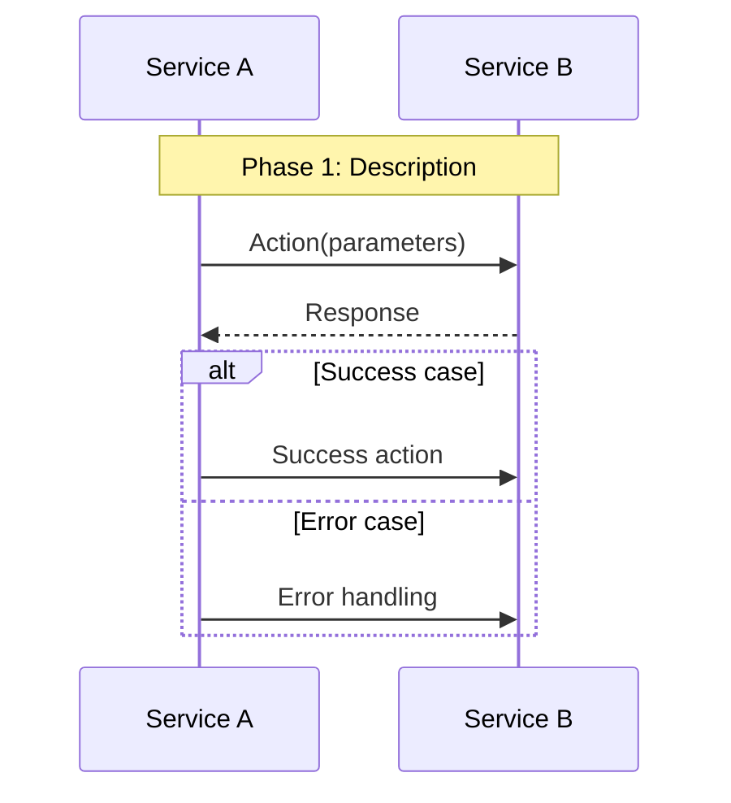

# 📊 Sequence Diagrams

**Purpose**: Visual representations of system interactions and workflows  
**Navigation**: [← Workflows](../README.md) | [← Back to Main](../../README.md)

---

## 📋 **Overview**

This section contains Mermaid sequence diagrams that visualize the interactions between services in our microservices platform. These diagrams provide a clear understanding of how services communicate to deliver business functionality.

### **🎯 Diagram Categories**

Our sequence diagrams are organized by business workflow and complexity:

1. **🛒 Customer Journey Flows** - End-to-end customer-facing processes
2. **🏭 Operational Flows** - Internal business operations
3. **🔗 Integration Flows** - System integrations and data synchronization
4. **🚨 Error Handling Flows** - Exception handling and recovery processes

---

## 📚 **Available Sequence Diagrams**

### **[Complete Order Flow](complete-order-flow.mmd)**
**End-to-end order creation sequence from browse to delivery**

- **Scope**: Complete customer journey from product discovery to delivery
- **Services**: 11 services involved (Gateway, Auth, Catalog, Checkout, Order, Payment, Warehouse, Fulfillment, Shipping, Notification)
- **Phases**: 11 distinct phases from authentication to post-purchase
- **Duration**: 15-45 minutes typical customer session + 1-3 days fulfillment

**Key Interactions:**
- Customer authentication and session management
- Product catalog browsing and stock checking
- Cart management with stock reservations
- Checkout process with price validation
- Order creation and payment processing
- Fulfillment workflow with quality control
- Shipping and delivery tracking
- Post-purchase review collection

### **[Checkout Payment Flow](checkout-payment-flow.mmd)** 🚧
**Checkout and payment processing sequence**

- **Scope**: Detailed checkout and payment processing workflow
- **Services**: 6 services involved (Gateway, Checkout, Payment, Order, Warehouse, Notification)
- **Key Features**: Multi-gateway payment, fraud detection, inventory allocation
- **Duration**: 2-5 minutes typical checkout process

### **[Fulfillment Shipping Flow](fulfillment-shipping-flow.mmd)** 🚧
**Fulfillment and shipping workflow**

- **Scope**: Order fulfillment from warehouse assignment to shipment
- **Services**: 5 services involved (Fulfillment, Warehouse, Shipping, Catalog, Notification)
- **Key Features**: Warehouse optimization, picking workflow, quality control, carrier selection
- **Duration**: 2-24 hours depending on priority

### **[Return Refund Flow](return-refund-flow.mmd)** 🚧
**Return and refund processing sequence**

- **Scope**: Complete returns workflow from request to refund
- **Services**: 7 services involved (Return, Order, Payment, Warehouse, Shipping, Notification, Analytics)
- **Key Features**: Return approval, shipping logistics, inspection, refund processing
- **Duration**: 5-7 days typical return processing

### **[Search Discovery Flow](search-discovery-flow.mmd)** 🚧
**Product search and discovery workflow**

- **Scope**: Product search, filtering, and recommendation workflow
- **Services**: 4 services involved (Gateway, Search, Catalog, Analytics)
- **Key Features**: Real-time search, filtering, personalization, analytics
- **Duration**: <1 second search response time

---

## 🎨 **Diagram Standards & Conventions**

### **Service Naming Conventions**
```mermaid
participant C as Customer
participant G as Gateway
participant A as Auth Service
participant CAT as Catalog Service
participant O as Order Service
participant P as Payment Service
participant W as Warehouse Service
participant F as Fulfillment Service
participant S as Shipping Service
participant N as Notification Service
```

### **Interaction Types**

**Synchronous Calls (gRPC/HTTP):**
```mermaid
A->>B: SynchronousCall(parameters)
B-->>A: Response data
```

**Asynchronous Events:**
```mermaid
A-->>B: Event: async.event.published
```

**Internal Processing:**
```mermaid
A->>A: Internal processing
```

**Conditional Logic:**
```mermaid
alt Condition met
    A->>B: Action if true
else Condition not met
    A->>C: Action if false
end
```

**Parallel Processing:**
```mermaid
par Parallel Action 1
    A->>B: First action
and Parallel Action 2
    A->>C: Second action
end
```

### **Color Coding & Visual Standards**

**Service Categories:**
- **🚪 Gateway Services**: Entry points and routing
- **🔐 Security Services**: Authentication and authorization
- **📦 Product Services**: Catalog, search, inventory
- **🛒 Commerce Services**: Orders, checkout, payment
- **🚚 Logistics Services**: Fulfillment, shipping, warehouse
- **📧 Communication Services**: Notifications, analytics

**Interaction Patterns:**
- **Solid Lines**: Synchronous communication
- **Dashed Lines**: Asynchronous communication
- **Notes**: Important business context
- **Loops**: Repetitive processes
- **Alt/Else**: Conditional logic

---

## 📊 **Diagram Usage Guidelines**

### **For Developers**
- **Implementation Planning**: Understand service interactions before coding
- **API Design**: Design service contracts based on interaction patterns
- **Error Handling**: Implement proper error handling for each interaction
- **Performance Optimization**: Identify bottlenecks and optimization opportunities

### **For System Architects**
- **Architecture Review**: Validate system design and service boundaries
- **Integration Planning**: Plan service integrations and dependencies
- **Scalability Analysis**: Identify scaling bottlenecks and solutions
- **Security Review**: Ensure secure communication patterns

### **For Business Analysts**
- **Process Understanding**: Understand technical implementation of business processes
- **Requirements Validation**: Ensure technical implementation meets business requirements
- **Gap Analysis**: Identify missing functionality or process steps
- **Stakeholder Communication**: Explain technical processes to business stakeholders

### **For QA Engineers**
- **Test Planning**: Design integration tests based on service interactions
- **End-to-End Testing**: Create comprehensive test scenarios
- **Performance Testing**: Test interaction performance under load
- **Error Testing**: Test error handling and recovery scenarios

---

## 🔧 **Viewing & Editing Diagrams**

### **Supported Platforms**

**GitHub Integration:**
- Native Mermaid support in GitHub markdown
- Real-time rendering in pull requests and issues
- Version control for diagram changes

**Development Tools:**
- **VS Code**: Mermaid extension for live preview
- **IntelliJ IDEA**: Mermaid plugin for editing and preview
- **Online Editor**: [Mermaid Live Editor](https://mermaid.live)

**Documentation Platforms:**
- **GitBook**: Native Mermaid support
- **Notion**: Mermaid block support
- **Confluence**: Mermaid macro support

### **Editing Guidelines**

**File Naming Convention:**
```
{workflow-name}-{type}-flow.mmd
Examples:
- complete-order-flow.mmd
- checkout-payment-flow.mmd
- return-refund-flow.mmd
```

**Diagram Structure:**


### **Best Practices**

**Diagram Clarity:**
- Use clear, descriptive participant names
- Add phase comments for complex workflows
- Include important business context in notes
- Keep diagrams focused on specific workflows

**Technical Accuracy:**
- Ensure diagrams reflect actual implementation
- Update diagrams when services change
- Validate interactions with service owners
- Include error handling scenarios

**Maintenance:**
- Regular review and updates
- Version control for all changes
- Link diagrams to related documentation
- Automated validation where possible

---

## 📈 **Diagram Analytics & Insights**

### **Complexity Metrics**

| Diagram | Services | Interactions | Phases | Complexity |
|---------|----------|--------------|--------|------------|
| **Complete Order Flow** | 11 | 45+ | 11 | High |
| **Checkout Payment Flow** | 6 | 25+ | 6 | Medium |
| **Fulfillment Shipping Flow** | 5 | 20+ | 5 | Medium |
| **Return Refund Flow** | 7 | 30+ | 7 | Medium |
| **Search Discovery Flow** | 4 | 15+ | 3 | Low |

### **Performance Insights**

**Critical Path Analysis:**
- **Longest Paths**: Complete order flow (11 services)
- **Bottlenecks**: Payment processing, inventory allocation
- **Optimization Opportunities**: Parallel processing, caching
- **SLA Impact**: Each interaction adds to total response time

**Service Dependencies:**
- **Most Connected**: Gateway Service (all flows)
- **Critical Services**: Order, Payment, Warehouse
- **Single Points of Failure**: Gateway, Database services
- **Scaling Priorities**: High-volume interaction services

---

## 🚀 **Future Enhancements**

### **Interactive Diagrams**
- **Clickable Elements**: Navigate to service documentation
- **Real-time Data**: Show actual performance metrics
- **Animation**: Visualize data flow and timing
- **Filtering**: Show/hide specific services or interactions

### **Automated Generation**
- **Code Analysis**: Generate diagrams from service code
- **API Documentation**: Sync with OpenAPI specifications
- **Monitoring Integration**: Real-time interaction visualization
- **Testing Integration**: Validate diagrams against actual behavior

### **Advanced Visualizations**
- **3D Diagrams**: Multi-dimensional service interactions
- **Timeline Views**: Show interactions over time
- **Heat Maps**: Visualize interaction frequency and performance
- **Dependency Graphs**: Service dependency visualization

---

## 📋 **Diagram Maintenance**

### **Review Schedule**
- **Monthly**: Review for accuracy and completeness
- **Quarterly**: Major updates and optimizations
- **Release Cycles**: Update for new features and changes
- **Incident Response**: Update after significant issues

### **Quality Assurance**
- **Peer Review**: All diagram changes reviewed by team
- **Technical Validation**: Validate against actual implementation
- **Business Validation**: Ensure business accuracy
- **Documentation Sync**: Keep aligned with other documentation

### **Version Control**
- **Git Integration**: All diagrams version controlled
- **Change Tracking**: Track all modifications
- **Branching Strategy**: Feature branches for major changes
- **Release Management**: Coordinate with software releases

---

**Last Updated**: January 30, 2026  
**Platform Status**: 88% Complete, Core Sequence Diagrams Available  
**Maintained By**: Platform Architecture & Documentation Team