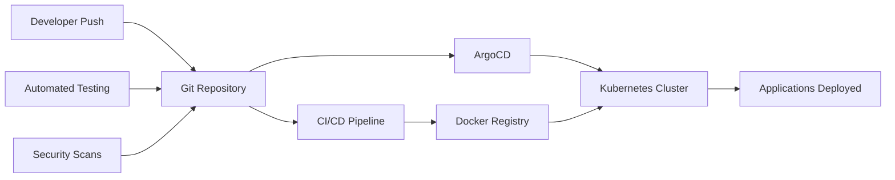

# 🚀 Deployment Documentation

**Purpose**: Complete deployment strategy and procedures for the microservices platform  
**Last Updated**: 2026-02-03  
**Status**: ✅ Active - GitOps deployment with ArgoCD

---

## 📋 Overview

This section contains comprehensive documentation for deploying and managing the microservices platform. We use GitOps with ArgoCD as our primary deployment strategy, ensuring reliable, automated, and auditable deployments.

### 🎯 What You'll Find Here

- **[GitOps Overview](./gitops/)** - Complete GitOps strategy and implementation
- **[ArgoCD Procedures](./argocd/)** - ArgoCD-specific deployment procedures
- **[Kubernetes Operations](./kubernetes/)** - K8s cluster management and operations
- **[Deployment Guides](./guides/)** - Step-by-step deployment procedures

---

## 🚀 Deployment Strategy

### **GitOps-First Approach**



### **Key Principles**
- **Declarative Configuration**: All infrastructure defined in code
- **Version Control**: Git as single source of truth
- **Automated Deployment**: Zero-touch deployment pipeline
- **Rollback Capability**: Instant rollback to previous versions
- **Environment Parity**: Consistent environments across stages

---

## 📊 Deployment Architecture

### **Environment Strategy**

| Environment | Purpose | Git Branch | ArgoCD App | Auto-Sync |
|-------------|---------|------------|------------|-----------|
| **Development** | Feature development | `develop` | `dev-apps` | ✅ Yes |
| **Staging** | Pre-production testing | `main` | `staging-apps` | ⏳ Manual |
| **Production** | Live production | `main` | `prod-apps` | ⏳ Manual |

### **Deployment Pipeline**

```yaml
# GitOps Pipeline
stages:
  - name: "Code Commit"
    trigger: "Git Push"
    
  - name: "CI Pipeline"
    actions:
      - "Unit Tests"
      - "Integration Tests"
      - "Security Scan"
      - "Docker Build"
      
  - name: "Image Registry"
    actions:
      - "Push Image"
      - "Vulnerability Scan"
      
  - name: "GitOps Update"
    actions:
      - "Update Image Tag"
      - "Commit to Git"
      
  - name: "ArgoCD Deploy"
    actions:
      - "Detect Changes"
      - "Deploy to K8s"
      - "Health Check"
```

---

## 🔧 Quick Start

### **1. Prerequisites**
```bash
# Required tools
kubectl 1.25+
helm 3.0+
git 2.30+
docker 20.10+
argocd CLI
```

### **2. Setup GitOps Repository**
```bash
# Clone GitOps repository
git clone https://gitlab.company.com/gitops/apps.git
cd apps

# Configure ArgoCD
kubectl apply -f argocd/install.yaml
```

### **3. Deploy First Application**
```bash
# Add application configuration
mkdir -p apps/order-service
cp templates/application.yaml apps/order-service/

# Apply to cluster
kubectl apply -f apps/order-service/

# Check status
argocd app get order-service
```

---

## 📚 Documentation Structure

### **🚀 GitOps Strategy**
- **[GitOps Overview](./gitops/)** - Complete GitOps strategy
- **Multi-Environment Setup** - Dev/Staging/Production
- **Progressive Delivery** - Canary and blue-green deployments
- **Best Practices** - GitOps patterns and procedures

### **🔧 ArgoCD Operations**
- **[ArgoCD Guide](./argocd/ARGOCD_GUIDE.md)** - Comprehensive ArgoCD guide
- **Application Management** - Service deployment procedures
- **Configuration** - ArgoCD setup and configuration
- **Troubleshooting** - Common ArgoCD issues

### **☸️ Kubernetes Operations**
- **[Kubernetes Setup](./kubernetes/INSTALLATION.md)** - Cluster setup
- **Cluster Management** - Node and resource management
- **Networking** - Service mesh and networking
- **Security** - RBAC and security policies

### **📋 Deployment Guides**
- **[Implementation Checklist](./guides/IMPLEMENTATION_CHECKLIST.md)** - Deployment checklist
- **Service Configuration** - Service setup procedures
- **Migration Guides** - System migration procedures
- **Best Practices** - Deployment best practices

---

## 🎯 Common Deployment Tasks

### **Deploy New Service**
```bash
# 1. Create service directory
mkdir -p apps/new-service

# 2. Add application manifest
cp templates/application.yaml apps/new-service/

# 3. Configure values
cp templates/values.yaml apps/new-service/

# 4. Deploy
kubectl apply -f apps/new-service/

# 5. Monitor deployment
argocd app get new-service
```

### **Update Service**
```bash
# 1. Update image tag
sed -i 's|image: .*|image: new-service:v1.2.3|' apps/new-service/values.yaml

# 2. Commit changes
git add apps/new-service/values.yaml
git commit -m "Update new-service to v1.2.3"

# 3. Push to Git
git push origin main

# 4. Monitor deployment
argocd app sync new-service
```

### **Rollback Deployment**
```bash
# 1. Check deployment history
argocd app history new-service

# 2. Rollback to previous version
argocd app rollback new-service <revision-id>

# 3. Verify rollback
argocd app get new-service
```

---

## 📊 Deployment Metrics

### **Key Performance Indicators**

#### **Deployment Metrics**
- **Deployment Frequency**: Number of deployments per day
- **Lead Time**: Time from commit to production
- **Change Failure Rate**: Percentage of failed deployments
- **Mean Time to Recovery**: Time to recover from failures

#### **Quality Metrics**
- **Test Coverage**: Percentage of code covered by tests
- **Security Score**: Vulnerability scan results
- **Performance**: Application performance benchmarks
- **Compliance**: Regulatory compliance status

### **Monitoring Dashboard**

```yaml
# Grafana Dashboard Metrics
deployment_metrics:
  - deployment_frequency
  - lead_time_for_changes
  - change_failure_rate
  - mean_time_to_recovery
  - test_coverage
  - security_scan_results
```

---

## 🚨 Troubleshooting

### **Common Issues**

#### **Deployment Failures**
```bash
# Check ArgoCD status
argocd app get <app-name>

# Check application logs
kubectl logs -f deployment/<app-name> -n production

# Check ArgoCD events
argocd app events <app-name>

# Sync application manually
argocd app sync <app-name>
```

#### **Image Pull Issues**
```bash
# Check image availability
docker pull <image-name>:<tag>

# Check registry credentials
kubectl get secret registry-credentials -n production

# Test image pull
kubectl run test-pod --image=<image-name>:<tag> --dry-run=client
```

#### **Resource Issues**
```bash
# Check resource usage
kubectl top nodes
kubectl top pods -n production

# Check resource limits
kubectl describe pod <pod-name> -n production

# Check cluster capacity
kubectl describe nodes
```

---

## 🔒 Security Considerations

### **Deployment Security**
- **Image Scanning**: All images scanned for vulnerabilities
- **RBAC**: Role-based access control for deployments
- **Network Policies**: Traffic restrictions between services
- **Secrets Management**: Encrypted secrets with rotation

### **GitOps Security**
- **Branch Protection**: Protected branches for production
- **Code Reviews**: Required pull requests for changes
- **Audit Trail**: Complete audit trail of all changes
- **Compliance**: Regulatory compliance tracking

---

## 📞 Support & Contacts

### **Deployment Team**
- **DevOps Team**: devops@company.com
- **Platform Engineering**: platform@company.com
- **Security Team**: security@company.com

### **Communication Channels**
- **Deployments**: #ops-deployments
- **GitOps Issues**: #ops-gitops
- **Infrastructure**: #ops-infrastructure
- **Security**: #security-incidents

---

## 🔄 Maintenance

### **Regular Tasks**
- **Daily**: Monitor deployment status and health
- **Weekly**: Review deployment metrics and performance
- **Monthly**: Update documentation and procedures
- **Quarterly**: Security audits and compliance reviews

### **Documentation Updates**
- Update procedures when deployment process changes
- Document lessons learned from incidents
- Add new deployment patterns and best practices
- Review and update security procedures

---

## 📚 Related Documentation

### **Platform Documentation**
- [Operations Overview](../README.md) - Overall operations
- [Monitoring](../monitoring/) - Observability and alerting
- [Security](../security/) - Security operations
- [Runbooks](../runbooks/) - Operational procedures

### **Development Documentation**
- [Development Guidelines](../../07-development/) - Development standards
- [Architecture](../../01-architecture/) - System architecture
- [Services](../../03-services/) - Individual service documentation

---

**Last Updated**: 2026-02-03  
**Review Cycle**: Monthly deployment review  
**Maintained By**: DevOps & Platform Engineering Teams
