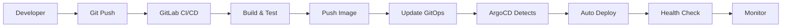

# 🚀 GitOps Overview

**Purpose**: Complete GitOps strategy and implementation guide  
**Last Updated**: 2026-02-03  
**Status**: ✅ Active - Production-ready GitOps implementation

---

## 📋 What is GitOps?

GitOps is a modern approach to continuous delivery that uses Git as the single source of truth for declarative infrastructure and applications.

### 🎯 Core Principles

1. **Declarative Configuration**: Everything is declared in code
2. **Versioned & Immutable**: Git stores the complete desired state
3. **Automated Deployment**: Changes are automatically applied
4. **Continuous Reconciliation**: Drift detection and auto-correction

---

## 🏗️ GitOps Architecture

### Our Implementation Stack

```
┌─────────────────┐    ┌─────────────────┐    ┌─────────────────┐
│   Git Repository │    │     ArgoCD      │    │  Kubernetes     │
│                 │    │                 │    │    Cluster      │
│ • Helm Charts   │───▶│ • GitOps Engine │───▶│ • Applications  │
│ • K8s Manifests │    │ • Sync Engine   │    │ • Infrastructure│
│ • Config Files  │    │ • Health Checks │    │ • Services      │
│ • Environment   │    │ • Rollback      │    │ • Monitoring    │
└─────────────────┘    └─────────────────┘    └─────────────────┘
```

### Directory Structure

```
gitops/
├── apps/                    # Application deployments
│   ├── admin/               # Admin dashboard
│   ├── analytics/           # Analytics service
│   ├── auth/                # Authentication service
│   ├── catalog/             # Product catalog
│   ├── checkout/            # Checkout process
│   ├── customer/            # Customer management
│   ├── fulfillment/         # Order fulfillment
│   ├── gateway/             # API gateway
│   ├── notification/        # Notifications
│   ├── order/               # Order management
│   ├── payment/             # Payment processing
│   ├── pricing/             # Dynamic pricing
│   ├── promotion/           # Promotions
│   ├── review/              # Reviews & ratings
│   ├── search/              # Product search
│   └── shipping/            # Shipping management
├── bootstrap/               # Bootstrap manifests
│   └── root-app-dev.yaml    # Root application
├── clusters/                # Cluster-specific configs
│   ├── dev/                 # Development cluster
│   ├── staging/             # Staging cluster
│   └── production/          # Production cluster
└── infrastructure/          # Infrastructure components
    ├── argocd/              # ArgoCD itself
    ├── monitoring/          # Prometheus, Grafana
    └── logging/             # ELK stack
```

---

## 🔄 GitOps Workflow

### 1. Development Workflow



### 2. Change Process

1. **Code Changes**: Developer pushes to feature branch
2. **CI Pipeline**: Automated tests and build
3. **Merge to Main**: Code review and merge
4. **Image Build**: Docker image built and pushed
5. **GitOps Update**: Update image tag in GitOps repo
6. **Auto Deployment**: ArgoCD detects and deploys
7. **Monitoring**: Health checks and alerts

---

## 🎯 Benefits of GitOps

### ✅ Operational Benefits
- **Consistency**: Same deployment process everywhere
- **Reliability**: Automated, repeatable deployments
- **Speed**: Faster deployment cycles
- **Safety**: Rollback capabilities
- **Audit Trail**: Complete Git history

### ✅ Development Benefits
- **Productivity**: Focus on code, not deployment
- **Collaboration**: Git-based workflow
- **Transparency**: Visible deployment state
- **Self-Service**: Teams can deploy their services

### ✅ Business Benefits
- **Faster Time to Market**: Quick feature delivery
- **Reduced Risk**: Safer deployments
- **Better Reliability**: Consistent environments
- **Cost Efficiency**: Automated operations

---

## 🔧 Implementation Details

### ArgoCD Configuration

#### ApplicationSet Pattern
```yaml
apiVersion: argoproj.io/v1alpha1
kind: ApplicationSet
metadata:
  name: microservices
spec:
  generators:
  - git:
      repoURL: https://gitlab.example.com/gitops/apps.git
      revision: HEAD
      directories:
      - path: apps/*
  template:
    metadata:
      name: '{{path.basename}}'
    spec:
      project: default
      source:
        repoURL: https://gitlab.example.com/gitops/apps.git
        targetRevision: HEAD
        path: '{{path}}'
      destination:
        server: https://kubernetes.default.svc
        namespace: '{{path.basename}}'
      syncPolicy:
        automated:
          prune: true
          selfHeal: true
```

#### Multi-Environment Strategy
```yaml
# Development
apiVersion: argoproj.io/v1alpha1
kind: Application
metadata:
  name: catalog-dev
  namespace: argocd
spec:
  destination:
    server: https://kubernetes.default.svc
    namespace: catalog-dev
  source:
    repoURL: https://gitlab.example.com/gitops/apps.git
    targetRevision: develop
    path: apps/catalog
    helm:
      valueFiles:
      - ../../clusters/dev/values.yaml
      - values-dev.yaml
  syncPolicy:
    automated:
      prune: true
      selfHeal: true

# Production
apiVersion: argoproj.io/v1alpha1
kind: Application
metadata:
  name: catalog-prod
  namespace: argocd
spec:
  destination:
    server: https://kubernetes.default.svc
    namespace: catalog-prod
  source:
    repoURL: https://gitlab.example.com/gitops/apps.git
    targetRevision: main
    path: apps/catalog
    helm:
      valueFiles:
      - ../../clusters/production/values.yaml
      - values-prod.yaml
  syncPolicy:
    automated:
      prune: false  # Manual approval for prod
      selfHeal: true
```

---

## 📊 Monitoring & Observability

### ArgoCD Metrics
- Application Sync Status
- Deployment Health
- Sync Duration
- Error Rates

### Integration with Monitoring
```yaml
# Prometheus ServiceMonitor
apiVersion: monitoring.coreos.com/v1
kind: ServiceMonitor
metadata:
  name: argocd-metrics
spec:
  selector:
    matchLabels:
      app.kubernetes.io/name: argocd-metrics
  endpoints:
  - port: metrics
```

### Alerting Rules
```yaml
# ArgoCD Alerts
groups:
- name: argocd
  rules:
  - alert: ApplicationOutOfSync
    expr: argocd_app_sync_status != 1
    for: 5m
    labels:
      severity: warning
    annotations:
      summary: "Application {{ $labels.name }} is out of sync"
```

---

## 🔒 Security Considerations

### Git Repository Security
- **Branch Protection**: Protected branches for main/master
- **Code Review**: Required pull requests
- **Access Control**: Role-based Git access
- **Audit Logging**: Git operation tracking

### ArgoCD Security
- **RBAC**: Role-based access control
- **SSO Integration**: LDAP/OAuth integration
- **Secret Management**: Kubernetes secrets
- **Network Policies**: Restricted network access

---

## 🚀 Best Practices

### Repository Structure
1. **Separate Repos**: One for apps, one for infrastructure
2. **Environment Branches**: Separate branches per environment
3. **Helm Charts**: Standardized Helm chart structure
4. **Values Files**: Environment-specific values

### Deployment Strategy
1. **Progressive Deployment**: Dev → Staging → Production
2. **Canary Releases**: Gradual rollout for critical services
3. **Blue-Green**: Zero-downtime deployments
4. **Feature Flags**: Runtime feature toggles

### Operational Excellence
1. **Automated Testing**: Comprehensive test coverage
2. **Health Checks**: Proper liveness/readiness probes
3. **Resource Limits**: CPU/memory limits and requests
4. **Backup Strategy**: Regular backups of critical data

---

## 📚 Related Documentation

### Core GitOps
- [ArgoCD Setup Guide](../kubernetes/ARGOCD_SETUP_GUIDE.md)
- [Deployment Patterns](../deployment/README.md)
- [Configuration Management](../configuration/README.md)

### Advanced Topics
- [Multi-Cluster GitOps](./MULTI_CLUSTER_GITOPS.md)
- [Progressive Delivery](./PROGRESSIVE_DELIVERY.md)
- [GitOps Security](./GITOPS_SECURITY.md)

### Troubleshooting
- [Common Issues](./TROUBLESHOOTING.md)
- [Debugging Guide](./DEBUGGING.md)
- [Recovery Procedures](./RECOVERY.md)

---

## 🎯 Getting Started

### Quick Start Checklist
- [ ] Install ArgoCD in cluster
- [ ] Configure Git repository
- [ ] Set up ApplicationSet
- [ ] Deploy first application
- [ ] Configure monitoring
- [ ] Set up alerts

### Next Steps
1. Read the [ArgoCD Setup Guide](../kubernetes/ARGOCD_SETUP_GUIDE.md)
2. Review [Deployment Patterns](../deployment/README.md)
3. Set up your first application
4. Configure monitoring and alerts

---

**Last Updated**: 2026-02-03  
**Review Cycle**: Monthly  
**Maintained By**: Platform Engineering Team
