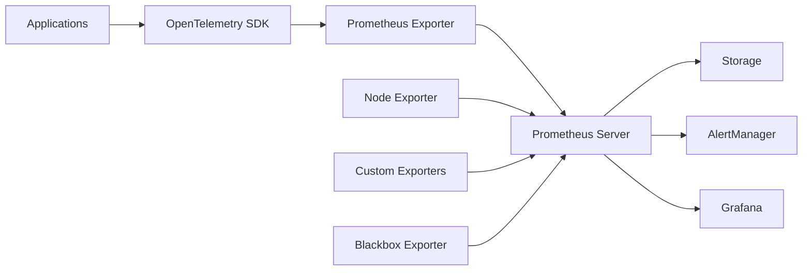

# 📊 Metrics Collection

**Purpose**: Comprehensive metrics collection strategy and implementation  
**Last Updated**: 2026-02-03  
**Status**: 🔄 In Progress - Core metrics implemented

---

## 📋 Overview

This document describes the metrics collection strategy for our microservices platform using Prometheus. Metrics provide quantitative data about system behavior, performance, and business operations.

---

## 🎯 Metrics Strategy

### **Metrics Types**

#### **Counter Metrics**
- **Definition**: Cumulative values that only increase
- **Use Cases**: Request counts, error counts, order totals
- **Examples**: `http_requests_total`, `orders_processed_total`

#### **Gauge Metrics**
- **Definition**: Values that can go up or down
- **Use Cases**: Current state, resource usage
- **Examples**: `active_connections`, `memory_usage_bytes`

#### **Histogram Metrics**
- **Definition**: Distribution of values over time
- **Use Cases**: Request duration, response sizes
- **Examples**: `http_request_duration_seconds`, `response_size_bytes`

#### **Summary Metrics**
- **Definition**: Similar to histograms but calculated client-side
- **Use Cases**: SLA monitoring, percentiles
- **Examples**: `rpc_duration_seconds`

---

## 🏗️ Metrics Architecture

### **Collection Pipeline**



### **Metrics Hierarchy**

```
Platform Metrics
├── Infrastructure Metrics
│   ├── kubernetes_*
│   ├── node_*
│   └── container_*
├── Application Metrics
│   ├── http_*
│   ├── grpc_*
│   └── business_*
├── Database Metrics
│   ├── postgresql_*
│   ├── redis_*
│   └── elasticsearch_*
└── Custom Business Metrics
    ├── orders_*
    ├── payments_*
    └── users_*
```

---

## 📊 Standard Metrics

### **HTTP Metrics**

#### **Request Metrics**
```go
var (
    httpRequestsTotal = prometheus.NewCounterVec(
        prometheus.CounterOpts{
            Name: "http_requests_total",
            Help: "Total number of HTTP requests",
        },
        []string{"method", "endpoint", "status_code", "service"},
    )
    
    httpRequestDuration = prometheus.NewHistogramVec(
        prometheus.HistogramOpts{
            Name: "http_request_duration_seconds",
            Help: "HTTP request duration in seconds",
            Buckets: prometheus.DefBuckets,
        },
        []string{"method", "endpoint", "service"},
    )
    
    httpRequestSize = prometheus.NewHistogramVec(
        prometheus.HistogramOpts{
            Name: "http_request_size_bytes",
            Help: "HTTP request size in bytes",
            Buckets: []float64{100, 1000, 10000, 100000, 1000000},
        },
        []string{"method", "endpoint", "service"},
    )
)
```

#### **Response Metrics**
```go
var (
    httpResponseSize = prometheus.NewHistogramVec(
        prometheus.HistogramOpts{
            Name: "http_response_size_bytes",
            Help: "HTTP response size in bytes",
            Buckets: []float64{100, 1000, 10000, 100000, 1000000},
        },
        []string{"method", "endpoint", "service"},
    )
    
    httpActiveRequests = prometheus.NewGaugeVec(
        prometheus.GaugeOpts{
            Name: "http_active_requests",
            Help: "Number of active HTTP requests",
        },
        []string{"service"},
    )
)
```

### **gRPC Metrics**

#### **Unary RPC Metrics**
```go
var (
    grpcServerRequestsTotal = prometheus.NewCounterVec(
        prometheus.CounterOpts{
            Name: "grpc_server_requests_total",
            Help: "Total number of gRPC requests",
        },
        []string{"service", "method", "status_code"},
    )
    
    grpcServerRequestDuration = prometheus.NewHistogramVec(
        prometheus.HistogramOpts{
            Name: "grpc_server_request_duration_seconds",
            Help: "gRPC request duration in seconds",
            Buckets: prometheus.DefBuckets,
        },
        []string{"service", "method"},
    )
)
```

### **Business Metrics**

#### **Order Metrics**
```go
var (
    ordersCreatedTotal = prometheus.NewCounterVec(
        prometheus.CounterOpts{
            Name: "orders_created_total",
            Help: "Total number of orders created",
        },
        []string{"status", "payment_method", "region"},
    )
    
    orderValueTotal = prometheus.NewCounterVec(
        prometheus.CounterOpts{
            Name: "order_value_total",
            Help: "Total value of orders",
        },
        []string{"currency", "region"},
    )
    
    orderProcessingDuration = prometheus.NewHistogramVec(
        prometheus.HistogramOpts{
            Name: "order_processing_duration_seconds",
            Help: "Time to process an order",
            Buckets: []float64{1, 5, 10, 30, 60, 120, 300},
        },
        []string{"service"},
    )
)
```

#### **Payment Metrics**
```go
var (
    paymentAttemptsTotal = prometheus.NewCounterVec(
        prometheus.CounterOpts{
            Name: "payment_attempts_total",
            Help: "Total number of payment attempts",
        },
        []string{"gateway", "status", "currency"},
    )
    
    paymentAmountTotal = prometheus.NewCounterVec(
        prometheus.CounterOpts{
            Name: "payment_amount_total",
            Help: "Total amount of payments",
        },
        []string{"gateway", "currency", "status"},
    )
    
    paymentProcessingDuration = prometheus.NewHistogramVec(
        prometheus.HistogramOpts{
            Name: "payment_processing_duration_seconds",
            Help: "Payment processing duration",
            Buckets: []float64{1, 2, 5, 10, 30, 60},
        },
        []string{"gateway"},
    )
)
```

---

## 🔧 Implementation Guide

### **1. Add Prometheus Client**

```go
import (
    "github.com/prometheus/client_golang/prometheus"
    "github.com/prometheus/client_golang/prometheus/promhttp"
)
```

### **2. Define Metrics**

```go
// Define metrics at package level
var (
    requestCount = prometheus.NewCounterVec(
        prometheus.CounterOpts{
            Name: "myapp_requests_total",
            Help: "Total number of requests",
        },
        []string{"method", "endpoint"},
    )
)

// Register metrics
func init() {
    prometheus.MustRegister(requestCount)
}
```

### **3. Instrument Code**

```go
func (h *Handler) HandleRequest(w http.ResponseWriter, r *http.Request) {
    timer := prometheus.NewTimer(prometheus.ObserverFunc(func(v float64) {
        requestDuration.WithLabelValues(r.Method, r.URL.Path).Observe(v)
    }))
    defer timer.ObserveDuration()
    
    requestCount.WithLabelValues(r.Method, r.URL.Path).Inc()
    
    // Your handler logic here
}
```

### **4. Expose Metrics Endpoint**

```go
func main() {
    http.Handle("/metrics", promhttp.Handler())
    http.ListenAndServe(":8080", nil)
}
```

---

## 📈 Prometheus Configuration

### **Server Configuration**

```yaml
global:
  scrape_interval: 15s
  evaluation_interval: 15s
  external_labels:
    cluster: 'production'
    region: 'us-west-2'

rule_files:
  - "alert_rules.yml"
  - "recording_rules.yml"

alerting:
  alertmanagers:
    - static_configs:
        - targets:
          - alertmanager:9093

scrape_configs:
  - job_name: 'kubernetes-apiservers'
    kubernetes_sd_configs:
      - role: endpoints
    scheme: https
    tls_config:
      ca_file: /var/run/secrets/kubernetes.io/serviceaccount/ca.crt
    bearer_token_file: /var/run/secrets/kubernetes.io/serviceaccount/token
    relabel_configs:
      - source_labels: [__meta_kubernetes_namespace, __meta_kubernetes_service_name, __meta_kubernetes_endpoint_port_name]
        action: keep
        regex: default;kubernetes;https

  - job_name: 'kubernetes-pods'
    kubernetes_sd_configs:
      - role: pod
    relabel_configs:
      - source_labels: [__meta_kubernetes_pod_annotation_prometheus_io_scrape]
        action: keep
        regex: true
      - source_labels: [__meta_kubernetes_pod_annotation_prometheus_io_path]
        action: replace
        target_label: __metrics_path__
        regex: (.+)
      - source_labels: [__address__, __meta_kubernetes_pod_annotation_prometheus_io_port]
        action: replace
        regex: ([^:]+)(?::\d+)?;(\d+)
        replacement: $1:$2
        target_label: __address__
      - action: labelmap
        regex: __meta_kubernetes_pod_label_(.+)
      - source_labels: [__meta_kubernetes_namespace]
        action: replace
        target_label: kubernetes_namespace
      - source_labels: [__meta_kubernetes_pod_name]
        action: replace
        target_label: kubernetes_pod_name
```

### **Recording Rules**

```yaml
groups:
  - name: kubernetes.rules
    rules:
      - record: kubernetes_pod_name:container_cpu_usage_seconds_total:rate
        expr: sum(rate(container_cpu_usage_seconds_total{container!="POD",container!=""}[5m])) by (pod)
      
      - record: kubernetes_pod_name:container_memory_usage_bytes:sum
        expr: sum(container_memory_usage_bytes{container!="POD",container!=""}) by (pod)
      
      - record: kubernetes_namespace:container_memory_usage_bytes:sum
        expr: sum(container_memory_usage_bytes{container!="POD",container!=""}) by (namespace)
```

---

## 🚨 Alerting Rules

### **Service Level Alerts**

```yaml
groups:
  - name: service.rules
    rules:
      - alert: HighErrorRate
        expr: rate(http_requests_total{status_code=~"5.."}[5m]) / rate(http_requests_total[5m]) > 0.1
        for: 5m
        labels:
          severity: critical
        annotations:
          summary: "High error rate detected"
          description: "Error rate is {{ $value | humanizePercentage }} for {{ $labels.service }}"

      - alert: HighLatency
        expr: histogram_quantile(0.95, rate(http_request_duration_seconds_bucket[5m])) > 0.5
        for: 5m
        labels:
          severity: warning
        annotations:
          summary: "High latency detected"
          description: "95th percentile latency is {{ $value }}s for {{ $labels.service }}"

      - alert: ServiceDown
        expr: up{job="kubernetes-pods"} == 0
        for: 1m
        labels:
          severity: critical
        annotations:
          summary: "Service is down"
          description: "{{ $labels.service }} has been down for more than 1 minute"
```

### **Infrastructure Alerts**

```yaml
groups:
  - name: infrastructure.rules
    rules:
      - alert: HighCPUUsage
        expr: 100 - (avg by(instance) (rate(node_cpu_seconds_total{mode="idle"}[5m])) * 100) > 80
        for: 5m
        labels:
          severity: warning
        annotations:
          summary: "High CPU usage"
          description: "CPU usage is {{ $value }}% on {{ $labels.instance }}"

      - alert: HighMemoryUsage
        expr: (1 - (node_memory_MemAvailable_bytes / node_memory_MemTotal_bytes)) * 100 > 85
        for: 5m
        labels:
          severity: warning
        annotations:
          summary: "High memory usage"
          description: "Memory usage is {{ $value }}% on {{ $labels.instance }}"

      - alert: DiskSpaceLow
        expr: (1 - (node_filesystem_avail_bytes / node_filesystem_size_bytes)) * 100 > 90
        for: 5m
        labels:
          severity: critical
        annotations:
          summary: "Low disk space"
          description: "Disk usage is {{ $value }}% on {{ $labels.instance }}"
```

---

## 📊 Dashboard Examples

### **Service Dashboard**

```json
{
  "dashboard": {
    "title": "Service Overview",
    "panels": [
      {
        "title": "Request Rate",
        "type": "graph",
        "targets": [
          {
            "expr": "rate(http_requests_total[5m])",
            "legendFormat": "{{service}} - {{method}}"
          }
        ]
      },
      {
        "title": "Error Rate",
        "type": "graph",
        "targets": [
          {
            "expr": "rate(http_requests_total{status_code=~\"5..\"}[5m]) / rate(http_requests_total[5m])",
            "legendFormat": "Error Rate"
          }
        ]
      },
      {
        "title": "Response Time",
        "type": "graph",
        "targets": [
          {
            "expr": "histogram_quantile(0.95, rate(http_request_duration_seconds_bucket[5m]))",
            "legendFormat": "95th percentile"
          }
        ]
      }
    ]
  }
}
```

---

## 🔧 Best Practices

### **Metric Naming**

#### **Conventions**
- Use snake_case for metric names
- Include units in metric names (seconds, bytes, etc.)
- Use consistent labels across metrics
- Use meaningful label values

#### **Examples**
```go
// Good
http_requests_total
http_request_duration_seconds
memory_usage_bytes

// Bad
httpRequests
requestTime
mem
```

### **Label Usage**

#### **Best Practices**
- Keep cardinality low
- Use consistent label values
- Avoid high-cardinality labels like user IDs
- Use labels for dimensions you want to filter by

#### **Examples**
```go
// Good labels
service: "order-service"
method: "POST"
status_code: "200"

// Bad labels (high cardinality)
user_id: "12345"
request_id: "abc-def-ghi"
timestamp: "2026-02-03T10:30:00Z"
```

### **Performance Considerations**

#### **Optimization Tips**
- Use appropriate histogram buckets
- Limit number of time series
- Use recording rules for complex queries
- Set appropriate retention policies

---

## 📚 Related Documentation

### **Implementation Guides**
- [Monitoring Architecture](./MONITORING_ARCHITECTURE.md) - Overall architecture
- [Logging Strategy](./LOGGING.md) - Log collection
- [Tracing Implementation](./TRACING.md) - Distributed tracing
- [Alerting Setup](./ALERTING.md) - Alert configuration

### **External Resources**
- [Prometheus Documentation](https://prometheus.io/docs/)
- [Go Client Library](https://prometheus.io/docs/instrumenting/clientlibs/)
- [Best Practices](https://prometheus.io/docs/practices/)

---

**Last Updated**: 2026-02-03  
**Review Cycle**: Monthly  
**Maintained By**: Platform Engineering Team
