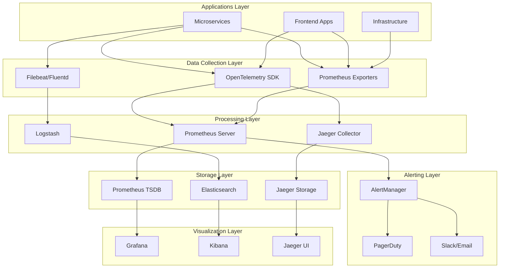
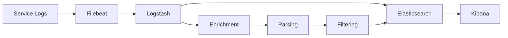
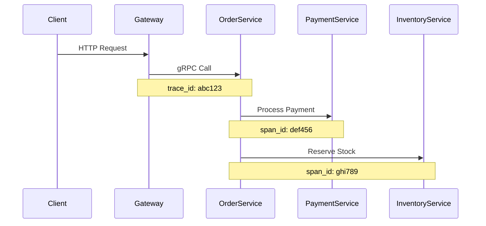
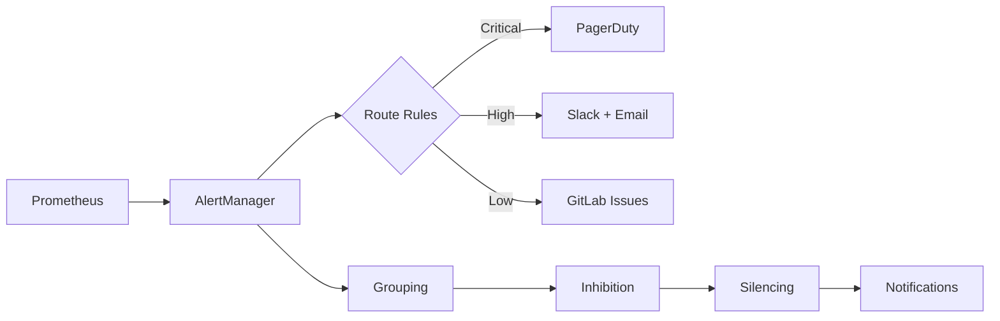

# 🏗️ Monitoring Architecture

**Purpose**: Complete observability architecture and design  
**Last Updated**: 2026-02-03  
**Status**: 🔄 In Progress - Architecture defined, implementation ongoing

---

## 📋 Overview

This document describes the complete monitoring and observability architecture for our microservices platform. The architecture provides comprehensive visibility into system health, performance, and business operations.

---

## 🎯 Architecture Principles

### **Observability First**
- Every service is observable by design
- Metrics, logs, and traces are first-class citizens
- Instrumentation is part of the development process

### **Unified Monitoring**
- Single pane of glass for all monitoring needs
- Consistent data formats and conventions
- Centralized alerting and notification

### **Scalable Design**
- Monitoring scales with the platform
- Efficient data collection and storage
- Cost-effective observability

---

## 🏗️ System Architecture

### **High-Level Architecture**



### **Component Interactions**

#### **Metrics Flow**
```
Service → OpenTelemetry SDK → Prometheus Exporter → Prometheus Server → Grafana
                                                              ↓
                                                         AlertManager → Notifications
```

#### **Logs Flow**
```
Service → Structured Logs → Filebeat → Logstash → Elasticsearch → Kibana
```

#### **Traces Flow**
```
Service → OpenTelemetry SDK → Jaeger Collector → Jaeger Storage → Jaeger UI
```

---

## 📊 Metrics Architecture

### **Prometheus Stack**

#### **Core Components**
- **Prometheus Server**: Metrics collection and storage
- **AlertManager**: Alert routing and management
- **Node Exporter**: System metrics
- **Blackbox Exporter**: External monitoring
- **Custom Exporters**: Application-specific metrics

#### **Deployment Architecture**
```yaml
# Prometheus Configuration
global:
  scrape_interval: 15s
  evaluation_interval: 15s

rule_files:
  - "alert_rules.yml"

alerting:
  alertmanagers:
    - static_configs:
        - targets:
          - alertmanager:9093

scrape_configs:
  - job_name: 'kubernetes-pods'
    kubernetes_sd_configs:
      - role: pod
    relabel_configs:
      - source_labels: [__meta_kubernetes_pod_annotation_prometheus_io_scrape]
        action: keep
        regex: true
```

#### **Metrics Hierarchy**
```
Platform Metrics
├── Infrastructure Metrics
│   ├── Kubernetes Cluster
│   ├── Node Resources
│   └── Network
├── Application Metrics
│   ├── Service Performance
│   ├── Business Metrics
│   └── Custom Application Metrics
└── Integration Metrics
    ├── Database Performance
    ├── External APIs
    └── Message Queues
```

---

## 📝 Logging Architecture

### **ELK Stack Design**

#### **Components**
- **Elasticsearch**: Log storage and search
- **Logstash**: Log processing and enrichment
- **Kibana**: Log analysis and visualization
- **Filebeat**: Log shipping from services

#### **Log Processing Pipeline**


#### **Log Structure**
```json
{
  "timestamp": "2026-02-03T10:30:00Z",
  "level": "INFO",
  "service": "order-service",
  "trace_id": "abc123",
  "span_id": "def456",
  "message": "Order created successfully",
  "fields": {
    "order_id": "ORD-001",
    "customer_id": "CUST-001",
    "amount": 99.99,
    "duration_ms": 150
  }
}
```

---

## 🔍 Tracing Architecture

### **Distributed Tracing Stack**

#### **Components**
- **Jaeger**: Distributed tracing platform
- **OpenTelemetry**: Instrumentation library
- **Jaeger Collector**: Trace collection and processing
- **Jaeger Query**: Trace query and visualization

#### **Trace Propagation**


#### **Sampling Strategy**
- **Default Sampling**: 1% for all traces
- **High-Priority Services**: 10% for critical paths
- **Error Traces**: 100% for error conditions
- **Debug Mode**: 100% for specific requests

---

## 🚨 Alerting Architecture

### **Alert Management**

#### **Alert Hierarchy**
```
AlertManager
├── Route Rules
│   ├── Critical Alerts → PagerDuty
│   ├── High Priority → Slack + Email
│   └── Low Priority → GitLab Issues
├── Grouping Rules
│   ├── By Service
│   ├── By Severity
│   └── By Cluster
└── Inhibition Rules
    ├── Prevent Alert Storms
    └── Reduce Noise
```

#### **Alert Flow**


---

## 📈 Dashboard Architecture

### **Grafana Dashboard Hierarchy**

#### **Dashboard Categories**
```
Grafana Dashboards
├── Platform Overview
│   ├── System Health
│   ├── Resource Usage
│   └── Business Metrics
├── Service Dashboards
│   ├── Individual Services
│   ├── Service Dependencies
│   └── Service Performance
├── Infrastructure
│   ├── Kubernetes Cluster
│   ├── Database Performance
│   └── Network Monitoring
└── Business Intelligence
    ├── E-Commerce Metrics
    ├── User Analytics
    └── Revenue Tracking
```

#### **Dashboard Standards**
- **Consistent Layout**: Standardized panel arrangements
- **Time Synchronization**: All panels use same time range
- **Color Coding**: Consistent status indicators
- **Annotations**: Important events and deployments

---

## 🔧 Implementation Details

### **Kubernetes Deployment**

#### **Monitoring Namespace**
```yaml
apiVersion: v1
kind: Namespace
metadata:
  name: monitoring
  labels:
    name: monitoring
    purpose: observability
```

#### **Prometheus Deployment**
```yaml
apiVersion: apps/v1
kind: Deployment
metadata:
  name: prometheus
  namespace: monitoring
spec:
  replicas: 2
  selector:
    matchLabels:
      app: prometheus
  template:
    metadata:
      labels:
        app: prometheus
    spec:
      containers:
      - name: prometheus
        image: prom/prometheus:latest
        ports:
        - containerPort: 9090
        volumeMounts:
        - name: config
          mountPath: /etc/prometheus
        - name: storage
          mountPath: /prometheus
      volumes:
      - name: config
        configMap:
          name: prometheus-config
      - name: storage
        persistentVolumeClaim:
          claimName: prometheus-storage
```

### **Service Discovery**

#### **Kubernetes Service Discovery**
```yaml
scrape_configs:
  - job_name: 'kubernetes-apiservers'
    kubernetes_sd_configs:
      - role: endpoints
    scheme: https
    tls_config:
      ca_file: /var/run/secrets/kubernetes.io/serviceaccount/ca.crt
    bearer_token_file: /var/run/secrets/kubernetes.io/serviceaccount/token
    
  - job_name: 'kubernetes-pods'
    kubernetes_sd_configs:
      - role: pod
    relabel_configs:
      - source_labels: [__meta_kubernetes_pod_annotation_prometheus_io_scrape]
        action: keep
        regex: true
      - source_labels: [__meta_kubernetes_pod_annotation_prometheus_io_path]
        action: replace
        target_label: __metrics_path__
        regex: (.+)
```

---

## 📊 Data Retention

### **Metrics Retention**
- **High Resolution**: 15s intervals, 15 days
- **Medium Resolution**: 1m intervals, 90 days
- **Low Resolution**: 5m intervals, 1 year

### **Logs Retention**
- **Hot Storage**: 30 days (SSD)
- **Warm Storage**: 90 days (HDD)
- **Cold Storage**: 1 year (Object Storage)
- **Archive**: 7 years (Compressed)

### **Traces Retention**
- **Full Traces**: 7 days
- **Trace Summaries**: 30 days
- **Performance Metrics**: 90 days

---

## 🔒 Security Architecture

### **Monitoring Security**

#### **Access Control**
- **RBAC**: Role-based access to monitoring tools
- **Network Policies**: Restricted network access
- **Authentication**: SSO integration for all tools
- **Authorization**: Fine-grained permissions

#### **Data Security**
- **Encryption**: Data in transit and at rest
- **PII Redaction**: Automatic sensitive data removal
- **Audit Logging**: All access logged and monitored
- **Compliance**: GDPR and SOC 2 compliance

---

## 🚀 Performance Considerations

### **Scalability**

#### **Metrics Scalability**
- **Horizontal Scaling**: Multiple Prometheus instances
- **Federation**: Global aggregation of metrics
- **Remote Storage**: Long-term storage solutions
- **Caching**: Query result caching

#### **Logging Scalability**
- **Sharding**: Elasticsearch cluster sharding
- **Load Balancing**: Multiple Logstash instances
- **Buffering**: Message queue for log buffering
- **Compression**: Log data compression

---

## 📚 Related Documentation

### **Implementation Guides**
- [Metrics Implementation](./METRICS.md) - Detailed metrics setup
- [Logging Implementation](./LOGGING.md) - ELK stack setup
- [Tracing Implementation](./TRACING.md) - Jaeger setup
- [Alerting Setup](./ALERTING.md) - Alert configuration

### **Operations**
- [Dashboard Catalog](./DASHBOARDS.md) - Available dashboards
- [Troubleshooting](./TROUBLESHOOTING.md) - Common issues
- [Maintenance](./MAINTENANCE.md) - System maintenance

---

**Last Updated**: 2026-02-03  
**Review Cycle**: Monthly  
**Maintained By**: Platform Engineering & SRE Teams
