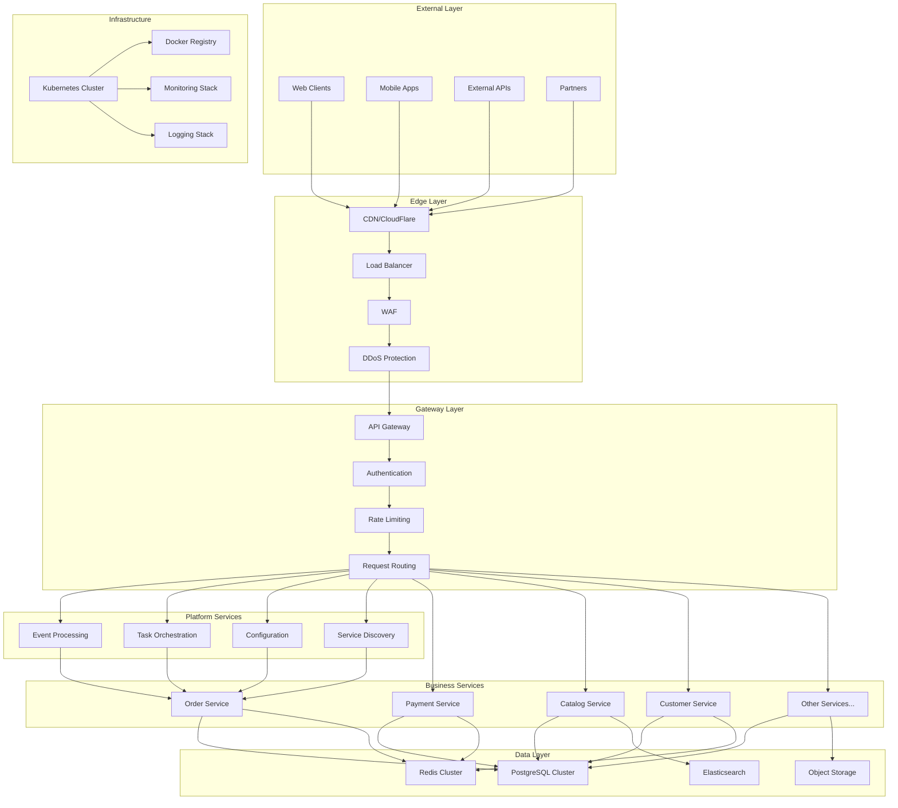
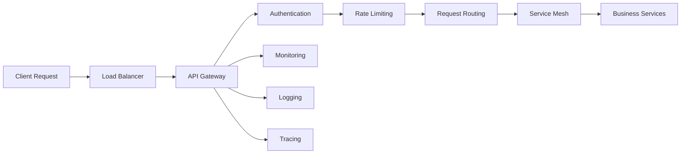
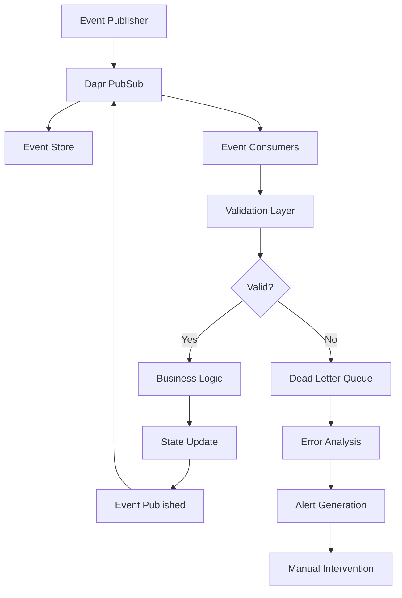
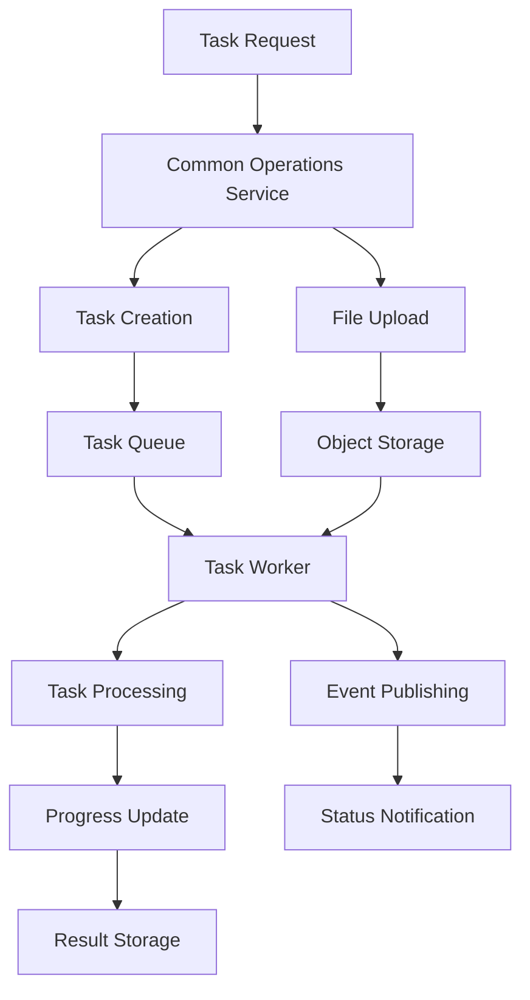
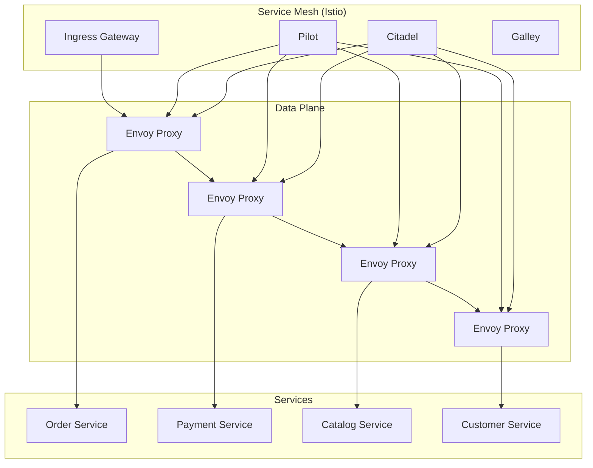
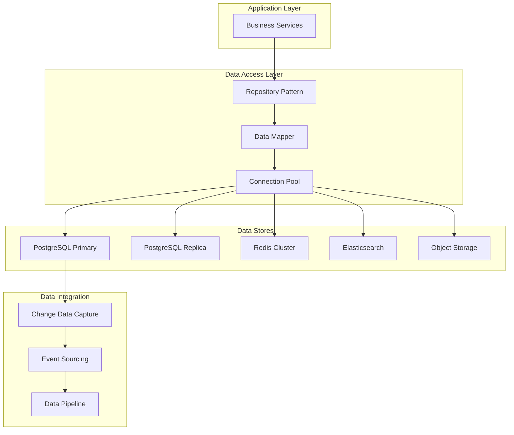
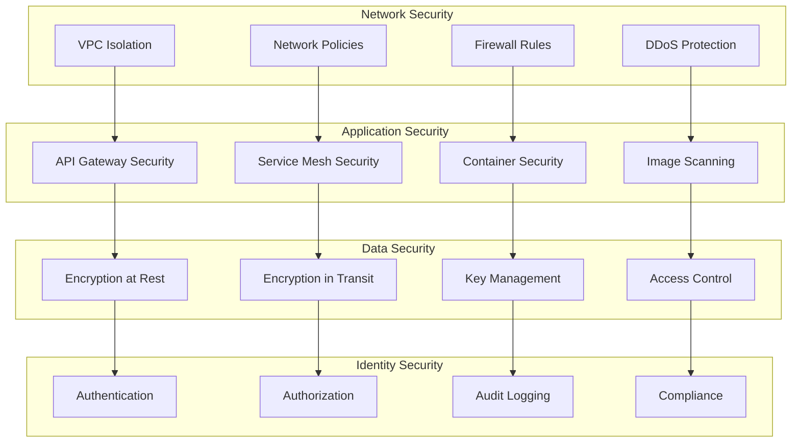
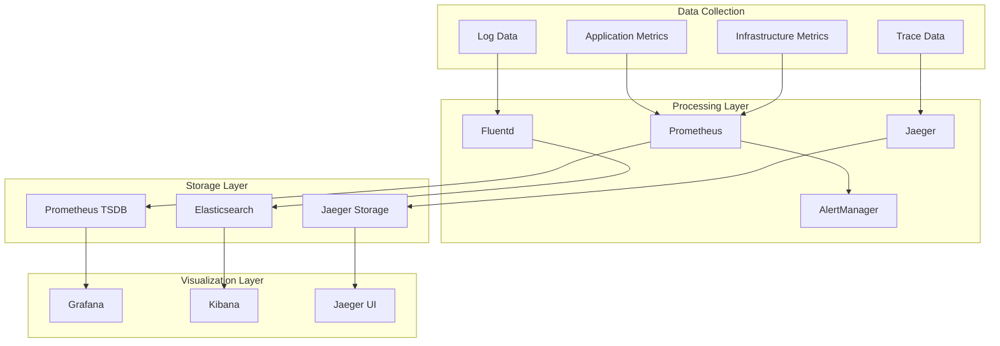
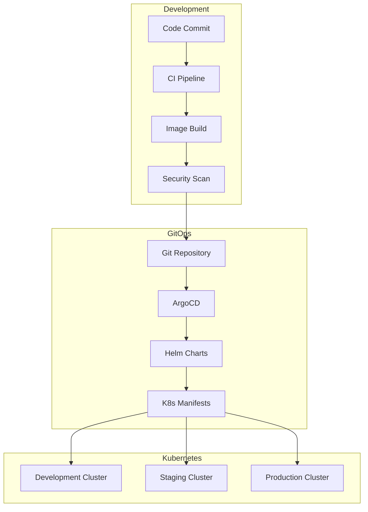

# 🏗️ Platform Architecture

**Purpose**: Complete platform architecture and design documentation  
**Last Updated**: 2026-02-03  
**Status**: ✅ Active - Production-ready platform architecture

---

## 📋 Overview

This document describes the complete platform architecture for our microservices ecosystem. The platform provides the foundational infrastructure and services that enable the business microservices to operate reliably and efficiently.

---

## 🎯 Architecture Principles

### **Platform as a Product**
- **Developer Experience**: Easy to use and integrate
- **Self-Service**: Automated provisioning and management
- **Reliability**: Built-in fault tolerance and resilience
- **Observability**: Comprehensive monitoring and tracing

### **Cloud-Native Design**
- **Container-Native**: Everything runs in containers
- **Kubernetes-Native**: Leverages K8s primitives
- **Event-Driven**: Asynchronous communication patterns
- **API-First**: Contract-driven development

### **Security by Default**
- **Zero Trust**: Never trust, always verify
- **Encryption**: Data encrypted in transit and at rest
- **Least Privilege**: Minimal access permissions
- **Compliance Ready**: Built for regulatory requirements

---

## 🏗️ Platform Architecture Overview

### **High-Level Architecture**



---

## 🔧 Core Platform Services

### **API Gateway**

#### **Gateway Architecture**


#### **Gateway Features**
- **Protocol Translation**: HTTP/gRPC/WebSocket support
- **Authentication**: JWT validation, OAuth2, MFA
- **Authorization**: RBAC, ABAC, service-to-service auth
- **Rate Limiting**: User-based, IP-based, service-based limits
- **Circuit Breaking**: Fault tolerance and resilience
- **Request Transformation**: Header manipulation, body transformation
- **Monitoring**: Request metrics, response times, error rates

#### **Gateway Configuration**
```yaml
apiVersion: v1
kind: ConfigMap
metadata:
  name: gateway-config
  namespace: production
data:
  config.yaml: |
    gateway:
      port: 8080
      timeout: 30s
      
    authentication:
      jwt:
        issuer: "https://auth.company.com"
        audience: "api.company.com"
        algorithms: ["RS256"]
        
    rate_limiting:
      default:
        requests_per_second: 100
        burst: 200
        
    circuit_breaker:
      failure_threshold: 5
      recovery_timeout: 30s
      success_threshold: 2
```

### **Event Processing System**

#### **Event Architecture**


#### **Event Processing Components**
- **Dapr PubSub**: Event publishing and subscription
- **Event Validation**: Schema validation and type checking
- **Dead Letter Queue**: Failed event management
- **Circuit Breaker**: Consumer fault tolerance
- **Event Sourcing**: Immutable event log
- **CQRS**: Command Query Responsibility Segregation

#### **Event Schema Example**
```json
{
  "specversion": "1.0",
  "type": "order.created",
  "source": "/order-service",
  "id": "order-12345",
  "time": "2026-02-03T10:30:00Z",
  "datacontenttype": "application/json",
  "data": {
    "orderId": "ORD-001",
    "customerId": "CUST-001",
    "totalAmount": 99.99,
    "currency": "USD",
    "items": [
      {
        "productId": "PROD-001",
        "quantity": 2,
        "price": 49.99
      }
    ]
  }
}
```

### **Task Orchestration Service**

#### **Task Architecture**


#### **Task Types**
- **Import Operations**: Data import from various sources
- **Export Operations**: Data export in multiple formats
- **Batch Processing**: Bulk data processing
- **Report Generation**: Automated report creation
- **Data Synchronization**: Cross-system data sync

#### **Task Lifecycle**
```yaml
task_lifecycle:
  states:
    - pending: Task created, waiting to start
    - running: Task currently processing
    - completed: Task finished successfully
    - failed: Task failed with error
    - cancelled: Task cancelled by user
    - retrying: Task being retried after failure
    
  transitions:
    pending -> running: Task started
    running -> completed: Task finished
    running -> failed: Task error
    running -> cancelled: User cancelled
    failed -> retrying: Automatic retry
    retrying -> running: Retry attempt
    retrying -> failed: Max retries exceeded
```

---

## 🌐 Service Mesh Integration

### **Service Mesh Architecture**



### **Service Mesh Features**
- **mTLS**: Mutual TLS for service-to-service communication
- **Traffic Management**: Routing, load balancing, canary deployments
- **Security**: Authentication, authorization, policy enforcement
- **Observability**: Metrics, logs, tracing
- **Resilience**: Circuit breaking, retries, timeouts

---

## 💾 Data Architecture

### **Data Layer Design**



### **Database Architecture**

#### **PostgreSQL Cluster**
- **Primary-Replica Setup**: High availability with read replicas
- **Connection Pooling**: PgBouncer for connection management
- **Backup Strategy**: Continuous backup with point-in-time recovery
- **Monitoring**: Query performance, connection metrics

#### **Redis Cluster**
- **High Availability**: Redis Cluster with automatic failover
- **Data Persistence**: RDB + AOF persistence
- **Memory Management**: Eviction policies and memory optimization
- **Use Cases**: Caching, session storage, pub/sub

#### **Elasticsearch**
- **Cluster Setup**: Multi-node cluster with shard allocation
- **Index Management**: Time-based indices and lifecycle policies
- **Search Performance**: Optimized mappings and queries
- **Use Cases**: Product search, log analytics, monitoring

---

## 🔒 Security Architecture

### **Security Layers**



### **Security Implementation**

#### **Network Security**
- **VPC Isolation**: Private network segments
- **Network Policies**: Kubernetes network policies
- **Service Mesh mTLS**: Mutual TLS for all service communication
- **Ingress Security**: TLS termination and certificate management

#### **Application Security**
- **Container Security**: Image scanning, runtime protection
- **API Security**: Authentication, authorization, rate limiting
- **Secrets Management**: Encrypted secrets with rotation
- **Vulnerability Management**: Automated scanning and patching

---

## 📊 Observability Architecture

### **Monitoring Stack**



### **Observability Features**
- **Metrics Collection**: Prometheus with custom exporters
- **Log Aggregation**: ELK stack with structured logging
- **Distributed Tracing**: Jaeger with OpenTelemetry
- **Alerting**: AlertManager with multiple notification channels
- **Dashboarding**: Grafana with pre-built dashboards

---

## 🚀 Deployment Architecture

### **GitOps Workflow**



### **Deployment Strategy**
- **GitOps**: Declarative configuration with Git as source of truth
- **Progressive Delivery**: Canary deployments and blue-green deployments
- **Automated Testing**: Comprehensive test automation
- **Rollback Capability**: Instant rollback to previous versions

---

## 📚 Related Documentation

### **Platform Documentation**
- [Platform Operations](./README.md) - Platform operational procedures
- [Event Processing Manual](./event-processing-manual.md) - Event processing details
- [Common Operations Flow](./common-operations-flow.md) - Task orchestration

### **Architecture Documentation**
- [System Architecture](../../01-architecture/README.md) - Overall system design
- [Security Architecture](../security/SECURITY_ARCHITECTURE.md) - Security design
- [Monitoring Architecture](../monitoring/MONITORING_ARCHITECTURE.md) - Observability design

---

**Last Updated**: 2026-02-03  
**Review Cycle**: Monthly  
**Maintained By**: Platform Engineering Team
