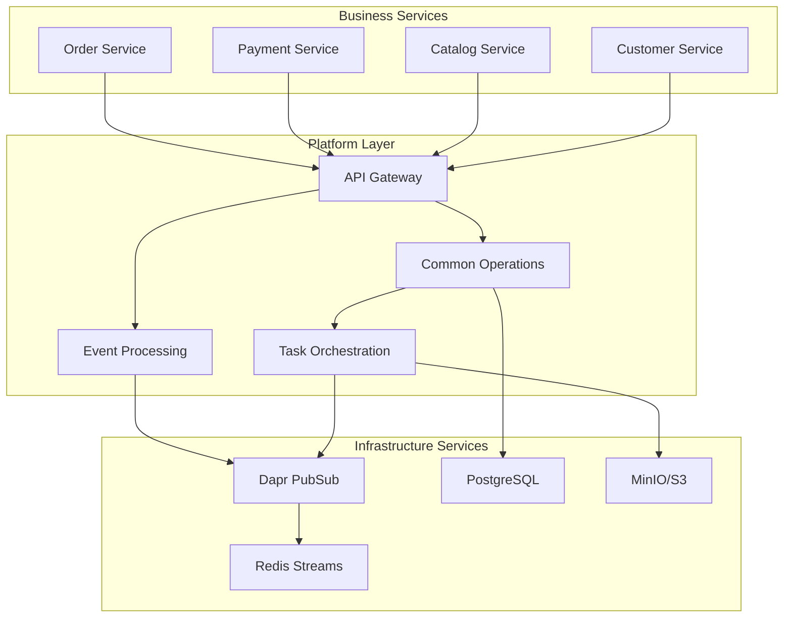

# 🏗️ Platform Operations

**Purpose**: Platform-wide operational procedures and system management  
**Last Updated**: 2026-02-03  
**Status**: ✅ Active - Core platform operations documented

---

## 📋 Overview

This section contains documentation for platform-wide operations, including event processing, task orchestration, and system integration flows. These procedures ensure reliable operation of the underlying platform infrastructure.

### 🎯 What You'll Find Here

- **[Common Operations Flow](./common-operations-flow.md)** - Task orchestration and background jobs
- **[Event Processing Manual](./event-processing-manual.md)** - Event-driven architecture procedures
- **[Event Processing Quick Reference](./event-processing-quick-reference.md)** - Fast troubleshooting guide
- **[Event Validation DLQ Flow](./event-validation-dlq-flow.md)** - Dead letter queue procedures
- **[Gateway Service Flow](./gateway-service-flow.md)** - API gateway operations

---

## 🏗️ Platform Architecture Overview

### **Core Platform Services**



### **Key Platform Components**

#### **🔄 Event Processing System**
- **Dapr PubSub**: Event publishing and subscription
- **Event Validation**: Schema validation and error handling
- **Dead Letter Queue**: Failed event management
- **Circuit Breaker**: Fault tolerance and resilience

#### **🔧 Task Orchestration**
- **Common Operations Service**: Background task management
- **File Processing**: Import/export operations
- **Progress Tracking**: Real-time task status
- **Result Storage**: Output file management

#### **🌐 API Gateway**
- **Request Routing**: Service discovery and load balancing
- **Authentication**: JWT validation and authorization
- **Rate Limiting**: Traffic management and protection
- **Monitoring**: Request tracking and metrics

---

## 📊 Platform Operations Status

### **✅ Documented Flows**

| Flow | Status | Description | Documentation |
|------|--------|-------------|----------------|
| **Common Operations** | ✅ Complete | Task orchestration and background jobs | [common-operations-flow.md](./common-operations-flow.md) |
| **Event Processing** | ✅ Complete | Event-driven architecture procedures | [event-processing-manual.md](./event-processing-manual.md) |
| **Event Validation** | ✅ Complete | Event validation and DLQ management | [event-validation-dlq-flow.md](./event-validation-dlq-flow.md) |
| **Gateway Service** | ✅ Complete | API gateway operations and routing | [gateway-service-flow.md](./gateway-service-flow.md) |
| **Quick Reference** | ✅ Complete | Fast troubleshooting and commands | [event-processing-quick-reference.md](./event-processing-quick-reference.md) |

### **🔧 Platform Services Health**

#### **Critical Services**
- **API Gateway**: ✅ Operational
- **Common Operations**: ✅ Operational
- **Dapr PubSub**: ✅ Operational
- **PostgreSQL**: ✅ Operational

#### **Supporting Services**
- **Redis Streams**: ✅ Operational
- **MinIO/S3**: ✅ Operational
- **Monitoring Stack**: ✅ Operational

---

## 🚀 Quick Access Guides

### **🔥 Most Common Issues**

#### **Event Processing Problems**
```bash
# Check event consumer status
kubectl logs -f deployment/search-service -n production | grep "event"

# Check Dapr sidecar
kubectl logs -f deployment/search-service -n production -c daprd

# Check Redis streams
kubectl exec -it redis-pod -- redis-cli XINFO STREAMS operations.task.created

# Check DLQ
kubectl exec -it redis-pod -- redis-cli XLEN dlq:search-events
```

#### **Task Orchestration Issues**
```bash
# Check common operations service
kubectl logs -f deployment/common-operations -n production

# Check task status
curl -H "Authorization: Bearer $TOKEN" \
  https://api.company.com/api/v1/operations/tasks

# Check file storage
kubectl exec -it minio-pod -- mc ls common-operations/
```

#### **Gateway Service Issues**
```bash
# Check gateway logs
kubectl logs -f deployment/gateway -n production

# Check upstream services
kubectl get services -n production
kubectl describe service SERVICE-NAME -n production

# Check configuration
kubectl get configmap gateway-config -n production -o yaml
```

### **📊 Platform Metrics**

#### **Event Processing Metrics**
- **Event Throughput**: Events processed per second
- **Error Rate**: Failed events percentage
- **DLQ Size**: Dead letter queue length
- **Processing Latency**: Event processing time

#### **Task Orchestration Metrics**
- **Active Tasks**: Currently running tasks
- **Task Success Rate**: Completed tasks percentage
- **Average Processing Time**: Task duration
- **Queue Length**: Pending tasks

#### **Gateway Metrics**
- **Request Rate**: Requests per second
- **Response Time**: API response latency
- **Error Rate**: Failed requests percentage
- **Upstream Health**: Backend service status

---

## 🔧 Platform Maintenance

### **Daily Checks**

#### **Event Processing Health**
```bash
#!/bin/bash
# daily-event-processing-check.sh

echo "=== Event Processing Health Check ==="

# Check Dapr components
echo "Checking Dapr components..."
kubectl get daprcomponents --all-namespaces

# Check event consumers
echo "Checking event consumers..."
kubectl get pods -l app=search-service -n production

# Check Redis streams
echo "Checking Redis streams..."
kubectl exec -it redis-pod -- redis-cli INFO streams

# Check DLQ
echo "Checking DLQ size..."
kubectl exec -it redis-pod -- redis-cli XLEN dlq:*

echo "=== Event Processing Health Check Complete ==="
```

#### **Task Orchestration Health**
```bash
#!/bin/bash
# daily-task-orchestration-check.sh

echo "=== Task Orchestration Health Check ==="

# Check common operations service
echo "Checking common operations service..."
kubectl get pods -l app=common-operations -n production

# Check database connectivity
echo "Checking database connectivity..."
kubectl exec -it common-operations-pod -- nc -zv postgres 5432

# Check storage
echo "Checking storage..."
kubectl exec -it minio-pod -- mc ls common-operations/

# Check active tasks
echo "Checking active tasks..."
curl -H "Authorization: Bearer $TOKEN" \
  https://api.company.com/api/v1/operations/tasks?status=running

echo "=== Task Orchestration Health Check Complete ==="
```

### **Weekly Maintenance**

#### **Event Processing Maintenance**
```bash
#!/bin/bash
# weekly-event-processing-maintenance.sh

echo "=== Event Processing Maintenance ==="

# Clean up old event streams
echo "Cleaning up old event streams..."
kubectl exec -it redis-pod -- redis-cli --scan --pattern "events:*" | \
  xargs -I {} redis-cli XTRIM {} MAXLEN ~ 10000

# Process DLQ
echo "Processing DLQ..."
./scripts/process-dlq.sh

# Update event schemas
echo "Updating event schemas..."
./scripts/update-event-schemas.sh

# Validate event processing
echo "Validating event processing..."
./scripts/validate-event-processing.sh

echo "=== Event Processing Maintenance Complete ==="
```

---

## 🚨 Incident Response

### **Platform-Wide Incidents**

#### **Event Processing Failure**
```bash
# Immediate response
kubectl scale deployment search-service --replicas=0 -n production
kubectl apply -f emergency/event-processing-fix.yaml
kubectl scale deployment search-service --replicas=3 -n production

# Monitor recovery
kubectl logs -f deployment/search-service -n production
kubectl exec -it redis-pod -- redis-cli MONITOR
```

#### **Task Orchestration Failure**
```bash
# Immediate response
kubectl scale deployment common-operations --replicas=0 -n production
kubectl apply -f emergency/task-orchestration-fix.yaml
kubectl scale deployment common-operations --replicas=2 -n production

# Monitor recovery
kubectl logs -f deployment/common-operations -n production
curl -H "Authorization: Bearer $TOKEN" \
  https://api.company.com/api/v1/operations/tasks
```

#### **Gateway Service Failure**
```bash
# Immediate response
kubectl scale deployment gateway --replicas=0 -n production
kubectl apply -f emergency/gateway-fix.yaml
kubectl scale deployment gateway --replicas=3 -n production

# Monitor recovery
kubectl logs -f deployment/gateway -n production
curl -I https://api.company.com/health
```

---

## 📚 Related Documentation

### **Platform Documentation**
- [Monitoring Overview](../monitoring/README.md) - Platform monitoring
- [Security Operations](../security/README.md) - Platform security
- [GitOps Overview](../deployment/gitops/GITOPS_OVERVIEW.md) - Platform deployment

### **Service Documentation**
- [Service Documentation](../../03-services/README.md) - Individual service details
- [API Documentation](../../04-apis/README.md) - API specifications
- [Architecture Decisions](../../08-architecture-decisions/README.md) - Design decisions

### **External Resources**
- [Dapr Documentation](https://dapr.io/docs/)
- [Kubernetes Documentation](https://kubernetes.io/docs/)
- [Redis Documentation](https://redis.io/documentation)

---

## 🎯 Getting Started

### **For Platform Engineers**
1. **Read Architecture Overview**: Understand platform design
2. **Review Common Operations**: Learn task orchestration
3. **Study Event Processing**: Master event-driven architecture
4. **Practice Troubleshooting**: Use quick reference guides

### **For Service Developers**
1. **Understand Integration**: Learn how services connect
2. **Review Event Schemas**: Understand event contracts
3. **Study Gateway**: Learn API gateway usage
4. **Practice Debugging**: Use troubleshooting guides

### **For Operations Teams**
1. **Daily Checks**: Follow health check procedures
2. **Maintenance Tasks**: Execute scheduled maintenance
3. **Incident Response**: Use incident response procedures
4. **Monitoring**: Track platform metrics

---

## 🔄 Continuous Improvement

### **Platform Metrics Tracking**
- **Reliability**: Platform uptime and availability
- **Performance**: Event processing and task execution times
- **Scalability**: System capacity and growth metrics
- **Security**: Platform security incidents and responses

### **Documentation Updates**
- **Monthly Reviews**: Regular documentation updates
- **Incident Learning**: Update procedures based on incidents
- **Best Practices**: Document new patterns and solutions
- **Tool Updates**: Update for new platform tools and features

---

**Last Updated**: 2026-02-03  
**Review Cycle**: Monthly  
**Maintained By**: Platform Engineering Team
