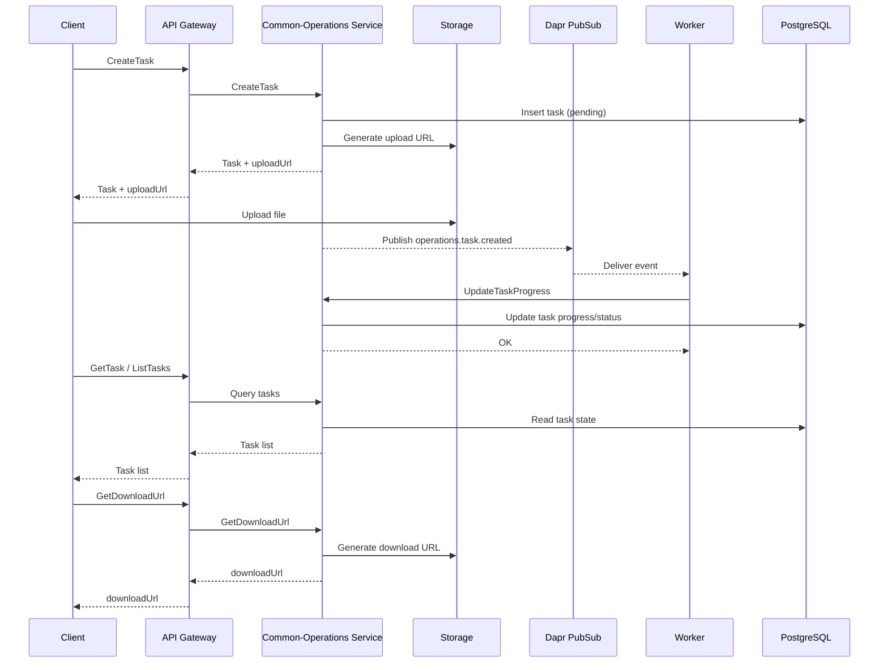

# Common-Operations Flow (Task Orchestration)

**Domain**: Platform
**Service**: Common-Operations Service

## Overview
The Common-Operations Service orchestrates shared tasks (import/export, background jobs). It supports task creation, file upload, async processing, progress updates, output download, and logs/events.

## Actors
- Admin UI / Service Client
- API Gateway
- Common-Operations Service
- Storage (S3/MinIO)
- Dapr PubSub (operations.task.created)
- Worker (TaskConsumer / TaskProcessor)
- PostgreSQL (common_operations_db)

## Core APIs
- POST /api/v1/operations/tasks (CreateTask)
- GET /api/v1/operations/tasks/{id}
- GET /api/v1/operations/tasks
- POST /api/v1/operations/tasks/{id}/cancel
- POST /api/v1/operations/tasks/{id}/retry
- PATCH /api/v1/operations/tasks/{taskId}/progress
- GET /api/v1/operations/tasks/{taskId}/download
- GET /api/v1/operations/tasks/{taskId}/logs
- GET /api/v1/operations/tasks/{taskId}/events

## Diagram

## Flow 1: Create Task + Upload File
1. Client calls CreateTask with taskType/entityType/params.
2. Service creates Task (status=pending) in DB.
3. If fileName exists, generate upload URL and return uploadUrl.
4. Client uploads file to storage via uploadUrl.

## Flow 2: Task Processing (Async)
1. Task created → publish operations.task.created event.
2. Dapr delivers event to worker endpoint.
3. TaskConsumer loads task and routes by taskType/entityType.
4. Worker processes (export/import), updates status/progress and logs/events.

## Flow 3: Progress & Completion
1. Worker calls UpdateTaskProgress.
2. Service computes progress % and updates status (processing/completed/failed).
3. Client polls GetTask / ListTasks for progress.

## Flow 4: Download Output
1. Client calls GetDownloadUrl.
2. Service generates a pre-signed URL via storage.

## Flow 5: Retry / Cancel
1. CancelTask: set status=cancelled, publish event.
2. RetryTask: reset status=pending, increment retryCount, publish event.

## Flow 6: Maintenance Jobs
- Cron: cleanup old tasks, detect timeouts, retry scheduling.
- Fallback polling when pubsub is unavailable (TaskConsumer.Start).

## Observability
- Task logs/events endpoints.
- Health endpoint: /api/v1/operations/health.
