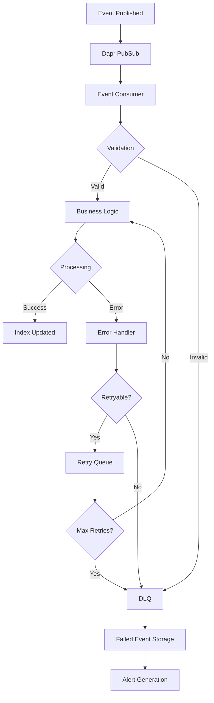
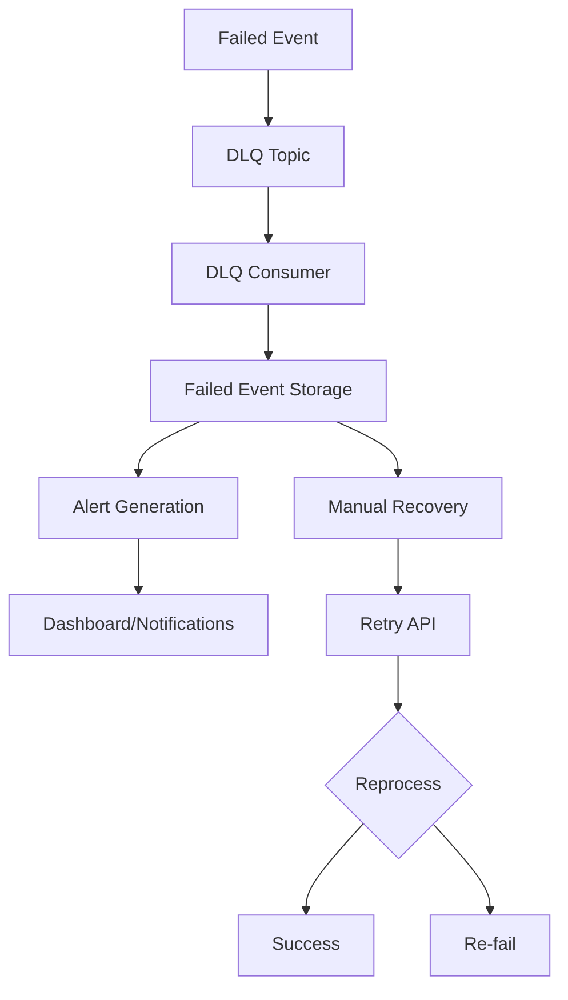

# 🔄 Event Processing Manual - Search Service

**Version**: 1.0
**Last Updated**: 2026-01-21
**Owner**: Platform Engineering Team
**Scope**: Event-driven architecture for search indexing with validation, DLQ, and monitoring

---

## 📋 Table of Contents

1. [Architecture Overview](#architecture-overview)
2. [Event Validation Framework](#event-validation-framework)
3. [DLQ (Dead Letter Queue) System](#dlq-system)
4. [Error Handling & Classification](#error-handling--classification)
5. [Circuit Breaker Protection](#circuit-breaker-protection)
6. [Monitoring & Alerting](#monitoring--alerting)
7. [Troubleshooting Guide](#troubleshooting-guide)
8. [Recovery Procedures](#recovery-procedures)
9. [Performance Tuning](#performance-tuning)
10. [Best Practices](#best-practices)

---

## 🏗️ Architecture Overview

### Event Processing Pipeline



### Key Components

| Component | Purpose | Location |
|-----------|---------|----------|
| **Event Validators** | Schema validation for all event types | `internal/service/validators/` |
| **Error Handler** | Classifies errors and determines actions | `internal/service/error_handler.go` |
| **DLQ Consumer** | Monitors and processes failed events | `internal/service/dlq_consumer.go` |
| **Alert Manager** | Sends notifications for issues | `internal/service/alert_manager.go` |
| **Circuit Breakers** | Protects against cascading failures | `internal/client/*_grpc_client.go` |

### Supported Event Types

| Event Type | Validator | Consumer | DLQ Topic |
|------------|-----------|----------|-----------|
| `catalog.product.created` | ProductValidator | ProductConsumer | `catalog.product.created.dlq` |
| `catalog.product.updated` | ProductValidator | ProductConsumer | `catalog.product.updated.dlq` |
| `catalog.product.deleted` | ProductValidator | ProductConsumer | `catalog.product.deleted.dlq` |
| `pricing.price.updated` | PriceValidator | PriceConsumer | `pricing.price.updated.dlq` |
| `pricing.price.deleted` | PriceValidator | PriceConsumer | `pricing.price.deleted.dlq` |
| `warehouse.inventory.stock_changed` | StockValidator | StockConsumer | `warehouse.inventory.stock_changed.dlq` |
| `catalog.cms.page.*` | CMSValidator | CMSConsumer | `catalog.cms.page.*.dlq` |

---

## ✅ Event Validation Framework

### Validation Architecture

```go
type EventValidator interface {
    Validate(event interface{}) error
}

type ValidatorRegistry struct {
    validators map[string]EventValidator
}
```

### Validation Rules by Event Type

#### Product Events
- **Required Fields**: `productId`, `sku`, `name`, `status`
- **Status Validation**: `active`, `inactive`, `draft`, `archived`
- **Timestamp Validation**: Not in future, reasonable age
- **String Validation**: No empty/whitespace-only strings

#### Price Events
- **Required Fields**: `productId`, `currency`, `newPrice`
- **Currency Format**: 3-letter uppercase ISO codes
- **Price Validation**: Non-negative values
- **Price Hierarchy**: `special ≤ sale ≤ regular`
- **Scope Validation**: `product`, `warehouse`, `sku`

#### Stock Events
- **Required Fields**: `sku`, `warehouse_id`, `available_stock`, `stock_status`
- **Quantity Validation**: Non-negative stock levels
- **Status Consistency**: `in_stock` requires positive quantity
- **Status Values**: `in_stock`, `out_of_stock`, `low_stock`, `discontinued`

#### CMS Events
- **Required Fields**: `pageId`, `title`, `slug`, `type`, `status`
- **Slug Format**: Lowercase, numbers, hyphens only
- **URL Validation**: Featured image URLs
- **Tag Validation**: Non-empty, max 50 chars

### Validation Error Metrics

```
search_validation_errors_total{event_type, service}
search_validation_errors_by_field_total{event_type, field, service}
search_validation_errors_by_type_total{event_type, error_type, service}
```

**Error Types**:
- `required_field_missing`
- `format_invalid`
- `business_logic_violation`
- `length_exceeded`

---

## 🔄 DLQ (Dead Letter Queue) System

### DLQ Architecture



### DLQ Topics & Monitoring

| Original Topic | DLQ Topic | Threshold | Alert Level |
|----------------|-----------|-----------|-------------|
| `catalog.product.*` | `catalog.product.*.dlq` | 10 | Warning |
| `pricing.price.*` | `pricing.price.*.dlq` | 10 | Warning |
| `warehouse.inventory.stock_changed` | `warehouse.inventory.stock_changed.dlq` | 50 | Error |
| `catalog.cms.page.*` | `catalog.cms.page.*.dlq` | 5 | Warning |

### DLQ Monitoring Metrics

```
search_dlq_message_count{topic}
```

### DLQ Management APIs

```bash
# Check DLQ statistics
GET /api/v1/admin/dlq/stats

# List failed events
GET /api/v1/admin/dlq/failed-events

# Retry failed event
POST /api/v1/admin/dlq/retry?event_id={id}
```

---

## 🚨 Error Handling & Classification

### Error Classification Matrix

| Error Type | Retryable | Action | Max Retries | DLQ |
|------------|-----------|--------|-------------|-----|
| **Timeout** | ✅ Yes | Retry + Backoff | 3 | After max retries |
| **Circuit Breaker** | ✅ Yes | Retry + Delay | 2 | After max retries |
| **Service Unavailable** | ✅ Yes | Retry + Backoff | 3 | After max retries |
| **Rate Limit** | ✅ Yes | Retry + Delay | 1 | After max retries |
| **Validation Error** | ❌ No | DLQ | 0 | Immediate |
| **Not Found** | ❌ No | DLQ | 0 | Immediate |
| **Conflict** | ⚠️ Conditional | Retry once, then DLQ | 1 | After retry |
| **Authorization** | ❌ No | DLQ | 0 | Immediate |
| **Internal Error** | ⚠️ Conditional | Retry once, then Alert | 1 | After retry |

### Error Handler Configuration

```go
// Retry limits by event type
product_events: 3 retries
price_events: 2 retries
stock_events: 5 retries (high frequency)
cms_events: 2 retries
```

### Error Context Enrichment

All errors include:
- Request ID
- Service name
- Event type
- Retry count
- Timestamp
- Duration
- User context (when available)

---

## 🛡️ Circuit Breaker Protection

### Circuit Breaker Configuration

| Service | Failure Threshold | Recovery Timeout | Max Requests |
|---------|------------------|------------------|--------------|
| **Catalog** | 5 consecutive failures | 120s | 5 |
| **Pricing** | 5 consecutive failures | 120s | 5 |
| **Warehouse** | 5 consecutive failures | 120s | 5 |

### Circuit Breaker States

```
Closed (normal) → Open (tripped) → Half-Open (testing) → Closed/Open
```

### Circuit Breaker Metrics

```
search_circuit_breaker_state{service_name}
search_circuit_breaker_requests_total{service_name, state}
search_circuit_breaker_failures_total{service_name}
search_circuit_breaker_successes_total{service_name}
```

### Manual Circuit Breaker Control

```bash
# Check circuit breaker status
GET /metrics | grep circuit_breaker

# Force reset (requires code change)
# Circuit breakers auto-recover based on timeout
```

---

## 📊 Monitoring & Alerting

### Key Metrics

#### Event Processing Metrics
```
search_event_processing_total{event_type, service, result}
search_event_processing_duration_seconds{event_type, service}
search_event_processing_lag_seconds{event_type, service}
```

#### Error Metrics
```
search_event_processing_errors_total{event_type, service, error_type}
```

#### System Health Metrics
```
search_dlq_message_count{topic}
search_circuit_breaker_state{service_name}
search_validation_errors_total{event_type, service}
```

### Alert Rules

| Alert Name | Condition | Severity | Cooldown |
|------------|-----------|----------|----------|
| High DLQ Count - Products | DLQ > 10 | Warning | 10min |
| High DLQ Count - Stock | DLQ > 50 | Error | 5min |
| Circuit Breaker Open | State = Open | Error | 2min |
| High Validation Errors | Rate > 10% | Warning | 15min |

### Alert Channels

1. **Logs**: Structured logging with context
2. **Slack**: Real-time notifications with rich formatting
3. **Email**: Scheduled digests for non-critical alerts
4. **PagerDuty**: Critical system alerts

---

## 🔧 Troubleshooting Guide

### Common Issues & Solutions

#### 1. High DLQ Message Count

**Symptoms**:
- DLQ message count > threshold
- Alert: "DLQ Alert: {topic}"
- Events not being processed

**Diagnosis**:
```bash
# Check DLQ statistics
curl http://search-service/api/v1/admin/dlq/stats

# Check recent failed events
curl http://search-service/api/v1/admin/dlq/failed-events

# Check application logs
kubectl logs -f deployment/search-service
```

**Solutions**:
1. **Identify Root Cause**: Check failed event error messages
2. **Fix Data Issues**: Correct invalid event data at source
3. **Manual Retry**: Use retry API for recoverable failures
4. **Circuit Breaker**: Check if downstream services are down

#### 2. Circuit Breaker Tripped

**Symptoms**:
- Circuit breaker state = "open"
- Alert: "Circuit Breaker Open - {service}"
- Service calls failing fast

**Diagnosis**:
```bash
# Check circuit breaker metrics
curl http://prometheus:9090/api/v1/query?query=circuit_breaker_state

# Check downstream service health
curl http://catalog-service/health
```

**Solutions**:
1. **Check Downstream Service**: Verify service is healthy
2. **Network Issues**: Check connectivity and DNS
3. **Resource Exhaustion**: Check CPU/memory on downstream service
4. **Auto Recovery**: Circuit breaker recovers automatically after timeout

#### 3. Validation Errors Increasing

**Symptoms**:
- Validation error rate > normal
- Alert: "High Validation Error Rate"
- Events being rejected

**Diagnosis**:
```bash
# Check validation error metrics
curl http://prometheus:9090/api/v1/query?query=validation_errors_total

# Check which fields are failing
curl http://prometheus:9090/api/v1/query?query=validation_errors_by_field_total
```

**Solutions**:
1. **Event Schema Changes**: Check if publisher changed event format
2. **Data Quality Issues**: Review data validation at source
3. **Temporary Issues**: Monitor for patterns and trends

#### 4. Event Processing Latency High

**Symptoms**:
- Processing duration > 30s
- Alert: "Event Processing Latency High"
- Events backing up

**Diagnosis**:
```bash
# Check processing duration metrics
curl http://prometheus:9090/api/v1/query?query=event_processing_duration_seconds

# Check Elasticsearch performance
curl http://elasticsearch:9200/_cluster/health
```

**Solutions**:
1. **Elasticsearch Issues**: Check cluster health and indexing performance
2. **Resource Constraints**: Check CPU/memory on search service
3. **Circuit Breaker**: Downstream services may be slow
4. **Bulk Operations**: Consider implementing bulk indexing

#### 5. Missing Events

**Symptoms**:
- Expected events not appearing in search index
- No errors in logs
- Event lag increasing

**Diagnosis**:
```bash
# Check event processing metrics
curl http://prometheus:9090/api/v1/query?query=event_processing_total

# Check Dapr sidecar logs
kubectl logs -f deployment/search-service -c daprd

# Check pubsub health
kubectl get pods -l app=dapr-redis
```

**Solutions**:
1. **Dapr Issues**: Restart Dapr sidecar
2. **PubSub Problems**: Check Redis connectivity
3. **Subscription Issues**: Verify Dapr subscriptions are deployed
4. **Event Filtering**: Check if events are being filtered

---

## 🔄 Recovery Procedures

### Automated Recovery

#### Circuit Breaker Recovery
- **Trigger**: Time-based (120s timeout)
- **Action**: Transitions to half-open, tests with limited requests
- **Monitoring**: Watch success rate in half-open state

#### Event Retry
- **Trigger**: Retryable errors with exponential backoff
- **Backoff Schedule**: 5s → 10s → 15s (configurable)
- **Max Retries**: Event-type specific (2-5 retries)

### Manual Recovery

#### 1. Failed Event Investigation

```bash
# Get failed events
curl http://search-service/api/v1/admin/dlq/failed-events > failed_events.json

# Analyze error patterns
jq '.data[] | {topic: .topic, error: .errorMessage, count: .retryCount}' failed_events.json
```

#### 2. Manual Event Retry

```bash
# Retry specific event
curl -X POST "http://search-service/api/v1/admin/dlq/retry?event_id=failed-event-123"

# Bulk retry (script)
#!/bin/bash
for event_id in $(jq -r '.data[].id' failed_events.json); do
    curl -X POST "http://search-service/api/v1/admin/dlq/retry?event_id=$event_id"
    sleep 1
done
```

#### 3. Data Correction at Source

For validation errors:
1. Identify root cause (schema change, data quality issue)
2. Fix data at source service
3. Republish corrected events
4. Clear DLQ backlog

#### 4. Circuit Breaker Manual Reset

```bash
# Force restart search service (circuit breakers reset on startup)
kubectl rollout restart deployment/search-service

# Or scale down/up
kubectl scale deployment search-service --replicas=0
kubectl scale deployment search-service --replicas=1
```

#### 5. DLQ Backlog Processing

For large DLQ backlogs:
1. **Prioritize**: Process critical events first
2. **Batch Process**: Use scripts for bulk operations
3. **Monitor Progress**: Track DLQ message count reduction
4. **Capacity Planning**: Ensure sufficient resources for processing

### Emergency Procedures

#### Complete System Recovery

```bash
# 1. Stop event processing
kubectl scale deployment/search-service --replicas=0

# 2. Clear problematic DLQ topics (if needed)
# Use Redis CLI or Dapr CLI to clear topics

# 3. Fix root cause
# Deploy code fixes, restart downstream services

# 4. Restart with monitoring
kubectl scale deployment/search-service --replicas=1

# 5. Monitor recovery
watch 'curl http://search-service/api/v1/admin/dlq/stats'
```

---

## ⚡ Performance Tuning

### Configuration Tuning

#### Event Processing Limits
```yaml
# In search service config
event_processing:
  max_concurrent_events: 10
  timeout_seconds: 30
  retry_backoff_base: 5
  max_retries: 3
```

#### Circuit Breaker Tuning
```yaml
circuit_breaker:
  failure_threshold: 5
  recovery_timeout: 120
  max_requests_half_open: 5
```

#### DLQ Monitoring
```yaml
dlq_monitoring:
  check_interval: 5m
  alert_cooldown: 10m
  max_alert_history: 1000
```

### Resource Optimization

#### Elasticsearch Tuning
- **Index Refresh**: Balance between real-time and performance
- **Bulk Indexing**: Use bulk operations for better throughput
- **Index Sharding**: Optimize shard count for workload

#### Memory Management
- **Circuit Breaker State**: Minimal memory overhead
- **Event Buffering**: Configure appropriate buffer sizes
- **Goroutine Limits**: Control concurrent event processing

#### Network Optimization
- **Connection Pooling**: Reuse gRPC connections
- **Timeout Tuning**: Balance responsiveness vs reliability
- **Batch Operations**: Reduce network round trips

### Monitoring Optimization

#### Metric Cardinality
- Use appropriate label combinations
- Avoid high-cardinality labels (timestamps, IDs)
- Aggregate metrics at appropriate levels

#### Alert Optimization
- Tune alert thresholds based on normal operation
- Use appropriate cooldown periods
- Avoid alert fatigue with smart deduplication

---

## 📚 Best Practices

### Development Practices

#### Event Schema Design
- **Backward Compatibility**: Use optional fields, avoid breaking changes
- **Validation Rules**: Document validation rules with event schemas
- **Versioning**: Consider event versioning for major changes

#### Error Handling
- **Fail Fast**: Validate early, fail fast for invalid data
- **Graceful Degradation**: Continue processing other events when one fails
- **Circuit Breakers**: Protect against cascading failures

#### Monitoring
- **Key Metrics**: Track success rates, latencies, error rates
- **Alert Thresholds**: Set appropriate thresholds for your workload
- **Dashboard**: Create operational dashboards for monitoring

### Operational Practices

#### Regular Maintenance
- **DLQ Monitoring**: Regularly check DLQ message counts
- **Failed Event Review**: Weekly review of failed events
- **Circuit Breaker Health**: Monitor circuit breaker states

#### Capacity Planning
- **Event Volume**: Monitor and plan for event throughput
- **Resource Allocation**: Ensure sufficient CPU/memory for peak loads
- **Scalability**: Design for horizontal scaling

#### Incident Response
- **Runbooks**: Document response procedures for common issues
- **Escalation**: Clear escalation paths for different severity levels
- **Post-Mortems**: Learn from incidents and improve systems

### Testing Practices

#### Integration Testing
- **Event Scenarios**: Test valid/invalid events, error conditions
- **DLQ Testing**: Verify DLQ processing and recovery
- **Circuit Breaker Testing**: Test failure scenarios and recovery

#### Chaos Engineering
- **Service Failures**: Test downstream service failures
- **Network Issues**: Test network partitions and latency
- **Resource Exhaustion**: Test high load and resource limits

---

## 📞 Support & Resources

### Documentation Links
- [Event Validation + DLQ Flow](workflow/event-validation-dlq-flow.md)
- [Integration Tests](test/integration/README.md)
- [Service Architecture](../platform-engineering/README.md)

### Monitoring Dashboards
- **Grafana**: Event Processing Dashboard
- **Prometheus**: Search Service Metrics
- **Kibana**: Log Aggregation

### Contact Information
- **Platform Engineering**: platform-eng@company.com
- **On-call SRE**: sre-oncall@company.com
- **Incident Response**: incident@company.com

### Quick Reference Commands

```bash
# Check service health
curl http://search-service/health

# Check DLQ status
curl http://search-service/api/v1/admin/dlq/stats

# Check circuit breaker status
curl http://prometheus:9090/api/v1/query?query=circuit_breaker_state

# Check event processing metrics
curl http://prometheus:9090/api/v1/query?query=event_processing_total

# View recent logs
kubectl logs -f deployment/search-service --tail=100

# Restart service
kubectl rollout restart deployment/search-service
```

---

**Implementation Status**: ✅ Complete - All event validation, DLQ, error handling, monitoring, and alerting features implemented and documented.